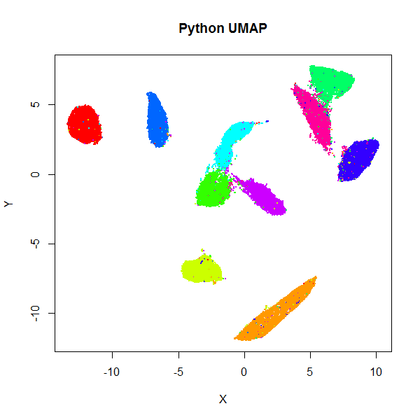

# UWOT

An R implementation of the 
[Uniform Manifold Approximation and Projection (UMAP)](https://arxiv.org/abs/1802.03426) 
method for dimensionality reduction (McInnes and Healy, 2018).

## Status

`uwot` is now slightly multi-threaded. Thanks to 
[RcppAnnoy](https://github.com/eddelbuettel/rcppannoy) and 
[RcppParallel](https://github.com/RcppCore/RcppParallel), the slowest part of 
the code, the [Annoy](https://github.com/spotify/annoy)-based
nearest neighbor index search, follows the strategy of 
[LargeVis](https://github.com/lferry007/LargeVis): after index building, the
index is written to disk, each thread then creates its own index by reading
that file and each chunk of data in the thread uses that index.

You can (and should) adjust the number of threads via the `n_threads` parameter;
for now, the default is half of whatever RcppParallel thinks should be the
default. I have also exposed the `grain_size` parameter. If a thread would
process less than `grain_size` number of items, then no multithreading is
carried out. Set `n_threads = 1` to use the previous non-threaded search.

I can't tell you how many times I blew up my R Session while writing this. I
think I've got it working now, but consider this highly experimental. The rest
of `uwot` remains single-threaded.

## Installing

```R
install.packages("devtools")
devtools::install_github("jlmelville/uwot")
library(uwot)

# See function man page for help
?umap
```

## Example

```R
iris_umap <- umap(iris, n_neighbors = 50, alpha = 0.5, init = "random")

# Load mnist from somewhere, e.g.
# devtools::install_github("jlmelville/snedata")
# mnist <- snedata::download_mnist()
mnist_umap <- umap(mnist, n_neighbors = 15, min_dist = 0.001, verbose = TRUE)
```

## Implementation Details

For small (N < 4096), exact nearest neighbors are found using the 
[FNN](https://cran.r-project.org/package=FNN) package. Otherwise, approximate
nearest neighbors are found using 
[RcppAnnoy](https://cran.r-project.org/package=RcppAnnoy).

Coordinate initialization uses
[RSpectra](https://cran.r-project.org/package=RSpectra) to do the
eigendecomposition of the normalized Laplacian.

The smooth k-nearest neighbor distance and stochastic gradient descent
optimization routines are written in C++ (using
[Rcpp](https://cran.r-project.org/package=Rcpp) and 
[RcppArmadillo](https://cran.r-project.org/package=RcppArmadillo)), aping
the Python code as closely as possible. It is my first time using Rcpp, so 
let's assume I did a horrible job (as we shall see when we look at performance
numbers versus Python).

For the datasets I've tried it with, the results look at least
reminiscent of those obtained using the 
[official Python implementation](https://github.com/lmcinnes/umap).
Below are results for the 70,000 MNIST digits (downloaded using the
[snedata](https://github.com/jlmelville/snedata) package). On the left
is the result of using the official Python UMAP implementation 
(via the [reticulate](https://cran.r-project.org/package=reticulate) package).
The right hand image is the result of using `uwot`.

|                                    |                                  |
|------------------------------------|----------------------------------|
|       |       |

## Performance

On my not-particularly-beefy laptop `uwot` took around 3 and a half minutes. 
For comparison, the default settings of the R package for
[Barnes-Hut t-SNE](https://cran.r-project.org/package=Rtsne) took 21 minutes, and the
[largeVis](https://github.com/elbamos/largeVis) package took 56 minutes. The
[official LargeVis implementation](https://github.com/lferry007/LargeVis) took
10 minutes. 

The Python UMAP implementation (powered by the JIT-magic of
[Numba](https://numba.pydata.org/)) took just under 2 minutes (it takes 11
minutes to get through this via reticulate for reasons I haven't looked into).
The difference in performance of the Python UMAP and `uwot` is due to:

* nearest neighbor search: takes 40 seconds in Python which also has the
experimental parallel support in Numba turned on, versus just over 2 minutes in
`uwot`. Using 4 threads for the index search part reduces this to 1 minute.
This part is the performance bottleneck at the moment. The Python
version of UMAP uses [pynndescent](https://github.com/lmcinnes/pynndescent),
a nearest neighbor descent approach, rather than Annoy. Alternative nearest
neighbors libraries e.g. [kgraph](https://github.com/aaalgo/kgraph) (which is
based on the same paper as pynndescent), or 
[HNSW](https://github.com/nmslib/hnsw) would be interesting to try, but all of
the ones I've looked at either don't currently build on Windows or have
non-portable compilation flags, so will require some fiddling with.
* the optimization stage: takes 60 seconds in Python (no parallel option
here), versus about 66 seconds in `uwot`. I think the difference here is due to
the `pow` operations in the gradient. Comparing with a modified version of the
Python UMAP to use the t-UMAP gradient (see the "Other Methods" section below), 
which doesn't use any `pow` operations, `uwot` is now faster: Python t-UMAP
optimization takes 32 seconds, while `uwot` t-UMAP optimization only takes 18
seconds.

If you like living dangerously, you can try using the `fastPrecisePow` 
approximation to the `pow` function suggested by 
[Martin Ankerl](https://martin.ankerl.com/2012/01/25/optimized-approximative-pow-in-c-and-cpp/):

```R
# Set approx_pow = TRUE to use the approximation
mnist_umap <- umap(mnist, n_neighbors = 15, min_dist = 0.001, approx_pow = TRUE, verbose = TRUE)
```

For what I think seem like typical values of `b` (between `0.7` and `0.9`)
and the squared distance (`0`-`1000`), I found the maximum relative error was 
about `0.06`. However, I haven't done much testing, beyond looking to see that
the MNIST results are not obviously worsened. Optimization time was reduced to 
24 seconds with this method, so it does show a worthwhile improvement if you
are feeling brave.

I would welcome any further suggestions on improvements (particularly speeding
up the optimization loop). However, it's certainly fast enough for my needs.

## Limitations

* Only Euclidean distances are supported for finding nearest neighbors from data frame
and dense matrix input. But if you can calculate a distance matrix for your data, you
can pass it in as `dist` object. For larger distance matrices, you can pass in a 
`sparseMatrix` (from the [Matrix](https://cran.r-project.org/package=Matrix) package).
Neither approach is supremely efficient at the moment.
* The code is mostly single-threaded, with the exception of the Annoy-based 
nearest neighbor index search, which works similarly to LargeVis. 
* I haven't tried this on anything much larger than MNIST and Fashion MNIST (so
at least around 100,000 rows with 500-1,000 columns works fine).

## Other Methods

Some other dimensionality reduction methods are also available in `uwot`:

### t-UMAP

If you choose the UMAP curve parameters to be `a = 1` and `b = 1`, you get
back the Cauchy distribution used in 
[t-Distributed Stochastic Neighbor Embedding](https://lvdmaaten.github.io/tsne/) 
and [LargeVis](https://arxiv.org/abs/1602.00370). This also happens to
significantly simplify the gradient leading to a noticeable speed-up: for MNIST,
I saw the optimization time drop from 66 seconds to 18 seconds. The trade off is
that you will see larger, more spread-out clusters than with the typical UMAP
settings (they're still more compact than you see in t-SNE, however). To try
t-UMAP, use the `tumap` function:

```R
mnist_tumap <- tumap(mnist, n_neighbors = 15, verbose = TRUE)
```

Note that using `umap(a = 1, b = 1)` doesn't use the simplified gradient, so
you won't see any speed-up that way.

### lvish: a LargeVis-ish method.

As UMAP's implementation is similar to LargeVis in some respects, this package
also offers a LargeVis-like method, `lvish`:

```R
# perplexity, init and n_epoch values shown are the defaults
mnist_lv <- lvish(mnist, perplexity = 50, init = "lvrand", n_epochs = 5000, 
                  verbose = TRUE)
# Make hilarious Lembas bread joke
```

Although `lvish` is like the real LargeVis in terms of the input weights, output
weight function and gradient, and so should give results that resemble the real
thing, it differs in the following ways:

* Only the nearest-neighor search is multi-threaded.
* Matrix input data is not normalized. You can carry out the LargeVis normalization
yourself by doing:
```R
data <- scale(data, center = TRUE, scale = FALSE)
data <- data / max(abs(data))
```
* The `n_trees` parameter is not dynamically chosen based on data set size.
* Nearest neighbor results are not refined via the neighbor-of-my-neighbor
method. The `search_k` parameter is twice as large than Annoy's default to
compensate.
* Gradient values are clipped to `4.0` rather than `5.0`.
* Negative edges are generated by uniform sampling of vertexes rather than their
degree ^ 0.75.
* The default number of samples is much reduced. The default number of epochs,
`n_epochs`, is set to `5000`. This is much larger than the `umap` default (`200`
or `500`, depending on data set size), but is still a lot less sampling than the
official LargeVis implementation, so you may need to increase it further
depending on your dataset. The default seems to be ok with MNIST. Using the UMAP
initialization of `init = "spectral"`, rather than the default Gaussian random
initialization (`init = "lvrand"`) can help.

Because the default number of neighbors is 3 times the `perplexity`, and the
default `perplexity = 50`, the nearest neighbor search needs to find 150 nearest
neighbors per data point, an order of magnitude larger than the UMAP defaults.
This leads to a less sparse input graph and hence more edges to sample. Combined
with the increased number of epochs, expect `lvish` to be slower than `umap` 
(with default settings, it took about 16 minutes to embed the MNIST data under
the same circumstances as described in the "Performance" section).

## License

[GPLv3 or later](https://www.gnu.org/licenses/gpl-3.0.txt).

## See Also

* The [UMAP](https://github.com/lmcinnes/umap) reference implementation and
[publication](https://arxiv.org/abs/1802.03426).
* Other R packages for UMAP: https://github.com/ropenscilabs/umapr and 
https://github.com/tkonopka/umap
* `uwot` uses the [RcppProgress](https://cran.r-project.org/package=RcppProgress)
package to show a text-based progress bar when `verbose = TRUE`.
* My somewhat convoluted method to ensure the C++ random numbers are repeatable
makes use of a (not convoluted) `get_seed` function suggested in a blog post by 
[Rory Nolan](http://rorynolan.rbind.io/2018/05/08/rcsetseed/).
