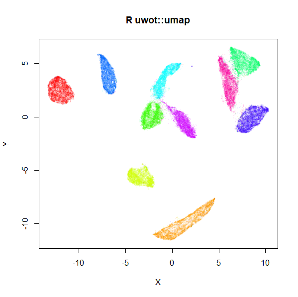

# uwot
<!-- badges: start -->
[](https://github.com/jlmelville/uwot/actions)
[](https://ci.appveyor.com/project/jlmelville/uwot)
[](https://app.codecov.io/github/jlmelville/uwot?branch=master)
[](https://cran.r-project.org/package=uwot)
[](https://cran.r-project.org/package=uwot)
[](https://cran.r-project.org/package=uwot)

[](https://github.com/jlmelville/uwot)
<!-- badges: end -->
An R implementation of the
[Uniform Manifold Approximation and Projection (UMAP)](https://arxiv.org/abs/1802.03426)
method for dimensionality reduction (McInnes et al. 2018), that also
implements the supervised and metric (out-of-sample) learning extensions to
the basic method. Translated from the
[Python implementation](https://github.com/lmcinnes/umap).

## News

*June 28 2023* Version 0.1.16 has been released to CRAN. This is a very minor
tweak to 0.1.15 to further support the new release of [RcppAnnoy](https://cran.r-project.org/package=RcppAnnoy).

## Installing

### From CRAN

```R
install.packages("uwot")
```

### From github

`uwot` makes use of C++ code which must be compiled. You may have to carry out
a few extra steps before being able to build this package:

**Windows**: install
[Rtools](https://cran.r-project.org/bin/windows/Rtools/) and ensure
`C:\Rtools\bin` is on your path.

**Mac OS X**: using a custom `~/.R/Makevars`
[may cause linking errors](https://github.com/jlmelville/uwot/issues/1).
This sort of thing is a potential problem on all platforms but seems to bite
Mac owners more.
[The R for Mac OS X FAQ](https://cran.r-project.org/bin/macosx/RMacOSX-FAQ.html#Installation-of-source-packages)
may be helpful here to work out what you can get away with. To be on the safe
side, I would advise building `uwot` without a custom `Makevars`.

```R
install.packages("devtools")
devtools::install_github("jlmelville/uwot")
```

## Example

```R
library(uwot)

# See function man page for help
?umap

# Non-numeric columns are ignored, so in a lot of cases you can pass a data
# frame directly to umap
iris_umap <- umap(iris, n_neighbors = 50, learning_rate = 0.5, init = "random")

# Load mnist from somewhere, e.g.
# devtools::install_github("jlmelville/snedata")
# mnist <- snedata::download_mnist()
mnist_umap <- umap(mnist, n_neighbors = 15, min_dist = 0.001, verbose = TRUE)

# For high dimensional datasets (> 100-1000 columns) using PCA to reduce
# dimensionality is highly recommended to avoid the nearest neighbor search
# taking a long time. Keeping only 50 dimensions can speed up calculations
# without affecting the visualization much
mnist_umap <- umap(mnist, pca = 50)

# Use a specific number of threads
mnist_umap <- umap(mnist, n_neighbors = 15, min_dist = 0.001, verbose = TRUE, n_threads = 8)

# Use a different metric
mnist_umap_cosine <- umap(mnist, n_neighbors = 15, metric = "cosine", min_dist = 0.001, verbose = TRUE, n_threads = 8)

# If you are only interested in visualization, `fast_sgd = TRUE` gives a much faster optimization
mnist_umap_fast_sgd <- umap(mnist, n_neighbors = 15, metric = "cosine", min_dist = 0.001, verbose = TRUE, fast_sgd = TRUE)

# Supervised dimension reduction
mnist_umap_s <- umap(mnist, n_neighbors = 15, min_dist = 0.001, verbose = TRUE, n_threads = 8,
                     y = mnist$Label, target_weight = 0.5)

# Add new points to an existing embedding
mnist_train <- head(mnist, 60000)
mnist_test <- tail(mnist, 10000)

# You must set ret_model = TRUE to return extra data we need
# coordinates are in mnist_train_umap$embedding
mnist_train_umap <- umap(mnist_train, verbose = TRUE, ret_model = TRUE)
mnist_test_umap <- umap_transform(mnist_test, mnist_train_umap, verbose = TRUE)

# Save the nearest neighbor data
mnist_nn <- umap(mnist, ret_nn = TRUE)
# coordinates are now in mnist_nn$embedding

# Re-use the nearest neighor data and save a lot of time
mnist_nn_spca <- umap(mnist, nn_method = mnist_nn$nn, init = "spca")

# No problem to have ret_nn = TRUE and ret_model = TRUE at the same time
# Or just use the ret_extra parameter:
mnist_nn_and_model <- umap(mnist, ret_extra = c("model", "nn"))

# You can also get to the input fuzzy graph as a sparse matrix via "fgraph"
mnist_with_fgraph <- umap(mnist, ret_extra = c("fgraph"))
# equivalent for lvish is to use "P" (input probability matrix):
mnist_with_P <- lvish(mnist, ret_extra = c("P"))

# Calculate Petal and Sepal neighbors separately (uses intersection of the resulting sets):
iris_umap <- umap(iris, metric = list("euclidean" = c("Sepal.Length", "Sepal.Width"),
                                      "euclidean" = c("Petal.Length", "Petal.Width")))
# Can also use individual factor columns
iris_umap <- umap(iris, metric = list("euclidean" = c("Sepal.Length", "Sepal.Width"),
                                      "euclidean" = c("Petal.Length", "Petal.Width"),
                                      "categorical" = "Species"))

# Batch mode allows for multiple threads while being reproducible
# (at the cost of needing more epochs for larger datasets)
set.seed(42)
iris_umap_batch <- umap(iris, batch = TRUE, n_sgd_threads = 4)
# This will give the same results
set.seed(42)
iris_umap_batch2 <- umap(iris, batch = TRUE, n_sgd_threads = 2)
all(iris_umap_batch == iris_umap_batch2)
# TRUE

# Batch mode uses Adam optimizer by default. Control the parameters with the opt_args list
iris_umap_batch <- umap(iris, batch = TRUE, opt_args = list(beta1 = 0.9, beta2 = 0.999))

```

## Documentation

<https://jlmelville.github.io/uwot/>.


## Implementation Details

For small (N < 4096) and Euclidean distance, exact nearest neighbors are found
using the [FNN](https://cran.r-project.org/package=FNN) package. Otherwise,
approximate nearest neighbors are found using
[RcppAnnoy](https://cran.r-project.org/package=RcppAnnoy). The supported
distance metrics (set by the `metric` parameter) are:

* Euclidean
* Cosine
* Pearson Correlation (`correlation`)
* Manhattan
* Hamming

Exactly what constitutes the cosine distance can differ between packages. `uwot`
tries to follow how the Python version of UMAP defines it, which is 
1 minus the cosine similarity. This differs slightly from how Annoy defines its
angular distance, so be aware that `uwot` internally converts the Annoy version 
of the distance. Also be aware that the Pearson correlation distance is the
cosine distance applied to row-centered vectors.

If you need other metrics, and can generate the nearest neighbor info
externally, you can pass the data directly to `uwot` via the `nn_method`
parameter. See the
[Nearest Neighbor Data Format section](https://github.com/jlmelville/uwot#nearest-neighbor-data-format)
for more details. Please note that the Hamming support is a lot slower than the
other metrics. I do not recommend using it if you have more than a few hundred
features, and even then expect it to take several minutes during the index
building phase in situations where the Euclidean metric would take only a few
seconds.

Coordinate initialization uses
[RSpectra](https://cran.r-project.org/package=RSpectra) to do the
eigendecomposition of the normalized Laplacian.

The optional PCA initialization and initial dimensionality reduction uses
[irlba](https://cran.r-project.org/package=irlba).

The smooth k-nearest neighbor distance and stochastic gradient descent
optimization routines are written in C++ (using
[Rcpp](https://cran.r-project.org/package=Rcpp), aping
the Python code as closely as possible. It is my first time using Rcpp, so
let's assume I did a horrible job.

For the datasets I've tried it with, the results look at least
reminiscent of those obtained using the
[official Python implementation](https://github.com/lmcinnes/umap).
Below are results for the 70,000 MNIST digits (downloaded using the
[snedata](https://github.com/jlmelville/snedata) package). On the left
is the result of using the official Python UMAP implementation
(via the [reticulate](https://cran.r-project.org/package=reticulate) package).
The right hand image is the result of using `uwot`.

|                                   |                                 |
|-----------------------------------|---------------------------------|
|  |  |

The project documentation contains some more [examples](https://jlmelville.github.io/uwot/articles/umap-examples.html).

## Memory Usage

By the deeply unscientific method of me looking at how much memory the R session
was taking up according to the Task Manager, processing MNIST with four threads
saw the memory usage increase by nearly 1 GB at some points. There are some manual
calls to `gc()` after some stages to avoid holding onto unused memory for longer
than usual. The larger the value of `n_neighbors`, the more memory you can expect
to take up (see, for example, the discussion of the `lvish` function below).

## Multi-threading support

[RcppParallel](https://github.com/RcppCore/RcppParallel) is used for the nearest
neighbor index search, the smooth knn/perplexity calibration, and the
optimization, which is the same approach that
[LargeVis](https://github.com/lferry007/LargeVis) takes.

You can (and should) adjust the number of threads via the `n_threads`, which
controls the nearest neighbor and smooth knn calibration, and the
`n_sgd_threads` parameter, which controls the number of threads used during
optimization. For the `n_threads`, the default is half of whatever RcppParallel
thinks should be the default. For `n_sgd_threads` the default is `0`, which
ensures reproducibility of results with a fixed seed.

I have also exposed the `grain_size` parameter. If a thread would
process less than `grain_size` number of items, then no multithreading is
carried out.

I've not experienced any problems with using multiple threads for a little
while, but if you have any problems with crashing sessions, please file an
issue.

## Limitations and Other Issues

* As noted in the
[Implementation Details](https://github.com/jlmelville/uwot#implementation-details),
only Euclidean, Cosine, Hamming, Pearson Correlation, and Manhattan distances
are supported for finding nearest neighbors from data frame and dense matrix
input. For other metrics, you can pass nearest neighbor data directly: see the
[Nearest Neighbor Data Format](https://github.com/jlmelville/uwot#nearest-neighbor-data-format)
section. Or if you can calculate a distance matrix for your data, you can pass
it in as `dist` object. For larger distance matrices, you can pass in a
`sparseMatrix` (from the [Matrix](https://cran.r-project.org/package=Matrix)
package). Neither approach is supremely efficient at the moment. Proper sparse
matrix support is limited by the nearest neighbor search routine: Annoy is
intended for dense vectors. Adding a library for sparse nearest neighbor search
would be a good extension.
* If `n_sgd_threads` is set larger than `1`, then even if you use `set.seed`,
results of the embeddings are not repeatable, This is because there is no
locking carried out on the underlying coordinate matrix, and work is partitioned
by edge not vertex and a given vertex may be processed by different threads. The
order in which reads and writes occur is of course at the whim of the thread
scheduler. This is the same behavior as largeVis.
* I haven't applied `uwot` on anything much larger than MNIST and Fashion MNIST
(so at least around 100,000 rows with 500-1,000 columns works fine). Bear in mind
that Annoy itself says it works best with dimensions < 100, but still works
"surprisingly well" up to 1000.
* Experience with
[COIL-100](https://www.cs.columbia.edu/CAVE/software/softlib/coil-100.php),
which has 49,152 features, suggests that Annoy will *definitely* struggle with
datasets of this dimensionality. I strongly recommend using the `pca` option
to reduce the dimensionality, e.g `pca = 100`.
* The spectral initialization default for `umap` (and the Laplacian Eigenmap
initialization, `init = "laplacian"`) can sometimes run into problems. If it
fails to converge it will fall back to random initialization, but on occasion
I've seen it take an extremely long time (a couple of hours) to converge. Recent
changes have hopefully reduced the chance of this happening, but if
initialization is taking more than a few minutes, I suggest stopping the
calculation and using the scaled PCA (`init = "spca"`) instead.
* `R CMD check` currently reports the following note:
`GNU make is a SystemRequirements.`, which is expected and due to using
RcppParallel. On Linux, it sometimes notes that the `libs` sub-directory is over
1 MB. I am unsure if this is anything to worry about.

## Other Methods

Some other dimensionality reduction methods are also available in `uwot`:

### t-UMAP

If you choose the UMAP curve parameters to be `a = 1` and `b = 1`, you get
back the Cauchy distribution used in
[t-Distributed Stochastic Neighbor Embedding](https://lvdmaaten.github.io/tsne/)
and [LargeVis](https://arxiv.org/abs/1602.00370). This also happens to
significantly simplify the gradient leading to a noticeable speed-up: for MNIST,
I saw the optimization time drop from 66 seconds to 18 seconds. The trade off is
that you will see larger, more spread-out clusters than with the typical UMAP
settings (they're still more compact than you see in t-SNE, however). To try
t-UMAP, use the `tumap` function:

```R
mnist_tumap <- tumap(mnist, n_neighbors = 15, verbose = TRUE)
```

Note that using `umap(a = 1, b = 1)` doesn't use the simplified gradient, so
you won't see any speed-up that way.

## License

[GPLv3 or later](https://www.gnu.org/licenses/gpl-3.0.txt).

uwot directly contains code that originates with
[RcppParallel](https://github.com/RcppCore/RcppParallel),
which is [GPLv2](https://cran.r-project.org/web/licenses/GPL-2).

## Citation

If you want to cite the use of uwot, then use the output of running 
`citation("uwot")` (you can do this with any R package).

## See Also

* The [UMAP reference implementation](https://github.com/lmcinnes/umap) and
[publication](https://arxiv.org/abs/1802.03426).
* There is now a [UMAP package on CRAN](https://cran.r-project.org/package=umap)
(see also its [github repo](https://github.com/tkonopka/umap)).
* Another R package is [umapr](https://github.com/ropensci-archive/umapr), but it is 
no longer being maintained.
* [umappp](https://github.com/LTLA/umappp) is a full C++ implementation, and
[yaumap](https://github.com/LTLA/yaumap) provides an R wrapper. The batch
implementation in umappp are the basis for uwot's attempt at the same.
* `uwot` uses the [RcppProgress](https://cran.r-project.org/package=RcppProgress)
package to show a text-based progress bar when `verbose = TRUE`.
