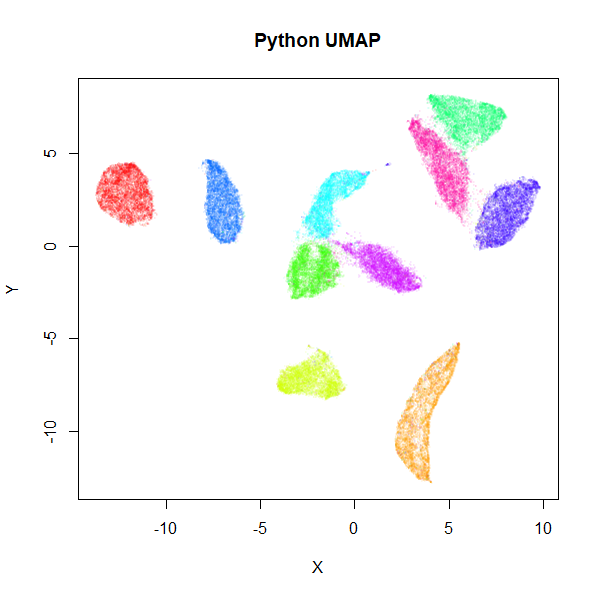
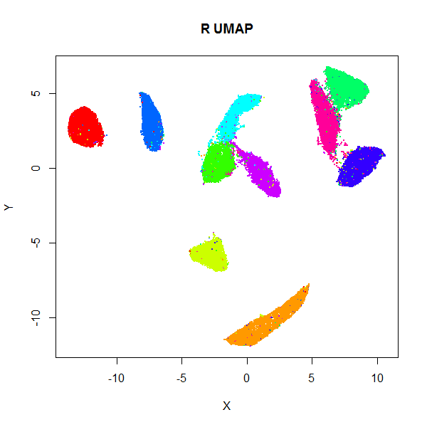
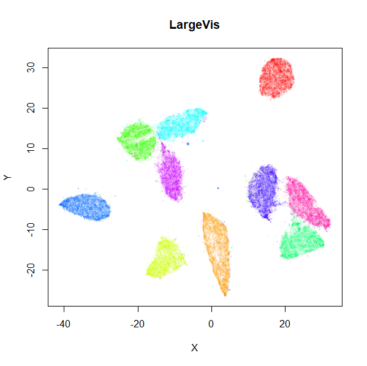
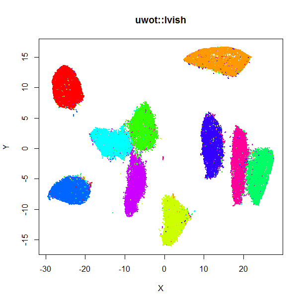

# UWOT

[](https://travis-ci.org/jlmelville/uwot) [](https://ci.appveyor.com/project/jlmelville/uwot) [](https://codecov.io/github/jlmelville/uwot?branch=master)

An R implementation of the 
[Uniform Manifold Approximation and Projection (UMAP)](https://arxiv.org/abs/1802.03426) 
method for dimensionality reduction (McInnes and Healy, 2018), that also 
implements the supervised and metric (out-of-sample) learning extensions to
the basic method.

## News

*August 14 2018*. I had broken `metric = cosine` for all cases except when
specifying `n_threads = 0`. Thanks to [ONeillMB1](https://github.com/ONeillMB1) 
for reporting this.

## Installing

```R
install.packages("devtools")
devtools::install_github("jlmelville/uwot")
library(uwot)

# See function man page for help
?umap
```

## Example

```R
iris_umap <- umap(iris, n_neighbors = 50, alpha = 0.5, init = "random")

# Load mnist from somewhere, e.g.
# devtools::install_github("jlmelville/snedata")
# mnist <- snedata::download_mnist()
mnist_umap <- umap(mnist, n_neighbors = 15, min_dist = 0.001, verbose = TRUE)

# Use a specific number of threads
mnist_umap <- umap(mnist, n_neighbors = 15, min_dist = 0.001, verbose = TRUE, n_threads = 8)

# Use a different metric
mnist_umap_cosine <- umap(n_neighbors = 15, metric = "cosine", min_dist = 0.001, verbose = TRUE, n_threads = 8)

# Supervised dimension reduction
mnist_umap_s <- umap(n_neighbors = 15, min_dist = 0.001, verbose = TRUE, n_threads = 8, 
                     y = mnist$Label, target_weight = 0.5)
                    
# Add new points to an existing embedding
mnist_train <- head(mnist, 60000)
mnist_test <- tail(mnist, 70000)

# You must set ret_model = TRUE to return extra data we need
mnist_train_umap <- umap(mnist_train, verbose = TRUE, ret_model = TRUE)
mnist_test_umap <- umap_transform(mnist_test, mnist_train_umap, verbose = TRUE)
```

## Documentation

Apart from the man pages in R: you may be interested in:

* A [description of UMAP](https://jlmelville.github.io/uwot/umap-for-tsne.html)
using algorithmic terminology similar to t-SNE, rather than the more topological
approach of the UMAP publication.
* [Examples](https://jlmelville.github.io/uwot/umap-examples.html) of the 
output of UMAP on some datasets, compared to t-SNE.
* How to use UMAP for 
[Supervised and Metric Learning](https://jlmelville.github.io/uwot/metric-learning.html)

## Implementation Details

For small (N < 4096), exact nearest neighbors are found using the 
[FNN](https://cran.r-project.org/package=FNN) package. Otherwise, approximate
nearest neighbors are found using 
[RcppAnnoy](https://cran.r-project.org/package=RcppAnnoy).

Coordinate initialization uses
[RSpectra](https://cran.r-project.org/package=RSpectra) to do the
eigendecomposition of the normalized Laplacian.

The smooth k-nearest neighbor distance and stochastic gradient descent
optimization routines are written in C++ (using
[Rcpp](https://cran.r-project.org/package=Rcpp) and 
[RcppArmadillo](https://cran.r-project.org/package=RcppArmadillo)), aping
the Python code as closely as possible. It is my first time using Rcpp, so 
let's assume I did a horrible job.

For the datasets I've tried it with, the results look at least
reminiscent of those obtained using the 
[official Python implementation](https://github.com/lmcinnes/umap).
Below are results for the 70,000 MNIST digits (downloaded using the
[snedata](https://github.com/jlmelville/snedata) package). On the left
is the result of using the official Python UMAP implementation 
(via the [reticulate](https://cran.r-project.org/package=reticulate) package).
The right hand image is the result of using `uwot`.

|                                   |                                 |
|-----------------------------------|---------------------------------|
|  |  |

The project documentation contains some more [examples](https://jlmelville.github.io/uwot/umap-examples.html).

## Performance

To get a feel for the performance of `uwot`, here are some timings for
processing the MNIST dataset on my not-particularly-beefy laptop, compared with
some other packages with their default settings:

| Method                                                                    |   Time       |
|---------------------------------------------------------------------------|--------------|
| `uwot(n_threads = 1)`                                                     | 3.5 minutes  |
| [Barnes-Hut t-SNE](https://cran.r-project.org/package=Rtsne)              | 21 minutes   |
| [largeVis](https://github.com/elbamos/largeVis)                           | 56 minutes   |
| [official LargeVis implementation](https://github.com/lferry007/LargeVis) | 10 minutes   |
| [UMAP (Python)](https://github.com/lmcinnes/umap)                         | 2 minutes    |
| `uwot(n_threads = 4)`                                                     | 2 minutes    |
| `uwot(n_threads = 1, approx_pow = TRUE)`                                  | 3 minutes    | 
| `uwot(n_threads = 4, approx_pow = TRUE)`                                  | 1.5 minutes  | 

The difference in performance between the Python UMAP (powered by the JIT-magic of
[Numba](https://numba.pydata.org/)) and `uwot` with one thread is due to:

* nearest neighbor search: takes 40 seconds in Python which also has the
experimental parallel support in Numba turned on, versus just over 2 minutes in
single-threaded `uwot`. Using 4 threads for the index search part reduces this
to 1 minute. This part is the performance bottleneck at the moment. The Python
version of UMAP uses [pynndescent](https://github.com/lmcinnes/pynndescent),
a nearest neighbor descent approach, rather than Annoy. Alternative nearest
neighbors libraries e.g. [kgraph](https://github.com/aaalgo/kgraph) (which is
based on the same paper as pynndescent), or 
[HNSW](https://github.com/nmslib/hnsw) would be interesting to try, but all of
the ones I've looked at either don't currently build on Windows or have
non-portable compilation flags, so will require some fiddling with.
* the optimization stage: takes 60 seconds in Python (no parallel option
here), versus about 66 seconds with `uwot` with one thread . I think the
difference here is due to the `pow` operations in the gradient. If you like
living dangerously, you can try using the `fastPrecisePow` approximation to the
`pow` function suggested by
[Martin Ankerl](https://martin.ankerl.com/2012/01/25/optimized-approximative-pow-in-c-and-cpp/):

```R
# Set approx_pow = TRUE to use the approximation
mnist_umap <- umap(mnist, n_neighbors = 15, min_dist = 0.001, approx_pow = TRUE, verbose = TRUE)
```

For what I think seem like typical values of `b` (between `0.7` and `0.9`)
and the squared distance (`0`-`1000`), I found the maximum relative error was 
about `0.06`. However, I haven't done much testing, beyond looking to see that
the MNIST results are not obviously worsened. Results in the table above with
`approx_pow = TRUE` do show a worthwhile improvement.

I would welcome any further suggestions on improvements (particularly speeding
up the optimization loop). However, it's certainly fast enough for my needs.

## Memory Usage

By the deeply unscientific method of me looking at how much memory the R session
was taking up according to the Task Manager, processing MNIST with four threads
saw the memory usage increase by nearly 1 GB at some points. There are some manual
calls to `gc()` after some stages to avoid holding onto unused memory for longer
than usual. The larger the value of `n_neighbors`, the more memory you can expect
to take up (see, for example, the discussion of the `lvish` function below).

## Multi-threading support

[RcppParallel](https://github.com/RcppCore/RcppParallel) is used for the nearest
neighbor index search, the smooth knn/perplexity calibration, and the
optimization, which is the same approach that
[LargeVis](https://github.com/lferry007/LargeVis) takes.

You can (and should) adjust the number of threads via the `n_threads` parameter;
for now, the default is half of whatever RcppParallel thinks should be the
default. I have also exposed the `grain_size` parameter. If a thread would
process less than `grain_size` number of items, then no multithreading is
carried out. Set `n_threads = 0` to use the previous non-threaded search; with
`n_threads = 1`, you get the new multi-threaded code but with only one thread.

I've not experienced any problems with using multiple threads for a little
while, but if you have any problems with crashing sessions, please file an 
issue.

## Limitations and Other Issues

* Only Euclidean, cosine, and Manhattan distances are supported for finding
nearest neighbors from data frame and dense matrix input. But if you can
calculate a distance matrix for your data, you can pass it in as `dist` object.
For larger distance matrices, you can pass in a `sparseMatrix` (from the
[Matrix](https://cran.r-project.org/package=Matrix) package). Neither approach
is supremely efficient at the moment. Proper sparse matrix support is limited
by the nearest neighbor search routine: Annoy is intended for dense vectors.
Adding a library for sparse nearest neighbor search would be a good extension.
* I haven't tried this on anything much larger than MNIST and Fashion MNIST (so
at least around 100,000 rows with 500-1,000 columns works fine). Bear in mind
that Annoy itself says it works best with dimensions < 100, but still works
"surprisingly well" up to 1000.
* The spectral initialization default for `umap` (and the Laplacian eigenmap
initialization, `init = "laplacian"`) can sometimes run into problems. If it
fails to converge it will fall back to random initialization, but on occasion
I've seen it take an extremely long time (a couple of hours) to converge. If
initialization is taking more than a few minutes, I suggest stopping the 
calculation and using the scaled PCA (`init = "spca"`) instead.
* For supervised dimensionality reduction using a numeric vector, only the
Euclidean distance is supported for building the target graph.
* `R CMD check` currently reports the following note: 
`GNU make is a SystemRequirements.`, which is expected and due to using 
RcppParallel. On Linux, it sometimes notes that the `libs` sub-directory is over
1 MB. I am unsure if this is anything to worry about.

## Other Methods

Some other dimensionality reduction methods are also available in `uwot`:

### t-UMAP

If you choose the UMAP curve parameters to be `a = 1` and `b = 1`, you get
back the Cauchy distribution used in 
[t-Distributed Stochastic Neighbor Embedding](https://lvdmaaten.github.io/tsne/) 
and [LargeVis](https://arxiv.org/abs/1602.00370). This also happens to
significantly simplify the gradient leading to a noticeable speed-up: for MNIST,
I saw the optimization time drop from 66 seconds to 18 seconds. The trade off is
that you will see larger, more spread-out clusters than with the typical UMAP
settings (they're still more compact than you see in t-SNE, however). To try
t-UMAP, use the `tumap` function:

```R
mnist_tumap <- tumap(mnist, n_neighbors = 15, verbose = TRUE)
```

Note that using `umap(a = 1, b = 1)` doesn't use the simplified gradient, so
you won't see any speed-up that way.

### lvish: a LargeVis-ish method.

As UMAP's implementation is similar to LargeVis in some respects, this package
also offers a LargeVis-like method, `lvish`:

```R
# perplexity, init and n_epoch values shown are the defaults
# use perplexity instead of n_neighbors to control local neighborhood size
mnist_lv <- lvish(mnist, perplexity = 50, init = "lvrand", n_epochs = 5000, 
                  verbose = TRUE)
# Make hilarious Lembas bread joke
```

Although `lvish` is like the real LargeVis in terms of the input weights, output
weight function and gradient, and so should give results that resemble the real
thing, note that:

* Like the real LargeVis, matrix input data is normalized by centering each
column and then the entire matrix is scaled by dividing by the maximum absolute
value. This differs from `umap`, where no scaling is carried out. Scaling can be
controlled by the `scale` parameter.
* Nearest neighbor results are not refined via the neighbor expansion method.
The `search_k` parameter is twice as large than Annoy's default to compensate.
* The other nearest neighbor index parameter, `n_trees`, is not dynamically
chosen based on data set size. In LargeVis, it ranges between 10 (for N <
100,000) and 100 (for N > 5,000,000). The `lvish` default of 50 would cover
datasets up to N = 5,000,000, and combined with the default `search_k`, 
seems suitable for the datasets I've looked at.
* Negative edges are generated by uniform sampling of vertexes rather than their
degree ^ 0.75.
* The default number of epochs is dataset-dependent, to generate the same number
of edge samples that would be used by the default settings of the reference
LargeVis implementation. This normally results in a substantially longer run
time than for `umap`. You may be able to get away with fewer epochs, and using
the UMAP initialization of `init = "spectral"`, rather than the default Gaussian
random initialization (`init = "lvrand"`) can help.

The left-hand image below is the result of running the official LargeVis
implementation on MNIST. The image on the right is that from running `lvish`
with its default settings (apart from setting `n_threads = 8`). Given they were
both initialized from different random configurations, there's no reason to
believe they would be identical, but they look pretty similar:

|                                               |                                         |
|-----------------------------------------------|-----------------------------------------|
|  |  |

Because the default number of neighbors is 3 times the `perplexity`, and the
default `perplexity = 50`, the nearest neighbor search needs to find 150 nearest
neighbors per data point, an order of magnitude larger than the UMAP defaults.
This leads to a less sparse input graph and hence more edges to sample. Combined
with the increased number of epochs, expect `lvish` to be slower than `umap`:
with default single-threaded settings, it took about 20 minutes to embed the
MNIST data under the same circumstances as described in the "Performance"
section. With `n_threads = 4`, it took 7 minutes. In addition, storing those
extra edges requires a lot more memory than the `umap` defaults: my R session
increased by around 3.2 GB, versus 1 GB for `umap`.

As an alternative to the usual Gaussian input weight function, you can use the
k-nearest neighbor graph itself, by setting `kernel = "knn"`. This will give
each edge between neighbors a uniform weight equal to 1/`perplexity`, which
leads to each row's probability distribution having the target `perplexity`.
This matrix will then be symmetrized in the usual way. The advantage of this is
that the number of neighbors is reduced to the same as the perplexity (indeed,
the `n_neighbors` parameter is ignored with this setting), and leads to less
memory usage and a faster runtime. You can also get away with setting the
perplexity to a much lower value than usual with this kernel (e.g. `perplexity =
15`) and get closer to UMAP's performance. If you use the default LargeVis
random initialization, you will still need more epochs than UMAP, but you can
still expect to see a big improvement. Something like the following works for
MNIST:

```R
mnist_lv <- lvish(mnist, kernel = "knn", perplexity = 15, n_epochs = 1500,
                  init = "lvrand", verbose = TRUE)
```

## License

[GPLv3 or later](https://www.gnu.org/licenses/gpl-3.0.txt).

## See Also

* The [UMAP](https://github.com/lmcinnes/umap) reference implementation and
[publication](https://arxiv.org/abs/1802.03426).
* There is now a [UMAP package on CRAN](https://cran.r-project.org/package=umap)
(see also its [github repo](https://github.com/tkonopka/umap)). Another R
package is https://github.com/ropenscilabs/umapr.
* `uwot` uses the [RcppProgress](https://cran.r-project.org/package=RcppProgress)
package to show a text-based progress bar when `verbose = TRUE`.
* My somewhat convoluted method to ensure the C++ random numbers are repeatable
makes use of a (not convoluted) `get_seed` function suggested in a blog post by 
[Rory Nolan](http://rorynolan.rbind.io/2018/05/08/rcsetseed/).
