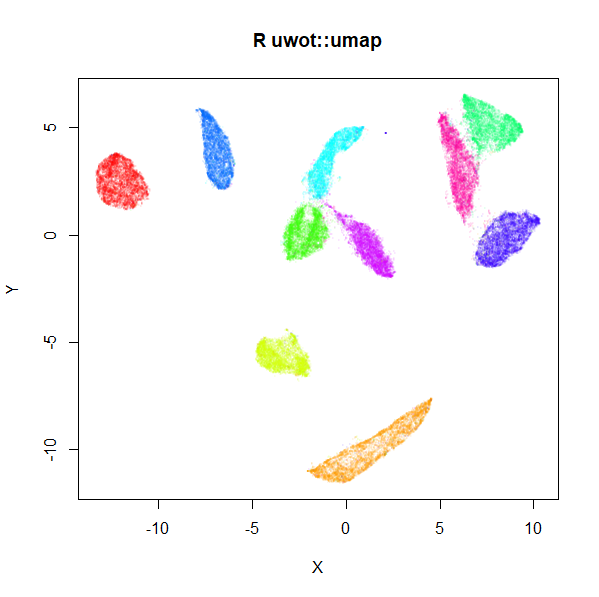

# uwot
<!-- badges: start -->
[](https://github.com/jlmelville/uwot/actions)
[](https://ci.appveyor.com/project/jlmelville/uwot)
[](https://app.codecov.io/github/jlmelville/uwot?branch=master)
[](https://cran.r-project.org/package=uwot)
[](https://cran.r-project.org/package=uwot)
[](https://www.r-pkg.org/pkg/uwot)
[](https://www.r-pkg.org/pkg/uwot)
[](https://github.com/jlmelville/uwot)
<!-- badges: end -->

An R implementation of the
[Uniform Manifold Approximation and Projection (UMAP)](https://arxiv.org/abs/1802.03426)
method for dimensionality reduction of McInnes et al. (2018). Also included are
the supervised and metric (out-of-sample) learning extensions to the basic
method. Translated from the
[Python implementation](https://github.com/lmcinnes/umap).

## News

*November 10 2025* `uwot` version 0.2.4 has been released to CRAN. This was
mainly to avoid a test potentially starting to fail due to an incorrect use of
`testthat`. However, as part of some other small fixes, optional dependencies
(e.g. RSpectra) will now be correctly detected and used if installed even if not
loaded. This could have an effect on output (but the old behavior was a bug).

*February 24 2025* `uwot` version 0.2.3 has been released to CRAN. This release
mainly fixes some bugs, including one that was causing an error with an upcoming
version of R-devel. One new feature: set `rng_type = "deterministic"` to use a
deterministic sampling of vertices during the optimization phase which will give
faster and more reproducible output at the cost of accuracy. The idea for this
came straight from
[Leland McInnes via Reddit](https://www.reddit.com/r/MachineLearning/comments/1gsjfq9/comment/lxip9wy/).


## Installing

### From CRAN

```R
install.packages("uwot")
```

### From github

`uwot` makes use of C++ code which must be compiled. You may have to carry out
a few extra steps before being able to build this package:

**Windows**: install
[Rtools](https://cran.r-project.org/bin/windows/Rtools/) and ensure
`C:\Rtools\bin` is on your path.

**Mac OS X**: using a custom `~/.R/Makevars`
[may cause linking errors](https://github.com/jlmelville/uwot/issues/1).
This sort of thing is a potential problem on all platforms but seems to bite
Mac owners more.
[The R for Mac OS X FAQ](https://cran.r-project.org/bin/macosx/RMacOSX-FAQ.html#Installation-of-source-packages)
may be helpful here to work out what you can get away with. To be on the safe
side, I would advise building `uwot` without a custom `Makevars`.

```R
install.packages("devtools")
devtools::install_github("jlmelville/uwot")
```

## Example

```R
library(uwot)

# umap2 is a version of the umap() function with better defaults
iris_umap <- umap2(iris)

# but you can still use the umap function (which most of the existing 
# documentation does)
iris_umap <- umap(iris)

# Load mnist from somewhere, e.g.
# devtools::install_github("jlmelville/snedata")
# mnist <- snedata::download_mnist()

mnist_umap <- umap(mnist, n_neighbors = 15, min_dist = 0.001, verbose = TRUE)
plot(
  mnist_umap,
  cex = 0.1,
  col = grDevices::rainbow(n = length(levels(mnist$Label)))[as.integer(mnist$Label)] |>
    grDevices::adjustcolor(alpha.f = 0.1),
  main = "R uwot::umap",
  xlab = "",
  ylab = ""
)

# I recommend the following optional packages
# for faster or more flexible nearest neighbor search:
install.packages(c("RcppHNSW", "rnndescent"))
library(RcppHNSW)
library(rnndescent)

# Installing RcppHNSW will allow the use of the usually faster HNSW method:
mnist_umap_hnsw <- umap(mnist, n_neighbors = 15, min_dist = 0.001, 
                        nn_method = "hnsw")
# nndescent is also available
mnist_umap_nnd <- umap(mnist, n_neighbors = 15, min_dist = 0.001, 
                       nn_method = "nndescent")
# umap2 will choose HNSW by default if available
mnist_umap2 <- umap2(mnist)
```



## Documentation

<https://jlmelville.github.io/uwot/>. For more examples see the 
[get started](https://jlmelville.github.io/uwot/articles/uwot.html) doc.
There are plenty of [articles](https://jlmelville.github.io/uwot/articles/index.html)
describing various aspects of the package.

## License

[GPLv3 or later](https://www.gnu.org/licenses/gpl-3.0.txt).

## Citation

If you want to cite the use of uwot, then use the output of running 
`citation("uwot")` (you can do this with any R package).

## See Also

* The [UMAP reference implementation](https://github.com/lmcinnes/umap) and
[publication](https://arxiv.org/abs/1802.03426).
* The [UMAP R package](https://cran.r-project.org/package=umap)
(see also its [github repo](https://github.com/tkonopka/umap)), predates
`uwot`'s arrival on CRAN.
* Another R package is [umapr](https://github.com/ropensci-archive/umapr), but
it is no longer being maintained.
* [umappp](https://github.com/libscran/umappp) is a full C++ implementation, and
[yaumap](https://github.com/LTLA/yaumap) provides an R wrapper. The batch
implementation in umappp are the basis for uwot's attempt at the same.
* `uwot` uses the [RcppProgress](https://cran.r-project.org/package=RcppProgress)
package to show a text-based progress bar when `verbose = TRUE`.
