# Fine-tuning UMAP Visualizations

If you look at the UMAP
[examples](https://jlmelville.github.io/uwot/articles/umap-examples.html),
it’s clear that the default settings aren’t always appropriate for some
datasets: it’s easy to get results where the clusters are very spaced
out relative to their sizes, which makes viewing your data on a single
static plot quite difficult compared to t-SNE. Fortunately, UMAP’s
output weight function can be adjusted to give different results.

Note that another way to change UMAP’s output is to modify the value of
`n_neighbors`. This is a more drastic change that directly modifies the
input affinity graph we are trying to find a low-dimensional
approximation to, and it can have a big effect on run-time, so we won’t
consider that here. Changes to the output weight function are more
subtle.

## Theory

The output weight between two points $i$ and $j$ are given by:

$$w_{ij} = 1/\left( 1 + ad_{ij}^{2b} \right)$$

with $d_{ij}$ being the Euclidean distance in the embedding between the
two points. Below I drop the $ij$ subscript for clarity’s sake. $a$ and
$b$ are two hyper-parameters. Usually they are determined by a
non-linear least squares fit based on an exponential decay curve
parameterized by `min_dist` and `spread`:

$$w = \exp\left\lbrack - \max(0,d - \rho)/\sigma \right\rbrack$$

where `min_dist` is $\rho$ and `spread` is $\sigma$. I have used those
symbols to make it more obvious that this equation has the same form as
UMAP’s weighting function for its edge weights in the input space. As a
reminder, the presence of the `max` operation and shifting the distances
by $\rho$ is to enforce the local connectivity constraint: there is
always an edge weight of 1 between a point and its nearest neighbor.
`spread` determines the x-value range over which the y-value decays to
zero, and is set to `spread` multiplied by 3.

Here’s some R code that works through this and then plots the results
using the Python UMAP defaults of `spread = 1`, `min_dist = 0.1`:

``` r
spread <- 1
min_dist <- 0.1

# define the exponential
xv <- seq(
  from = 0,
  to = spread * 3,
  length.out = 300
)
yv <- exp(-(pmax(0, xv - min_dist)) / spread)

# Fit the a,b curve to the exponential
params <- stats::nls(yv ~ 1 / (1 + a * xv^(2.0 * b)),
  start = list(a = 1, b = 1)
)$m$getPars()
a <- params["a"]
b <- params["b"]

# Plot the results
title <-
  paste0(
    "exp curve spread = ",
    spread,
    ", min_dist = ",
    min_dist
  )
sub <-
  paste0("UMAP fit (green) a = ", formatC(a), " b = ", formatC(b))
plot(
  xv,
  yv,
  xlab = "d",
  ylab = "w",
  type = "l",
  main = title,
  lwd = 2
)

graphics::mtext(sub)
lines(xv, 1 / (1 + a * xv^(2.0 * b)), col = "#1B9E77FF", lwd = 2)
```

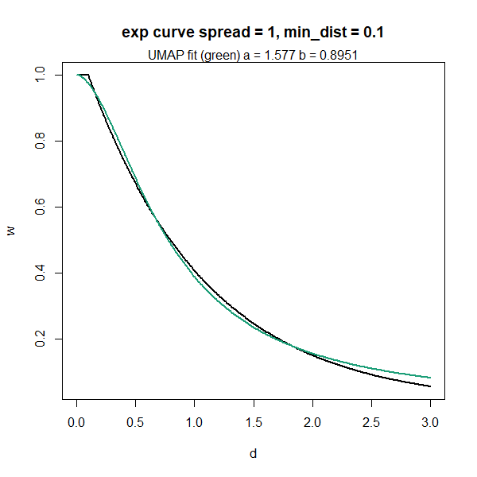

UMAP a,b curve

As the title indicates, this curve leads to the default parameters of
$a = 1.577$, $b = 0.895$. `uwot` uses a slightly different default
`min_dist = 0.001`, which leads to $a = 1.93,b = 0.79$. I don’t know why
I used a different default `min_dist` – probably I made a mistake. This
is likely to change in a later version of `uwot`, but it doesn’t make
much of a difference to the results, fortunately. Setting $a = 1,b = 1$
gives the Cauchy distribution used in t-SNE (and the `tumap` function in
`uwot`), which corresponds roughly to `spread = 1.12` and
`min_dist = 0.23`: putting those values back into the curve-fitting
routine will give you back $a = 0.99$, $b = 1.01$. Close enough. Here is
the `uwot` default results in orange and the Cauchy results in blue
overlaid with the UMAP defaults (green, same as in the previous plot):

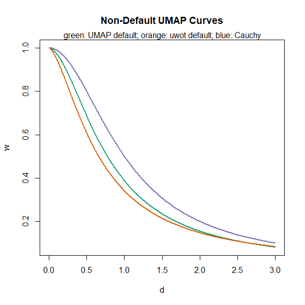

Other UMAP a,b curve

This still leaves open the question of how changing `spread` and
`min_dist`, or `a` and `b` affects the output of UMAP. The current
version of the [UMAP
docs](https://umap-learn.readthedocs.io/en/latest/parameters.html)
doesn’t mention `spread` and treats `min_dist` as the only adjustable
parameter, which can be varied between `0` and very close to `1`. But in
what follows we’ll take a look at both `min_dist` and `spread`, and use
the trusty MNIST digits dataset to investigate their effect.

## min_dist and spread

Let’s look at `min_dist` and `spread` first. First, I’ll show some
results of changing `spread`, keeping `min_dist = 0.1` and then we’ll
look at changing `min_dist`, while fixing `spread = 1`. The above
explanation of the exponential curve suggests that allowing `min_dist`
to exceed the value of `spread` will give increasingly odd results.

### spread

In the plots below, the value of `spread` and `min_dist` is given in the
title, along with the values of `a` and `b` that they give rise to. The
value of `spread` increases from 0.1 to 10 as we go from left to right
and top to bottom.

|                                                  |                                                  |                                                    |
|:------------------------------------------------:|:------------------------------------------------:|:--------------------------------------------------:|
| 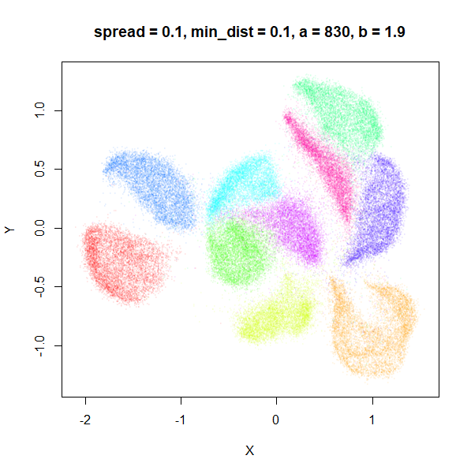 | 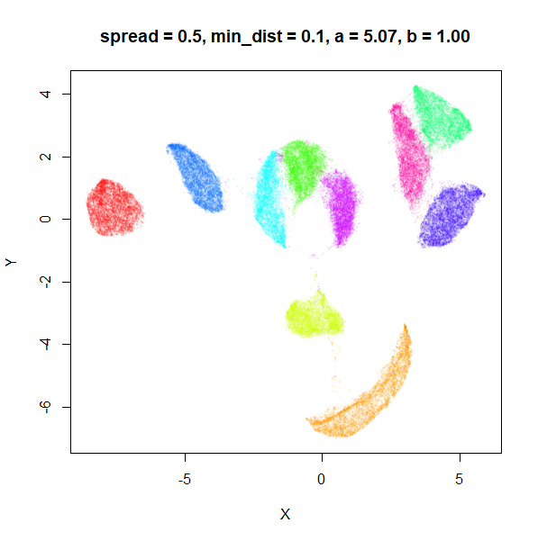 | 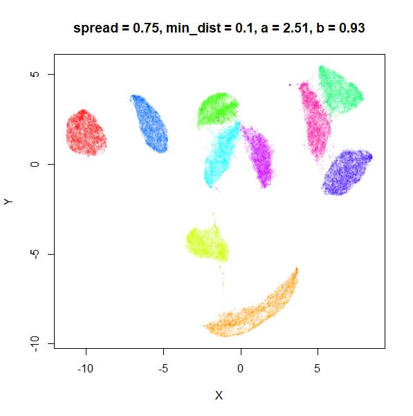 |
|   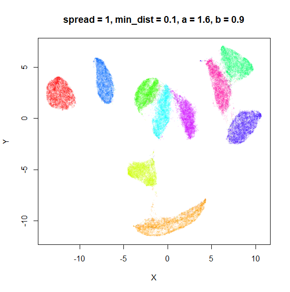   | 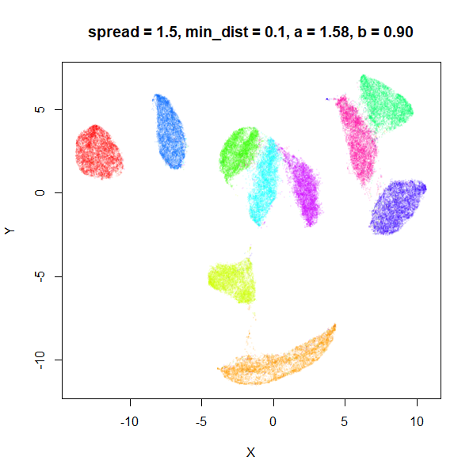 |    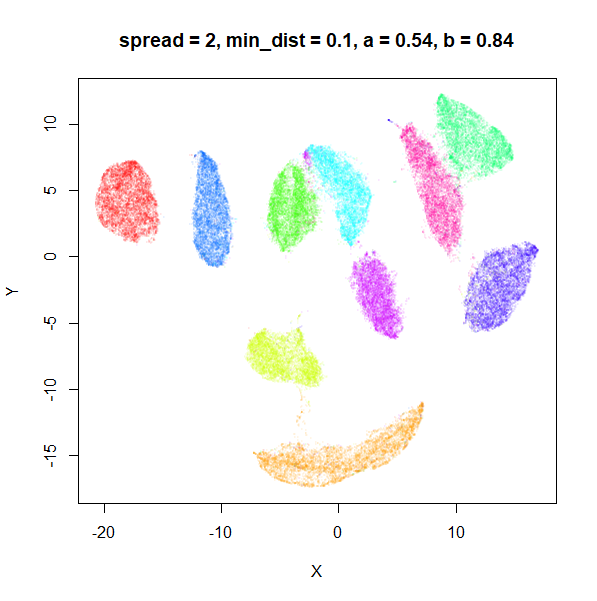    |
|   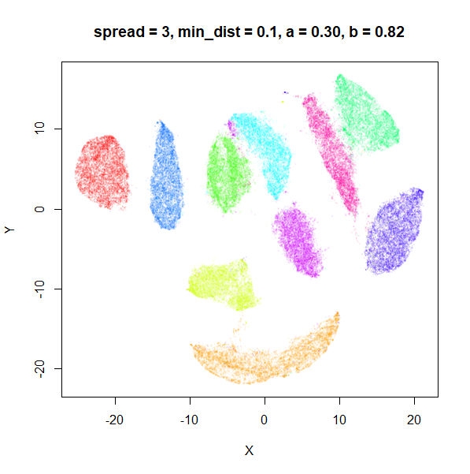   |   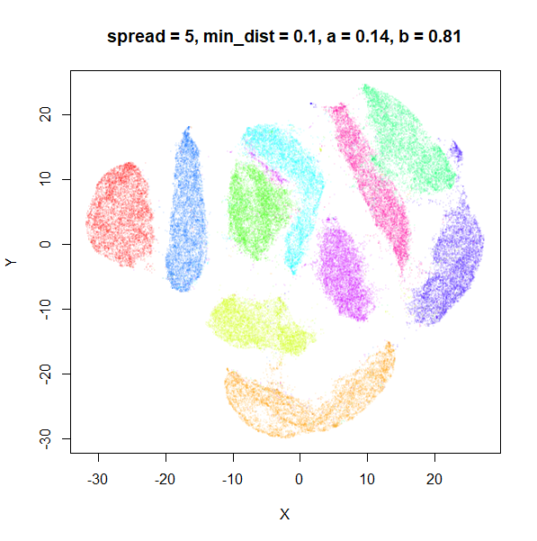   |   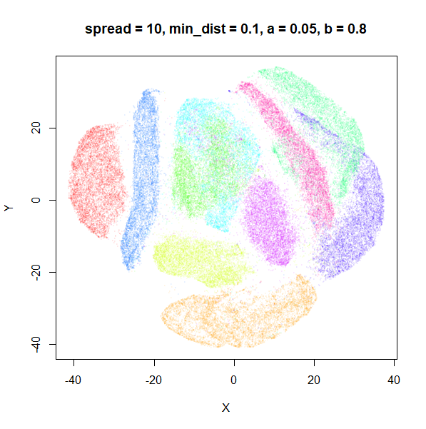   |

The top-left result, with `spread = min_dist = 0.1` gives a clear
indication that you want `spread` to be larger than `min_dist`. Then,
for values of `spread` between 0.5-3 not much happens. As `spread` gets
to 5 and above, the clusters start to overlap each other.

Here’s a table summarizing how `a` and `b` change as `spread` is varied.

| spread | min_dist | a    | b    |
|--------|----------|------|------|
| 0.1    | 0.1      | 830  | 1.93 |
| 0.5    | 0.1      | 5.07 | 1.00 |
| 0.75   | 0.1      | 2.51 | 0.93 |
| 1      | 0.1      | 1.58 | 0.90 |
| 1.5    | 0.1      | 0.84 | 0.86 |
| 2      | 0.1      | 0.54 | 0.84 |
| 3      | 0.1      | 0.30 | 0.82 |
| 5      | 0.1      | 0.14 | 0.81 |
| 10     | 0.1      | 0.05 | 0.80 |

For low values of `spread`, `a` starts getting very large.

What about `min_dist`? Below, `min_dist` increases from 0.0001 to 2,
with `spread = 1`, so I suspect the highest of these values will also
show some eccentric results.

### min_dist

|                                                        |                                                      |                                                    |
|:------------------------------------------------------:|:----------------------------------------------------:|:--------------------------------------------------:|
| 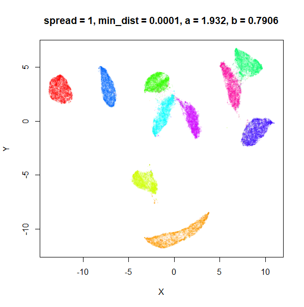 | 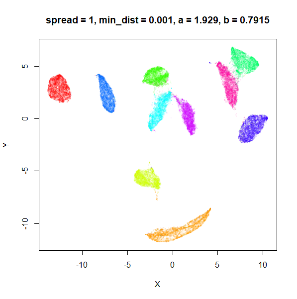 | 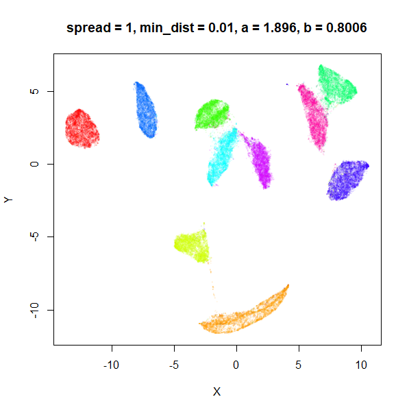 |
|   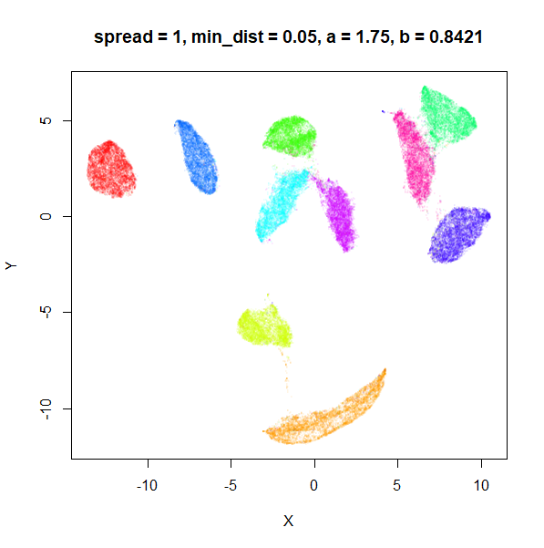   |      |  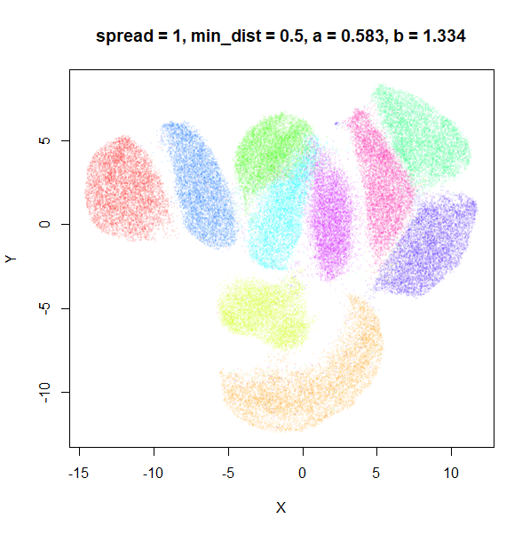  |
|      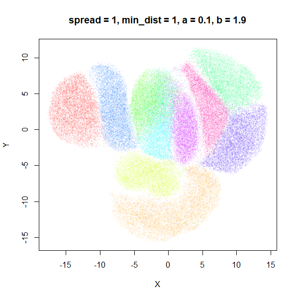      |   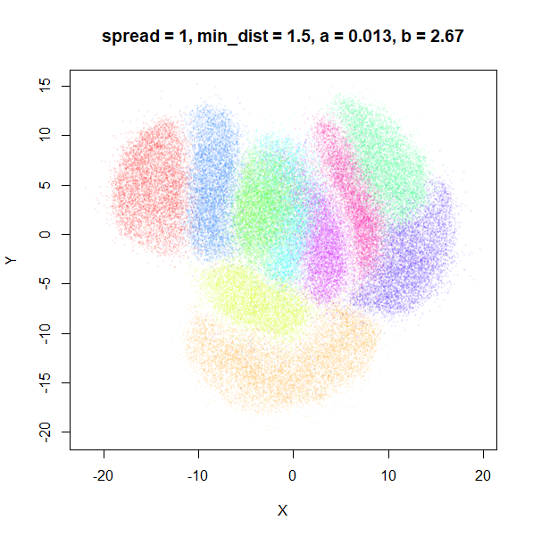   |    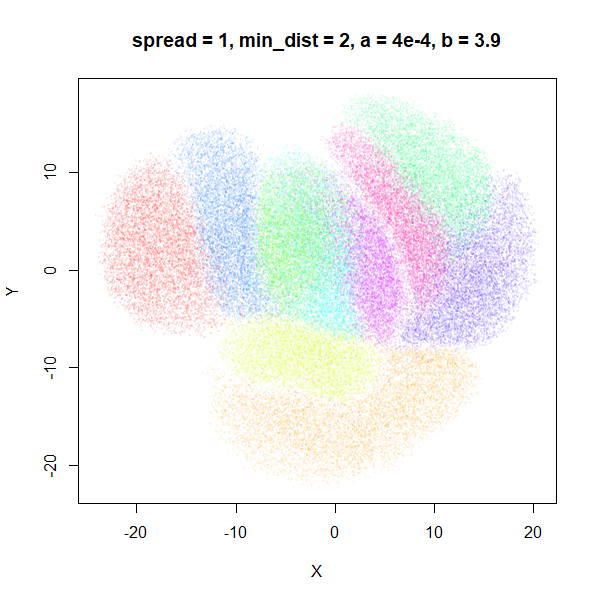    |

Again, there is a range of `min_dist` values, from 0.0001 to 0.1 where
not much happens to the plot. Above this value, the clusters begin to
expand. The final shapes are very diffuse. The table below shows how `a`
and `b` change as `min_dist` increases.

| spread | min_dist | a      | b     |
|--------|----------|--------|-------|
| 1      | 0.0001   | 1.932  | 0.791 |
| 1      | 0.001    | 1.929  | 0.792 |
| 1      | 0.01     | 1.90   | 0.80  |
| 1      | 0.05     | 1.75   | 0.84  |
| 1      | 0.1      | 1.58   | 0.90  |
| 1      | 0.5      | 0.58   | 1.33  |
| 1      | 1        | 0.12   | 1.93  |
| 1      | 1.5      | 0.013  | 2.67  |
| 1      | 2        | 0.0004 | 3.89  |

For value of `min_dist` larger than 0.5, values of `a` drop quickly
while `b` increases rapidly.

In terms of the differences between `spread` and `min_dist`, `min_dist`
seems to more obviously increase the size of the clusters, whereas
increasing `spread` keeps the shape and boundary of the clusters a bit
better. `spread` can therefore be used to control the inter-cluster
distances to some extent, where as `min_dist` controls the size of the
clusters.

## a and b

Rather than change `spread` and `min_dist`, we can supply values of `a`
and `b` directly. Perhaps these can also be interpreted. Again, we’ll
look at changing each value separately, leaving the other value at the
UMAP defaults (`a = 1.58` and `b = 0.90`). I used the range of values of
`a` and `b` that resulted from changing `min_dist` and `spread` in the
previous section’s results to set the range of values I look at below.

[Wang and co-workers](https://www.jmlr.org/papers/v22/20-1061.html)
recommend that `b > 0.5` to be a good loss function for dimensionality
reduction (see Proposition 1 and 2 in their PaCMAP paper).

### a

`a` seemed to have a wider range of values than `b`, so I looked at
values between `a = 0.0001` and `a = 100`.

|                                                   |                                                 |                                               |
|:-------------------------------------------------:|:-----------------------------------------------:|:---------------------------------------------:|
| 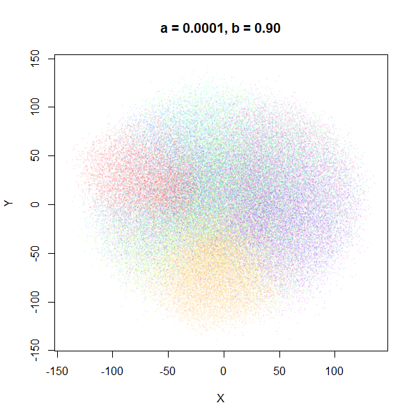 | 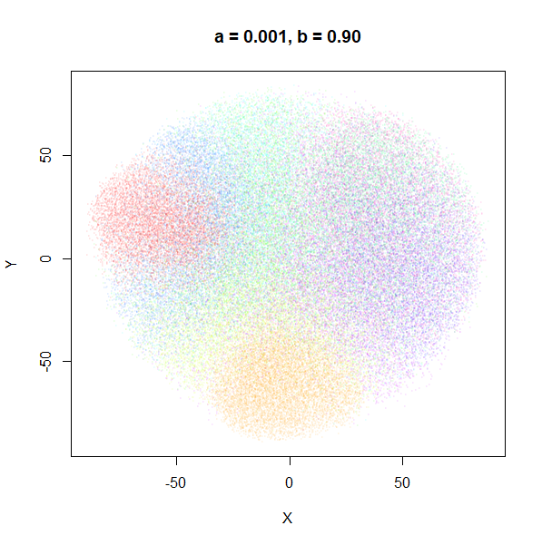 | 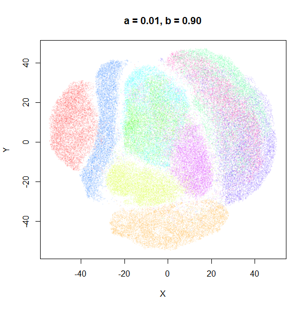 |
|    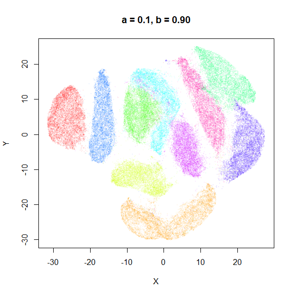    |     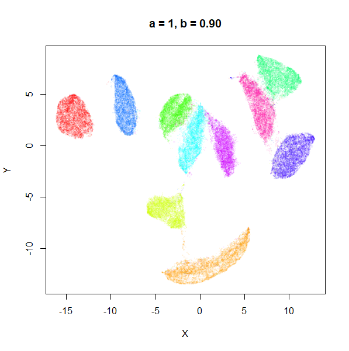     |    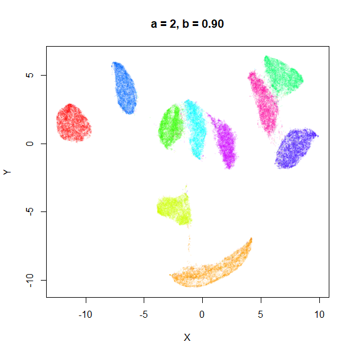    |
|     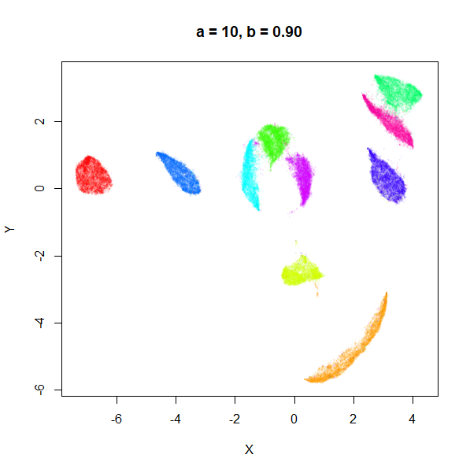     |    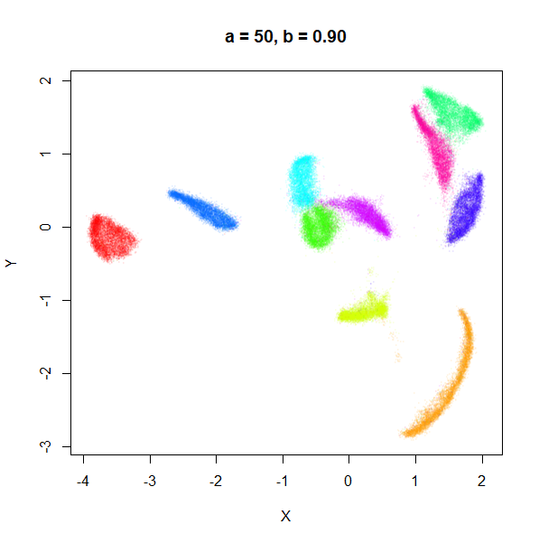    |  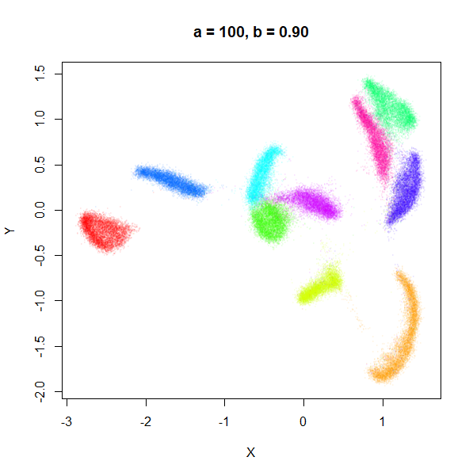  |

`a` seems to control the spread of the clusters for most of its range.
Low values of `a` certainly result in a diffuse round cloud. Above
`a = 10`, I suspect we are running into numerical issues with taking a
large power of a small positive value. Values between 0.1 and 10 seem
reasonable, with higher values leading to smaller clusters.

### b

`b` definitely seems to have a smaller range of useful values compared
to `a`, so I looked at values between `b = 0.1` to `b = 2.5`.

|                                                |                                                |                                                |
|:----------------------------------------------:|:----------------------------------------------:|:----------------------------------------------:|
|  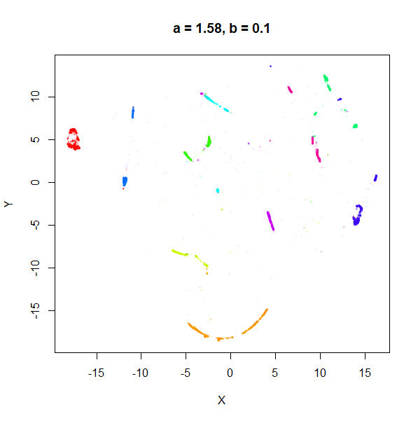  | 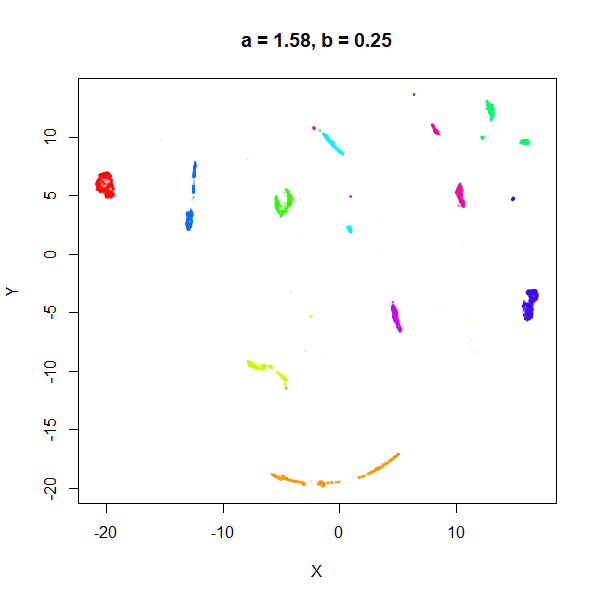 |  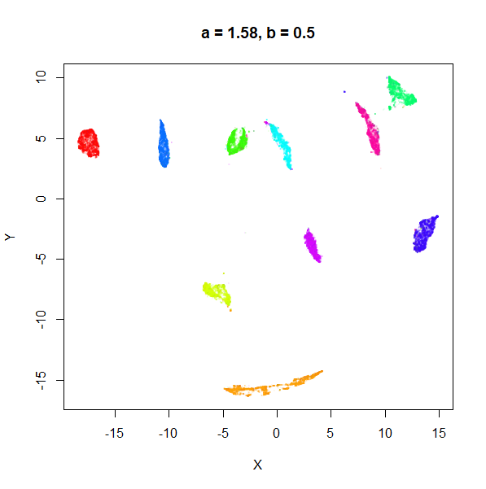  |
| 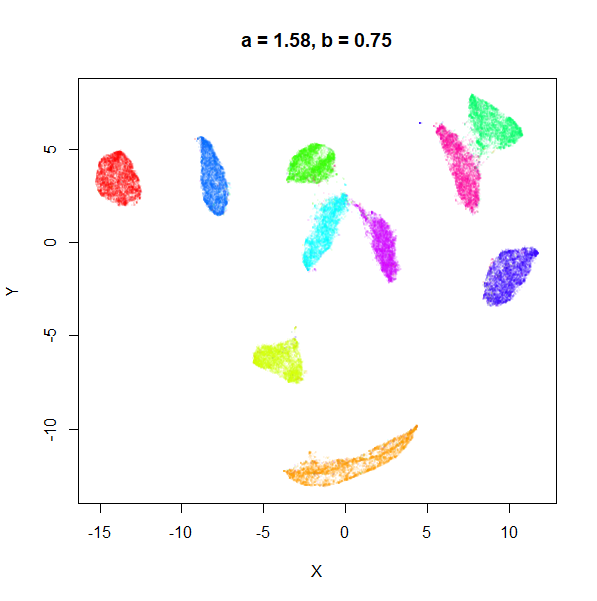 |    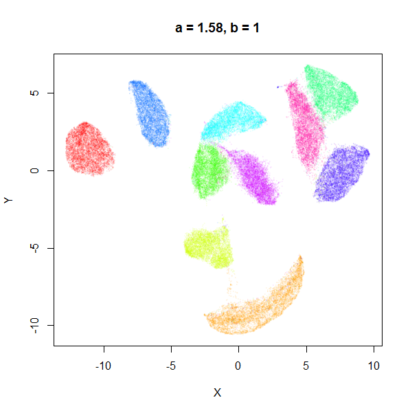    | 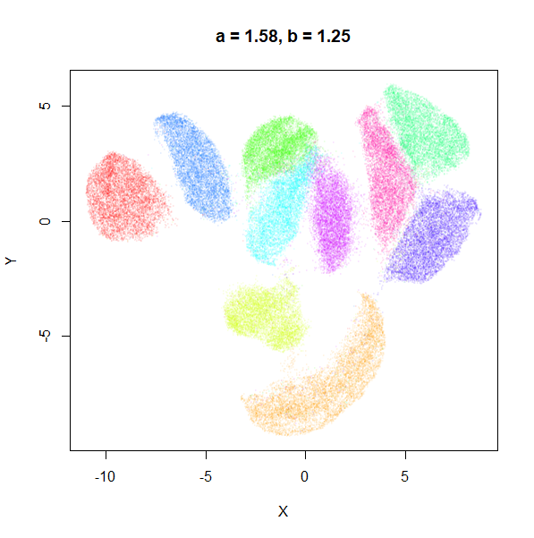 |
|  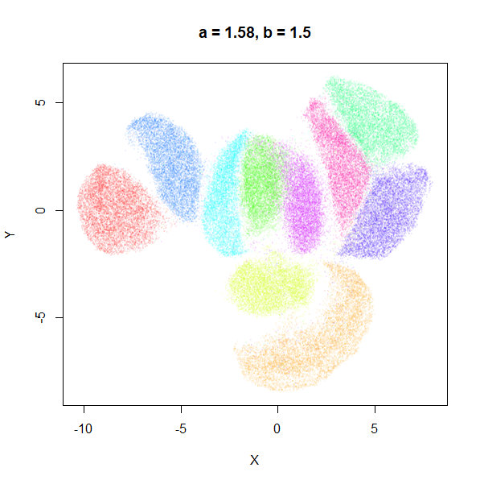  |    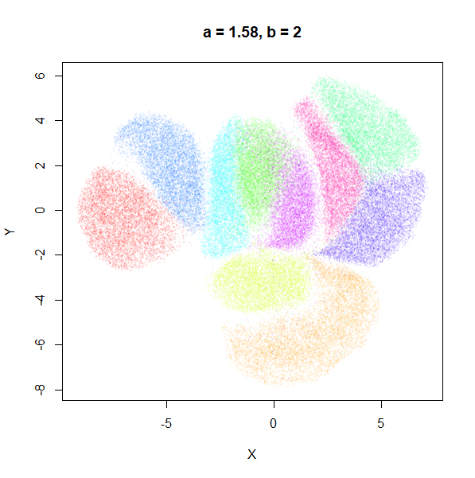    |  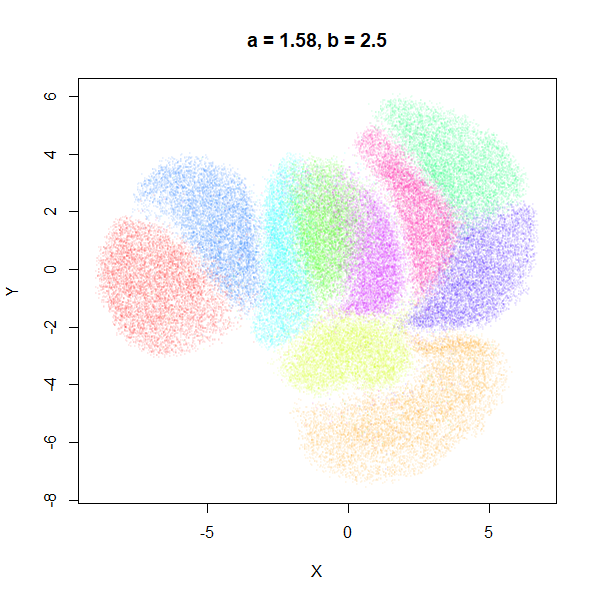  |

`b` seems to work like the heavy-tail parameter sometimes used in
[t-SNE](https://arxiv.org/abs/1902.05804): low values increase the
distances between the clusters, relative to their size, but also reveal
sub-clusters that appear to be one structure in the other plots. At high
values, the space between clusters is reduced, but you can still see
borders between the clusters, unlike what happens with low `a`.

I don’t see a big difference between using `a` and `b` directly, or
sticking with `min_dist` and `spread` I prefer `a` and `b` myself, as it
reminds me more of the approach used in [ABSNE
(PDF)](https://people.eecs.berkeley.edu/~pabbeel/papers/2015-ICML-absne.pdf),
although I don’t claim there is any equivalence between the `a` and `b`
parameters in UMAP and the $\alpha$ and $\beta$ parameters in that work.

## Examples

MNIST is useful for seeing the effect of changing `a` and `b`, but it
can be visualized well with the default parameters. So here are two
examples which show that we can improve on the default visualizations,
by using our knowledge of what `a` and `b` roughly represent in terms of
cluster size and separation.

### Example 1: tasic2018

The transcriptomics dataset tasic2018 is a good example where the
default UMAP parameters are sub-optimal. Below is the default UMAP
result in the top left image, and then a series of results based on me
fiddling with `a` and `b` in response to it. I eventually fumble my way
to a setting with a lower `a` and a higher `b` that provides a better
visualization (in my opinion), which you can see in the lower right.

|                                                           |                                                         |
|:---------------------------------------------------------:|:-------------------------------------------------------:|
| 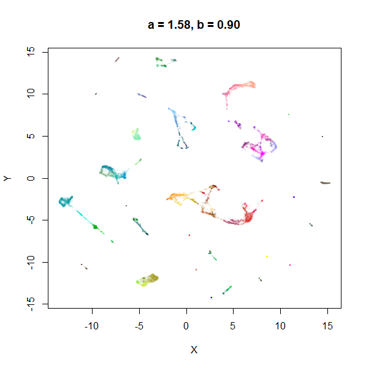 |   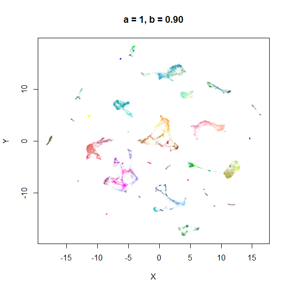   |
|    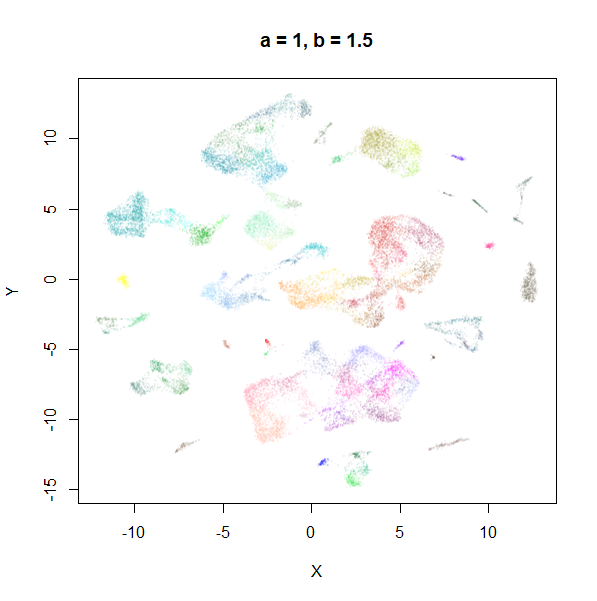    | 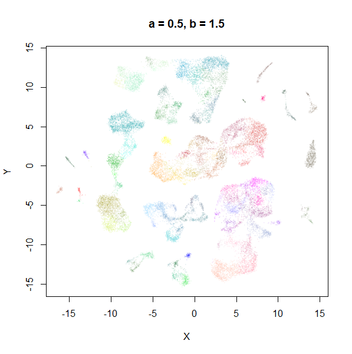 |

### Example 2: COIL-20

And here’s another example where arguably the default UMAP results
spread the clusters out a bit too much. Here are three alternatives
based on controlling `a` and `b`.

|                                                        |                                                      |
|:------------------------------------------------------:|:----------------------------------------------------:|
| 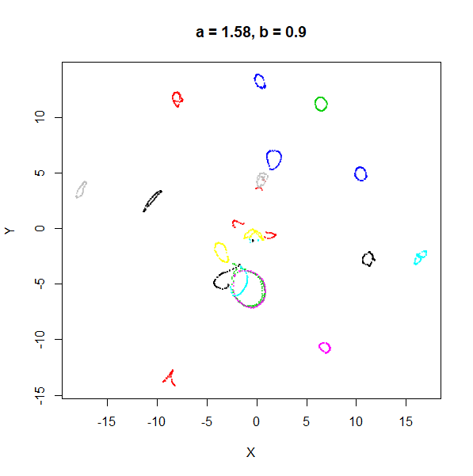 | 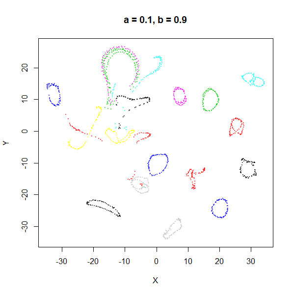 |
|  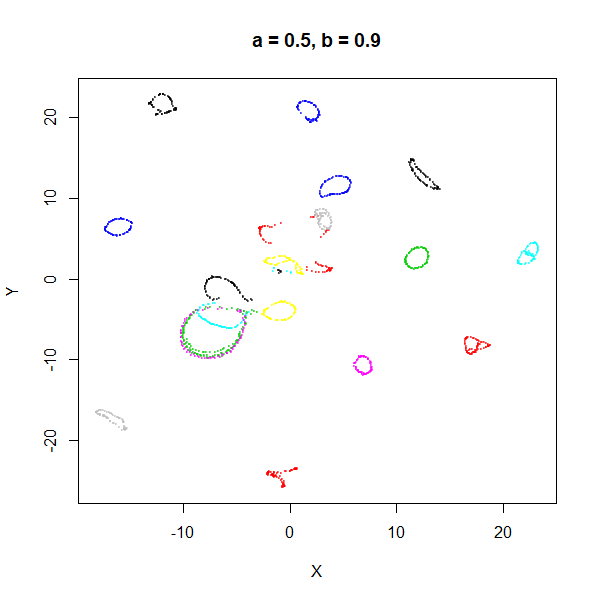  | 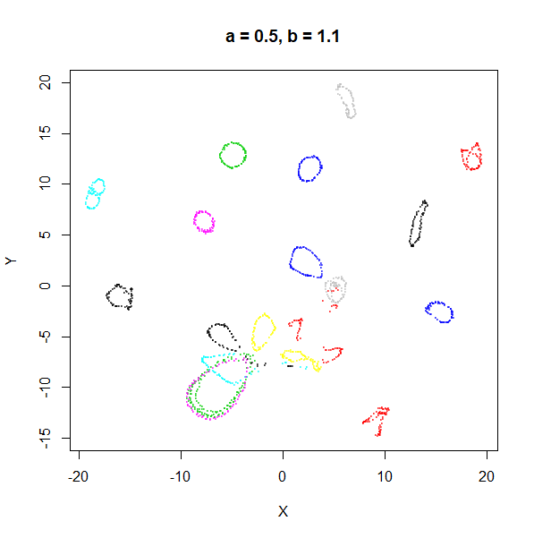 |

## My recommendation

Hopefully this is enough to convince you that the embedding parameters
can be profitably twiddled with in more than a random way to give
visualizations that improve over the default settings.

Of `min_dist` and `spread`, modifying `min_dist` between 0 and 1, as
suggested by the UMAP docs seems to be most fruitful of the parameters
to meddle with.

I personally prefer to use `a` and `b` directly. To find good values for
`a` and `b`, you can start with them at `a = 1 and b = 1`, which gives a
t-SNE-like output function, and you can use the `tumap` function to
generate the initial plot much faster. I also recommend doing any PCA
dimensionality reduction outside of `uwot` and using `ret_nn = TRUE` for
the first plot, so you can re-use the nearest neighbors data in
subsequent runs of `umap`. This is a substantial speed up and makes
repeating runs with different values of `a` and `b` a lot more
tolerable.

Here’s an example workflow:

``` r
# PCA to 50 dimensions first
mnist_pca <- irlba::prcomp_irlba(mnist, n = 50, retx = TRUE, center = center,
                             scale. = FALSE)$x

# t-UMAP is equivalent to a = 1, b = 1
# remember to get the nearest neighbor data back too
mnist_a1b1 <- tumap(mnist_pca, ret_nn = TRUE)

# find a
mnist_a1.5b1 <- umap(mnist_pca, nn_method = mnist_a1b1$nn, a = 1.5, b = 1)
mnist_a0.5b1 <- umap(mnist_pca, nn_method = mnist_a1b1$nn, a = 0.5, b = 1)

# find b based on whichever value of a you prefer
mnist_a0.5b1.2 <- umap(mnist_pca, nn_method = mnist_a1b1$nn, a = 0.5, b = 1.2)
```
