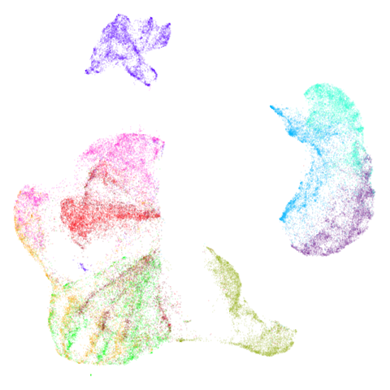
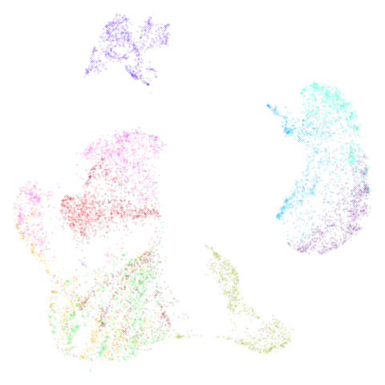

# Embedding New Data

Note: some of this information is repeated from the [metric learning
article](https://jlmelville.github.io/uwot/articles/metric-learning.html),
an article so poorly-titled that I was unable to find where I had
discussed transforming new data. [As
requested](https://github.com/jlmelville/uwot/issues/132) by
[RoyiAvital](https://github.com/RoyiAvital), this article focuses only
on tranforming new data into an existing embedding, and a description of
how this is achieved.

To embed new data into an embedding so you should:

- set `ret_model = TRUE` when running `umap` on the original data.
- Provide the return value of that call to `umap` to the
  `umap_transform` function along with your new data.

## How It Works

1.  Let’s say $P$ are the set of embedded points and there are $N_{P}$
    of them. Likewise there are new points to embed called $Q$ (could be
    as few as 1 point in Q).
2.  For a given new item to embed, $q$, find the `n_neighbors` nearest
    neighbors from the already embedded dataset (i.e. find $p_{1}$\`,
    $p_{2}$, …, $p_{k}$).
3.  Form the affinity matrix between the $N_{Q}$ points to embed and the
    original $N_{P}$ points. The affinity matrix is no longer square or
    symmetric but that doesn’t matter.
4.  Embed that as usual, where we want the Euclidean distance in the
    low-dimensional space to reproduce the affinities in the affinity
    matrix, via the usual UMAP cost function. Each pair of items is of
    the form $(p,q)$, i.e. it’s always one point from the original data
    and one from the new data. You don’t have pairs like $(p,p)$ or
    $(q,q)$.
5.  The only deviation from the standard way of doing things is that you
    don’t let the coordinates of any of the $p$ points update only the
    $q$.

There are some minor differences to the parameters involved in the
transform:

1.  Coordinates are initialized by taking the weighted average of the
    neighbors coordinates, where the weights are the affinities.
2.  In terms of calculating those affinities, the local connectivity is
    adjusted down by one. This is a rather obscure parameter that I
    rarely see (never?) being adjusted by users in either `uwot` or in
    other implementations. It controls the number of neighbors that are
    considered fully connected to a point (i.e. gets an affinity of
    1.0). It’s usually set to one, so that means when transforming data,
    the local connectivity is set to 0. I suspect the reason for this is
    that because of the initialization: because the points are located
    close to its neighbors we don’t need to worry about having items
    which are very distant during the optimization so we don’t need to
    enforce closeness to a given point.
3.  The learning rate is set to a quarter of whatever it was during
    training.

## Example

Let’s use the `fashion` MNIST dataset.

``` r
devtools::install_github("jlmelville/snedata")
fashion <- snedata::download_fashion_mnist()
```

The Fashion MNIST dataset contains 70,000 images of fashion items, in
one of ten classes. A factor column, `Label` contains the id of each
item (from `0` to `9`) for backwards compatibility with the MNIST
dataset, which Fashion MNIST is designed to be a drop-in replacement
for. A more descriptive, but entirely equivalent, factor column,
`Description` provides a short text string to describe the classes,
e.g. the `Description` `"Coat"` and the `Label` `4` are equivalent.

``` r
fashion_train <- head(fashion, 60000)
fashion_test <- tail(fashion, 10000)
```

Training proceeds by running UMAP normally, but we need to return more
than just the embedded coordinates. To return enough information to
embed new data, we need to set the `ret_model` flag when we run `umap`.
This will return a list. The embedded coordinates can be found as the
`embedding` item.

#### Training Data

I am using the `umap2` function here, but you can use `umap` or `tumap`
as you wish. I am also making use of the `rnndescent` library for
nearest neighbor search. This is also optional (just don’t set
`nn_method`).

``` r
set.seed(1337)
library(rnndescent)
fashion_umap_train <- umap2(fashion_train, ret_model = TRUE, nn_method = "nndescent")
```

#### Test Data

To embed new data, use the `umap_transform` function. Pass the new data
and the trained UMAP model. There’s no difference between using a
standard UMAP model:

``` r
fashion_umap_test <- umap_transform(fashion_test, fashion_umap_train)
```

Here are the results:

|                  Training data (60,000 points)                  |                   Test data (10,000 points)                   |
|:---------------------------------------------------------------:|:-------------------------------------------------------------:|
|  |  |

Looks pretty decent, although you could argue it’s not truly an “out of
sample” example because the test data is all from the same distribution
as the training data. If you made the test data an entire set of one
labels, it is obviously not going to embed in the same place as it
appear in the full embedding. You are also going to miss the
interactions between the points within the test data.

Also, be aware that with small datasets you can get some odd looking
ring effects from embedding the test data. See this issue for more
details: <https://github.com/jlmelville/uwot/issues/128> – in that issue
I speculate that it’s due to false negatives being included in the
negative sampling, i.e. actual close neighbors that should only be used
for attractive forces.
