# Fast SGD settings

By default, `uwot` uses some conservative settings during the stochastic
gradient descent. But there are some options that can speed things up:

- `n_sgd_threads = "auto"` (or any value greater than one): this is the
  biggest thing you can do to speed up optimization. The optimization is
  now spread across multiple threads. The `"auto"` setting sets the
  value to that used in the other multi-threaded part of the code, which
  is controlled by `n_threads`. The downside to using multiple threads
  is that you can no longer guarantee the reproducibility of the
  results. Normally, you would expect the same results if you called
  `set.seed` before each run. This will not be the case if set
  `n_sgd_threads`.
- `pcg_rand = FALSE`: the default random number generator used in the
  optimization is taken from [the PCG
  family](http://www.pcg-random.org/). This is quite fast and has good
  statistical properties. An alternative PRNG is an implementation of
  the Tausworthe “taus88” generator, which is used in the Python
  implementation of UMAP and which I have translated from Python into
  C++. By setting `pcg_rand = FALSE`, you will get the taus88 generator.
  This is faster than PCG, but bear in mind that PCG was designed by
  computer science professor [Melissa
  O’Neill](https://www.cs.hmc.edu/~oneill/index.html), and the taus88
  implementation was translated into C++ by me (I am not a computer
  science professor), so if you have any concerns about the possibility
  of artifacts from bad random number generation, stick with PCG.
  Nonetheless, it probably gives results similar to that in the Python
  UMAP implementation most of the time.
- `approx_pow = TRUE`: the UMAP gradient requires some power
  calculations, which are quite slow compared to other arithmetic
  operations. An [approximation to pow by Martin
  Ankerl](https://martin.ankerl.com/2012/01/25/optimized-approximative-pow-in-c-and-cpp/)
  can give a noticeable speed up.
- `fast_sgd = TRUE`: this just sets all three of the above options at
  once, to make life a bit easier.

If you need reproducibility (e.g. for scientific/publication purposes),
then using multiple optimization threads is a deal-breaker. But for
visualization purposes or if reproducibility isn’t that important to
you, then these settings can give a meaningful speed up of the
performance of `uwot`, without hurting the quality of the layout.

To prove it, here are some images of embeddings with the fast settings
on and off. On the left are images with the optimization settings left
in their default (slower) values. I also use PCA to reduce the
dimensionality to 100:

``` r
set.seed(1337)
mnist_umap_slow <- umap(mnist, pca = 100, verbose = TRUE)
```

On the right are the embeddings from using `fast_sgd = TRUE`:

``` r
set.seed(1337)
mnist_umap_fast <- umap(mnist, pca = 100, fast_sgd = TRUE, verbose = TRUE)
```

Six threads were used in the stochastic gradient descent.

For details on the datasets, see the
[examples](https://jlmelville.github.io/uwot/articles/umap-examples.html)
page. The timings are given in the title, in minutes and seconds. Note
that this is for entire run, not just the optimization phase, i.e. it
includes the PCA dimensionality reduction and nearest neighbor search,
which is usually the slowest part of the run and which is not affected
by `fast_sgd`.

### mnist

|                                            |                                            |
|:------------------------------------------:|:------------------------------------------:|
| 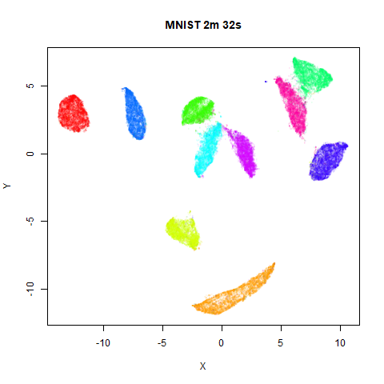 | 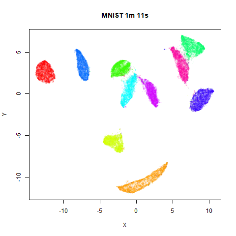 |

### fashion

|                                                |                                                |
|:----------------------------------------------:|:----------------------------------------------:|
| 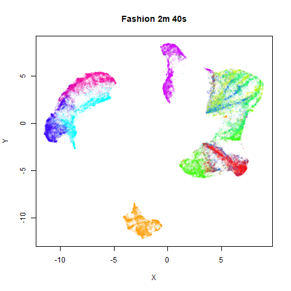 | 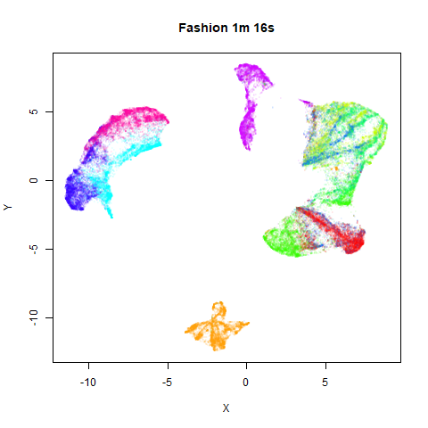 |

### kuzushiji

|                                                    |                                                    |
|:--------------------------------------------------:|:--------------------------------------------------:|
| 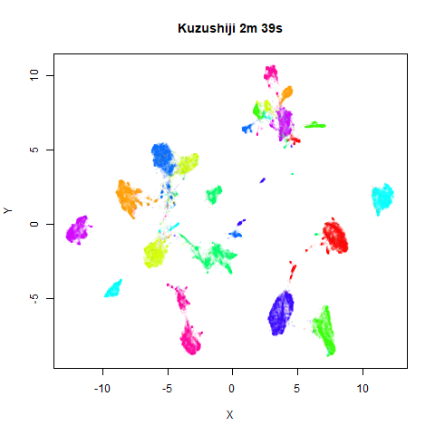 | 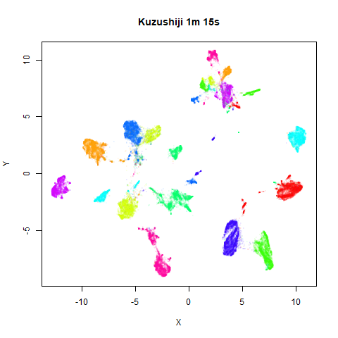 |

### norb

|                                          |                                          |
|:----------------------------------------:|:----------------------------------------:|
| 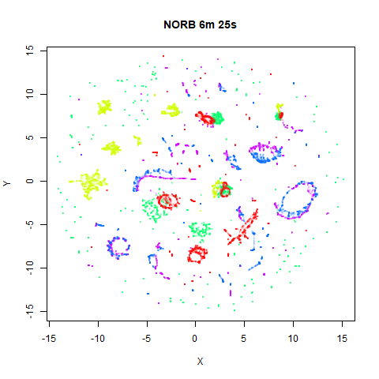 | 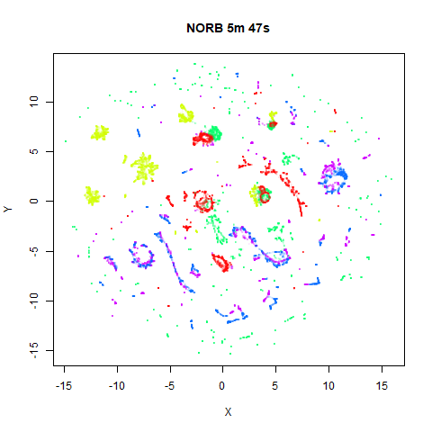 |

The distribution of clusters here does a look a little bit different,
but I think it’s within the variation that one would expect from the
stochastic nature of the optimization. To bolster my point, here are two
further runs of UMAP on the NORB dataset with `fast_sgd = FALSE` and
different seeds:

|                                      |                                          |
|:------------------------------------:|:----------------------------------------:|
| 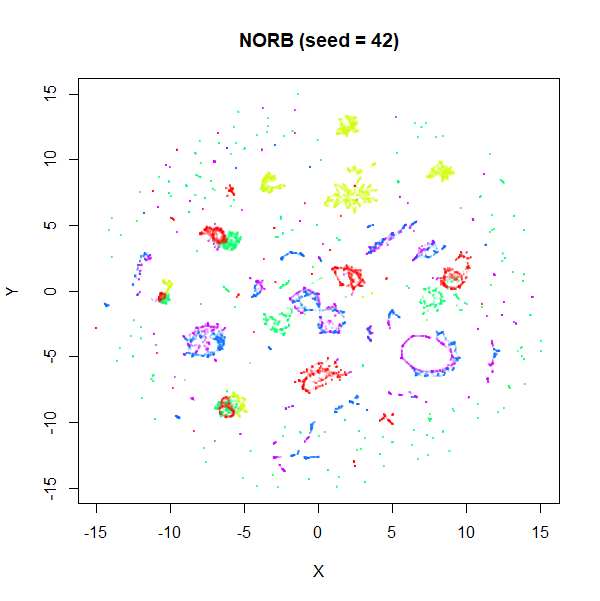 | 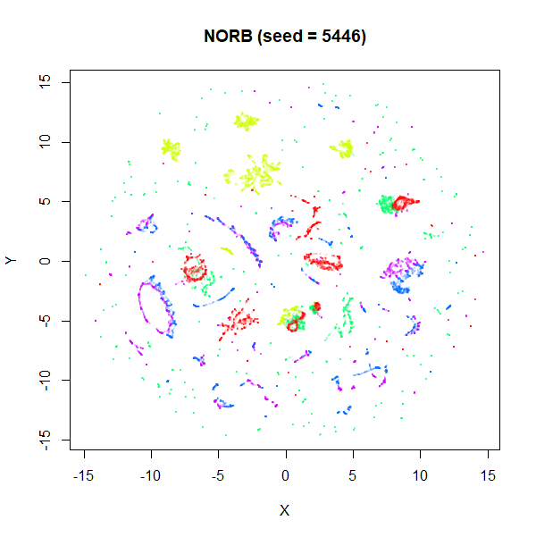 |

I think if you didn’t know one of these four images was generated with
the fast settiings, you’d be hard pressed to pick it out of the line up.
The variation between images is more likely due to the default
`n_neighbors` being too low to capture the global structure. Here’s some
plots with `n_neighbors = 150`, and `n_epochs = 500` to account for the
increased number of edges that need sampling:

|                                                 |                                                 |
|:-----------------------------------------------:|:-----------------------------------------------:|
| 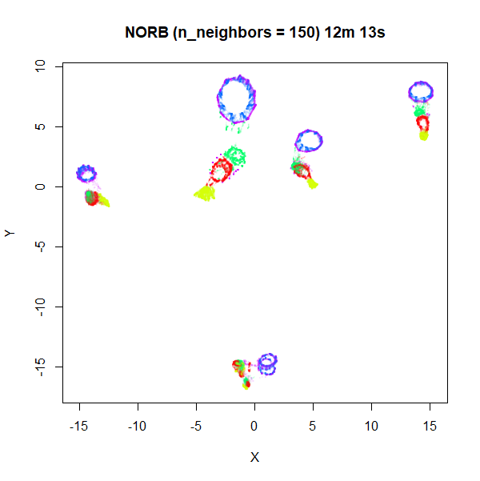 | 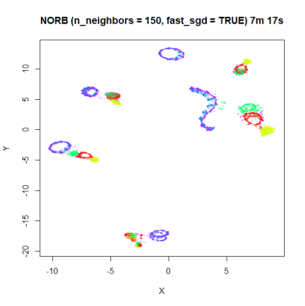 |

Apart from one of the blue loops being open in the `fast_sgd = TRUE`
result, which is probably fixable with a longer optimization, the global
arrangement of the two plots is pretty similar.

### tasic2018

|                                                    |                                                    |
|:--------------------------------------------------:|:--------------------------------------------------:|
| 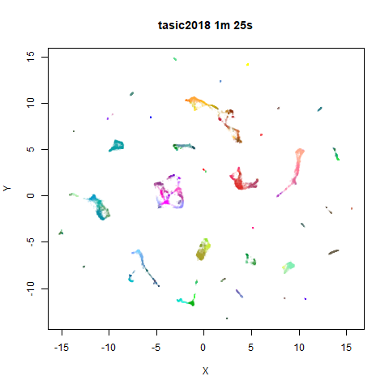 | 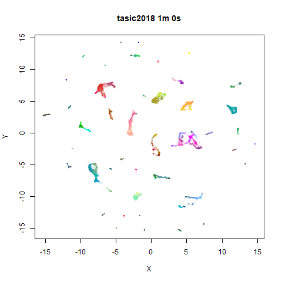 |

### macosko2015

|                                                        |                                                        |
|:------------------------------------------------------:|:------------------------------------------------------:|
| 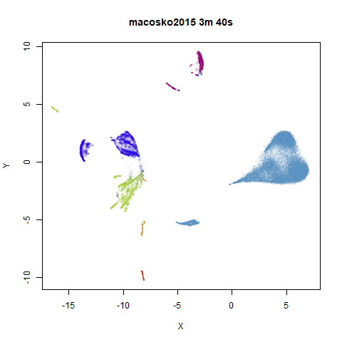 | 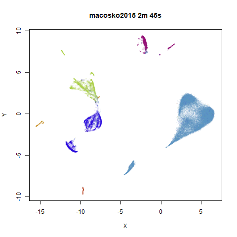 |

## Recommendations

From these results, I’d say that the `fast_sgd = TRUE` settings give
results which are effectively indistinguishable from the slower
settings, so if you want to save a bit of time, there seems no harm in
using them. The actual time savings you’ll see depend on how long the
nearest neighbor search takes, and any initial PCA you carry out on the
input (as we do in all these examples) can take a fair amount of the run
time. For example on NORB, the PCA takes up 5 minutes of the
six-and-a-half minute total run time, so there’s not a lot of time to be
saved. But for MNIST and Fashion, you can effectively halve the run time
(with six threads, anyway).

If reproducibility is important to you, then using multiple threads in
the optimization is out of the question, although that’s what gives the
biggest speed increase. However, you could still consider setting
`approx_pow = TRUE, pcg_rand = FALSE`. For MNIST-sized datasets
(`mnist`, `fashion`, `kuzushiji`) I saw a reasonable speed up of around
25%. For datasets where the PCA and nearest neighbor search dominates,
the gains are smaller: a 10-15% speedup for `tasic2018` and
`macosko2015`, and only 5% for `norb`. If you need to set `n_epochs`
higher, then these time savings will increase.

### Update December 22 2024

Since I wrote this document, there are some extra options available. As
of uwot 0.2.3, the `rng_type` parameter is preferred over `pcg_rand`.
The equivalent of `pcg_rand = FALSE` is `rng_type = "tausworthe"`, but
you can also set `rng_type = "deterministic"`, which will
deterministically sample the vertices. This can give a bigger speed up
than `rng_type = "tausworthe"`.

Further, if you are using the `umap2` function and have
[rnndescent](https://cran.r-project.org/package=rnndescent) installed,
the following parameters can be used to speed up the nearest neighbor
search:
`nn_method = "nndescent", nn_args = list(n_trees = 8, max_candidates = 20)`.

Finally, you can also consider setting `negative_sample_rate = 4`, which
will give a slight speed up versus the default sample rate of 5.

These suggestions are based on a comment by [Leland McInnes on
Reddit](https://www.reddit.com/r/MachineLearning/comments/1gsjfq9/comment/lxip9wy/).
