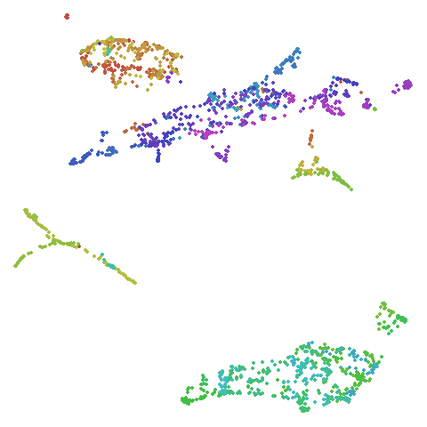
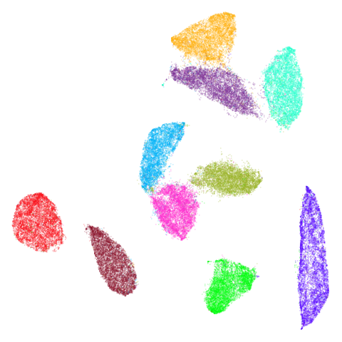
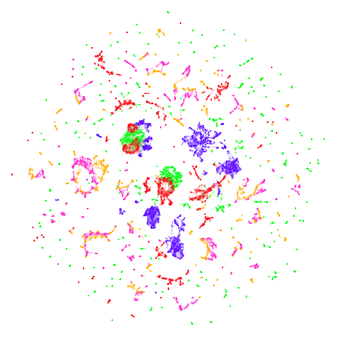
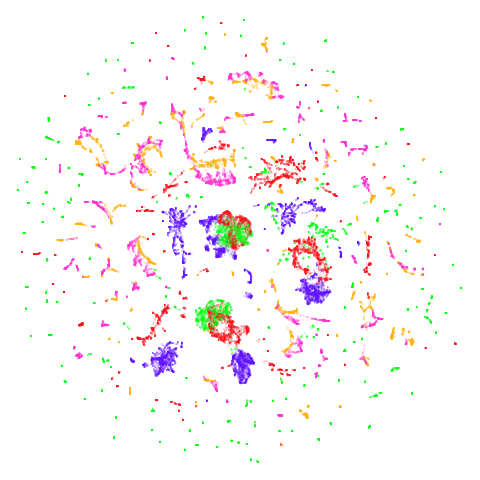

# Initialization

*December 27 2024*: Updated to use `umap2` and with better images.

## Introduction

The default initialization for UMAP uses the eigenvectors of a
normalized graph Laplacian of the sparse affinity matrix. This normally
works well except when:

- The graph has disconnected components, in which case you really have
  multiple separate graphs. In `uwot`, there is a risk that the
  [RSpectra](https://cran.r-project.org/package=RSpectra) can have
  trouble converging under these circumstances.
- Even with a connected graph, there can sometimes be convergence
  issues, which I have tried to mitigate. However, there is a still a
  risk of a very long initialization, and possibly a hang.
  Unfortunately, interrupting RSpectra can result in requiring the
  entire R session to be lost.

### PCA Initialization

An alternative to using the spectral initialization is to use PCA,
although depending on the scaling of your input variables, this could
lead to a quite spread-out initial set of coordinates, which can be hard
to optimize. For the related technique t-SNE, [Kobak and
Berens](https://www.biorxiv.org/content/10.1101/453449v1) recommend
scaling the PCA results so that the standard deviation for each
dimension is `1e-4`. You can get that behavior in `uwot` by using the
`umap` function with `init = "spca"` or `umap2` with
`init = "spca", init_sdev = 1e-4`.

### Changes with `umap2`

Based on some years of experience, the `umap2` function has some
slightly different defaults which I recommend over `umap`. For more on
the `umap2` function, see the [umap2
article](https://jlmelville.github.io/uwot/articles/umap2.html). But I
recommend using `init = "pca"`. At some point after I wrote `uwot` (or I
just never noticed), the Python UMAP package added an extra scaling of
coordinates so that they are contained in a bounding box of side length
10. This is now the default with `umap2` and seems to work pretty well.

All the results shown on this page now use `umap2`.

### If you are still using `umap`

If you are still using `umap`, then the `init = "spca"` option there
works ok, but the standard deviation of `1e-4` may be too small for some
datasets. If you see results where you are suspicious that clusters are
being broken up, I recommend trying with value of `init_sdev` of `1e-2`,
`1` or `2.5`. If you want to use the Python UMAP-style scaling with
`umap`, you can get it by setting `init_sdev = "range"`, and is probably
the best choice.

### The Approximate Global Spectral Initialization

PCA is a solid choice for initialization when spectral embedding fails.
But using PCA ignores the information in the affinity matrix that might
be useful for initialization: for example, when using supervised UMAP or
mixing different types of distance metrics. And conceptually, using the
affinity matrix has a lot of appeal. Dzwinel and co-workers describe a
very fast multi-dimensional scaling-like method called
[ivhd](https://arxiv.org/abs/1902.01108) which generates a connected
graph, by only knowing only a few neighbor and non-neighbor points and
pretending the target distances are 0 and 1, respectively. Similar
theoretical support for this is given by [Linderman and
co-workers](https://arxiv.org/abs/1711.04712). On the basis of this
work, I have implemented an “approximate global” spectral method of
initialization: which is a very minor modification of the standard
spectral initialization:

- All non-zero elements of the affinity matrix are set to 1.
- A random number of the zero elements are set to 0.1, at a rate of
  `n_neg_samples` for each positive edge in the graph. This is
  consistent with the ratio of neighbor to non-neighbor edge sampling
  during optimization and, if using a default value of `n_neg_samples`,
  is a similar order of magnitude as the ratio of neighbor to
  non-neighbor entries in the graph that is used with ivhd.
- Theoretically, this should be enough to guarantee a graph with a
  single component. The spectral initialization is carried out.
- After initialization, the original affinity matrix is used for
  optimization.

You can get this behavior in uwot with `init = "agspectral"`.

### Laplacian Eigenmap

Another option for a connected graph is to use a variation on the
normalization used in the graph Laplacian to get something close to
[Laplacian Eigenmap](https://doi.org/10.1162/089976603321780317) with
`init = "laplacian"`. In [Luxburg’s spectral clustering tutorial
(PDF)](http://www.kyb.mpg.de/fileadmin/user_upload/files/publications/attachments/luxburg06_TR_v2_4139%5b1%5d.pdf)
this form of normalization is recommended over that used in the
`init = "spectral"` normalization. So we’ll try it here and see if it
makes any difference.

### Random Initialization

If all else fails, you can use random initialization. In the spirit of
generosity, `uwot` offers two types of random initialization. The first
is that used by UMAP, which uses a random uniform distribution between
-10 and +10 along each axis. You can get this with `init = "rand"`.
Alternatively, there is the method favoured by LargeVis (and used by
default with `lvish`), which is to use a Gaussian distribution with
standard deviation 1e-4. This is also the method used by t-SNE. You can
get this by setting `init = "lvrand"`.

To summarize your options:

``` r
# Default initialization: use spectral initialization if possible
# falling back to scaled PCA if multiple components are found in the graph
embedding <- umap2(data)

# same as the above
embedding <- umap2(data, init = "spectral")

# use (scaled) PCA: defaults are different between umap and umap2
embedding <- umap2(data, init = "pca")

# If you want to use `umap` then you can use the following:
# umap with default scaled PCA
embedding <- umap(data, init = "spca")
# equivalent to:
embedding <- umap(data, init = "pca", init_sdev = 1e-4)
# but this might be a better choice of settings
embedding <- umap(data, init = "pca", init_sdev = "range")

# use an "approximate global" spectral initialization that should be applicable
# even under conditions where "spectral" fails and has to use spca
embedding <- umap2(data, init = "agspectral")

# use a Laplacian Eigenmap style initialization, which will also fall back to
# spca if it has to
embedding <- umap2(data, init = "laplacian")

# use random initialization, UMAP style
embedding <- umap2(data, init = "rand")
# use random initialization, t-SNE/LargeVis style
embedding <- umap2(data, init = "lvrand")
```

Below, we’ll explore the effect of these settings. For more details on
the datasets, see the
[examples](https://jlmelville.github.io/uwot/articles/umap-examples.html)
page.

Apart from changing `init`, mainly default settings where used. To save
a bit of time, I used pre-calculated exact nearest neighbors, but I
don’t expect that to have a major effect on the results. Some typical
commands using the `iris` dataset would be:

``` r
set.seed(1337)
# Using the `umap` function with spca initialization
iris_umap <- umap(iris, init = "spca")
# Using the `umap2` with agspectral with slightly different (and hopefully
# better) defaults
iris_umap <- umap2(iris, init = "agspectral")
```

## Datasets

For details see the [examples
article](https://jlmelville.github.io/uwot/articles/umap-examples.html).

## Spectral vs PCA

Below are some examples of using either the PCA initialization or a
spectral approach. On the first row, the left-hand image is the result
of using `init = "pca"`, and the right-hand image is
`init = "agspectral"`. On the second row, the left-hand image is for
`init = "spectral"`. and the right-hand image is `init = "laplacian"`.
Some datasets don’t have the second row of images, because with the
settings used here, they generate more than one component in the graph,
and therefore both `init = "spectral"` and `init = "laplacian"` would
fall back to similar results as seen with `init = "pca"`.

### iris

|                pca                 |                    agspectral                    |
|:----------------------------------:|:------------------------------------------------:|
|  |  |

### s1k

|               pca                |                   agspectral                   |
|:--------------------------------:|:----------------------------------------------:|
|  |  |

|                  spectral                  |                  laplacian                   |
|:------------------------------------------:|:--------------------------------------------:|
|  |  |

### olivetti

|                    pca                     |                        agspectral                        |
|:------------------------------------------:|:--------------------------------------------------------:|
|  |  |

|                       spectral                       |                       laplacian                        |
|:----------------------------------------------------:|:------------------------------------------------------:|
|  |  |

### frey

|                pca                 |                    agspectral                    |
|:----------------------------------:|:------------------------------------------------:|
|  |  |

|                   spectral                   |                   laplacian                    |
|:--------------------------------------------:|:----------------------------------------------:|
|  |  |

### coil20

|                  pca                   |                      agspectral                      |
|:--------------------------------------:|:----------------------------------------------------:|
|  |  |

### coil100

|                   pca                    |                       agspectral                       |
|:----------------------------------------:|:------------------------------------------------------:|
|  |  |

### mnist

|                 pca                  |                     agspectral                     |
|:------------------------------------:|:--------------------------------------------------:|
|  |  |

|                    spectral                    |                    laplacian                     |
|:----------------------------------------------:|:------------------------------------------------:|
|  |  |

### fashion

|                   pca                    |                       agspectral                       |
|:----------------------------------------:|:------------------------------------------------------:|
|  |  |

|                      spectral                      |                      laplacian                       |
|:--------------------------------------------------:|:----------------------------------------------------:|
|  |  |

### kuzushiji

|                     pca                      |                         agspectral                         |
|:--------------------------------------------:|:----------------------------------------------------------:|
|  |  |

|                        spectral                        |                        laplacian                         |
|:------------------------------------------------------:|:--------------------------------------------------------:|
|  |  |

### norb

|                pca                 |                    agspectral                    |
|:----------------------------------:|:------------------------------------------------:|
|  |  |

### tasic2018

|                     pca                      |                         agspectral                         |
|:--------------------------------------------:|:----------------------------------------------------------:|
|  |  |

### macosko2015pca100

|                             pca                              |                                 agspectral                                 |
|:------------------------------------------------------------:|:--------------------------------------------------------------------------:|
|  |  |

|                                spectral                                |                                laplacian                                 |
|:----------------------------------------------------------------------:|:------------------------------------------------------------------------:|
|  |  |

### isoswiss

|                    pca                     |                        agspectral                        |
|:------------------------------------------:|:--------------------------------------------------------:|
|  |  |

|                       spectral                       |                       laplacian                        |
|:----------------------------------------------------:|:------------------------------------------------------:|
|  |  |

There are really only minor differences between the PCA results and the
spectral results in *most* cases.

The big difference occurs with `isoswiss`. This shows the Achilles heel
of PCA for initialization: it does not have any respect for manifolds.
Where spectral initialization is able to “unfold” the structure, PCA
leaves it folded up and the projection onto 2D leaves it broken up into
three pieces.

In most (but not all) cases, the `agspectral` results are very similar
to the `spectral` results. Again `isoswiss` shows the limitations of the
method. Like with PCA, the manifold has not been initialized properly
and some unpleasant breakage occurs. There are certainly worse ways to
initialize this dataset though, as we shall see below. I don’t think the
results here are a fundamental limitation of the `agspectral` approach,
but the balance of the random vs near neighbor affinities may not be
ideal for this dataset.

The `laplacian` results also strongly resemble the spectral
initialization, and where they differ it’s not obvious to me if one is
strictly better than the other, so in terms of initialization for UMAP,
there doesn’t seem to be a strong advantage for using one type of graph
Laplacian over the other.

## Random Initialization: `rand`

Below are two results each from using random initialization, so you can
get a sense for how much variation you can expect from getting lucky or
not with the initialization.

``` r
# left-hand plots used this seed
set.seed(1337)
# right-hand plots used this seed
# set.seed(42)
iris_umap <- umap(iris, init = "rand")
```

### iris

|                 seed = 1337                  |                seed = 42                 |
|:--------------------------------------------:|:----------------------------------------:|
|  |  |

### s1k

|                seed = 1337                 |               seed = 42                |
|:------------------------------------------:|:--------------------------------------:|
|  |  |

### olivetti

|                     seed = 1337                      |                    seed = 42                     |
|:----------------------------------------------------:|:------------------------------------------------:|
|  |  |

### frey

|                 seed = 1337                  |                seed = 42                 |
|:--------------------------------------------:|:----------------------------------------:|
|  |  |

### coil20

|                   seed = 1337                    |                  seed = 42                   |
|:------------------------------------------------:|:--------------------------------------------:|
|  |  |

### coil100

|                    seed = 1337                     |                   seed = 42                    |
|:--------------------------------------------------:|:----------------------------------------------:|
|  |  |

### mnist

|                  seed = 1337                   |                 seed = 42                  |
|:----------------------------------------------:|:------------------------------------------:|
|  |  |

### fashion

|                    seed = 1337                     |                   seed = 42                    |
|:--------------------------------------------------:|:----------------------------------------------:|
|  |  |

### kuzushiji

|                      seed = 1337                       |                     seed = 42                      |
|:------------------------------------------------------:|:--------------------------------------------------:|
|  |  |

### norb

|                 seed = 1337                  |                seed = 42                 |
|:--------------------------------------------:|:----------------------------------------:|
|  |  |

### tasic2018

|                      seed = 1337                       |                     seed = 42                      |
|:------------------------------------------------------:|:--------------------------------------------------:|
|  |  |

### macosko2015pca100

|                              seed = 1337                               |                             seed = 42                              |
|:----------------------------------------------------------------------:|:------------------------------------------------------------------:|
|  |  |

### isoswiss

|                     seed = 1337                      |                    seed = 42                     |
|:----------------------------------------------------:|:------------------------------------------------:|
|  |  |

Results are not terrible for the smaller datasets, but for anything
`mnist`-sized, we start to see broken-up clusters. And oof, `isoswiss`
is a disaster.

## Random Initialization: `lvrand`

And here is the result of using random initialization in the
t-SNE/LargeVis style, which use a Gaussian distribution over a much
smaller initial range of coordinate values. Will it make much
difference?

``` r
# left-hand plots used this seed
set.seed(1337)
# right-hand plots used this seed
# set.seed(42)
iris_umap <- umap(iris, init = "lvrand")
```

### iris

|                   seed = 1337                    |                  seed = 42                   |
|:------------------------------------------------:|:--------------------------------------------:|
|  |  |

### s1k

|                  seed = 1337                   |                 seed = 42                  |
|:----------------------------------------------:|:------------------------------------------:|
|  |  |

### olivetti

|                       seed = 1337                        |                      seed = 42                       |
|:--------------------------------------------------------:|:----------------------------------------------------:|
|  |  |

### frey

|                   seed = 1337                    |                  seed = 42                   |
|:------------------------------------------------:|:--------------------------------------------:|
|  |  |

### coil20

|                     seed = 1337                      |                    seed = 42                     |
|:----------------------------------------------------:|:------------------------------------------------:|
|  |  |

### coil100

|                      seed = 1337                       |                     seed = 42                      |
|:------------------------------------------------------:|:--------------------------------------------------:|
|  |  |

### mnist

|                    seed = 1337                     |                   seed = 42                    |
|:--------------------------------------------------:|:----------------------------------------------:|
|  |  |

### fashion

|                      seed = 1337                       |                     seed = 42                      |
|:------------------------------------------------------:|:--------------------------------------------------:|
|  |  |

### kuzushiji

|                        seed = 1337                         |                       seed = 42                        |
|:----------------------------------------------------------:|:------------------------------------------------------:|
|  |  |

### norb

|                   seed = 1337                    |                  seed = 42                   |
|:------------------------------------------------:|:--------------------------------------------:|
|  |  |

### tasic2018

|                        seed = 1337                         |                       seed = 42                        |
|:----------------------------------------------------------:|:------------------------------------------------------:|
|  |  |

### macosko2015pca100

|                                seed = 1337                                 |                               seed = 42                                |
|:--------------------------------------------------------------------------:|:----------------------------------------------------------------------:|
|  |  |

### isoswiss

|                     seed = 1337                      |                    seed = 42                     |
|:----------------------------------------------------:|:------------------------------------------------:|
|  |  |

No, it doesn’t make a huge difference.

## Recommendations

The default spectral initialization does a good job. If for some reason
you can’t use it, for example due to disconnections, then `init = "pca"`
is a good choice. The one exception is with data where you think you
have a manifold structure. In that case, you would hope that you have a
connected graph, in which case you won’t need to use PCA.

I would love to say that `agspectral` can help you out if you are having
difficulty with a slow spectral initialization, and in general it seems
useful, but it may not work well with manifold data. The `laplacian`
initialization does not provide a meaningful difference to the spectral
initialization based on the results shown here.

Random initialization should be used only as a last resort. Increasing
`n_neighbors` can sometimes help a bit, but you may need to set it to a
very high value (e.g. 150) and that may introduce long-distance
interactions that doesn’t represent your data.
