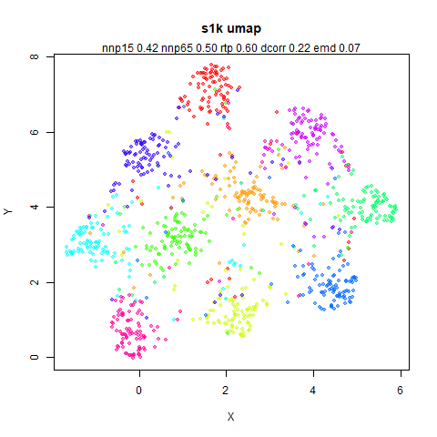
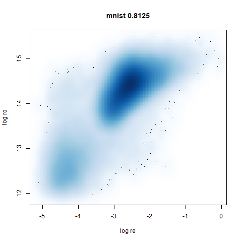
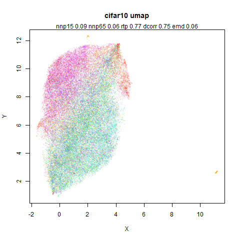
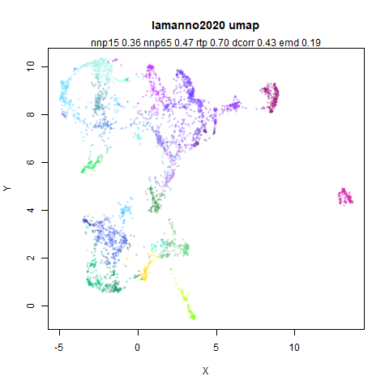

# Leopold: Lightweight Estimate of Preservation of Local Density

## densMAP

[densMAP](https://doi.org/10.1038/s41587-020-00801-7) is a variation on
UMAP that attempts to preserve the differences in density in the
original data by adding a new component to the cost function. It is
available in the Python UMAP implementation by setting `densmap=True`.
See also [this excellent
tutorial](https://umap-learn.readthedocs.io/en/latest/densmap_demo.htm).
There has been a [request to add densMAP to
uwot](https://github.com/jlmelville/uwot/issues/73) since the start of
2021. This document describes the approximate version of densMAP that is
available in `uwot` which may be good enough. But first, a bit more
about densMAP.

densMAP can be seen as adding a regularization to the UMAP cost function
in which the “local radius” of each observation in the input and output
space is calculated and the Pearson correlation between the two is
optimized.

The radius of observation $i$, $R_{i}$ is calculated as:

$$R_{i} = \frac{1}{\sum\limits_{i}P_{ij}}\sum\limits_{i}d_{ij}^{2}P_{ij}$$

where $d_{ij}$ is the distance between point $i$ and $j$ and $P_{ij}$ is
the *symmetrized* edge weight between $i$ and $j$, i.e. the radius is
the edge-weighted average of the squared distances between each $i$ and
each of its neighbors. Because the matrix has been symmetrized, $i$ may
have a different number of neighbors than the `n_neighbors` parameter
that the user specifies.

To get a feel for what densMAP does, below are some results from the
Python UMAP (i.e. no `uwot` output here), with and without
`densmap=True`. As recommended by the current UMAP README, I also set
`n_neighbors=30`, except for `subset_clusters`, which I’ll explain when
I get to it. Everything else was left as the defaults.

The images below are:

- Top left: the UMAP results colored by the typical label for that
  dataset. There are some cryptic numbers in the subtitle which you
  should feel free to ignore.
- Top right: UMAP results with each point colored by the log of the
  input local radius, using the [ColorBrewer Spectral
  palette](https://colorbrewer2.org/#type=diverging&scheme=Spectral&n=11).
  Red means a small radius, blue means a large radius. This should show
  areas that densMAP is likely to contract or expand, respectively.
- Middle left: the densMAP results colored by the typical label for that
  dataset.
- Middle right: the densMAP results colored by local radius.
- Bottom: a plot of the log of the input local radii vs the log output
  radii and the Pearson correlation between them. These radii are
  returned from the `fit_transform` method when `densmap=True`. When
  there were more than 1000 points, I used `smoothScatter` to plot the
  results.

First two datasets are simple simulation sets based on [How to Use t-SNE
Effectively](https://distill.pub/2016/misread-tsne/), specifically
sections 2 (“Cluster sizes in a t-SNE plot mean nothing”) and 6 (“For
topology, you may need more than one plot”).

### two_different_clusters

This dataset consists of two 50D Gaussians of 5,000 points each. One of
the clusters has a standard deviation 10x the other. I used
[snedata](https://github.com/jlmelville/snedata) to generate this data
(via the `two_different_clusters_data` function).

|                                                                                        |                                                                                              |
|:--------------------------------------------------------------------------------------:|:--------------------------------------------------------------------------------------------:|
|        |                  |
|  |  |
|          |                                                                                              |

Like t-SNE, default UMAP shows both of these clusters as the same size.
densMAP shows one of the clusters as smaller. A good start.

### subset_clusters

This dataset once again features two 50D gaussians of 5,000 points each,
but this time they overlap entirely. The larger cluster has a standard
deviation of 50, the smaller a standard deviation of 1.

For this dataset I used `n_neighbors=150`, much larger than the
`n_neighbors=30` setting used for the other plots. This was to be
consistent with the plots I generated with `uwot`. With `uwot` I
precalculated exact nearest neighbors for all datasets and for this
dataset, using the exact 30 nearest neighbors results in the smaller
cluster being embedded at the edge of the larger cluster. Presumably 30
nearest neighbors doesn’t result in enough edges between the two
clusters to properly situate the smaller cluster. The approximate
nearest neighbors routine used in UMAP results in edges between
sufficiently far away neighbors to create a neighborhood to that
reflects the global structure better. I didn’t investigate this
thoroughly, but it sounds plausible to me.

|                                                                          |                                                                                |
|:------------------------------------------------------------------------:|:------------------------------------------------------------------------------:|
|        |                  |
|  |  |
|          |                                                                                |

UMAP considers these two clusters to be the same size. With densMAP, the
ring-shaped structure that is found with high perplexities with t-SNE
shows up. But at least the small cluster is inside the big one. Note
that if you re-run this with `n_neighbors=30` the results are not
noticeably changed.

### s1k

This is a synthetic dataset I like to use: 1000 points from a fuzzy 10D
simplex.

|                                                  |                                                        |
|:------------------------------------------------:|:------------------------------------------------------:|
|        |                  |
|  |  |
|          |                                                        |

I can’t say I like what densMAP has done here. There is one point that
has been flung far away from the rest of the plot. You can see from the
coloring that this is because it has a large local radius. This perhaps
indicates that the local radius calculation can be affected by edge
effects.

### swissroll

A swiss roll dataset [of my own
devising](https://github.com/jlmelville/snedata).

|                                                              |                                                                    |
|:------------------------------------------------------------:|:------------------------------------------------------------------:|
|        |                  |
|  |  |
|          |                                                                    |

densMAP does a noticeably better job at not ripping the swiss roll than
UMAP does. As you would expect the local density to be fairly uniform
across a 2D manifold I don’t know if there’s an *a priori* reason to
have thought densMAP would do a better job here.

### scurvehole

A 3D S-curve with a hole data set, used to validate the [PaCMAP
method](https://arxiv.org/abs/2012.04456) (see also the [github
repo](https://github.com/YingfanWang/PaCMAP)).

|                                                                |                                                                      |
|:--------------------------------------------------------------:|:--------------------------------------------------------------------:|
|        |                  |
|  |  |
|          |                                                                      |

### iris

[Ronald Fisher’s iris
dataset](https://en.wikipedia.org/wiki/Iris_flower_data_set).

|                                                    |                                                          |
|:--------------------------------------------------:|:--------------------------------------------------------:|
|        |                  |
|  |  |
|          |                                                          |

### spenguins

The [Palmer Penguins](https://allisonhorst.github.io/palmerpenguins/).
The `s` in `spenguins` stands for scaled, because I filtered out entries
with missing values then Z-scaled the inputs.

|                                                              |                                                                    |
|:------------------------------------------------------------:|:------------------------------------------------------------------:|
|        |                  |
|  |  |
|          |                                                                    |

### mammoth

A 3D point cloud of a [mammoth at the
Smithsonian](https://3d.si.edu/object/3d/mammuthus-primigenius-blumbach:341c96cd-f967-4540-8ed1-d3fc56d31f12),
from [Understanding
UMAP](https://pair-code.github.io/understanding-umap/), based on work
originally done by [Max
Noichl](https://github.com/MNoichl/UMAP-examples-mammoth-).

|                                                          |                                                                |
|:--------------------------------------------------------:|:--------------------------------------------------------------:|
|        |                  |
|  |  |
|          |                                                                |

### oli

The [Olivetti Faces](https://cs.nyu.edu/~roweis/data.html) images.

|                                                  |                                                        |
|:------------------------------------------------:|:------------------------------------------------------:|
|        |                  |
|  |  |
|          |                                                        |

### frey

The [Frey Faces](https://cs.nyu.edu/~roweis/data.html) images.

|                                                    |                                                          |
|:--------------------------------------------------:|:--------------------------------------------------------:|
|        |                  |
|  |  |
|          |                                                          |

### isofaces

The faces dataset used in Isomap (processed via [this
gist](https://gist.github.com/jlmelville/339dfeb80c3e836e887d70a37679b244)).

|                                                            |                                                                  |
|:----------------------------------------------------------:|:----------------------------------------------------------------:|
|        |                  |
|  |  |
|          |                                                                  |

### mnist

The [MNIST digits](http://yann.lecun.com/exdb/mnist/) images.

|                                                      |                                                            |
|:----------------------------------------------------:|:----------------------------------------------------------:|
|        |                  |
|  |  |
|          |                                                            |

The orange cluster is the 1 digits and its smaller radius is
exceptionally obvious when coloring the UMAP plot by radius. It very
noticeably shrinks when densMAP goes to work on it.

### fashion

The [Fashion MNIST](https://github.com/zalandoresearch/fashion-mnist)
images.

|                                                          |                                                                |
|:--------------------------------------------------------:|:--------------------------------------------------------------:|
|        |                  |
|  |  |
|          |                                                                |

Similarly to the MNIST digits, the orange cluster (this time its images
of pants) is noticeably smaller than the other clusters.

### kuzushiji

The [Kuzushiji MNIST](http://codh.rois.ac.jp/kmnist/index.html.en)
images.

|                                                              |                                                                    |
|:------------------------------------------------------------:|:------------------------------------------------------------------:|
|        |                  |
|  |  |
|          |                                                                    |

### norb

The [Small NORB](https://cs.nyu.edu/~ylclab/data/norb-v1.0-small/)
images.

|                                                    |                                                          |
|:--------------------------------------------------:|:--------------------------------------------------------:|
|        |                  |
|  |  |
|          |                                                          |

You can see the largest of the blue/purple ring-like structures is
broken up by UMAP, but densMAP preserves it. In fact, the densMAP plot
is one of the nicer UMAP layouts of the small NORB datasets I’ve seen.

### coil20

The
[COIL-20](https://www.cs.columbia.edu/CAVE/software/softlib/coil-20.php)
images.

|                                                        |                                                              |
|:------------------------------------------------------:|:------------------------------------------------------------:|
|        |                  |
|  |  |
|          |                                                              |

### coil100

The [COIL-100](https://cave.cs.columbia.edu/repository/COIL-100) images.

|                                                          |                                                                |
|:--------------------------------------------------------:|:--------------------------------------------------------------:|
|        |                  |
|  |  |
|          |                                                                |

### cifar10

The [CIFAR-10](https://www.cs.toronto.edu/~kriz/cifar.html) images.

|                                                          |                                                                |
|:--------------------------------------------------------:|:--------------------------------------------------------------:|
|        |                  |
|  |  |
|          |                                                                |

### macosko2015

The [macosko2015](https://doi.org/10.1016/j.cell.2015.05.002) RNAseq
data.

|                                                                  |                                                                        |
|:----------------------------------------------------------------:|:----------------------------------------------------------------------:|
|        |                  |
|  |  |
|          |                                                                        |

This dataset (an RNA sequence dataset) isn’t a lot of fun to visualize
with vanilla UMAP, but densMAP does not improve matters.

### tasic2018

RNAseq data from the [Allen Brain
Atlas](http://celltypes.brain-map.org/rnaseq/mouse) originally reported
by [Tasic and co-workers](http://dx.doi.org/10.1038/s41586-018-0654-5).

|                                                              |                                                                    |
|:------------------------------------------------------------:|:------------------------------------------------------------------:|
|        |                  |
|  |  |
|          |                                                                    |

Another RNAseq dataset, densMAP has a very interesting effect on the
cluster sizes, but because some of the clusters have a very low density,
this has the effect of squashing the other into the center of the plot.

### lamanno2020

Another RNASeq data, found via the [Picasso example
notebook](https://github.com/pachterlab/picasso/blob/main/examplePicasso.ipynb).
I think the publication reference is
<https://doi.org/10.1038/s41586-021-03775-x> (was published at
[biorXiv](https://www.biorxiv.org/content/10.1101/2020.07.02.184051v1)
in 2020).

|                                                                  |                                                                        |
|:----------------------------------------------------------------:|:----------------------------------------------------------------------:|
|        |                  |
|  |  |
|          |                                                                        |

### ng20

The [20 Newsgroups](http://qwone.com/~jason/20Newsgroups/) dataset,
which I manually converted into a dense 3000D PCA result: [see this
gist](https://gist.github.com/jlmelville/78f5dc241c9163494eda509a1c5f46e8).

|                                                    |                                                          |
|:--------------------------------------------------:|:--------------------------------------------------------:|
|        |                  |
|  |  |
|          |                                                          |

densMAP noticeably has a hard time mapping the local radii to the 2D
output.

What I take away from all this:

- densMAP does a good job at maintaining the correlation of input and
  output radii. The only time it fails is with the 20 Newsgroups
  dataset.
- A good correlation doesn’t necessarily mean a helpful static
  visualization. Some of the results have some clusters which are highly
  dispersed which may reflect the true relationship of densities but
  makes it hard to actually see the cluster, and the rest of the data
  gets crushed into the middle of the plot. That’s not necessarily a
  problem if you have an interactive plot and can pan and zoom. Or you
  can change the regularization value of `dens_lambda`. I didn’t try
  that but I have no reason to doubt a satisfying value can be found for
  any of the datasets where I didn’t like the output with default
  settings.

But I don’t currently want to implement densMAP because it involves
adding lots of extra code, much of it in C++ and I am very lazy.

## Approximating densMAP

Here’s my pitch for an approximation to densMAP, which I have named the
Lightweight Estimate of Preservation of Local Density (Leopold).

For the input radii, as part of the smooth k-nearest neighbor distances
routine we already calculate $\rho$ which is the distance to the nearest
neighbor of each item in the dataset (subject to the
`local_connectivity` constraint). Additionally, we also calculate
$\sigma$ which is a normalization factor used with the neighbors at
distance greater than $\rho$. It must have units of distance, and the
larger the distances to the neighbors, the larger $\sigma$ gets. So I
propose the following definition for the local radius:

$$R_{i} = \rho + \sigma$$

The biggest difference between this definition of the local input radii
is that I haven’t bothered to square the distances (it doesn’t make much
difference for leopold) and that the values for $\sigma$ and $\rho$ are
calculated *before* the symmetrization of the UMAP input edge weights.
So these values are missing the influence of observations outside the
initial k-nearest neighborhood graph.

For the output radii, I know from looking at the [output weight function
parameters](https://jlmelville.github.io/uwot/articles/umap-examples.html),
that increasing the `a` parameter makes the clusters in a UMAP plot
shrink, and vice versa. So let’s use that as measure of the output
density, i.e. the inverse of the local radius. As every point has its
own radius, the value for a given weight between points $i$ and $j$ will
be the geometric mean of the two radii:

$$w_{ij} = 1/\left( 1 + \frac{d_{ij}^{2}}{\sqrt{r_{i}r_{j}}} \right)$$

where $r_{i}$ is a scaled version of the input radius $R_{i}$ suitable
for the lower dimensional space. This is a similar sort of scaling to
that used by [Zelnik-Manor and
Perona](https://papers.nips.cc/paper/2004/hash/40173ea48d9567f1f393b20c855bb40b-Abstract.html)
for “self-tuning” spectral clustering, and also recommended for local
scaling to reduce hubness in high dimensional space by [Schnitzer and
co-workers](https://www.jmlr.org/papers/v13/schnitzer12a.html).

The scaling from input to output space is not sophisticated: I have
observed that for typical values of $b$ used in UMAP, a usable range of
$a$ values are between 0.01 (very diffuse clusters) and 100 (very tight
clusters), so we will just map the inverse of the input local radii to
that range.

The final adjustment to this is that it would be good to introduce a
parameter that controls how much of the range of `a` is used in the
output and thus how big a disparity of the input radii is reflected in
the output. To that end, there is an adjustable parameter for leopold: a
`dens_scale` parameter. Set it to 1 and it uses all the available range
of `a`. Set it to 0 and you get plain old UMAP back, with a fixed global
value of `a` as specified by the user (or via the `spread` and
`min_dist` parameters). Intermediate values get intermediate results.

In my mind this scaling of the radii is straightforward, but looking up
at that description maybe it’s not. The procedure is:

1.  Define the minimum log density as $a \times 10^{- 2s}$ where $a$ is
    the UMAP `a` parameter for the output and $s$ is the `den_scale`
    parameter.
2.  Define the maximum log density as $a \times 10^{2s}$.
3.  Range scale $\log\left( 1/R_{i} \right)$ between the minimum and
    maximum log density. Call that range scaled log density $\Delta_{i}$
4.  $a_{i} = \sqrt{\exp\left( \Delta_{i} \right)}$.
5.  The leopold output weight function is
    $w_{ij} = 1/\left( 1 + a_{i}a_{j}d_{ij}^{2} \right)$.

### The Advantage of leopold

The main advantage is for me: to implement this I don’t have to write
much new code: $\rho$ and $\sigma$ are already calculated and
implementing the per-observation value for `a` in the output function
requires creating a new version of the umap gradient routine that
expects a vector of values rather than a scalar. This is a lot less work
than implementing densMAP.

### The Disadvantage of leopold

It’s all a bit approximate. But all I really want from this technique is
that it makes the dense clusters get smaller and the diffuse clusters
get bigger. The exact changes seem less important to me as long as they
are vaguely sensible. I don’t claim to have a good sense of what I
expect to see when a blob of data with an intrinsic dimensionality of
$d$ and a radius of $r$ is embedded into 2D versus one with an intrinsic
dimensionality of $d + 5$ but a radius of $r/2$. Even if that was
accurately embedded, would it even look sensible let alone helpful?

## Results

Here are some plots using leopold. I used exact nearest neighbors for
these results as nearest neighbor calculations are usually the slowest
part of UMAP. The following deviations from default parameters were
used: `min_dist = 0.1` to be closer to the Python UMAP results. For
consistency with densMAP, `n_neighbors = 30` except for
`subset_clusters` which uses `n_neighbors = 150`. Also to be consistent
with densMAP, an extra 200 epochs on top of the usual default `n_epochs`
was used.

In the plots below:

top left: the output of running leopold,

- Top left: the leopold results colored by the typical label for that
  dataset.
- Top right: UMAP results with each point colored by the log of the
  input local radius, using the [ColorBrewer Spectral
  palette](https://colorbrewer2.org/#type=diverging&scheme=Spectral&n=11).
  Red means a small radius, blue means a large radius. This should show
  areas that densMAP is likely to contract or expand, respectively.
- Bottom left: a plot of the log of the input local radii vs the log
  output radii and the Pearson correlation between them. When there were
  more than 1000 points, I used `smoothScatter` to plot the results.
- Bottom right: a plot of the log of the densmap input local radii
  against the leopold equivalent ($\rho + \sigma$). The number in the
  title is Pearson correlation. There’s no particular reason for the two
  measures of local radius to be the same, but they should show a
  similar trend.

For a lot of these datasets, I won’t have anything to say unless there
is an interesting contrast or similarity with densMAP.

### two_different_clusters

|                                                                                                   |                                                                                                           |
|:-------------------------------------------------------------------------------------------------:|:---------------------------------------------------------------------------------------------------------:|
|          |            |
|  |  |

leopold is able to produce two different sizes for the cluster, although
the size disparity is much larger than for densMAP. This is due to the
very bimodal nature of the standard deviations in this dataset. One
cluster gets one end of the radii scale (highly disperse) and the second
cluster gets the other (highly compact). Turning down `dens_scale` to
something like `0.2` works well for this data set. But it doesn’t really
matter as this is a very artificial dataset. As long as the clusters are
the right relative size I am happy.

### subset_clusters

|                                                                                     |                                                                                             |
|:-----------------------------------------------------------------------------------:|:-------------------------------------------------------------------------------------------:|
|          |            |
|  |  |

This shows an interesting difference with densMAP: with densMAP, the
outer yellow ring had a more uniform density, whereas for leopold there
is a noticeable density gradient towards the center. I leave it up to
you to decide if that is a good or a bad thing.

### s1k

|                                                             |                                                                     |
|:-----------------------------------------------------------:|:-------------------------------------------------------------------:|
|          |            |
|  |  |

The point that got pushed far away from the rest of the data in the
densMAP plot is not as far away with leopold.

### swissroll

|                                                                         |                                                                                 |
|:-----------------------------------------------------------------------:|:-------------------------------------------------------------------------------:|
|          |            |
|  |  |

Both this one and `scurvehole` seem pretty comparable with the densMAP
results.

### scurvehole

|                                                                           |                                                                                   |
|:-------------------------------------------------------------------------:|:---------------------------------------------------------------------------------:|
|          |            |
|  |  |

### iris

|                                                               |                                                                       |
|:-------------------------------------------------------------:|:---------------------------------------------------------------------:|
|          |            |
|  |  |

### spenguins

|                                                                         |                                                                                 |
|:-----------------------------------------------------------------------:|:-------------------------------------------------------------------------------:|
|          |            |
|  |  |

### mammoth

|                                                                     |                                                                             |
|:-------------------------------------------------------------------:|:---------------------------------------------------------------------------:|
|          |            |
|  |  |

If you compare this to densMAP, the extremities are much more diffuse
than with leopold.

### oli

|                                                             |                                                                     |
|:-----------------------------------------------------------:|:-------------------------------------------------------------------:|
|          |            |
|  |  |

### frey

|                                                               |                                                                       |
|:-------------------------------------------------------------:|:---------------------------------------------------------------------:|
|          |            |
|  |  |

### isofaces

|                                                                       |                                                                               |
|:---------------------------------------------------------------------:|:-----------------------------------------------------------------------------:|
|          |            |
|  |  |

### mnist

|                                                                 |                                                                         |
|:---------------------------------------------------------------:|:-----------------------------------------------------------------------:|
|          |            |
|  |  |

The main thing I hoped to see was the orange ‘1’ cluster shrink. And it
does. The yellow ‘2’ cluster has also noticeably grown. Changes are more
subtle for the other clusters, but apart from the ‘1’ cluster their
densities are all quite similar. I’m happy with this.

### fashion

|                                                                     |                                                                             |
|:-------------------------------------------------------------------:|:---------------------------------------------------------------------------:|
|          |            |
|  |  |

leopold behaves in a densMAP-like way here too by shrinking the orange
cluster. The clusters which densMAP expands are also larger here, but
are not as diffuse as densMAP makes them. I personally prefer the
leopold layout, but I am biased so you should probably just ignore me.

### kuzushiji

|                                                                         |                                                                                 |
|:-----------------------------------------------------------------------:|:-------------------------------------------------------------------------------:|
|          |            |
|  |  |

### norb

|                                                               |                                                                       |
|:-------------------------------------------------------------:|:---------------------------------------------------------------------:|
|          |            |
|  |  |

This layout is fine, and maybe a bit neater than the UMAP one. But I
still like the densMAP version better.

### coil20

|                                                                   |                                                                           |
|:-----------------------------------------------------------------:|:-------------------------------------------------------------------------:|
|          |            |
|  |  |

### coil100

|                                                                     |                                                                             |
|:-------------------------------------------------------------------:|:---------------------------------------------------------------------------:|
|          |            |
|  |  |

### cifar10

|                                                                     |                                                                             |
|:-------------------------------------------------------------------:|:---------------------------------------------------------------------------:|
|          |            |
|  |  |

### macosko2015

|                                                                             |                                                                                     |
|:---------------------------------------------------------------------------:|:-----------------------------------------------------------------------------------:|
|          |            |
|  |  |

I think the layout that leopold provides is more legible than the
densMAP equivalent.

### tasic2018

|                                                                         |                                                                                 |
|:-----------------------------------------------------------------------:|:-------------------------------------------------------------------------------:|
|          |            |
|  |  |

Another example where leopold produces a less compressed result, because
the more diffuse clusters (e.g. the clusters at the bottom of the plot)
are not as expanded.

### lamanno2020

|                                                                             |                                                                                     |
|:---------------------------------------------------------------------------:|:-----------------------------------------------------------------------------------:|
|          |            |
|  |  |

### ng20

|                                                               |                                                                       |
|:-------------------------------------------------------------:|:---------------------------------------------------------------------:|
|          |            |
|  |  |

Does this layout look super-great? It does not. And nor can leopold
reproduce the input radii in the output space, it seems in fact to be
doing a worse job than densMAP. But it suffers less from outliers than
densMAP which is something.

## Conclusions

- I should probably be clear that I don’t think there’s anything wrong
  with densMAP.
- I am just currently too lazy to make all the changes in `uwot` it
  would need to be implemented. Hence leopold’s creation.
- Neither leopold’s definition of local radii or the results exactly map
  that of densMAP. So don’t go looking to reproduce densMAP plots
  exactly with it.
- I think the leopold results look fine. The dense clusters get smaller
  and the diffuse clusters get larger, although in the latter case not
  to the same extent as densMAP. However, that isn’t a big disadvantage
  from my perspective.
- densMAP does a better job in terms of the correlation between its
  input and output radii.
- Qualitatively, the densMAP and leopold results are quite similar.
- The correlations between the leopold definition of local radii and the
  densMAP version are pretty high for real datasets. So I venture to
  suggest they encode quite similar information.

If you want to use leopold in `uwot`:

- Set the `dens_scale` parameter to a value between 0 (exactly like
  UMAP) to 1 (use the full range of useful `a` values).
- Using leopold doesn’t seem to require extra epochs and you don’t need
  to worry about having to run normal UMAP for a number of epochs before
  applying leopold.
- Nor does it seem to benefit from a larger value of `n_neighbors`.
- I have re-run the results with `n_neighbors = 15` and default
  `n_epochs` and not noticed a very big effect compared to the results
  here, so I am not showing them as there are already way too many
  images on this page.
- You can transform new data with models generated where `dens_scale` is
  set. When UMAP transforms new data, an adjusted local connectivity is
  used which affects both $\sigma$ and $\rho$ so the estimated values of
  $R_{i}$ are not as precise as I would like, but the effect seems to be
  quite small.
- Even if you don’t use the local radii to generate the UMAP layout,
  coloring the results by the log of `localr` is quite informative as to
  which parts of the embedding you would expect to shrink or expand.
- A conservative use of *leopold* would be to run UMAP normally,
  visualize the results coloring by `localr` and then if there are
  obvious clusters that are a lighter or darker hue, run with
  `dens_scale = 1` from the current coordinates for a couple of hundred
  more epochs.

Here’s how you use it with `iris`:

``` r
iris_leopold <- umap(iris, dens_scale = 1)
# and if you want the local radii values
iris_leopold <- umap(iris, dens_scale = 1, ret_extra = c("localr"))
```
