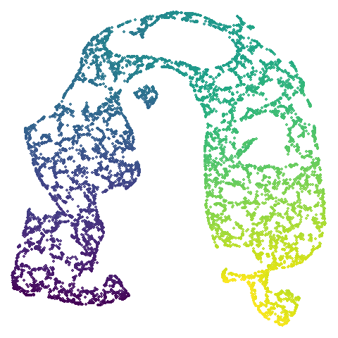
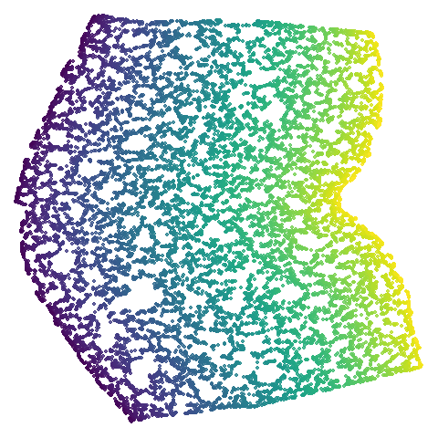
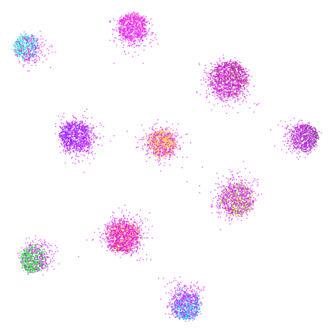
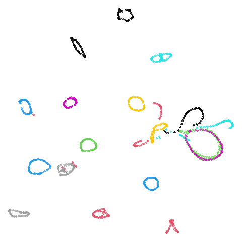
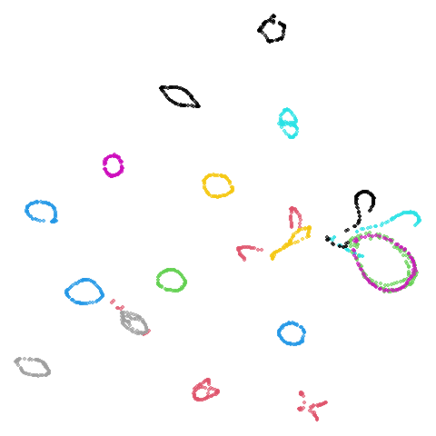
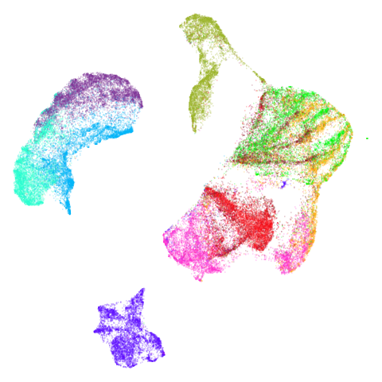
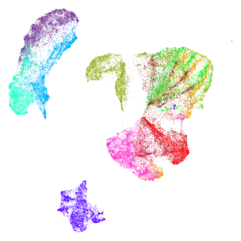
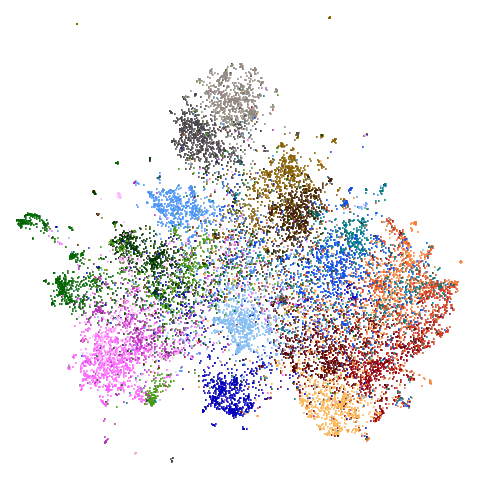

# Locally Scaled Neighbors

## Introduction

In their paper on [Self-Tuning Spectral
Clustering](https://papers.nips.cc/paper_files/paper/2004/hash/40173ea48d9567f1f393b20c855bb40b-Abstract.html),
Zelnik-Manor and Perona describe a method of local scaling to
determining the affinity (similarity) between two data points. This is
defined as:

$${\widehat{A}}_{ij} = \exp\left( - \frac{d_{ij}^{2}}{\sigma_{i}\sigma_{j}} \right)$$

where $d_{ij}$ is the distance between points $i$ and $j$, and
$\sigma_{i}$ and $\sigma_{j}$ are local scaling factors for points $i$
and $j$ respectively. Previous methods had suggested empirically
selecting a fixed value of $\sigma$ for the entire dataset, whereas
Zelnik-Manor and Perona suggest that there should be a per-point scaling
factor, based on the local density around each point. To choose the
local scaling factor, the authors suggest “studying the local statistics
of the neighborhood” around each point. In their studies they use the
distance to the 7th neighbor.

Although there is clearly a connection here between the local scaling
factor and the perplexity parameter in t-SNE, this specific method was
not used in dimensionality reduction until the introduction of
[TriMap](https://arxiv.org/abs/1910.00204) where it was used as part of
the weighting scheme in its triplet-based loss function, although the
local scaling factor was modified to be the average of the 4th-6th
neighbor distances.

## Locally Scaled Nearest Neighbors

Later, [PaCMAP](https://jmlr.org/papers/v22/20-1061.html) adopted
TriMap’s local scaling as a way of picking nearest neighbors rather than
using the k-nearest neighbors directly. The rationale given in the paper
is “the scaling is performed to account for the fact that neighborhoods
in different parts of the feature space could be of significantly
different magnitudes”.

Here’s how you do it:

1.  Select a number of neighbors $k$. By default, this is determined
    based on the number of points in the dataset, but is on the order of
    the UMAP default of `n_neighbors = 15`.
2.  Select a number of “extended” neighbors, $k\prime$. This is set to
    50.
3.  Find the $k + k\prime + 1$ nearest neighbors for each point. The
    `+ 1` bit is to account for the fact that the self-neighbor is
    included in the nearest neighbor list (this is an implementation
    detail of the PaCMAP code and not explicitly mentioned in the paper
    but makes sense).
4.  For each of the extended nearest neighbors, calculate the
    locally-scaled distances as $d_{ij}^{2}/\sigma_{i}\sigma_{j}$ with
    the same definition for $\sigma_{i}$ as in TriMap. Once again,
    because of the self-neighbor, we need to use one more neighbor than
    mentioned in the paper, so in terms of UMAP, we actually use the
    average distance of the fifth-to-seventh nearest neighbors to define
    $\sigma_{i}$.
5.  Return the $k$ nearest neighbors based on the locally-scaled
    distances.

PaCMAP does not actually make use of the distances from the near
neighbors, but the paper stresses that the scaled distances “are used
only for selecting neighbors; they are not used during optimization”.

I am curious about whether using the locally scaled neighbors for UMAP
neighbor graph provides any benefit, although the PaCMAP paper doesn’t
mention them or their effect in any of the discussion of the method’s
performance. Having to calculate an extra 50 nearest neighbors is a bit
of a computational burden, and may have motivated why PaCMAP will warn
you about a slow nearest neighbor search if you turn off the default PCA
preprocessing step. However, calculating on the order of ~65 nearest
neighbors, while more than a typical UMAP run, would be typical (or even
a little low) compared to a t-SNE run.

## Locally Scaled NN Implementation

Below is some code to generate a LSNN graph for use with `uwot`. Use
`locally_scaled_knn` to create it from an input dataframe, e.g.

``` r
lsnn15 <- locally_scaled_knn(data, n_neighbors = 15, n_extra = 50, n_threads = 6)
```

If you set `nn_kind = "exact"` you can get out the exact nearest
neighbors, but that will be slow.

If you already have a dense k-nearest neighbor graph of sufficient size,
(e.g. at least 51 neighbors per point), you can use `enn_to_lsnn` to
convert it to a locally scaled nearest neighbor graph of size
`n_neighbors`, e.g.

``` r
lsnn15 <- enn_to_lsnn(enn, n_neighbors = 15)
```

You can then use it with UMAP like so:

``` r
umap_res <- umap2(data, nn_method = lsnn15)
```

``` r
locally_scaled_knn <- function(X,
                               n_neighbors = 15,
                               n_extra = 50,
                               scale_from = 5,
                               scale_to = 7,
                               n_threads = 1,
                               nn_kind = "approx",
                               ret_knn = FALSE,
                               verbose = FALSE) {
  n <- nrow(X)
  n_neighbors <- min(n_neighbors, n - 1)

  enn <- extended_knn(
    X,
    n_neighbors,
    n_extra = n_extra,
    n_threads = n_threads,
    nn_kind = nn_kind,
    verbose = verbose
  )

  lsnn <- enn_to_lsnn(enn, n_neighbors, scale_from, scale_to)

  if (ret_knn) {
    return(list(lsnn = lsnn, knn = truncate_graph(enn, n_neighbors)))
  }
  lsnn
}

enn_to_lsnn <- function(enn,
                        n_neighbors,
                        scale_from = 5,
                        scale_to = 7,
                        n_extra = 51) {
  enn <- truncate_graph(enn, n_neighbors + n_extra)
  n <- nrow(enn$idx)
  n_neighbors <- min(n_neighbors, n - 1)

  lsdist <- locally_scaled_distances(enn$idx,
    enn$dist,
    scale_from = scale_from,
    scale_to = scale_to
  )
  enn_sorted <- sort_knn_graph(enn, sort_values = lsdist)
  lsnn <- truncate_graph(enn_sorted, n_neighbors)
  lsnn <- sort_knn_graph(lsnn)

  lsnn
}

extended_knn <- function(X,
                         n_neighbors = 150,
                         n_extra = 50,
                         n_threads = 1,
                         nn_kind = "approx",
                         verbose = FALSE) {
  n <- nrow(X)
  n_neighbors_extra <- min(n_neighbors + n_extra, n - 1)
  n_neighbors <- min(n_neighbors, n - 1)

  if (nn_kind == "exact") {
    knn <- rnndescent::brute_force_knn(
      data = X,
      k = n_neighbors_extra + 1,
      n_threads = n_threads,
      verbose = verbose
    )
  } else {
    knn <- rnndescent::rnnd_knn(
      data = X,
      k = n_neighbors_extra + 1,
      n_threads = n_threads,
      verbose = verbose
    )
  }

  knn
}

# Zelnik-Manor, Pietro Perona. Self-tuning spectral clustering. In NIPS, 2004.
locally_scaled_distances <- function(idx,
                                     dist,
                                     scale_from = 5,
                                     scale_to = 7) {
  if (scale_to < scale_from) {
    stop("scale_to must be greater than or equal to scale_from")
  }
  if (ncol(idx) != ncol(dist)) {
    stop("idx and dist must have the same number of columns")
  }
  if (ncol(idx) < scale_to) {
    stop("idx and dist must have at least scale_to columns")
  }

  sigma <- pmax(rowMeans(dist[, scale_from:scale_to]), 1e-10)
  d2 <- dist * dist

  # scale by sigma_i
  d2_scaled_row <- sweep(d2, 1, sigma, FUN = "/")

  # scale by sigma_j
  sigma_j <- sigma[idx]
  d2_scaled <- d2_scaled_row / sigma_j

  d2_scaled
}

# if enforce_self_first = TRUE then we ensure that the first column of the
# returned graph is the self-neighbor, even if it ought to sort to a different
# position. knn graphs usually assume that the first column is the
# self-neighbor.
sort_knn_graph <- function(knn_graph, sort_values = NULL, decreasing = FALSE,
                           enforce_self_first = TRUE) {
  dist_matrix <- knn_graph$dist
  idx_matrix <- knn_graph$idx

  if (is.null(sort_values)) {
    sort_values <- dist_matrix
  }

  if (enforce_self_first) {
    dist_col1 <- dist_matrix[, 1, drop = FALSE]
    idx_col1 <- idx_matrix[, 1, drop = FALSE]

    idx_matrix <- idx_matrix[, -1]
    dist_matrix <- dist_matrix[, -1]
    sort_values <- sort_values[, -1]
  }

  n <- nrow(dist_matrix)
  k <- ncol(dist_matrix)

  if (n != nrow(sort_values) || k != ncol(sort_values)) {
    stop("dist_matrix and sort_values must have the same dimensions")
  }

  sorted_dist <- matrix(NA, nrow = n, ncol = k)
  sorted_idx <- matrix(NA, nrow = n, ncol = k)

  for (i in 1:n) {
    ord <- order(sort_values[i, ], decreasing = decreasing)

    sorted_dist[i, ] <- dist_matrix[i, ord]
    sorted_idx[i, ] <- idx_matrix[i, ord]
  }

  if (enforce_self_first) {
    sorted_dist <- cbind(dist_col1, sorted_dist)
    sorted_idx <- cbind(idx_col1, sorted_idx)
  }

  list(dist = sorted_dist, idx = sorted_idx)
}

truncate_graph <- function(graph, k = NULL) {
  if (is.null(k)) {
    return(graph)
  }
  if (k > ncol(graph$idx)) {
    stop("k is greater than the number of neighbors")
  }
  list(idx = graph$idx[, 1:k], dist = graph$dist[, 1:k])
}
```

## Datasets

See the [examples
article](https://jlmelville.github.io/uwot/articles/umap-examples.html).

## Results

Let’s compare default UMAP (with `n_neighbors = 15`) to LSNN with
`n_neighbors = 15` picked from the 66-nearest neighbors. As we are going
to the effort of generating the 66-nearest neighbors, let’s also see
what UMAP with `n_neighbors = 66` looks like.

UMAP results with `n_neighbors = 15` on the left (`UMAP-15`), LSNN
results are in the middle and UMAP with 66 neighbors (`UMAP-66`) is on
the right. The number in parentheses after the dataset name is the
degree of overlap of the 15-nearest neighbors between the two methods (0
means no overlap, 1 means all neighbors are the same).

|         Dataset          | UMAP-15                                                        | LSNN                                                           | UMAP-66                                                            |
|:------------------------:|----------------------------------------------------------------|----------------------------------------------------------------|--------------------------------------------------------------------|
|      mammoth (0.90)      |                      |                      |                      |
|    scurvehole (0.92)     |                |                |                |
|     isoswiss (0.92)      |                    |                    |                    |
|   hierarchical (0.76)    |            |            |            |
|      spheres (0.84)      |                      |                      |                      |
|      coil20 (0.84)       |                        |                        |                        |
|      coil100 (0.85)      |                      |                      |                      |
|    macosko2015 (0.40)    |              |              |              |
| macosko2015pca100 (0.66) |  |  |  |
|       mnist (0.76)       |                          |                          |                          |
|      fashion (0.69)      |                      |                      |                      |
|       norb (0.78)        |                            |                            |                            |
|       ng20 (0.67)        |                            |                            |                            |

The average overlap is in the 77-78% range. Clearly, low-dimensional
datasets show the smallest difference in overlap, but higher
dimensionality doesn’t necessarily mean the lowest overlap: `coil100`
has nearly 50,000 features, but has quite a high overlap (0.84).
`macosko2015` (with 3,000 features) has an anomalously low overlap at
0.40. Applying PCA to reduce the dimensionality to 100 brings the
overlap up to 0.66.

For all that, I don’t see a huge difference between the two results. The
clusters in `mnist`, `fashion` and `macosko2015pca100` are moved about a
bit but not in a way that would be the source of any revelations. Maybe
the `mammoth` and `scurvehole` results are a bit better with LSNN?

`fashion` and `ng20` have some outliers which compresses the main body
of the embedding into the center of the plot a bit.

There are some intriguing signs in `norb` of better clustering. I
suspect this is related to the fact that `n_neighbors = 15` is probably
a bit too low for this dataset (see the [norb revisited
section](https://jlmelville.github.io/uwot/articles/mutual-nearest-neighbors.html#norb-revisited)
of the mutual nearest neighbors article for more). The `UMAP-66` results
look the best here.

`macosko2015` might also have something going on. The smaller clusters
are a bit more separated from the big cyan blob. The effect is
definitely much larger compared to the PCA-reduced version. And the
result is distinct from the `UMAP-66` result.

Would you better off using `n_neighbors = 66` for everything? For some
datasets it looks better (`mammoth`, `scurvehole`, `isoswiss` a little
bit, `norb` as previously mentioned), but for `coil20` and `coil100` it
looks worse, with less of the images being separated into their circular
clusters. For everything else, it’s pretty much the same result as with
`n_neighbors = 15`.

## Conclusion

For UMAP at least, it doesn’t seem like using the locally-scaled
neighbors makes enough of a difference that it’s worth the extra
computation.
