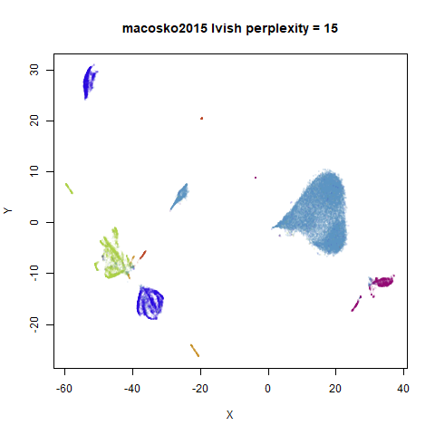

# lvish

## A LargeVis-ish method

The [LargeVis](https://arxiv.org/abs/1602.00370) method (see also its
[github](https://github.com/lferry007/LargeVis)), is in many respects a
bridge between t-SNE and UMAP. It’s sufficiently close to UMAP that
`uwot` also offers a LargeVis-like method, `lvish`:

``` r
# perplexity, init and n_epoch values shown are the defaults
# use perplexity instead of n_neighbors to control local neighborhood size
mnist_lv <- lvish(mnist, perplexity = 50, init = "lvrand", n_epochs = 5000,
                  verbose = TRUE)
# Make hilarious Lembas bread joke
```

Although `lvish` is like the real LargeVis in terms of the input
weights, output weight function and gradient, and so should give results
that resemble the real thing, note that:

- Like the real LargeVis, matrix input data is normalized by centering
  each column and then the entire matrix is scaled by dividing by the
  maximum absolute value. This differs from `umap`, where no scaling is
  carried out. Scaling can be controlled by the `scale` parameter.
- Nearest neighbor results are not refined via the neighbor expansion
  method. The `search_k` parameter is twice as large than Annoy’s
  default to compensate.
- The other nearest neighbor index parameter, `n_trees`, is not
  dynamically chosen based on data set size. In LargeVis, it ranges
  between 10 (for N \< 100,000) and 100 (for N \> 5,000,000). The
  `lvish` default of 50 would cover datasets up to N = 5,000,000, and
  combined with the default `search_k`, seems suitable for the datasets
  I’ve looked at.
- Negative edges are generated by uniform sampling of vertexes rather
  than their degree ^ 0.75.
- The default number of epochs is dataset-dependent, to generate the
  same number of edge samples that would be used by the default settings
  of the reference LargeVis implementation. This normally results in a
  substantially longer run time than for `umap`. You may be able to get
  away with fewer epochs, and using the UMAP initialization of
  `init = "spectral"`, rather than the default Gaussian random
  initialization (`init = "lvrand"`) can help.

The left-hand image below is the result of running the official LargeVis
implementation on MNIST. The image on the right is that from running
`lvish` with its default settings (apart from setting `n_threads = 8`).
Given they were both initialized from different random configurations,
there’s no reason to believe they would be identical, but they look
pretty similar:

|                                                  |                                            |
|--------------------------------------------------|--------------------------------------------|
|  |  |

Because the default number of neighbors is 3 times the `perplexity`, and
the default `perplexity = 50`, the nearest neighbor search needs to find
150 nearest neighbors per data point, an order of magnitude larger than
the UMAP defaults. This leads to a less sparse input graph and hence
more edges to sample. Combined with the increased number of epochs,
expect `lvish` to be slower than `umap`: with default single-threaded
settings, it took about 20 minutes to embed the MNIST data under the
same circumstances as described in the “Performance” section. With
`n_threads = 4`, it took 7 minutes. In addition, storing those extra
edges requires a lot more memory than the `umap` defaults: my R session
increased by around 3.2 GB, versus 1 GB for `umap`.

As an alternative to the usual Gaussian input weight function, you can
use the k-nearest neighbor graph itself, by setting `kernel = "knn"`.
This will give each edge between neighbors a uniform weight equal to
1/`perplexity`, which leads to each row’s probability distribution
having the target `perplexity`. This matrix will then be symmetrized in
the usual way. The advantage of this is that the number of neighbors is
reduced to the same as the perplexity (indeed, the `n_neighbors`
parameter is ignored with this setting), and leads to less memory usage
and a faster runtime. You can also get away with setting the perplexity
to a much lower value than usual with this kernel
(e.g. `perplexity = 15`) and get closer to UMAP’s performance. If you
use the default LargeVis random initialization, you will still need more
epochs than UMAP, but you can still expect to see a big improvement.
Something like the following works for MNIST:

``` r
mnist_lv <- lvish(mnist, kernel = "knn", perplexity = 15, n_epochs = 1500,
                  init = "lvrand", verbose = TRUE)
```

## Some More Results

For details on the datasets, and to compare with the output of UMAP and
t-SNE, see the [UMAP examples
gallery](https://jlmelville.github.io/uwot/articles/umap-examples.html).

### Gaussian Perplexity

As mentioned above, by default `lvish` uses a Gaussian similarity
function to determine perplexities, just like t-SNE. These results are
given below.

There are two images per dataset. The left-hand image uses a perplexity
of 15, which is similar to the sort of settings UMAP uses. The
right-hand image is for a perplexity of 50, which is the LargeVis
default.

The only other non-default settings was to use `pca = 100`, which
reduces the input dimensionality to 100.

``` r
iris_lv15 <- lvish(iris, pca = 100, perplexity = 15)
iris_lv50 <- lvish(iris, pca = 100, perplexity = 50)
```

Note that by default `lvish` uses a random initialization and a much
larger number of epochs to match the LargeVis defaults. This makes the
optimization take a lot longer than UMAP. LargeVis uses multiple threads
during the optimization phase, but `lvish` does not, to ensure
reproducibility of results with a fixed random seed. To get
multi-threaded performance like LargeVis, add the option,
`n_sgd_threads = "auto"`, e.g.:

``` r
iris_lv15 <- lvish(iris, pca = 100, perplexity = 15, n_sgd_threads = "auto")
```

I would also suggest that you fix the number of epochs to a smaller
value initially and see if that provides an adequate visualization.

``` r
iris_lv15 <- lvish(iris, pca = 100, perplexity = 15, n_sgd_threads = "auto", n_epochs = 500)
```

#### iris

|                                  |                                  |
|:--------------------------------:|:--------------------------------:|
|  |  |

#### s1k

|                                |                                |
|:------------------------------:|:------------------------------:|
|  |  |

#### oli

|                                |                                |
|:------------------------------:|:------------------------------:|
|  |  |

#### frey

|                                  |                                  |
|:--------------------------------:|:--------------------------------:|
|  |  |

#### coil20

|                                      |                                      |
|:------------------------------------:|:------------------------------------:|
|  |  |

#### coil100

|                                        |                                        |
|:--------------------------------------:|:--------------------------------------:|
|  |  |

#### mnist

|                                    |                                    |
|:----------------------------------:|:----------------------------------:|
|  |  |

#### fashion

|                                        |                                        |
|:--------------------------------------:|:--------------------------------------:|
|  |  |

#### kuzushiji

|                                            |                                            |
|:------------------------------------------:|:------------------------------------------:|
|  |  |

#### norb

|                                  |                                  |
|:--------------------------------:|:--------------------------------:|
|  |  |

#### tasic2018

|                                            |                                            |
|:------------------------------------------:|:------------------------------------------:|
|  |  |

#### macosko2015

|                                                |                                                |
|:----------------------------------------------:|:----------------------------------------------:|
|  |  |

Default initialization in `lvish`, as with LargeVis and t-SNE, is from a
random distribution. As with t-SNE, you can see one issue with that is
that sometimes clusters get split up by another cluster and are unable
to re-merge. MNIST is the easiest example image to see this in.

In general, there’s not a huge difference in the effect of increasing
perplexity, for larger datasets. For smaller datasets it’s apparent that
the resulting clusters tend to be more spread out with larger perplexity
values. The `norb` ([small
NORB](https://cs.nyu.edu/~ylclab/data/norb-v1.0-small/)) dataset shows
an obvious difference, where the `perplexity = 15` results are clearly
too low, and break up the structures that are apparent at
`perplexity = 50`. A similar effect is seen when using UMAP, so I don’t
think this is due to the random initialization of `lvish` in this case.
A contributing factor is likely to be that the initial PCA
dimensionality reduction to 100 dimensions is too aggressive for NORB
and reduces the nearest neighbor accuracy, which is recovered at higher
perplexities (as this requires finding more near neighbors).

On the other hand, it’s hard to see what’s going on with the `coil20`
and especially the `coil100` results. If you *could* see what was going
on from the static images above, it would be apparent that, in contrast
to the `norb` results, the `perplexity = 50` results are too high here,
and the loop structure of the clusters gets broken up.

The `coil100` and `coil20` results show an issue with using LargeVis
(and UMAP) that isn’t normally a problem with t-SNE: the extra repulsion
in their cost function can often spread the data quite far apart
compared to the cluster sizes. t-SNE has the opposite problem of the
clusters expanding into a large circular form which makes discerning
clusters harder as the datasets get larger, but in a single static plot,
I find the t-SNE results to be easier to examine. For UMAP and `lvish`,
you may have to resort to more interactive means of examining the data,
such as using the `embed_plotly` function in
[vizier](https://github.com/jlmelville/vizier).

An alternative for `lvish` is to modify the `repulsion_strength`
parameter (referred to as `gamma` in LargeVis). The default value, `7`
is taken from the LargeVis paper but seems to have been chosen
empiricially. Here are results for `coil20` and `perplexity = 50` with
the repulsion reduced to `repulsion_strength = 0.7` in the left image,
and `repulsion_strength = 0.07` on the right:

|                                             |                                               |
|:-------------------------------------------:|:---------------------------------------------:|
|  |  |

This helps a bit, but there are limits: the blue cluster on the right
remains an outlier, and reducing the `repulsion_strength` too far causes
some of the loops to shrink, as can be seen with the outlying blue and
black clusters for the right-hand plot.

### KNN Perplexity

As an alternative to using the Gaussian perplexities, you could use the
k-nearest neighbor graph directly, which involves setting the similarity
of $i$ with $j$ to 1 if $i$ is in the k-nearest neighbors of $j$, and 0
otherwise. The usual t-SNE procedure of symmetrizing (but not the
normalization step) is then carried out. There are some t-SNE
implementations which use kNN-derived perplexities, e.g. [the
majorization-minimization approach of Yang and
co-workers](http://proceedings.mlr.press/v38/yang15a.md).

The advantage of using the kNN kernel is that you get a sparser set of
edges, which due to `lvish` using the same formula for determining the
number of iterations required, results in a shorter run time.

For the results below the kNN perplexities were used by setting
`kernel = "knn"`

``` r
iris_lv15k <- lvish(iris, pca = 100, perplexity = 15, kernel = "knn")
iris_lv50k <- lvish(iris, pca = 100, perplexity = 50, kernel = "knn")
```

For comparison, the top row of images use the same settings as in the
previous section with Gaussian perplexities, and the bottom row show the
results for using the kNN kernel. The run time for each embedding is
given in the image. I used version 0.1.3 of `uwot` from CRAN.

#### iris

|                                    |                                    |
|:----------------------------------:|:----------------------------------:|
|  |  |
|  |  |

#### s1k

|                                  |                                  |
|:--------------------------------:|:--------------------------------:|
|  |  |
|  |  |

#### oli

|                                  |                                  |
|:--------------------------------:|:--------------------------------:|
|  |  |
|  |  |

#### frey

|                                    |                                    |
|:----------------------------------:|:----------------------------------:|
|  |  |
|  |  |

#### coil20

|                                        |                                        |
|:--------------------------------------:|:--------------------------------------:|
|  |  |
|  |  |

#### coil100

|                                          |                                          |
|:----------------------------------------:|:----------------------------------------:|
|  |  |
|  |  |

#### mnist

|                                      |                                      |
|:------------------------------------:|:------------------------------------:|
|  |  |
|  |  |

#### fashion

|                                          |                                          |
|:----------------------------------------:|:----------------------------------------:|
|  |  |
|  |  |

#### kuzushiji

|                                              |                                              |
|:--------------------------------------------:|:--------------------------------------------:|
|  |  |
|  |  |

#### norb

|                                    |                                    |
|:----------------------------------:|:----------------------------------:|
|  |  |
|  |  |

#### tasic2018

|                                              |                                              |
|:--------------------------------------------:|:--------------------------------------------:|
|  |  |
|  |  |

#### macosko2015

|                                                  |                                                  |
|:------------------------------------------------:|:------------------------------------------------:|
|  |  |
|  |  |

## Conclusions

For smaller datasets, the kNN kernel gives noticeably different results
to the Gaussian perplexity, particularly for `perplexity = 50`. For
`iris`, `s1k` and `oli`, the trend seems to be that the results are more
expanded with the kNN kernel. For `frey`, `coil20` and `coil100`, the
clusters are more separated.

For the larger datasets, the difference in behavior is less pronounced,
although the `macosko2015` results show a larger cluster separation as
well.

The good new is that for all cases, the run times are noticeably
reduced.

So for larger datasets, using `kernel = "knn"` seems to be an ok choice
for reducing the runtime of `lvish`. It also seems that you may want to
use a smaller value of the `perplexity` than you would with a Gaussian
perplexity, which further reduces the runtime. For smaller datasets,
results are more mixed. It seems that a smaller `perplexity` in this
case is definitely to be preferred.
