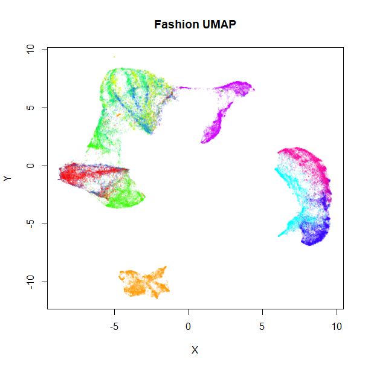
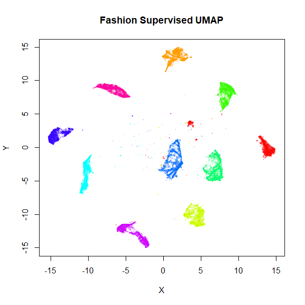
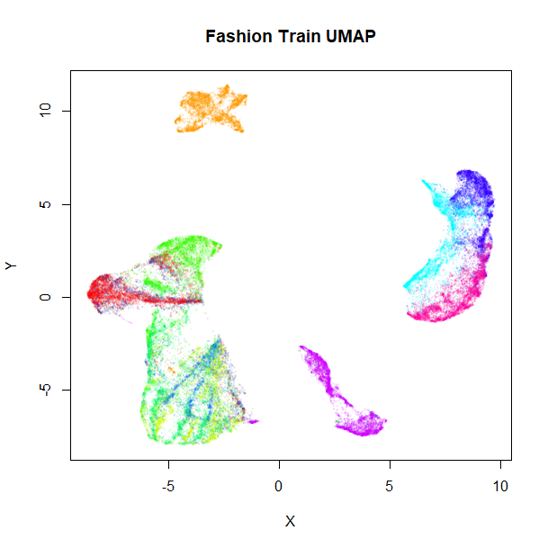
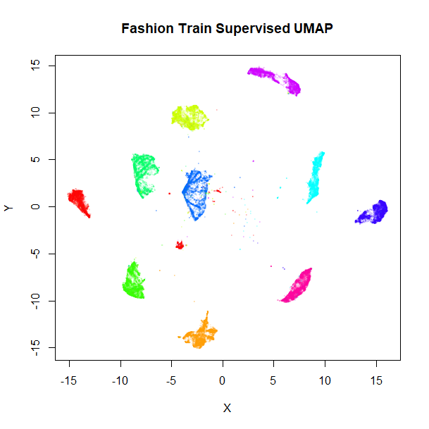
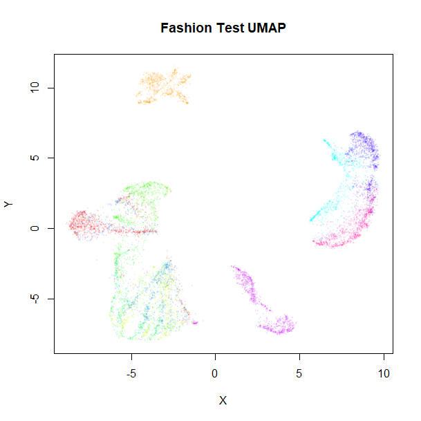
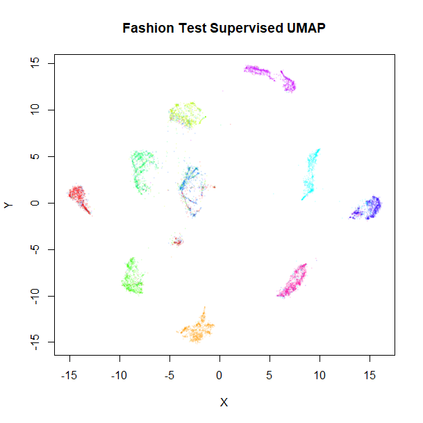
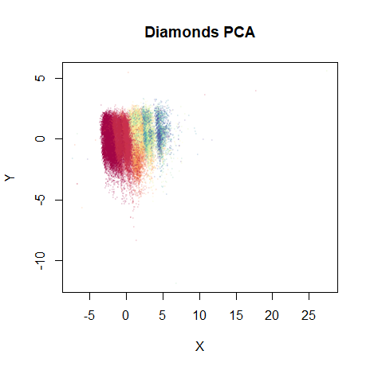
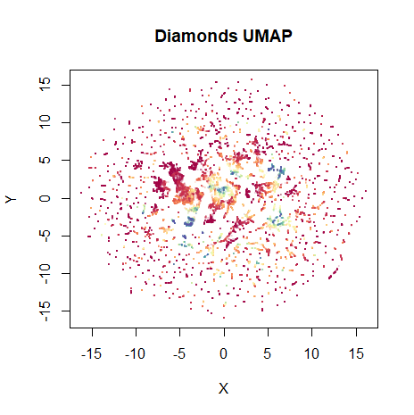
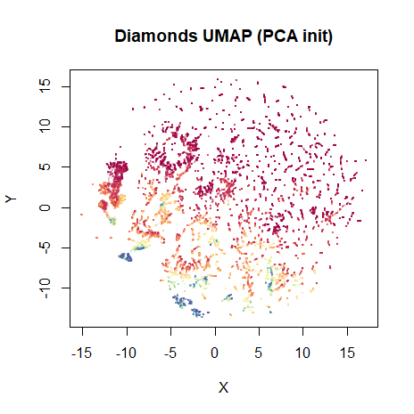
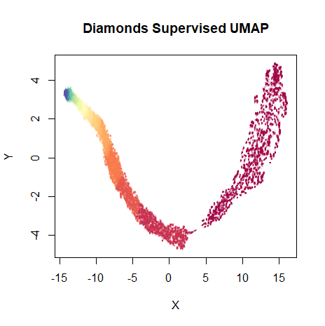

# Metric Learning with UMAP

Among other things, UMAP provides two interesting extensions to its
basic dimensionality reduction. First, it can do a supervised embedding,
where labels (or numeric values) are leveraged so that similar points
are closer together than they would otherwise be. Second, it can do
metric learning, by embedding out-of-sample points based on an existing
embedding.

This document shows how to do it in `uwot`, but more information is
available in UMAP’s
[documentation](https://umap-learn.readthedocs.io/en/latest/supervised.html).

The example dataset used is [Fashion
MNIST](https://github.com/zalandoresearch/fashion-mnist). One way to
download it in uwot-ready form is:

``` r
devtools::install_github("jlmelville/snedata")
fashion <- snedata::download_fashion_mnist()
```

The Fashion MNIST dataset contains 70,000 images of fashion items, in
one of ten classes. A factor column, `Label` contains the id of each
item (from `0` to `9`) for backwards compatibility with the MNIST
dataset, which Fashion MNIST is designed to be a drop-in replacement
for. A more descriptive, but entirely equivalent, factor column,
`Description` provides a short text string to describe the classes,
e.g. the `Description` `"Coat"` and the `Label` `4` are equivalent.

### Visualization

To produce the plots below, I used my [vizier
package](https://github.com/jlmelville/vizier), which can be installed
using:

``` r
devtools::install_github("jlmelville/vizier")
```

I’ll show the commands to produce the plots before they are displayed.

## Supervised Learning

We’ll compare the supervised result with a standard run of UMAP:

``` r
set.seed(1337)
fashion_umap <- umap(fashion)
```

For supervised learning, provide a suitable vector of labels as the `y`
argument to `umap` (or `tumap`):

``` r
set.seed(1337)
fashion_sumap <- umap(fashion, y = fashion$Description)
```

Let’s take a look at the results, the unsupervised embedding on the
left, and the supervised version on the right:

``` r
vizier::embed_plot(fashion_umap, fashion, cex = 0.5, title = "Fashion UMAP", alpha_scale = 0.075)
vizier::embed_plot(fashion_sumap, fashion, cex = 0.5, title = "Fashion Supervised UMAP", alpha_scale = 0.075)
```

|                                                           |                                                                       |
|:---------------------------------------------------------:|:---------------------------------------------------------------------:|
|  |  |

Clearly, the supervised UMAP has done a much better job of separating
out the classes, although it has also retained the relative location of
the clusters pretty well, too.

## Metric Learning

It’s also possible to use an existing embedding to embed new points.
Fashion MNIST comes with its own suggested split into training (the
first 60,000 images) and test (the remaining 10,000 images) sets, so
we’ll use that:

``` r
fashion_train <- head(fashion, 60000)
fashion_test <- tail(fashion, 10000)
```

Training proceeds by running UMAP normally, but we need to return more
than just the embedded coordinates. To return enough information to
embed new data, we need to set the `ret_model` flag when we run `umap`.
This will return a list. The embedded coordinates can be found as the
`embedding` item.

### Training

For training, we shall continue to use both standard UMAP:

``` r
set.seed(1337)
fashion_umap_train <- umap(fashion_train, ret_model = TRUE)
```

and supervised UMAP:

``` r
set.seed(1337)
fashion_sumap_train <- umap(fashion_train, ret_model = TRUE, y = fashion_train$Description)
```

These results shouldn’t be that different from the full-dataset
embeddings, but let’s take a look anyway:

``` r
vizier::embed_plot(fashion_umap_train$embedding, fashion_train, cex = 0.5, title = "Fashion Train UMAP", alpha_scale = 0.075)
vizier::embed_plot(fashion_sumap_train$embedding, fashion_train, cex = 0.5, title = "Fashion Train Supervised UMAP", alpha_scale = 0.075)
```

|                                                                   |                                                                               |
|:-----------------------------------------------------------------:|:-----------------------------------------------------------------------------:|
|  |  |

Everything looks in order here. The standard UMAP training plot is
flipped along the y-axis compared to the full dataset, but that doesn’t
matter.

### Embedding New Data

To embed new data, use the `umap_transform` function. Pass the new data
and the trained UMAP model. There’s no difference between using a
standard UMAP model:

``` r
set.seed(1337)
fashion_umap_test <- umap_transform(fashion_test, fashion_umap_train)
```

or a supervised UMAP model:

``` r
set.seed(1337)
fashion_sumap_test <- umap_transform(fashion_test, fashion_sumap_train)
```

Here are the results:

``` r
vizier::embed_plot(fashion_umap_test, fashion_test, cex = 0.5, title = "Fashion Test UMAP", alpha_scale = 0.075)
vizier::embed_plot(fashion_sumap_test, fashion_test, cex = 0.5, title = "Fashion Test Supervised UMAP", alpha_scale = 0.075)
```

|                                                                 |                                                                              |
|:---------------------------------------------------------------:|:----------------------------------------------------------------------------:|
|  |  |

The test data results are very obviously embedded in a similar way to
the training data. Of particular interest are the test results with the
supervised model, where the clusters stay well separated compared to the
unsupervised results, although there are some misclassifications of
shirts, t-shirts, coats and pullover classes (the green, blue and red
clusters on the right of the supervised UMAP plot).

### Accuracy Results

To quantify this improvement, we can look at accuracy in predicting the
test set labels by using the embedded coordinates as a k-nearest
neighbor classifier. There are a variety of ways I can imagine using the
information in the model, but two obvious ones are to use the label of
the nearest neighbor, (`1NN`) or take a vote using the `n_neighbors` (in
this case, 15) nearest neighbors (`15NN`).

For standard UMAP, the `1NN` accuracy is 71%, and the `15NN` accuracy is
77%. Using supervised UMAP, these accuracies improve to 83% and 84%,
respectively. So quantitatively, the supervised UMAP is a big help in
correctly classifying the test data.

To put these numbers in perspective, we can carry out similar
calculations using the input data directly. Here, the `1NN` accuracy is
85% and the `15NN` accuracy is 84%. Possibly, the lack of improvement on
going from 1 to 15 neighbors indicates that a different value of the
`n_neighbors` parameter could improve the embedding, but I haven’t
pursued that.

At any rate, it’s clear that the Fashion MNIST images do not embed well
in two dimensions, although supervised UMAP gets impressively close to
matching the high dimensional results. Maybe supervised UMAP can do even
better by a suitable choice of `target_weight` and `n_components` on top
of fiddling with `n_neighbors`.

The Fashion MNIST website contains a page that shows the accuracy using
129 [scikit-learn
methods](http://fashion-mnist.s3-website.eu-central-1.amazonaws.com/),
and the `15NN` supervised UMAP accuracy puts us in the top 60, which
isn’t bad, considering the only hyperparameter search I did was to look
at `1NN` and `15NN`. However, although the highest accuracy reported on
that page is 89.7%, the [deep learning
results](https://github.com/zalandoresearch/fashion-mnist#benchmark)
achieve 90-97%.

## Supervised UMAP: Numerical Y

Here’s an example of using supervised UMAP with a numerical target
vector. We shall use the `diamonds` dataset that comes with the
[ggplot2](https://cran.r-project.org/package=ggplot2) package, as it is
of a similar size to MNIST.

``` r
library(ggplot2)
?diamonds
```

There are 10 variables associated with each diamond: five numeric values
related to the geometry of the diamonds (`table`, `x`, `y`, `z` and
`depth`), three factors that measure the quality of the diamond (`cut`,
`color` and `clarity`), and the `price` in dollars. The `price` seems
like a perfect candidate for the sort of thing we’d want as the target
vector, leaving the other nine variables to be used for the
dimensionality reduction.

`uwot`’s implementation of UMAP uses all numeric columns in can find in
its calculations, so to avoid including the `price` in the
non-supervised part of UMAP, let’s create a new data frame, initially
with the geometric data:

``` r
dia <- diamonds[, c("carat", "x", "y", "z", "table")]
```

The `depth` column is related to `x`, `y` and `z` (albeit non-linearly)
so I’m not going to include it.

Additionally, the factors `cut`, `color` and `clarity` are all ordinal
variables, i.e. their categories can be ordered, so we can convert these
to a numeric scale and include them as well:

``` r
dia$cut <- as.numeric(diamonds$cut)
dia$color <- as.numeric(diamonds$color)
dia$clarity <- as.numeric(diamonds$clarity)
```

We now have a dataset with 53,940 rows and 8 columns. There are 360
duplicates, but it doesn’t seem to affect the results particularly.

Now, I’m not saying that this is the trickiest dataset to extract any
meaning from. First, let’s look at some standard unsupervised results.
For starters, here’s a plot of the first two principal components, using
the [irlba](https://cran.r-project.org/package=irlba) package:

``` r
dia_pca <- irlba::prcomp_irlba(dia, n = 2, scale. = TRUE)
vizier::embed_plot(dia_pca$x, diamonds$price, title = "Diamonds PCA", color_scheme = "RColorBrewer::Spectral", alpha_scale = 0.1, cex = 0.5, pc_axes = TRUE)
```



Diamonds PCA

Because the different columns have different units and meaning, I set
`scale. = TRUE` to equalize their variances. The color scheme is
“Spectral” palette from ColorBrewer: red indicates a low price and blue
a high price. Despite the majority of the dataset being clumped together
in the plot due to some outliers you can’t really see, the progression
of prices from low to high is already pretty well captured with two
components.

Anyway, let’s see what UMAP does with it. Like with PCA, the columns are
all scaled to have equal variance (`scale = TRUE`):

``` r
dia_umap <- umap(dia, scale = TRUE, verbose = TRUE)
vizier::embed_plot(dia_umap, diamonds$price, title = "Diamonds UMAP", color_scheme = "RColorBrewer::Spectral", alpha_scale = 0.1, cex = 0.5, pc_axes = TRUE)
```



Diamonds UMAP

Not bad. The high price diamonds are clumped together in their own
little clusters in the middle of the plot. On this occasion, I prefer
the layout that’s initialized from the PCA results, though:

``` r
dia_umap_from_pca <- umap(dia, scale = TRUE, verbose = TRUE, init = dia_pca$x)
vizier::embed_plot(dia_umap_from_pca, diamonds$price, title = "Diamonds UMAP (PCA init)", color_scheme = "RColorBrewer::Spectral", alpha_scale = 0.1, cex = 0.5, pc_axes = TRUE)
```



Diamonds UMAP from PCA

This maintains the global structure of the PCA result. Rather than have
to separately create the PCA, you can also use `init = "pca"` and get
the same results (`uwot` uses `irlba` internally for this, so there’s no
loss of speed).

Onto the supervised result. Results are not particularly affected by the
choice of initialization, so for simplicity we’ll just use the standard
spectral initialization:

``` r
dia_sumap <- umap(dia, scale = TRUE, verbose = TRUE, y = diamonds$price)
vizier::embed_plot(dia_sumap, diamonds$price, title = "Diamonds Supervised UMAP", color_scheme = "RColorBrewer::Spectral", alpha_scale = 0.1, cex = 0.5, pc_axes = TRUE)
```



Diamonds Supervised UMAP

As expected, the embedding is now even more well-organized along the
price of the diamonds.

There is a visible gap between the lowest price diamonds (on the right)
and the rest of the embedding. If you increase the `n_epochs` parameter
and allow the optimization to proceed, this gap increases substantially,
making the plot harder to read. Adjusting the `n_epochs` parameter,
along with the `target_n_neighbors` and `target_weight` parameters may
be required to strike the right balance. At the time of writing, I’m not
aware of many examples of supervised UMAP with a numeric vector (in fact
none except this thing I just wrote) so I cannot provide a lot of sage
wisdom on this matter.
