# UMAP with Mutual Nearest Neighbors

## Introduction

Traditionally, dimensionality reduction methods make use of the
k-nearest neighbors graph but there are some exceptions:
[Trimap](https://github.com/eamid/trimap) and
[PaCMAP](https://jmlr.org/papers/v22/20-1061.html) use an extended
version of k-nearest neighbors, based on the “generalized” distances
used in [self-tuning spectral
clustering](https://papers.nips.cc/paper/2004/hash/40173ea48d9567f1f393b20c855bb40b-Abstract.html),
and PaCMAP goes further to also sample the kth closest neighbors from a
locally sampled batch. [LocalMAP](https://arxiv.org/abs/2412.15426) also
adjusts the neighbor graph dynamically during the embedding by sampling
distances of the embedded points.

For the purposes of producing better-separated clusters, [Dalmia and
Sia](https://arxiv.org/abs/2108.05525) (see also the [article in the
UMAP
docs](https://umap-learn.readthedocs.io/en/latest/mutual_nn_umap.html))
consider the mutual nearest neighbors (augmented with some extra
neighbors).

The way PaCMAP uses its neighbors is beyond the architecture of `uwot`
to handle easily, but the mutual nearest neighbors graph is something
that `uwot` can deal with. As detailed in the article on `uwot`’s
[nearest neighbors
format](https://jlmelville.github.io/uwot/articles/nearest-neighbors-format.html),
we can provide as input a sparse distance matrix to represent nearest
neighbors, giving substantial flexibility. However, it’s not always easy
to take advantage of that. Here I will show some code that can generate
a suitably-massaged mutual nearest neighbors graph and see if it has any
effect on UMAP.

## The Problem With Symmetrized k-Nearest Neighbors

Although in a kNN graph each item only has k neighbors, any workable
dimensionality reduction working on the kNN graph as input will
symmetrize that graph, otherwise optimization is difficult. The outcome
of symmetrizing the kNN graph is that if $j$ is a neighbor of $i$ in the
kNN graph, $i$ is also guaranteed to be a neighbor of $j$ in the
symmetrized graph and *vice versa*. If one item tends to show up in a
lot of the kNN lists of multiple items, the symmetrization means that
there can be up to $N$ edges involving that very popular item. These are
called hubs and not only do they make search on the graph more difficult
(that item will be likely to show up in most queries) but because for a
given $k$ there are a limited number of edges to distribute over the
dataset, some items are not getting their fair share. This is more
likely to lead to outlier points that get embedded far away from the
main body of the data as they have no particularly strong bonds to the
rest of the data.

## Mutual k-Nearest Neighbors

You can think of the mutual k-nearest neighbors graph (the MNN graph) as
being a symmetrized kNN graph where edges only appear if item $i$ was a
neighbor of $j$*and* $j$ was a neighbor of $i$: in the symmetrized kNN
graph described above the requirement is only that $i$ be a neighbor of
$j$*or* $j$ be a neighbor of $i$. This means that an item can have no
more than $k$ mutual neighbors. Hub problem solved.

## The Problem with Mutual k-Nearest Neighbors

The downside of the MNN graph is that even in very well-behaved kNN
graphs, the MNN will contain several items with no edges to any other
item: while they have $k$ nearest neighbors, none of those neighbors
reciprocate. UMAP requires local connectivity, so it cannot handle a use
case where we have such Billy no-mates items.

As a result, the Dalmia and Sia paper has to go to some extra lengths to
augment the MNN graph with some extra nodes which you can see at [their
repo](https://github.com/adalmia96/umap-mnn). This involves minimum
spanning trees and Dijkstra’s algorithm to add new nodes (and distances
via the path length).

One alternative they consider is to take any fully disconnected nodes
and re-add the first nearest neighbor. They cite a paper by [de Souza,
Rezende and
Batista](https://link.springer.com/chapter/10.1007/978-3-642-40994-3_11)
for this, but there’s no extra detail in that paper, the authors just
note that they do this to avoid the disconnected nodes.

It should be said that this “adjacent neighbor” approach to MNN
augmentation does not work very well, leading to a lot of disconnected
components and small clusters of points scattered over the embedding.
This is not very surprising.

## Adding Back Extra Neighbors: The Balanced Mutual Nearest Neighbors Graph

As I don’t currently fancy implementing any of the path neighbor
approach, I propose the following strategy: just add back more than one
neighbor to disconnected nodes. In fact, we would probably do well to
ensure every item in the dataset has at least $m$ neighbors where
$m < k$, not just items which are completely disconnected, as we can
already see that items with only one neighbor don’t do a good job.
Obviously adding back all the neighbors would recreate the original
symmetrized kNN graph, so we want to keep $m$ small, but bigger than
one.

To name this concept I am going with the “Balanced MNN graph” where
“balanced” is meant to suggest that we are trying to ensure that no node
is left too isolated in the MNN graph. To be specific with numbers I
will refer to a ($k$, $m$)-BMNN graph. I would welcome hearing if there
is existing literature with a different (probably better) name.

## Creating the BMNN

The basic formula for creating the BMNN graph is as follows:

1.  Create the kNN graph.
2.  Form the equivalent MNN graph.
3.  Are there any nodes with fewer than $m$ neighbors? If not, we stop.
    Otherwise:
4.  Add back the $m$th-nearest neighbor from the kNN graph to each of
    those nodes.
5.  Go to step 3.

The loop in steps 3-5 must terminate in $m$ steps: at worst, for items
with 0 neighbors, we add all the $m$-th nearest neighbors. For items
with 1-($m$-1) neighbors, we don’t know if the $m$-th nearest neighbor
is already a neighbor. If it isn’t we are one step closer to
termination. If it is, then adding the edge will do nothing. So we can’t
add more than $m$ edges to any node and none of these nodes will get too
many edges added.

Creating the MNN from the sparse kNN representation is easy, assuming
your distances are symmetrical:

``` r
sp_mutual <- function(sp) {
  sp_t <- Matrix::t(sp)
  res <- sqrt(sp * sp_t)
  res
}
```

Balancing the MNN is a bit more involved, especially if you want it to
be efficient and not do anything disastrous like accidentally attempt to
turn your sparse matrix dense. We must go from 5 lines of code to more
than 100. Below is the code for your delight and delectation. I may
officially export this from `uwot` some day, but this remains an
experiment for now for you to copy and paste.

Input to `balance_mnn` is:

- `nn_graph` – the dense representation of the k-nearest neighbors,
  i.e. a list of two dense matrices, `idx` and `dist` both of dimensions
  `(n, k)`. See the [article on the nearest neighbor
  format](https://jlmelville.github.io/uwot/articles/nearest-neighbors-format.html)
  for more. `uwot` exports in this format, and so does
  [rnndescent](https://cran.r-project.org/package=rnndescent).
- `k` – optionally specify the size of the `l` nearest neighbors to use.
  If you omit this, all the neighbors in `nn_graph` will be used.
  Because generating nearest neighbors is time-consuming, you may wish
  to create a large neighbor graph once (e.g. set `k = 50` or `k = 150`)
  and then use a smaller subset as the need arises (e.g. 15 is typical
  for UMAP). The `nng` helper function above can do this. Pro-tip: I use
  [`rnndescent::brute_force_knn`](https://jlmelville.github.io/rnndescent/reference/brute_force_knn.html)
  to generate exact nearest neighbors for `k = 150` and then save them
  once and for all. My now rather decrepit 8th gen Intel laptop still
  has enough juice to crank through datasets of up to 100,000 items and
  up to 10,000 features with 6 threads in a “reasonable” amount of time,
  where “reasonable” for me means anything up to a few hours, but not
  “going on holiday for two weeks”.
- `m` – minimum number of neighbors to ensure each item has. This needs
  to be at least two.

One slightly weird thing about specifying `m` is that you will actually
get back one less edge than the value you ask for. This is because in
the dense format every item’s nearest neighbor is itself with a distance
of zero. This disappears when we convert to the sparse format. As a
result your dense k-nearest neighbor graph only contains $k - 1$
different neighbors for each item. The self-neighbor thing counting as
one of the neighbors is always how UMAP has done it, so we won’t be
changing the habit of a lifetime. You will just have to remember to
reproduce the “adjacent neighbor” method you must specify `m = 2`. The
function won’t let you go lower than `m = 2` anyway.

``` r
# create an m-balanced k-mutual nearest neighbors graph from the dense k-nearest
# neighbors graph `nn_graph`. m must be less than or equal to k. If `k` is not
# specified then all of the neighbors are used.
balance_mnn <- function(nn_graph, m, k = NULL) {
  if (m < 2) {
    stop("m must be at least 2")
  }

  if (!is.null(k)) {
    nn_graph <- nng(nn_graph, k)
  }
  k <- ncol(nn_graph$idx)
  if (m > k) {
    stop("m must be less than or equal to k")
  }

  # create the mutual neighbors as a sparse matrix
  # each item's neighbors distances are stored by column
  bmnn <- k_to_m(nn_graph)
  bmnn_adj <- sp_to_adj(bmnn)
  bmnn_edges <- colSums(bmnn_adj)
  too_few_edges_mask <- bmnn_edges < (m - 1)

  # add edges back from the kNN graph to "fill up" any items with too few edges
  # do it one column at a time to avoid over-filling any one item
  for (l in seq(from = 2, to = m)) {
    if (sum(too_few_edges_mask) == 0) {
      break
    } else {
      message("Iter ", l, " cols to process: ", sum(too_few_edges_mask))
    }

    knn_idxl <- nn_graph$idx[, l]
    masked_knn_distl <- nn_graph$dist[, l] * too_few_edges_mask
    masked_knn <- vec_to_sp(knn_idxl, masked_knn_distl)
    knn_adj <- sp_to_adj(masked_knn)

    mk_adj <- bmnn_adj + knn_adj
    bmnn <- bmnn + masked_knn
    bmnn@x <- bmnn@x / mk_adj@x

    bmnn_adj <- sp_to_adj(bmnn)
    bmnn_edges <- colSums(bmnn_adj)
    too_few_edges_mask <- bmnn_edges < (m - 1)
  }

  bmnn
}

## Helper functions

# truncate a dense neighbor graph to the first k neighbors
nng <- function(graph, k) {
    list(idx = graph$idx[, 1:k], dist = graph$dist[, 1:k])
}

# convert a dense knn graph to a sparse matrix format
# NB neighbors are stored by column
nng_to_sp <- function(graph, nbrs = NULL) {
  if (!is.null(nbrs)) {
    graph <- nng(graph, nbrs)
  }

  idx <- graph$idx
  dist <- graph$dist
  n_nbrs <- ncol(idx)
  n_row <- nrow(idx)
  n_ref <- nrow(idx)
  i <- as.vector(idx)
  j <- rep(1:n_row, times = n_nbrs)

  x <- as.vector(dist)
  keep_indices <- !is.na(x)
  i <- i[keep_indices]
  j <- j[keep_indices]
  x <- x[keep_indices]
  res <- Matrix::sparseMatrix(i = i, j = j, x = x, dims = c(n_row, 
      n_ref), repr = "C")
  Matrix::drop0(res)
}

# convert a sparse knn matrix to the mutual nearest neighbors graph
sp_mutual <- function(sp) {
  sp_t <- Matrix::t(sp)
  res <- sqrt(sp * sp_t)
  res
}

# convert a dense kNN graph to a mutual nearest neighbors graph
k_to_m <- function(graph, nbrs = NULL) {
  sp <- nng_to_sp(graph, nbrs)
  res <- sp_mutual(sp)
  res
}

# convert sparse matrix to an adjacency matrix (1 if there's an edge, 0 otherwise)
sp_to_adj <- function(sp) {
  spi <- sp
  spi@x <- rep(1, length(spi@x))
  spi
}

# convert the vector of values x to a sparse matrix with where the row is given
# by the equivalent value in the vector i, and the column is the index of the
# value in the vector x. The resulting matrix is a square matrix with the same 
# number of rows as the length of x.
vec_to_sp <- function(i, x) {
  n_row <- length(i)
  j <- 1:n_row

  keep_indices <- !is.na(x)
  i <- i[keep_indices]
  j <- j[keep_indices]
  x <- x[keep_indices]
  res <- Matrix::sparseMatrix(
    i = i,
    j = j,
    x = x,
    dims = c(n_row, n_row),
    repr = "C"
  )
  Matrix::drop0(res)
}
```

## Disconnections and the Question of Initialization

Dalmia and Sia note that using a MNN graph leads to many disconnected
components, which can cause issues with the default spectral
initialization in UMAP. Their approach creates a connected graph to get
round this problem. An alternative I pursue in all the results here is
to always initialize from the first two components of PCA. Even in the
case of the kNN graph, you can still get disconnected components for a
given value of `n_neighbors`, and `uwot` will fall back to PCA in this
case anyway.

## Working with the BMNN

Putting this together, my recommended workflow is:

``` r
library(rnndescent)
librart(uwot)
# get the approximate knn: use as many threads as you want
data_knn_15 <- rnndescent::rnnd_knn(data, k = 15, n_threads = 6)
# or if you have time on your hands
# data_knn_15 <- rnndescent::brute_force_knn(data, k = 15, n_threads = 6)

pca_init <- umap2(data, nn_method = data_knn_15, init = "pca", n_epochs = 0)

# Normal UMAP
data_umap <- umap2(data, nn_method = data_knn_15, init = pca_init)

# Create the (15, 5)-balanced MNN
data_bmnn_15_5 <- balance_mnn(data_knn_15, k = 15, m = 5)

# UMAP with BMNN
data_bmnn_umap <- umap2(data, nn_method = data_bmnn_15_5, init = pca_init)
```

In the work presented by Dalmia and Sia, multiple choices of `k` are
tried (from 10-50) and some changes to `min_dist`. I will stick with
`k = 15` for all the results shown here.

## MNIST Example

Does the BMNN graph produce results that differ from the kNN graph?
Let’s compare the UMAP embeddings of the [MNIST
digits](https://yann.lecun.com/exdb/mnist/) and [Fashion
MNIST](https://github.com/zalandoresearch/fashion-mnist) datasets using
the kNN graph and the BMNN graph. From left to right we have the
original UMAP embedding, the embedding using the (15, 2)-BMNN graph
which should give similar results to the MNN+adjacent neighbors approach
used by Dalmia and Sia, and an embedding using the (15, 5)-BMNN graph
which (I hope) should give a more “connected” embedding. You can click
on any of the images to see a (slightly) larger version.

| Dataset | 15-NN                                          | (15,2)-BMNN                                          | (15,5)-BMNN                                          |
|:-------:|------------------------------------------------|------------------------------------------------------|------------------------------------------------------|
|  MNIST  |      |      |      |
| fashion | 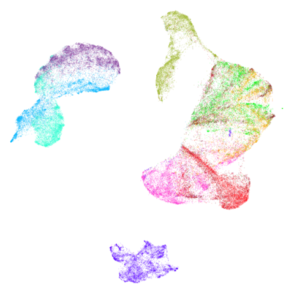 | 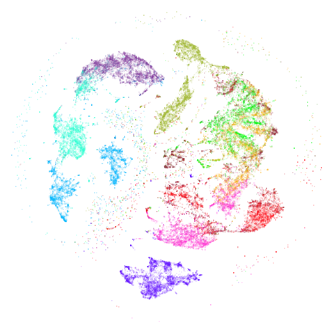 | 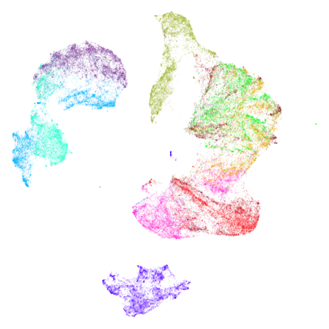 |

Although it’s not that easy to see unless you click on the image, the
(15,2)-BMNN results do show a sprinkling of outlier points throughout
the embedding. This confirms the observations of Dalmia and Sia and so
this doesn’t seem like a promising approach. I won’t bother showing
results for (15,2)-BMNN graphs going forward. The (15,5)-BMNN on the
other hand seems quite well behaved. Now, if you were to say “I put it
to you that it doesn’t look very different from the normal UMAP results”
I would have to agree with you. But there is perhaps slightly more
separation of the clusters and some finer detail? Possibly that’s
entirely within the expected variation of a given UMAP run.

Fortunately there are some datasets where we do see more of a
difference.

## COIL-20 and COIL-100

Embeddings of
[COIL-20](http://www.cs.columbia.edu/CAVE/software/softlib/coil-20.php).
and
[COIL-100](http://www.cs.columbia.edu/CAVE/software/softlib/coil-100.php)
show a series of loops, but some of which typically get a bit tangled up
together or mangled. If ever there were some datasets that might benefit
from focusing on the mutual neighbors, it’s these two.

| Dataset | 15-NN                                          | (15,5)-BMNN                                          |
|:-------:|------------------------------------------------|------------------------------------------------------|
| coil20  | 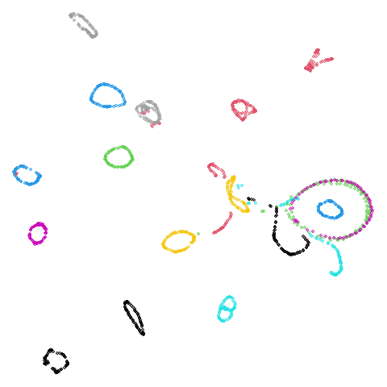   | 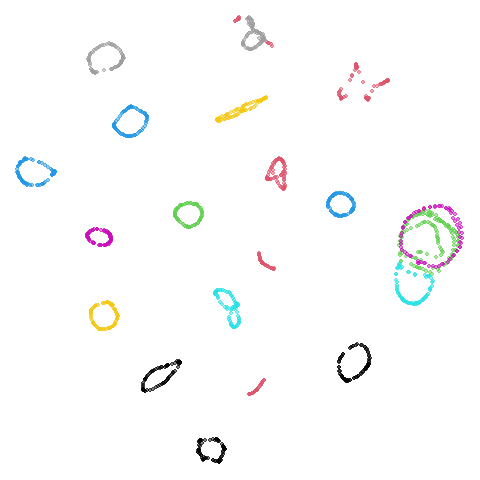   |
| coil100 | 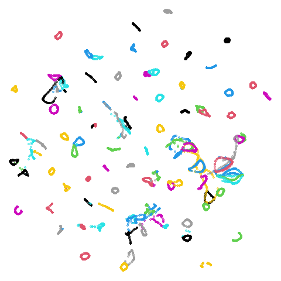 | 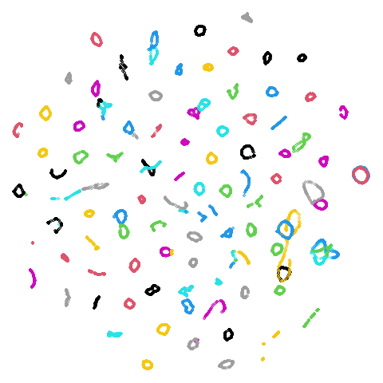 |

I no longer feel like I am lying to myself when I say I can see a
difference between the two embeddings. The BMNN graph definitely seems
to have untangled the loops a bit more.

## Disappointing Results

There are some datasets which UMAP struggles to produce useful results
for. These include:

- the image dataset
  [CIFAR-10](https://www.cs.toronto.edu/~kriz/cifar.html) where I just
  wouldn’t expect looking at Euclidean distance in the raw pixel space
  to produce anything of value (and it doesn’t).
- the text dataset [20Newsgroups](http://qwone.com/~jason/20Newsgroups/)
  that I have attempted to [process with
  UMAP](https://jlmelville.github.io/uwot/articles/sparse-data-example.html)
  in the past: this version was cleaned, had TF-IDF applied and then L2
  normalized. Clusters do appear but they aren’t very well-separated.
  This appears in the Dalmia and Sia paper with a different processing
  (and also in the PaCMAP paper with a different processing again)
  without looking terribly attractive.
- The scRNA-seq data
  [macosko2015](https://github.com/pavlin-policar/openTSNE/blob/master/examples/prepare_macosko_2015.ipynb),
  which in its raw form has around 3000 columns. It shows extreme
  hubness: the MNN graph (with `k = 15`) results in 89% of the dataset
  being entirely disconnected! A corresponding problem is that you have
  to be quite careful with how large `m` is in the BMNN: as the vast
  majority of edges in the kNN graph are pointing towards the hubs, even
  a small number of additions of kNN edges back can lead to a hub in the
  BMNN. The symmetrized kNN graph has a hub with 10,000 edges associated
  with it (around 20% of the dataset). The BMNN graph with `m = 5`
  reduces that, but the hub still has 4,000 edges.
- `macosko2015` visualizes more nicely with some PCA as the hubness is
  greatly reduced (I am agnostic on if this representation more
  faithfully represents the biological reality). So I also include the
  same dataset after reducing to 100 dimensions with PCA.
- The [Small NORB](https://cs.nyu.edu/~yann/data/norb-v1.0-small/) image
  dataset of objects, is not as challenging as the other datasets listed
  here. In fact, it is slightly COIL-ish in that it already shows some
  loops and other structure in UMAP. So could using the MNN graph
  improve matters further as it has for COIL-20 and COIL-100?

|      Dataset      | 15-NN                                                              | (15,5)-BMNN                                                              |
|:-----------------:|--------------------------------------------------------------------|--------------------------------------------------------------------------|
|       norb        | 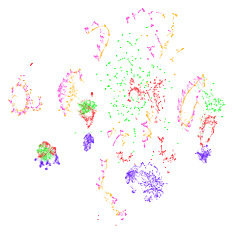                           | 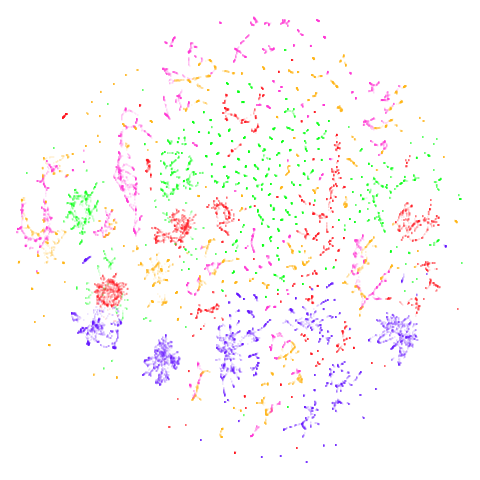                           |
|    macosko2015    | 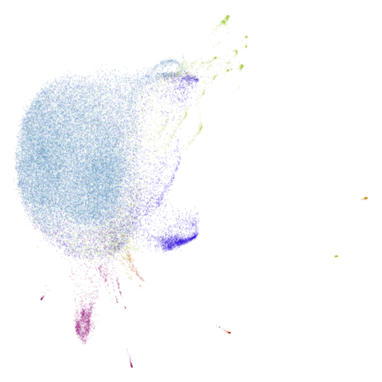             | 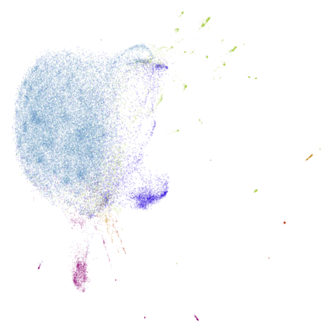             |
| macosko2015pca100 |  |  |
|       20NG        | 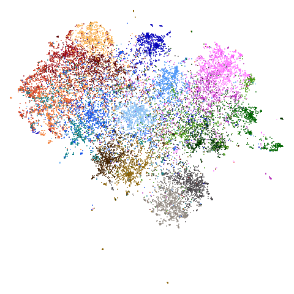                           | 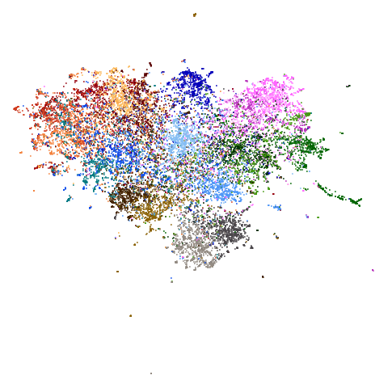                           |
|      cifar10      | 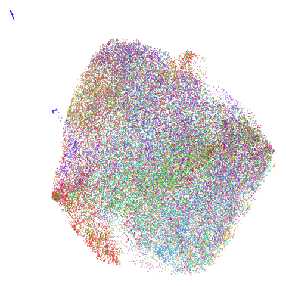                     | 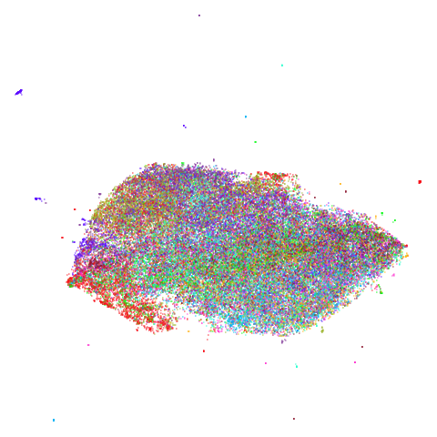                     |

Ok, so it turns out that the BMNN graph doesn’t really help in any of
these cases. `norb` is particularly disappointing in that it noticeably
makes things worse.

For `macosko2015`, pretty much nothing happens, except the big blue
round cluster has got some slight mottling where it seems like some kind
of fine(ish) structure is forming, which might translate to clusters. I
couldn’t tell you if it was biologically relevant though. I tested
whether the hubness that is present in the kNN and creeps back into the
BMNN is a determinant of this embedding by creating a BMNN where edges
were added back not in order of shortest distance, but in smallest
k-occurrence, i.e. items that appear the least often in the kNN graph.
This reduces the maximum edge count in the BMNN to around 200 (a nearly
20-fold drop), but the embedding looks very similar to the vanilla UMAP
result:

|                   macosko2015 (15, 5)-koBMNN                   |
|:--------------------------------------------------------------:|
| 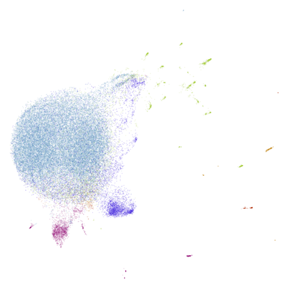 |

I include this image only because this is evidence against my long-held
belief that hubs in the kNN graph are a problem for UMAP, so this is a
good visualization for me to stare at the next time I start going down
this road. `macosko2015pca100` shows very little change also.

For `20NG` and `cifar10` the only effect is to make the main blob of
data more compressed in the middle of the plot, due to extra small
clusters now being located at the edges. While not attractive, this
could be indicating some anomalous clustering in these small subsets,
which might be worth investigating further. For example, these could be
duplicates or close duplicates. I haven’t actually *done* that
investigation though so I can’t say if that’s the case.

### norb revisited

*December 29 2024*: Looking further at the `norb` results, I couldn’t
shake the feeling that the way the results were broken up when going to
the BMNN result indicated that the `n_neighbors` was set too low. So
let’s try with `n_neighbors = 50`. I will set the BMNN to `(50,5)`.
Possilbly, a larger values of `k` means we also need a larger value of
`m` to get a good result but let’s see if we can get away with just
changing one parameter.

| Dataset | 50-NN                                    | (50,5)-BMNN                                    |
|:-------:|------------------------------------------|------------------------------------------------|
|  norb   | 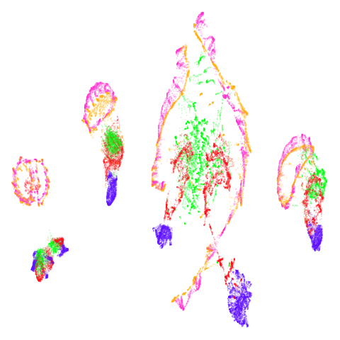 | 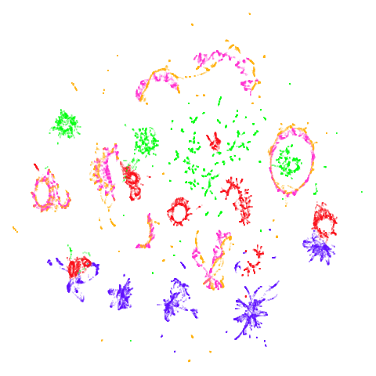 |

Ok, I am back to not hating BMNN for `norb`. Results are a bit messy,
but it’s definitely doing something: the BMNN separates out the objects
based on their class (the colors) to a much greater extent than the kNN
version, which has the results in more cleanly separated clusters but
with the classes more intertwined.

## Conclusions

Using the BMNN to approximate the MNN is a mixed bag. In some cases it
can help, but in others it either does very little, or can make things
worse – although there’s always a chance that this could be a diagnostic
of unusual structure in the data.

Also worth noting is that the BMNN graph is much sparser than the
symmetrized kNN graph that UMAP uses by default. In the examples here
the (15, 5)-BMNN graph has around 1/3-1/2 the number of edges of the kNN
graph. This can give a moderate speedup in the UMAP embedding step:
around 25-50%.

BMNN results are certainly not as visibly different as that seen in the
Dalmia and Sia paper. Why is this? It could be that I need to tweak `k`
and `m` specifically for each dataset although that makes the BMNN
approach very unappealing. It could also be that a spectral
initialization using the BMNN approach would give different results, but
in order to do that, we would need a strategy to form a fully connected
graph Laplacian. In general that would be a useful thing to generate
from any neighbor graph, but it seems like something that is more suited
to a graph or nearest neighbor package (like `rnndescent`) than `uwot`
itself.

Certainly the BMNN is no panacea to datasets that don’t show much
structure, but that was a pretty forlorn hope. My advice would be that
if your UMAP result does show some kind of structure, then it’s worth
trying the BMNN as it’s not difficult or time-consuming to generate. As
the `norb` example shows, if the BMNN destroys the clustering, that
could be a sign to try again with a larger values of `n_neighbors`.
