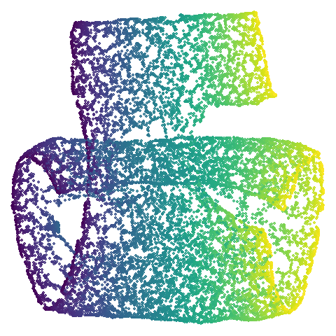
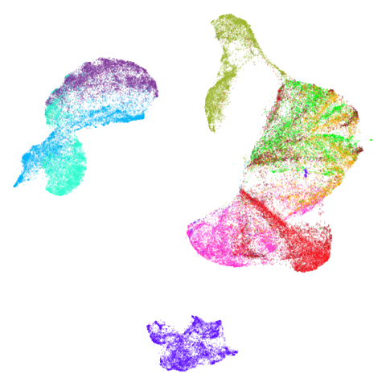

# PaCMAP Comparison

## Introduction

PaCMAP ([paper](https://jmlr.org/papers/v22/20-1061.html),
[repo](https://github.com/YingfanWang/PaCMAP)) is a highly-regarded
dimensionality method, firmly in the LargeVis/UMAP family. It’s main
point of differentiation from related methods is that it balances local
and global structure without needing to tune hyperparameters. The PaCMAP
authors’ [blog post](https://sites.duke.edu/dimensionreduction/)
explicitly states:

> PaCMAP has no parameters that are designed to be tuned.

Bold words! Also PaCMAP is pretty fast.

Alas there is no native R package for PaCMAP (as far as I know). You can
of course call it via `reticulate`, and the PaCMAP repo has a
[notebook](https://github.com/YingfanWang/PaCMAP/blob/master/demo/pacmap_Rnotebook_example.Rmd)
demonstrating that. But that’s a bit unsatisfactory. I have spent a lot
of time studying the Python code and you can see my [notes on the
method](https://jlmelville.github.io/smallvis/pacmap.html) if you want
the details. The upshot of all that is that I feel qualified to say that
it would actually be quite hard to integrate PaCMAP into `uwot`.

## Turning UMAP into PaCMAP?

But can we bend UMAP to make it behave more like PaCMAP? Here is a very
high-level overview of the most important ways that PaCMAP differs from
UMAP:

- Nearest neighbors are chosen using a method originating in
  [self-tuning spectral
  clustering](https://papers.nips.cc/paper/2004/hash/40173ea48d9567f1f393b20c855bb40b-Abstract.html)
  and also used in [Trimap](https://github.com/eamid/trimap). This
  rescales some nearest neighbor distances based on local densities.
  This doesn’t seem to make a massive difference in results in my
  testing so I won’t worry about implementing it.
- There is a special class of “mid-near” items, which are points further
  away than nearest neighbors but closer than randomly-sampled pairs. In
  the language of contrastive learning, you can think of these as
  “semi-positive” examples. Use of these mid-near pairs requires
  introducing a new loss term and gradient type, which is the main
  problem with integrating PaCMAP into `uwot`. Plus there are different
  weights applied to each component of the loss which changes during the
  optimization process. This would require even more reworking of
  `uwot`. Fortunately, it seems like most of the benefit of this (and
  using mid-near items in general) is when you initialize the embedding
  randomly. Let’s just not do that.
- The negative examples for each item are are sampled once and then
  re-used for all epochs, unlike UMAP which is always selecting
  different vertices. We’re also not going to do this as this is
  probably just a speed optimization rather than necessary for the
  working of the method as a whole.
- By default, if your input data has more than 100 columns, then
  Truncated SVD is applied to reduce the dimensionality to 100. I’m not
  really a fan of this as a default setting, but we can easily implement
  it by setting `pca = 100`. It does seem to be an important part of
  PaCMAP’s speed improvements too.
- Initialization is with PCA, which is also easily implemented in `uwot`
  with `init = "pca"`. PaCMAP then shrinks this by multiplying all the
  coordinates by `0.01`. This is supported by setting `init = "pacpca"`
  if you really want to do it, but I don’t think it’s necessary (or
  actually that good an idea).
- The loss function and gradient for PaCMAP are rather different from
  UMAP. In general these are more gentle than UMAP’s and cause less
  tearing and twisting of any manifold structure in the embedded
  coordinates. But in most real-world datasets I have looked at, there
  isn’t a huge effect from the gradient.

So from all of the above you can see that there are some reasonable
changes between UMAP and PaCMAP and most of my responses have been
“yeah, I don’t fancy changing that”. So to put my cards on the table, I
think the major source of differences between UMAP and PaCMAP are:

- Using PCA as initialization (this is the most important difference).
- Using PCA to reduce high-dimensional data to 100 dimensions.

## Methods

To make this simple I used:

- PaCMAP with its default settings. I used Python 3.12 and PaCMAP 0.7.3.
  There have been some patch releases since then, but it has no
  meaningful effect on the results shown here.
- For UMAP, I used default `umap2` parameters. HNSW was used as the
  nearest neighbor method.

I didn’t make any effort to match number of neighbors or number of
epochs and so on. I think these are all pretty comparable with their
default settings.

PCA was performed using `irlba`. To make results easier to compare, the
output coordinates were rigid-body rotated to align with the PCA results
using the Kabsch algorithm (the coordinates were also additionally
flipped along one dimension, and the result with lowest error was
chosen).

## Datasets

I tried to use a variety of datasets, including many used by the PaCMAP
authors in their paper and blog-post. Many of these had Python code in
the PaCMAP repo which was very useful. See the [examples
article](https://jlmelville.github.io/uwot/articles/umap-examples.html)
for more details on the datasets.

One extra dataset that we will also look at is `curve2d`, a simple 2D
curve. This is used as an example in the paper of how even if you start
with the original coordinates scaled by a constant, dimensionality
reduction methods will, rather than do nothing, still distort the
overall shape. Python code to generate the curve is at
<https://github.com/YingfanWang/PaCMAP/blob/master/experiments/run_experiments.py>.

## Results

There’s a table of embeddings below. ased on my feelings that PCA is the
key to a lot of PaCMAP’s differences to UMAP, I have three different
settings of UMAP. From left to right the settings used were:

- UMAP with its default parameters (`UMAP`).
- UMAP initialized with PCA (`UMAP PCA`), i.e. `init = "pca"`.
- UMAP with the input data reduced to 100 dimensions via PCA, if it had
  more than 100 columns (`UMAP-PCA100`) *and* also initialized with PCA,
  i.e.  `init = "pca", pca = 100`.

Finally on the right are the embeddings from running PaCMAP.

I made no special effort to account for variability between runs for
either UMAP or PaCMAP. Based on having run these many, many times, I am
confident that the results are representative of the methods’
performance.

If you have javascript enabled, you can click on any image to embiggen
it.

|   Dataset    | UMAP                                                              | UMAP PCA                                                                  | UMAP PCA100                                                                     | PaCMAP                                                                |
|:------------:|-------------------------------------------------------------------|---------------------------------------------------------------------------|---------------------------------------------------------------------------------|-----------------------------------------------------------------------|
|   curve2d    |            |            |            |            |
|   mammoth    |            |            |            |            |
|  scurvehole  |      |      |      |      |
|   isoswiss   |          |          |          |          |
| hierarchical |  |  |  |  |
|   spheres    |            |            |            |            |
|    coil20    |              |              |              |              |
|   coil100    |            |            |            |            |
| macosko2015  |    |    |    |    |
|    mnist     |                |                |                |                |
|   fashion    |            |            |            |            |
|  ng20pacmap  |      |      |      |      |

Headline results from my point of view are that going from left to
right, UMAP results get more like PaCMAP. But in *many* cases the
default UMAP results don’t seem that different to the PaCMAP results. In
a lot of these datasets, where there are differences, they have already
been discussed at length in the PaCMAP paper, but in act of enormous ego
I will provide my own commentary, you lucky things.

UMAP certainly makes`curve2d` a lot twistier than PaCMAP. And `mammoth`
looks very different. It’s been brutally spatchcocked by UMAP, but it’s
not been ripped to shreds. However, it’s undeniable that the human eye
definitely perceives the side-on view that PaCMAP provides as being more
“natural”. Also `scurvehole` demonstrates that UMAP has a tendency to
rip low-dimensional manifolds more than PaCMAP. That said this dataset
does often get ripped by PaCMAP too (both the ends and – less often –
the area around the hold can be ripped), although the degree of ripping
is not as pronounced as for UMAP.

Let’s also look at `isoswiss`. Here UMAP is *better* than PaCMAP and
does a good job at nearly unfolding it. It’s a bit hard to see what
PaCMAP has done here, but it’s undone by the PCA initialization which
keeps the data rolled up. There has been some unrolling, but it’s tough
to ask a method that works on iteratively updating pairs of points to do
the large scale rearrangement of unfolding, and instead the top part of
the embedding has been ripped.

You can see the same thing happening to a lesser extent with
`scurvehole` where the two ends are a bit twisted. This is the same
issue with a PCA initialization not being local enough. Is it the end of
the world? No. It’s just a bit of a shame we have to sacrifice unfolding
of these manifold examples given that the “M” in PaCMAP also stands for
“manifold”.

But these are all low-dimensional datasets. I would love to see methods
that could adapt to the intrinsic dimensionality of the data they are
working on, and PaCMAP’s gentler approach is definitely superior here.
But I am not sure that these are representative of the kind of data that
people are actually working with. And whether there are lots of nice
low-dimensional manifolds out there waiting to be unfolded is an open
question. If not, then PCA is a good enough initialization for most
datasets.

I’ll also briefly note something a bit odd about `spheres`. Neither UMAP
nor PaCMAP do a good job at recognizing that the ten clusters are
embedded in a larger sphere. Perhaps not surprising due to the local
nature of these methods. But while UMAP gives a result with ten
clusters, representing the ten spheres, plus the points from the other
cluster that were most local to them, PaCMAP has *eleven* clusters.
There is a large blob off to the side that seems to be just the
background cluster. Interesting, and maybe you might like this result
better due to it detecting the other sphere, even if the “containment”
relationship hasn’t been preserved. However, I have seen artifactual
behavior with Annoy sometimes when there are lots of degenerate
distances and the parameters haven’t been set correctly. So there is a
possibility that this is an artifact of the nearest neighbor method
having some issues. That would be something to rule out but I haven’t
done that here.

`coil100` is an interesting case and is why I think the “multiply the
PCA coordinates by 0.01” approach of PaCMAP may give slightly
inconsistent initialization on occasion. UMAP gives a circular-looking
result, whereas PaCMAP is more elongated, with some of the circular
structures noticeably above or to the right of the body of the
embedding. This is a case where the PaCMAP result is very influenced by
the PCA initialization: the overall extent of the initialization is
quite a large value: the side length of the bounding box of the
initialized coordinates is around ~200 units vs ~30 for the PCA
initialization of `mnist`. This leads to large interpoint distances
which is the enemy of all SNE-like methods: the gradients are smaller
than usual and hence more of the initial structure is kept. This could
be seen as a good thing, because you might want to keep more of the
PCA-inspired layout and focus more on local optimization. However, it’s
not something that happens consistently with PaCMAP, it really depends
on the initial scaling of the input dataset. Having a better scaling of
the input coordinates would help here, such as the UMAP approach of
scaling the coordinates to a cube of length 10.

Of the other datasets, the one that stands out as most different between
UMAP and PaCMAP to my eyes is `macosko2015`. The PaCMAP result looks
much nicer here. I like this dataset because results are very affected
by PCA.

Now let’s see what using PCA initialization does to UMAP. The obvious
place to look is at `mammoth` and here we see that the results are now
much closer to PaCMAP’s. The same is true for `curve2d` and `isoswiss`.
`scurvehole` also has an overall layout much closer to PaCMAP, but the
degree of twisting and ripping is definitely worse for UMAP.

Elsewhere, things aren’t changed so much. I admit I am a bit annoyed by
the result for `coil20` where one ring on the left is now stuck inside a
larger ring which isn’t the case for the spectral initialization of
PaCMAP but I will get over it. The UMAP + PCA result for `coil100` also
has the same circular shape as with the spectral initialization rather
than the elongated shape of the PaCMAP result which I argue is further
evidence that more control over the initial scaling of PaCMAP could be
helpful.

I also would say that in terms of overall layout, whether the `mnist`
cluster layout for UMAP or UMAP+PCA is more like the PaCMAP result is a
bit of a toss-up. But how well these methods work on `mnist` is the last
thing anyone should worry about. That really leaves `macosko2015` whch
still bears little resemblance to the PaCMAP result.

In the third column we use PCA to reduce the initial dimensionality of
the data to 100 *and* we use the first two principal components as the
initial coordinates. This will only give a difference in results
compared to the UMAP+PCA results if the input data has more than 100
columns, which is not the case for most of the datasets at the top of
the table. Further down not much happens *except* for `macosko2015`,
which now looks much more like the PaCMAP results. This was not terribly
surprising to me because I know that this dataset is highly affected by
running PCA on it first.

## Conclusions

If you want a more PaCMAP-like experience out of `uwot` using
`pca = 100, init = "pca"` is a good way to go. Even for
lower-dimensional synthetic data, PCA will give you results closer to
PaCMAP, although they may look a bit more raggedy.

### What about random initialization?

One of PaCMAP’s selling points is that you will get more consistent
results even if you don’t use PCA for initialization. I will grant you
that this is certainly a point in PaCMAP’s favor. But on the other hand,
there’s a limited number of circumstances where you can’t just use PCA
for initialization. The PaCMAP paper doesn’t go into detail about what
these circumstances are, so I will just give you some of my ideas. The
main one might be that you have data which doesn’t really lend itself to
PCA. Probably binary data is the most obvious case here, although PaCMAP
only supports the Hamming distance for binary data so your options are a
bit limited anyway. Another example might be where the data is such that
you have access to the k-nearest neighbors but not the underlying
ambient data. But in that case, you would not be able to generate the
mid-near pairs needed for PaCMAP’s performance so you would be out of
luck anyway.

However, I am sure other scenarios exist. In those cases, PaCMAP is a
good choice. For other cases we can make UMAP do what we want in `uwot`
easily enough.

### Ok, but will it be as fast?

The bottleneck for most of these methods is the speed of the nearest
neighbor search which is in turn dependent on the input dimensionality.
So if the PCA process is sufficiently fast then the overall speed of the
PaCMAP approach will outperform the UMAP approach. In `uwot` I find that
`irlba` tends to be a bit slower than the truncated SVD available in
`sklearn` in Python as used by PaCMAP but it depends on the linear
algebra library on your system.

Due to some other internal differences, I would still anticipate that
PaCMAP will be a bit faster than UMAP under these conditions. In
practice, the difference isn’t that large in my experience (a few
seconds for `mnist`, for example). If speed matters to you then I
recommend using:

- `a = 1, b = 1` with `umap2` if you don’t mind a t-UMAP-like
  appearance.
- Or use `approx_pow = TRUE` if you do want to control `min_dist` and
  `spread` (or `a` and `b` directly).
- `negative_sample_rate = 4` will reduce the amount of negative sampling
  in line with what PaCMAP effectively does and shouldn’t affect things
  too much.
- consider using `rng_type = "deterministic"`, which will not use a
  random number generator at all for the negative sampling. If you want
  pseudo-random sampling, then `rng_type = "tausworthe"` is faster than
  the default.

On the other hand, if speed really matters, then PaCMAP will give you
vital seconds back without having to fiddle with the UMAP defaults.
