# Python Comparison

This page is a gallery of images comparing the output of `uwot` version
0.1.3 to the [Python `UMAP` package](https://github.com/lmcinnes/umap)
version 0.3.8. In an ideal world, this wouldn’t be a very exciting
document, as it would exist to demonstrate that `uwot` results resemble
those from the Python implementation.

However, there are a couple of examples that highlight some differences
between the implementations. It’s still not that exciting, but there may
be some information of use to anyone using `uwot` and possibly some
implications for users of t-SNE packages. To distinguish between the
general technique of UMAP and the its specific implementation in the
Python package of the same name, I’ll refer to the Python implementation
with the formatting `UMAP`.

For details on the datasets, see the [UMAP examples
gallery](https://jlmelville.github.io/uwot/articles/umap-examples.html).
The `uwot` results have been re-run for the images here using different
random seeds, but they should resemble the `uwot` output on that page.

The datasets originated in R, mostly being loaded via the [snedata
package](https://github.com/jlmelville/snedata). I then exported them to
CSV, before reading them into Python. UMAP version 0.3.8 was used to
generate the embeddings, using all default settings. The embeddings were
then written to CSV and read back into R for visualization.

The `uwot` output also used default settings with the following
exceptions: `pca = 100` was used to reduce the dimensionality to a
maximum of 100 columns (data was mean-centered as part of this process,
but not rescaled), because the Annoy nearest neighbor search can be very
slow for high-dimensional data. `UMAP`’s [nearest neighbor
search](https://github.com/lmcinnes/pynndescent) seems less affected by
dimensionality. Also, `min_dist = 0.1`, which is the default for the
Python UMAP. `uwot` uses a default of `min_dist = 0.01`. Why? I would
love to tell you, but I think I just made a mistake when I set the
`uwot` defaults. Therefore, the defaults will probably change in some
later version of `uwot`. Fortunately, this doesn’t make a perceptible
practical difference, but I will use the Python default of
`min_dist = 0.1` in the following results.

There is also a potential difference in initialization. Both packages
use a spectral initialization if possible, but differ if the input graph
contains more than one component: `UMAP` attempts a meta-embedding of
the two separate components, where `uwot` abandons a spectral approach
and falls back to using PCA (followed by rescaling the output to a
standard deviation of 1 for each axis). This affects the following
datasets: `iris`, `coil20`, `coil100`, `norb` and `tasic2018`.

``` r
set.seed(42)
iris_umap <- umap(iris, pca = 100, min_dist = 0.1)
```

``` python
# iris X data read from CSV
iris_umap = umap.UMAP().fit_transform(iris_x)
```

Below the results on the left are for the `uwot` output. The image on
the right is from `UMAP`. I present most of these results without
comment because they seem to be very similar to each other. There are
two exceptions, for the small NORB dataset (`norb`) and the gene
expression dataset `macosko2015`, which will be discussed in their
section.

## Results

### iris

|                                     |                                       |
|:-----------------------------------:|:-------------------------------------:|
| 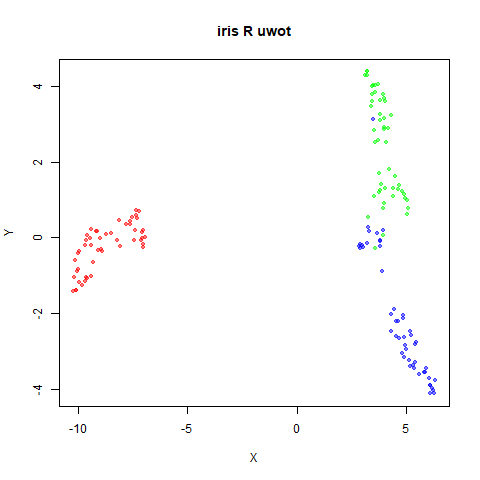 | 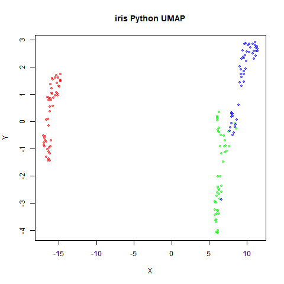 |

### s1k

|                                   |                                     |
|:---------------------------------:|:-----------------------------------:|
| 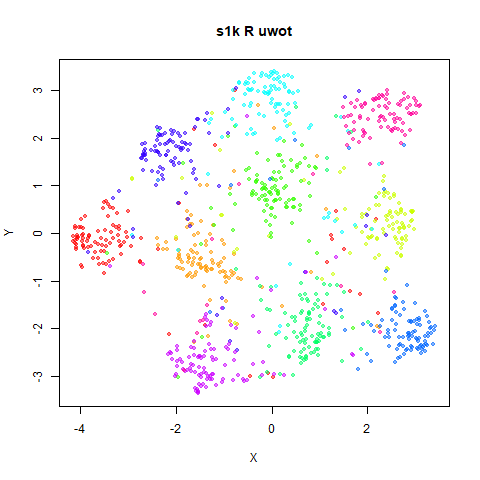 | 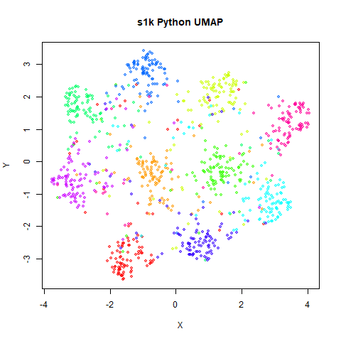 |

### oli

|                                   |                                     |
|:---------------------------------:|:-----------------------------------:|
| 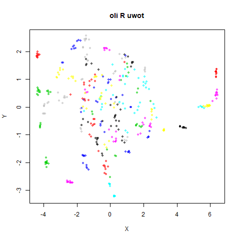 | 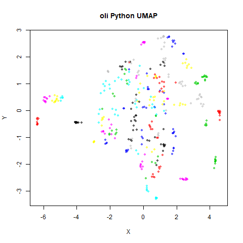 |

### frey

|                                     |                                       |
|:-----------------------------------:|:-------------------------------------:|
| 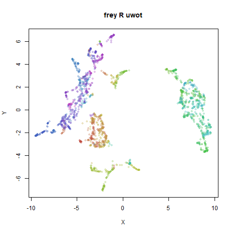 | 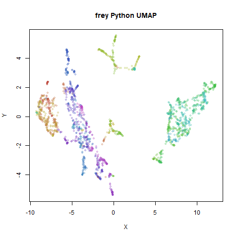 |

### coil20

|                                         |                                           |
|:---------------------------------------:|:-----------------------------------------:|
| 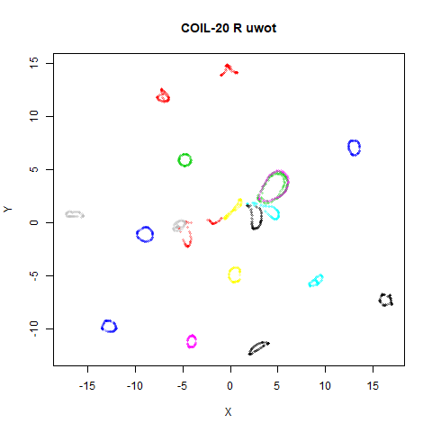 | 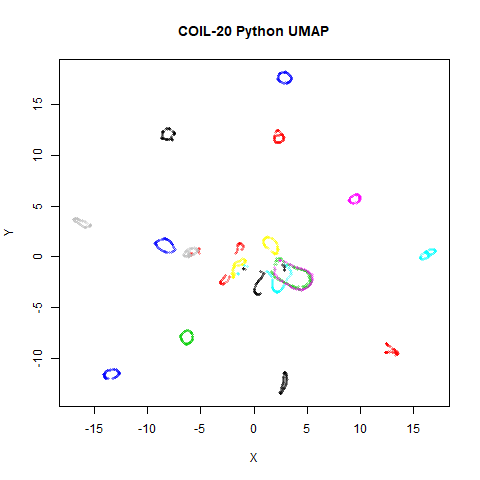 |

### coil100

|                                           |                                             |
|:-----------------------------------------:|:-------------------------------------------:|
| 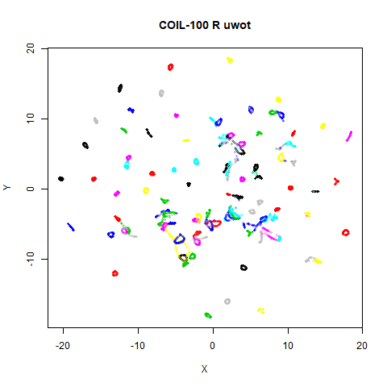 | 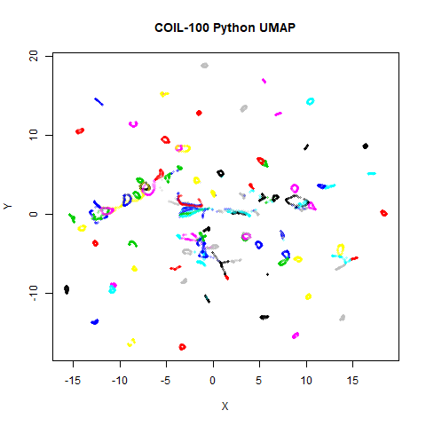 |

### mnist

|                                       |                                         |
|:-------------------------------------:|:---------------------------------------:|
| 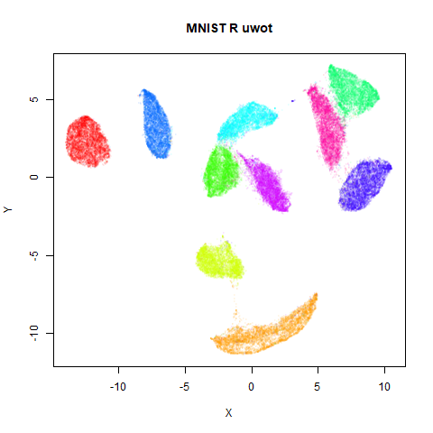 | 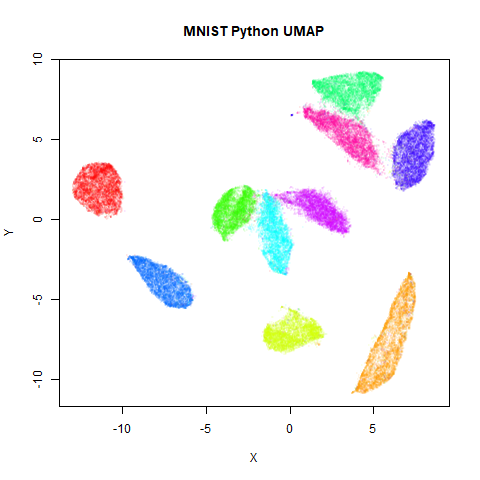 |

### fashion

|                                           |                                             |
|:-----------------------------------------:|:-------------------------------------------:|
| 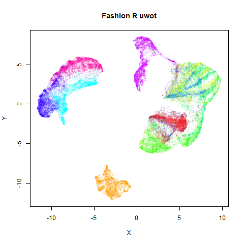 | 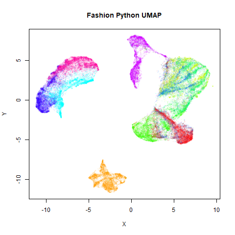 |

### kuzushiji

|                                               |                                                 |
|:---------------------------------------------:|:-----------------------------------------------:|
| 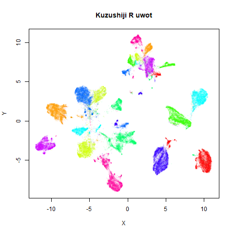 | 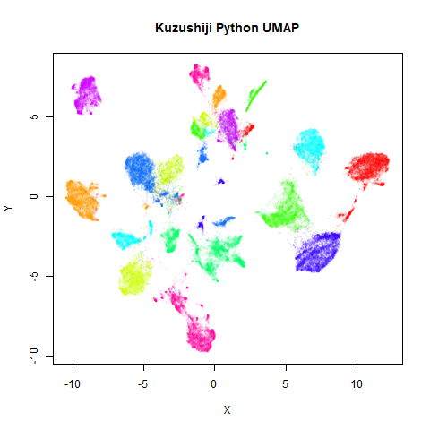 |

### norb

|                                     |                                       |
|:-----------------------------------:|:-------------------------------------:|
| 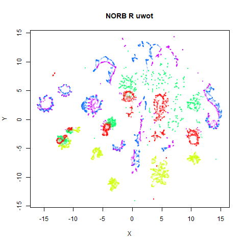 | 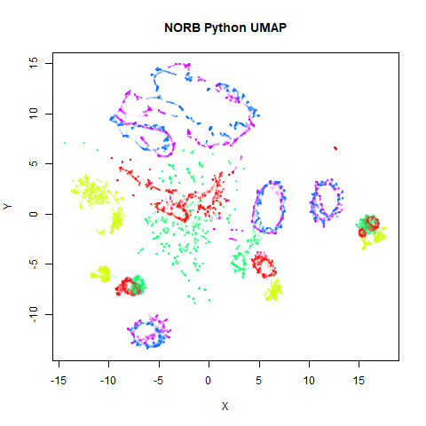 |

Here’s a result that seems worth commenting on. The `uwot` results show
slightly less structure, a large blue loop seems to have been broken up.

I suspect that the PCA preprocessing to 100 dimensions as used by `uwot`
is too aggressive here and might be throwing away too much of the
variance in the dataset. Compared to the ground truth 15 nearest
neighbors using [FNN](https://cran.r-project.org/package=FNN), Annoy
results with `pca = 100` are 82% accurate. Without PCA, this accuracy
goes up to 99% and the `uwot` results are much closer to the `UMAP`
results. This is the image below, on the left. Meanwhile, if you use the
PCA results as input to `UMAP`, the output now looks a bit more like the
`uwot` results. That’s the image on the lower right.

|                                               |                                              |
|:---------------------------------------------:|:--------------------------------------------:|
| 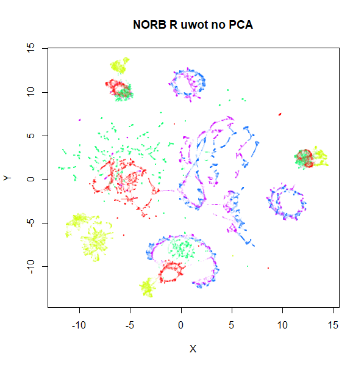 | 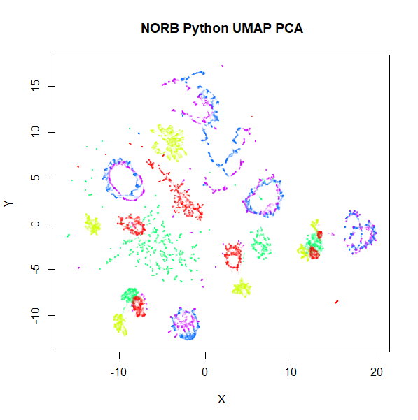 |

Unfortunately, the very high dimensionality of `norb` makes running
Annoy on it directly very slow indeed: with a single-thread, it took 4
and a half hours, versus around 5 minutes in the PCA case. We will
revisit nearest neighbor accuracies later.

Note also that `norb` is one of the datasets where the graph contains
two separate components, so the initialization of the output coordinates
is different between `uwot` and `UMAP`, with `UMAP`’s “meta-embedding”
approach better at retaining local structure.

### tasic2018

|                                               |                                                 |
|:---------------------------------------------:|:-----------------------------------------------:|
| 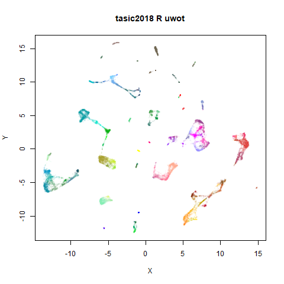 | 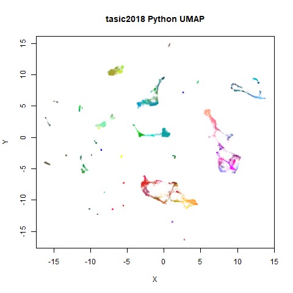 |

### macosko2015

|                                                   |                                                     |
|:-------------------------------------------------:|:---------------------------------------------------:|
| 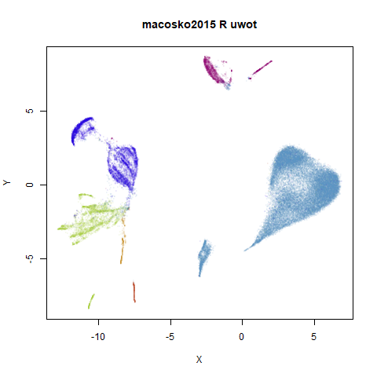 | 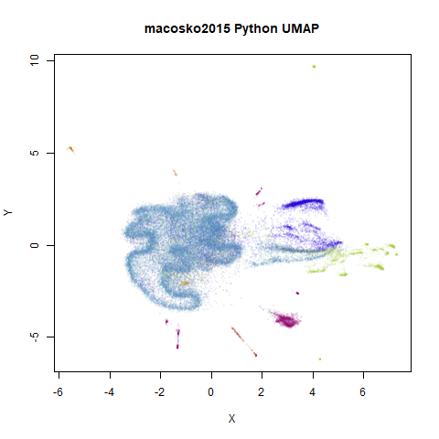 |

This result shows the largest deviation of `uwot` from `UMAP`. That big
cyan cluster is of an obviously different shape in the two plots. The
source of the difference here seems to be nearest neighbor results. It
turns out that both `uwot` and `UMAP` have trouble find good
approximations to the nearest neighbors with this dataset, but `UMAP`
does a lot better. We will get into more detail about the nearest
neighbor accuracies across the datasets in the next section. For now,
below are two further plots. The left-hand plot is the `uwot` results
when it uses the more accurate nearest neighbor data calculated by
`UMAP`: the `uwot` results now resemble the `UMAP` results, which is
reassuring. The right hand plot uses exact nearest neighbor results
calculated via the `FNN`.

|                                                            |                                                                          |
|:----------------------------------------------------------:|:------------------------------------------------------------------------:|
| 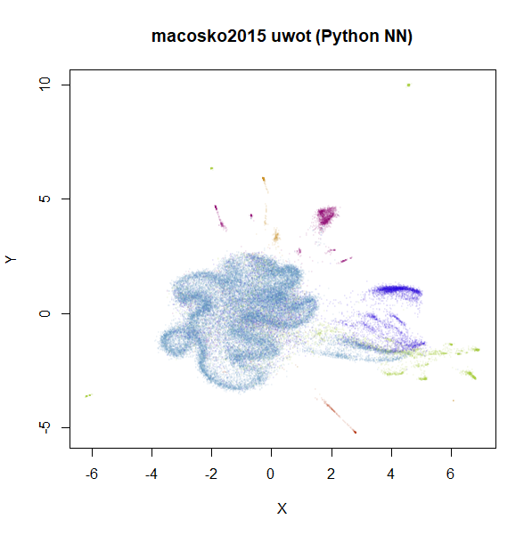 | 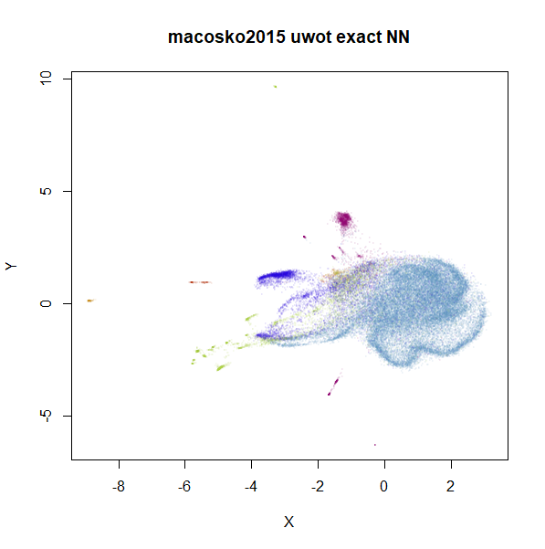 |

Even though the `UMAP` nearest neighbor data is better than that which
`uwot` produced, we can still see an obvious difference in the two
plots, so it’s clear that this data set presents a challenge for the
approximate nearest neighbor methods considered here.

### cifar10

|                                           |                                             |
|:-----------------------------------------:|:-------------------------------------------:|
| 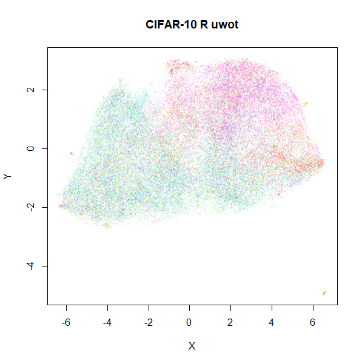 | 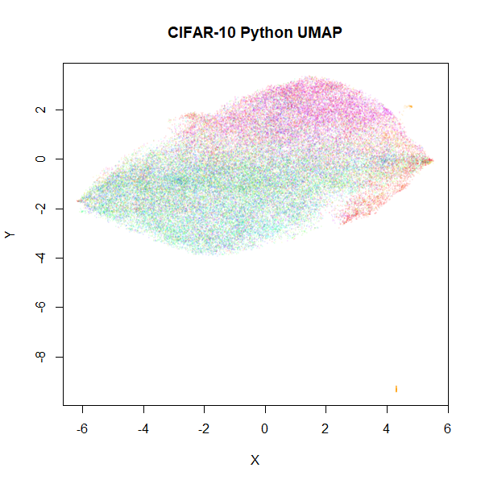 |

Based on results with this dataset in the [UMAP examples
gallery](https://jlmelville.github.io/uwot/articles/umap-examples.html),
I wasn’t expecting these results to be a feast for the eyes. After
seeing the difference in results with `macosko2015`, I am just relieved
that these two results look disappointing in a similar way.

## Nearest Neighbor Accuracy

The `norb` and `macosko2015` results suggest that the use of PCA and the
nearest neighbor search methods present the biggest source of difference
between `uwot` and `UMAP`. Here are some more details.

For small datasets, which in both implementations means less than 4,096
observations, both `uwot` and `UMAP` calculate the exact nearest
neighbors. For larger datasets, `uwot` uses the
[Annoy](https://github.com/spotify/annoy) method, and `UMAP` uses
[pynndescent](https://github.com/lmcinnes/pynndescent), which uses
random projection trees, followed by nearest neighbor descent.

For the larger datasets, I used the
[FNN](https://cran.r-project.org/package=FNN) package to generate the
exact 15 nearest neighbors and then compared results for `uwot` and
`UMAP`. For `UMAP`, I used default settings. For `uwot`, I applied
`pca = 100` as that is what I currently use for high dimensional
datasets. The third column shows the amount of variance explained by
only keeping 100 components.

| datasets      | `uwot` | `UMAP` | PCA 100 var |
|---------------|--------|--------|-------------|
| `coil100`     | 89.1%  | 99.7%  | 88.4%       |
| `mnist`       | 86.2%  | 97.5%  | 91.5%       |
| `fashion`     | 74.3%  | 97.9%  | 91.2%       |
| `kuzushiji`   | 78.3%  | 95.2%  | 84.6%       |
| `norb`        | 81.7%  | 98.3%  | 95.6%       |
| `tasic2018`   | 48.0%  | 97.7%  | 67.7%       |
| `macosko2015` | 11.2%  | 41.8%  | 37.3%       |
| `cifar10`     | 67.4%  | 84.1%  | 90.1%       |

`UMAP` does a pretty incredible job with nearly every dataset, and it’s
fast too. *And* it doesn’t need to use PCA to reduce the dimensionality.
The obvious exception is `macosko2015`. I was unable to find a
combination of parameters with `pynndescent` that produced good results,
e.g. by increasing the number of trees in the RP tree initialization or
the number of iterations in the nearest neighbor descent phase. With
`n_trees=250`, I was able to get to 54.9% accuracy, but I started to get
out of memory errors much beyond this setting, and nearest neighbor
descent tends to converge after 5-6 iterations anyway. Doing better will
may require more manipulation of the sampling rate and candidate list
size used in nearest neighbor descent, which can quickly cause a large
increase in memory and run time if you aren’t careful. Also, you can’t
fiddle with these parameters in `UMAP` version 0.3.8 anyway.

`uwot` results… well, they’re less impressive than `UMAP`’s. The
`tasic2018` results are pretty bad, and the `macosko2015` results can be
fairly described as horrendous. The accuracies show a rough correlation
with the percentage of variance explained by 100 components. Results for
`tasic2018` and especially `macosko2015` show that 100 components may
not be enough to extract the meaningful variation from the datasets,
which might explain the inability to find the true nearest neighbors.
The `uwot` defaults for the Annoy search are somewhat arbitrary, having
been copied from [LargeVis](https://github.com/lferry007/LargeVis). That
package used nearest neighbor descent to improve the accuracy, and
increasing Annoy’s `n_trees` parameter can give a small improvement to
some of the datasets, but the increase in computation time is probably
not worth the small increase in accuracy I’ve seen when trying this. It
seems that in cases where the current defaults don’t work well, it’s
because too much information is thrown away by the PCA pre-processing.

`tasic2018` and `macosko2015` are both transcriptomics datasets and
clearly represent an interesting challenge to Annoy, while `macosko2015`
troubles even pynndescent. The other datasets are image datasets.
Possibly the way the data has been scaled and prepared for these biology
datasets makes life harder for approximate nearest neighbors? It’s hard
to know where to start when it comes to unpicking what causes
`macosko2015` to perform so differently, but here is a histogram of the
nearest neighbor distances for `macosko2015` and `tasic2018` (top row),
which misbehave with Annoy, and on the bottom row are the histograms for
`mnist` and `fashion`, which are better behaved:

|                                                              |                                                          |
|:------------------------------------------------------------:|:--------------------------------------------------------:|
| 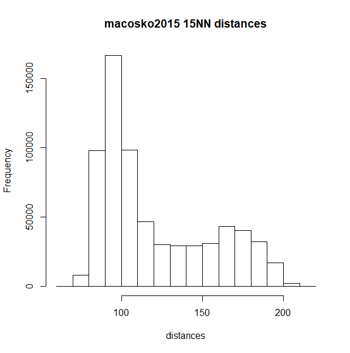 | 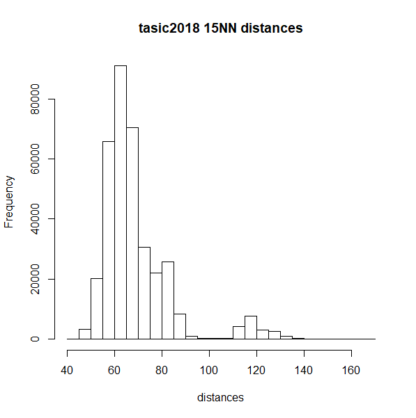 |
|       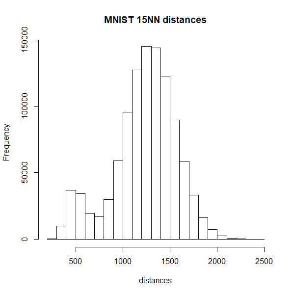       |   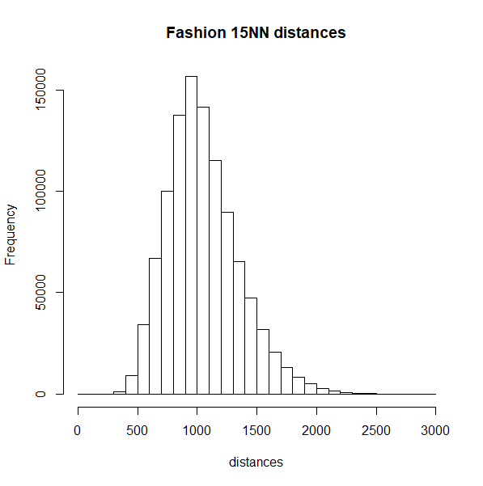   |

The biomodal distribution of `macosko2015` and `tasic2018` do seem more
similar to each other than they do to `mnist` or `fashion`. That said,
`tasic2018` behaves perfectly well with the pynndescent method, so I see
no obvious answers here.

## Conclusions

The good news is that for most datasets, the differences between
`uwot`’s UMAP implementation and that of the Python `UMAP`
implementation makes very little difference. The bad news is that there
*are* a couple of cases where we see differences. The biggest offender
is `macosko2015` but there neither method is doing a perfect job.
Nonetheless, `UMAP` is able to calculate nearest neighbors more
accurately and more quickly than `uwot`.

One source of the difference is the use of Annoy as the nearest neighbor
calculation method. It does seem to be solidly slower than pynndescent,
but in my experience, it can reach high accuracies. even if it takes a
while. **March 8 2020**: On Windows, there used to be an issue where an
Annoy index that was larger than 2GB on disk couldn’t be read back in.
Make sure you are using a version of
[RcppAnnoy](https://cran.r-project.org/package=RcppAnnoy) 0.0.15 or
later to avoid this.

The time to search an Annoy index seems to start scaling quite badly
with dimensionality \> 1000, so if you can get away with picking
500-1000 random features and use that, you could try that. With 1,152
random features (i.e. 1/16th the pixels in`norb`), visual results aren’t
*that* much worse with this approach and the nearest neighbor search
runs 100 times faster (50 minutes vs 20 seconds):

|                                                       |                                                   |
|:-----------------------------------------------------:|:-------------------------------------------------:|
| 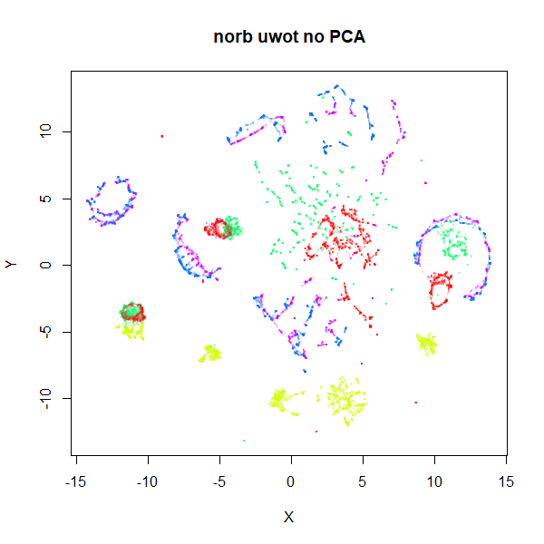 | 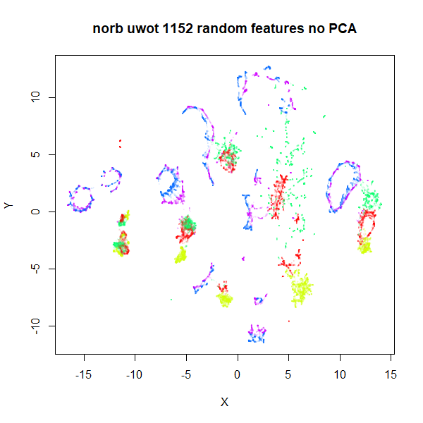 |

Otherwise, if you have a high-dimensional dataset, you should consider
PCA. I don’t have any solid advice for the number of components to
retain if you do use PCA for preprocessing. Less than the usual t-SNE
default of 50 is probably unwise. I use `pca = 100` in most examples,
but as we’ve seen, that can still sufficiently perturbs the pairwise
distances in the input data to give some differences in the output. It
would be nice if you could use more components to get a better trade-off
of accuracy and speed, but even with fast partial PCA routines used by
`uwot` (courtesy of [irlba](https://cran.r-project.org/package=irlba)),
extracting more than 100 components can be quite time-consuming.

### What about t-SNE?

`uwot` is not the only dimensionality reduction to use PCA or Annoy for
approximate nearest neighbor search. LargeVis uses it, the t-SNE package
[Fit-SNE](https://github.com/KlugerLab/FIt-SNE) has Annoy as an option
and [openTSNE](https://github.com/pavlin-policar/openTSNE) seems to have
at least considered it (see
e.g. <https://github.com/pavlin-policar/openTSNE/issues/28>). It is also
standard practice in t-SNE to reduce dimensionality:
[Rtsne](https://github.com/jkrijthe/Rtsne), a wrapper around the
de-facto standard Barnes Hut t-SNE routine. will only keep 50 components
via PCA by default.

Does the PCA issue effect t-SNE? Well, a little bit. Below are results
for `norb` and `macosko2015` (openTSNE’s documentation is where I
discovered this dataset, as it happens) with t-SNE results from `Rtsne`,
using `perplexity = 15`. The images on the left use PCA to reduce the
initial dimensionality down to 100, while the ones on the right use the
raw input data.

|                                                            |                                                                      |
|:----------------------------------------------------------:|:--------------------------------------------------------------------:|
|        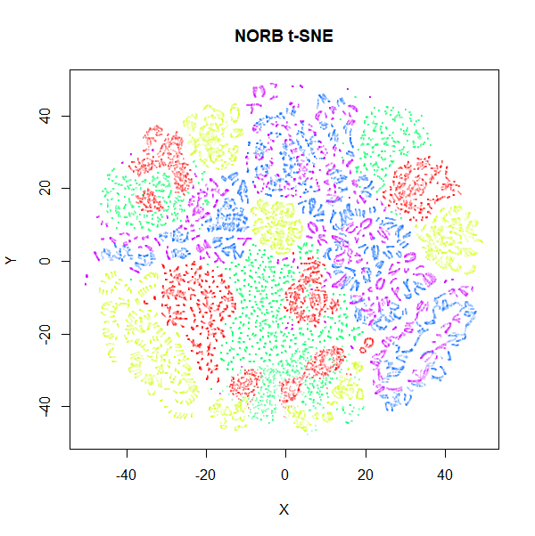        |        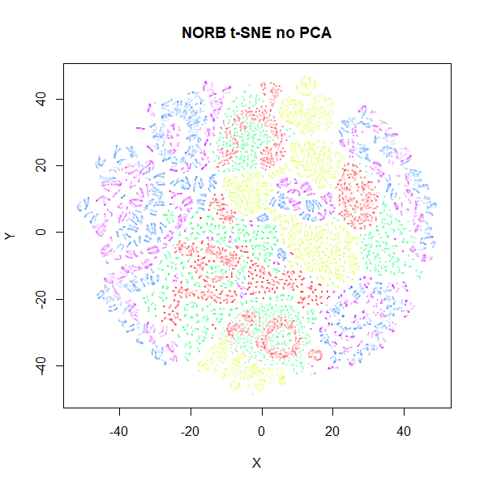        |
| 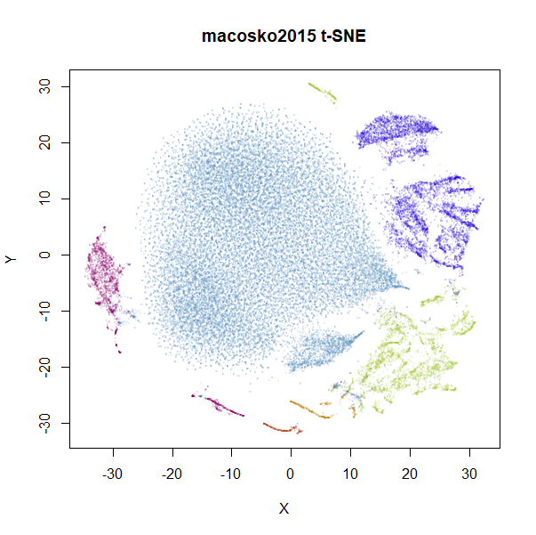 | 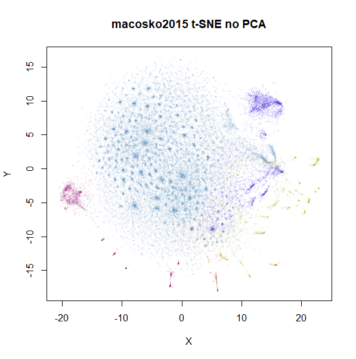 |

`norb` results seem fairly unaffected, but we also see for `macosko2015`
that there’s a change to the main large cluster. Usually, you don’t set
perplexity as low as 15, so are there also differences when the
perplexity is set to a more typical value, like 50? Also, the default
PCA dimensionality setting in `Rtsne` is 50, not 100, so here are those
t-SNE plots repeated with `perplexity = 50` and either
`pca = TRUE, partial_pca = TRUE, initial_dims = 50` on the left, and
`pca = FALSE` on the right:

|                                                                                  |                                                                                  |
|:--------------------------------------------------------------------------------:|:--------------------------------------------------------------------------------:|
|        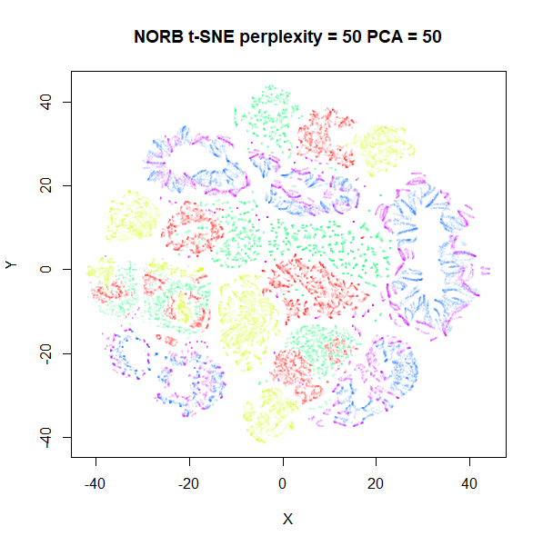        |        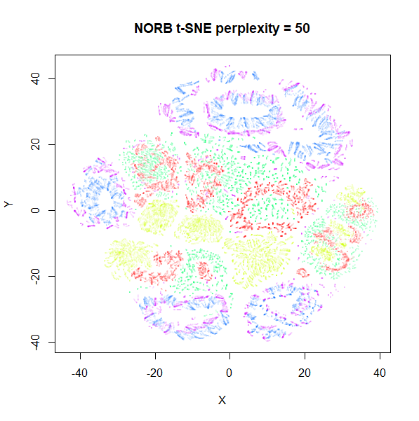        |
| 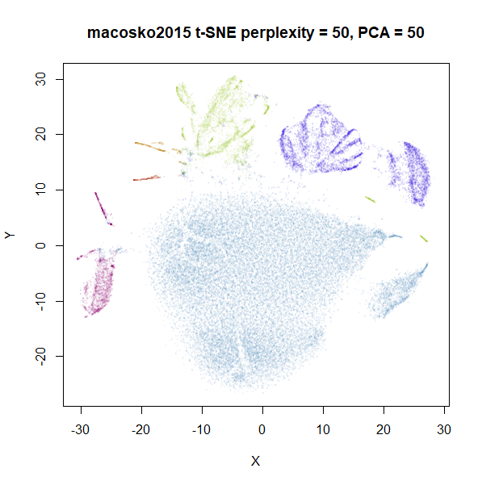 | 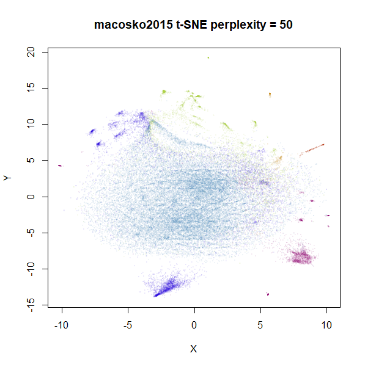 |

Again, the `norb` dataset is less affected than `macosko2015` but for
the latter there is a definite effect of preprocessing with PCA. This is
something to bear in mind before applying PCA to your data even with
t-SNE. On balance, I’d probably live with the effect of applying PCA to
your data, because just like with `uwot`, `Rtsne` input processing can
take a few hours with very high dimensional datasets.

Finally, some people consider results obtained with PCA to be *more*
reliable than those using the “raw” input, because PCA can be considered
a way to denoise data, where the lower-variance components are assumed
to be irrelevant. I might be a bit biased, but of all the UMAP plots of
`macosko2015`, I think the default `uwot` one shows the best separation
of clusters, so maybe there’s something to it. But this is also the
reason I tabulated the amount of variance 100 components explained for
each dataset. Where most of the datasets keep a large majority of the
variance with 100 components, in the case of `macosko2015`, you would
have to be prepared to argue why it was ok to throw away over 60% of
variance in the data. I’m sure it can be done, but you would need a
solid, ideally biology-based justification.

A future version of `uwot` will hopefully contain an implementation of
nearest neighbor descent optimization to reduce the gap in nearest
neighbor accuracy with `UMAP`.
