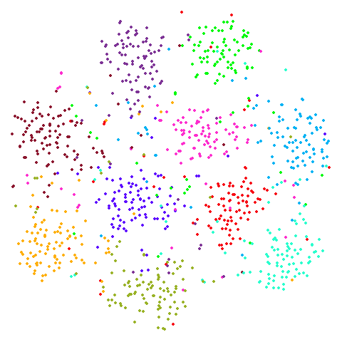
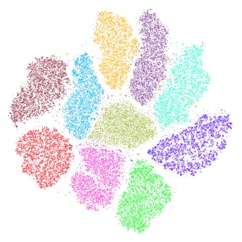
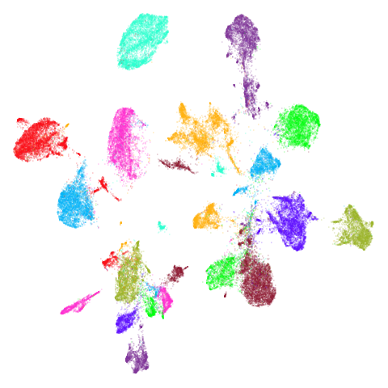

# UMAP Examples

## Introduction

*December 26 2024*: Images have been (mainly) reworked so that they make
better use of the space in the tables and are aligned more consistently
allowing an easier comparison of how UMAP and t-SNE differ. The t-SNE
output is also improved. I also use more default settings. Plus more
datasets.

*December 29 2018* New, better settings for t-SNE, better plots and a
couple of new datasets. Removed neighborhood preservation values until
I’ve double checked they are working correctly.

Here are some examples of the output of `uwot`’s implementation of UMAP,
compared to t-SNE output. As you will see, UMAP’s output results in more
compact, separated clusters compared to t-SNE.

### Data preparation

For details on the datasets, follow their links. Somewhat more detail is
also given in the [smallvis
documentation](https://jlmelville.github.io/smallvis/datasets.htm).
`iris` you already have if you are using R. `s1k` is part of the
[sneer](https://github.com/jlmelville/sneer) package. `frey`, `oli`,
`mnist`, `fashion`, `kuzushiji`, `norb` and `cifar10` can be downloaded
via [snedata](https://github.com/jlmelville/snedata). `coil20` and
`coil100` can be fetched via
[coil20](https://github.com/jlmelville/coil20).

``` r
mnist <- snedata::download_mnist()

# For some functions we need to strip out non-numeric columns and convert data to matrix
x2m <- function(X) {
  if (!methods::is(X, "matrix")) {
    m <- as.matrix(X[, which(vapply(X, is.numeric, logical(1)))])
  }
  else {
    m <- X
  }
  m
}
```

At the time I generated this document (late December 2018), the
`kuzushiji` dataset had some duplicate and all-black images that needed
filtering. This seems to have been remedied as of early February 2019. I
re-ran both UMAP and t-SNE on the fixed dataset, but the results weren’t
noticeably different. For the record, the clean-up routines I ran were:

``` r
# Remove all-black images in Kuzushiji MNIST (https://github.com/rois-codh/kmnist/issues/1)
kuzushiji <- kuzushiji[-which(apply(x2m(kuzushiji), 1, sum) == 0), ]
# Remove duplicate images (https://github.com/rois-codh/kmnist/issues/5)
kuzushiji <- kuzushiji[-which(duplicated(x2m(kuzushiji))), ]
```

### Settings

For UMAP I used default settings with the `umap2` function with one
exception: I have the pre-calculated exact nearest neighbors for these
datasets to hand, so I used those rather than approximate nearest
neighbors. For more on `umap2` see the [umap2
article](https://jlmelville.github.io/uwot/articles/umap2.html).

For t-SNE, I used the Python package
[openTSNE](https://github.com/pavlin-policar/openTSNE) (version 1.0.2)
with its default settings.

#### Visualization

For visualization, I used the
[vizier](https://github.com/jlmelville/vizier) package.

### Results

### iris

The standard `iris` dataset, known and loved by all.

|                      UMAP                       |                   t-SNE                   |
|:-----------------------------------------------:|:-----------------------------------------:|
|  |  |

### s1k

A 9-dimensional fuzzy simplex, which I created for testing t-SNE and
related methods, original in the
[sneer](https://github.com/jlmelville/sneer) package.

|                  UMAP                  |                  t-SNE                  |
|:--------------------------------------:|:---------------------------------------:|
|  |  |

### oli (or olivetti)

The [ORL database of faces](https://cam-orl.co.uk/facedatabase.html).

|                    UMAP                     |                    t-SNE                     |
|:-------------------------------------------:|:--------------------------------------------:|
|  |  |

### frey

Images of Brendan Frey’s face, as far as I know originating from a page
belonging to [Saul Roweis](https://cs.nyu.edu/~roweis/data.html).

|                   UMAP                   |                   t-SNE                   |
|:----------------------------------------:|:-----------------------------------------:|
|  |  |

### isofaces

Yet more faces, this time the dataset used in
[Isomap](http://web.mit.edu/cocosci/isomap/datasets.md), consisting of
images of the same face under different rotations and lighting
conditions. Unfortunately, it’s no longer available at the MIT website,
but it can be found via [the Wayback
Machine](https://web.archive.org/web/20160913051505/http://isomap.stanford.edu/face_data.mat.Z).
I wrote a [gist for processing the data in
R](https://gist.github.com/jlmelville/339dfeb80c3e836e887d70a37679b244).

In the images below the points are colored by the left-to-right pose
angle.

|                       UMAP                       |                       t-SNE                       |
|:------------------------------------------------:|:-------------------------------------------------:|
|  |  |

### coil20

The [COIL-20 Columbia Object Image
Library](http://www.cs.columbia.edu/CAVE/software/softlib/coil-20.php).

|                        UMAP                         |                     t-SNE                     |
|:---------------------------------------------------:|:---------------------------------------------:|
|  |  |

### coil100

The [COIL-100 Columbia Object Image
Library](http://www.cs.columbia.edu/CAVE/software/softlib/coil-100.php).

|                         UMAP                          |                      t-SNE                      |
|:-----------------------------------------------------:|:-----------------------------------------------:|
|  |  |

### swiss roll (isoswiss)

The [Swiss Roll](http://web.mit.edu/cocosci/isomap/datasets.md) data
used in Isomap. A famous dataset, but perhaps not that representative of
typical real world datasets. t-SNE is known to not handle this well, but
UMAP makes an impressive go at unfolding it.

|                     UMAP                      |                     t-SNE                      |
|:---------------------------------------------:|:----------------------------------------------:|
|  |  |

### mnist

The [MNIST database of handwritten
digits](http://yann.lecun.com/exdb/mnist/).

|                    UMAP                    |                    t-SNE                    |
|:------------------------------------------:|:-------------------------------------------:|
|  |  |

### fashion

The [Fashion MNIST
database](https://github.com/zalandoresearch/fashion-mnist), images of
fashion objects.

|                      UMAP                      |                      t-SNE                      |
|:----------------------------------------------:|:-----------------------------------------------:|
|  |  |

### kuzushiji (KMNIST)

The [Kuzushiji MNIST database](https://github.com/rois-codh/kmnist),
images of cursive Japanese handwriting.

|                        UMAP                        |                        t-SNE                        |
|:--------------------------------------------------:|:---------------------------------------------------:|
|  |  |

### norb

The [small NORB
dataset](https://cs.nyu.edu/~ylclab/data/norb-v1.0-small/), pairs of
images of 50 toys photographed at different angles and under different
lighting conditions.

|                   UMAP                   |                   t-SNE                   |
|:----------------------------------------:|:-----------------------------------------:|
|  |  |

### cifar10

The [CIFAR-10 dataset](https://www.cs.toronto.edu/~kriz/cifar.html),
consisting of 60000 32 x 32 color images evenly divided across 10
classes (e.g. airplane, cat, truck, bird). t-SNE was applied to CIFAR-10
in the [Barnes-Hut t-SNE
paper](http://jmlr.org/papers/v15/vandermaaten14a.md), but in the main
paper, only the results after passing through a convolutional neural
network were published. t-SNE on the original pixel data was only given
in the [supplementary information
(PDF)](https://lvdmaaten.github.io/publications/misc/Supplement_JMLR_2014.pdf)
which is oddly hard to find a link to via JMLR or the article itself,
and in the less widely-cited [preliminary investigation into BH
t-SNE](https://arxiv.org/abs/1301.3342).

|                      UMAP                      |                      t-SNE                      |
|:----------------------------------------------:|:-----------------------------------------------:|
|  |  |

There is an outlying purple cluster (which isn’t easy to see) in the
center bottom of the UMAP plot. I see the same thing in the Python
implementation, so I don’t think this is a bug in `uwot` (although I
also said that in a previous version of this page, and it turned out
there *was* a bug in `uwot`. The current result really is closer to the
Python version now, though). That cluster of images is of some
automobiles but they all seem to be variations of the same image. The
same cluster is present in the t-SNE plot (bottom left), but is more
comfortably close to the rest of the data.

The existence of these near-duplicates in CIFAR-10 doesn’t seem to have
been widely known or appreciated until quite recently, see for instance
[this twitter
thread](https://twitter.com/colinraffel/status/1030532862930382848) and
[this paper by Recht and co-workers](https://arxiv.org/abs/1806.00451).
Such manipulations are in line with the practice of data augmentation
that is popular in deep learning, but you would need to be aware of it
to avoid the test set results being contaminated. These images seem like
a good argument for applying UMAP or t-SNE to your dataset as a way to
spot this sort of thing.

As the visualization of CIFAR-10 isn’t very successful with UMAP or
t-SNE, here are some results using the activations of a convnet, similar
to that used in the BH t-SNE paper. For the convnet, I used a
[keras](https://keras.io/) implementation, taken from the [Machine
Learning in Action
blog](https://appliedmachinelearning.blog/2018/03/24/achieving-90-accuracy-in-object-recognition-task-on-cifar-10-dataset-with-keras-convolutional-neural-networks/).
Features were Z-scaled as carried out in the blog, but I used 100 epochs
and a batch size of 128 and I also used the [RMSprop
(PDF)](https://www.cs.toronto.edu/~tijmen/csc321/slides/lecture_slides_lec6.pdf)
optimizer favored in the [Deep Learning with Python
book](https://www.manning.com/books/deep-learning-with-python) (with
`lr=1e-4` and `decay=1e-6`). Without any data augmentation, this gave a
test set error of `0.1655`, slightly lower than the test set result
given in the BH t-SNE paper (which used a different architecture and
without the benefit of an extra 4 years of deep learning research).
After retraining with all 60000 images, the flattened output of the
final max-pool layer was used, giving 2048 features (the BH t-SNE paper
network had 1024 output activations). UMAP and t-SNE results are below.
For the UMAP results, I used the t-UMAP settings with scaled PCA
initialization.

|                                                                 |                                                                |
|:---------------------------------------------------------------:|:--------------------------------------------------------------:|
|  |  |

Results don’t look quite as good as those in the BH t-SNE paper, but
they are still an improvement. The orange cluster of automobiles remains
as an outlier, even in the activation space. You can also see it in the
BH t-SNE paper in the lower image in Figure 5 (orange cluster at the
bottom, slightly left of center).

### tasic2018

The `tasic2018` dataset is a transcriptomics dataset of mouse brain cell
RNA-seq data from the [Allen Brain
Atlas](http://celltypes.brain-map.org/rnaseq/mouse) (originally reported
by [Tasic and co-workers](http://dx.doi.org/10.1038/s41586-018-0654-5).
There is gene expression data for 14,249 cells from the primary visual
cortex, and 9,573 cells from the anterior lateral motor cortex to give a
dataset of size n = 23,822 overall. Expression data for 45,768 genes
were obtained in the original data, but the dataset used here follows
the pre-processing treatment of [Kobak and
Berens](https://doi.org/10.1101/453449) which applied a normalization
and log transformation and then only kept the top 3000 most variable
genes.

The data can be generated from the Allen Brain Atlas website and
processed in Python by following the instructions in this [Berens lab
notebook](https://github.com/berenslab/rna-seq-tsne/blob/master/demo.ipynb).
I output the data to CSV format for reading into R and assembling into a
data frame with the following extra exporting code:

``` python
np.savetxt("path/to/allen-visp-alm/tasic2018-log3k.csv", logCPM, delimiter=",")
np.savetxt("path/to/allen-visp-alm/tasic2018-areas.csv", tasic2018.areas, delimiter=",", fmt = "%d")
np.savetxt("path/to/allen-visp-alm/tasic2018-genes.csv", tasic2018.genes[selectedGenes], delimiter=",", fmt='%s')
np.savetxt("path/to/allen-visp-alm/tasic2018-clusters.csv", tasic2018.clusters, delimiter=",", fmt='%d')
np.savetxt("path/to/allen-visp-alm/tasic2018-cluster-names.csv", tasic2018.clusterNames, delimiter=",", fmt='%s')
np.savetxt("path/to/allen-visp-alm/tasic2018-cluster-colors.csv", tasic2018.clusterColors, delimiter=",", fmt='%s')
```

|                        UMAP                        |                        t-SNE                        |
|:--------------------------------------------------:|:---------------------------------------------------:|
|  |  |

### macosko2015

Another [transcriptomics data
set](https://doi.org/10.1016/j.cell.2015.05.002), used as an example in
[openTSNE](https://github.com/pavlin-policar/openTSNE). This contains
data for 44,808 cells from the mouse retina.

The raw data was fetched similarly to this [shell script from the
Hemberg
Lab](https://github.com/hemberg-lab/scRNA.seq.datasets/blob/master/bash/macosko.sh)
and then the data was prepared using the [openTSNE notebook by Pavlin
Policar](https://github.com/pavlin-policar/openTSNE/blob/master/examples/prepare_macosko_2015.ipynb).
Similarly to the `tasic2018` dataset, data was log normalized and the
3,000 most variable genes were retained.

I exported the data (without the Z-scaling and PCA dimensionality
reduction), as a CSV file, e.g.:

``` python
np.savetxt("/path/to/macosko2015/macosko2015-log3k.csv", x, delimiter=",")
# Use these as column names
np.savetxt("/path/to/macosko2015/macosko2015-genenames.csv", data.T.columns.values[gene_mask].astype(str), delimiter=",", fmt = "%s")
np.savetxt("/path/to/macosko2015/macosko2015-clusterids.csv", cluster_ids.values.astype(int), delimiter=",", fmt = "%d")
```

|                          UMAP                          |                          t-SNE                          |
|:------------------------------------------------------:|:-------------------------------------------------------:|
|  |  |

Results are not that impressive looking (especially for UMAP). I include
this example because it’s very common in scRNA-seq packages to apply PCA
to the gene expression data before UMAP. In this case, I have reduced
the dimensionality down to 100. After that transformation, results look
very different (with much better separation of clusters):

|                                UMAP                                |                                t-SNE                                |
|:------------------------------------------------------------------:|:-------------------------------------------------------------------:|
|  |  |

The good news is that results look better and the nearest neighbor
search step in both t-SNE and UMAP will go faster, which is often why
this is carried out. The bad news is that you now have to justify the
biological basis for the PCA pre-processing, which has clearly changed
the relationship between the different measurements. And why 100
dimensions?

In most datasets I’ve seen PCA pre-processing doesn’t have such a
noticeable effect, which is why I like this dataset.

### S-curve With a Hole (scurvehole)

Used by the dimensionality reduction method
[PaCMAP](https://github.com/YingfanWang/PaCMAP). It is generated by the
script at
<https://github.com/YingfanWang/PaCMAP/blob/master/experiments/run_experiments.py>.
script mentioned It’s an S-curve with a hole in the middle, and so
should be amenable to being unfolded into 2D. Similar to `isowiss`.

|                         UMAP                         |                         t-SNE                         |
|:----------------------------------------------------:|:-----------------------------------------------------:|
|  |  |

### mammoth

A 3D point cloud of a [mammoth at the
Smithsonian](https://3d.si.edu/object/3d/mammuthus-primigenius-blumbach:341c96cd-f967-4540-8ed1-d3fc56d31f12).
A 50,000 point sample was used used in [Understanding
UMAP](https://pair-code.github.io/understanding-umap/) and is available
for download from the [github
repo](https://github.com/PAIR-code/understanding-umap). There is also a
10,000 point sample available in the same repo, but I use the 50,000
point version.

As far as I can tell, it was first used for dimensionality reduction by
Max Noichl at
<https://github.com/MNoichl/UMAP-examples-mammoth-/blob/9e82eb3ee5b99020d74e99d2060856d49e8b9f85/umammoth.ipynb>.
Following the example in that notebook, the colors in this dataset were
generated by assigning 12 clusters to the 3D data via the [Agglomerative
Clustering](https://scikit-learn.org/stable/modules/generated/sklearn.cluster.AgglomerativeClustering.html)
method in `sklearn`.

`mammoth` is highly associated (at least in my mind) with the
[PaCMAP](https://github.com/YingfanWang/PaCMAP) method. The \[PaCMAP
paper\]([paper](https://jmlr.org/papers/v22/20-1061.html) makes
extensive use of it.

|                      UMAP                      |                      t-SNE                      |
|:----------------------------------------------:|:-----------------------------------------------:|
|  |  |

### hierarchical

Another dataset used in the [PaCMAP
paper](https://jmlr.org/papers/v22/20-1061.html), but for which I was
unable to find the code to generate it in the PaCMAP repo. The paper
describes it thusly: ’consists of 5 “macro clusters” that each have 5
“meso clusters,” and each of the meso subclusters has 5 “micro
clusters.” Thus, there are 5x5x5 = 125 micro clusters total. We colored
each point based on its true macro clusters, shading each meso
cluster.”. Get all of that? There’s more detail in Appendix B of the
paper and I think I was able to turn that into some Python that probably
generated the correct data. I think it’s correct. For more details see
<https://github.com/jlmelville/drnb/blob/master/notebooks/data-pipeline/synthetic-hierarchical.ipynb>.
I have not yet summoned the enthusiasm to come up with a pure R version.

|                           UMAP                           |                           t-SNE                           |
|:--------------------------------------------------------:|:---------------------------------------------------------:|
|  |  |

### spheres

A dataset from the [topological
autoencoders](https://arxiv.org/abs/1906.00722) paper. Another synthetic
hierarchical dataset, with 10 high-dimensional spheres embedded in a
larger sphere. Most dimensionality reduction methods that focus on local
measures like nearest neighbors have trouble with these sorts of
datasets, where representing the global structure and scale is
challenging.

|                      UMAP                      |                      t-SNE                      |
|:----------------------------------------------:|:-----------------------------------------------:|
|  |  |

### 20 Newsgroups (ng20)

The [20 Newsgroups](http://qwone.com/~jason/20Newsgroups/) dataset,
containing a sample of Usenet posts (ask your parents or maybe
grandparents at this point) from 20 different newsgroups. For more
details see the [Sparse Data
Article](https://jlmelville.github.io/uwot/articles/sparse-data-example.html).

I refer to this as `ng20` a lot due to being unable to begin any
variables with a number.

As many dimensionality reduction methods are unable to handle sparse
data, I also sometimes use the dense version of this dataset,
`ng20pacmap` which can be found in numpy format at the PaCMAP repo at
<https://github.com/YingfanWang/PaCMAP/tree/master/data> as `20NG.npy`
(i.e. in numpy format). Labels are also available there at
`20NG_labels.npy` If I had to guess I would say that the initial data
was subjected to TF-IDF followed by PCA down to 100 dimensions to
convert it from sparse to dense format, but I don’t know for sure, nor
do I know what pre-processing or normalization was carried out.

The image below is for `ng20pacmap`.

|                         UMAP                         |                         t-SNE                         |
|:----------------------------------------------------:|:-----------------------------------------------------:|
|  |  |

### Tomoradar

Used in the related papers [T-SNE Is Not Optimized to Reveal Clusters in
Data](https://arxiv.org/abs/2110.02573) and [Stochastic Cluster
Embedding](https://arxiv.org/abs/2108.08003) and originally from
[UAV-Borne Profiling Radar for Forest
Research](https://www.mdpi.com/2072-4292/9/1/58). A link to the data can
be found via the [SCE repo](https://github.com/rozyangno/sce). This is a
dataset of microwave radar data from forest canopy. This is a large
dataset in terms of number of items (~120,000) and number of features
(~8,000). This makes it a pain to process, and neither UMAP nor t-SNE do
a good job of separating out the three main classes, but both `uwot` and
the Python UMAP package take a surprisingly long time to carry out the
spectral initialization, so this could be a good example dataset when
timing and evaluating initialization methods.

|                        UMAP                        |                        t-SNE                        |
|:--------------------------------------------------:|:---------------------------------------------------:|
|  |  |
