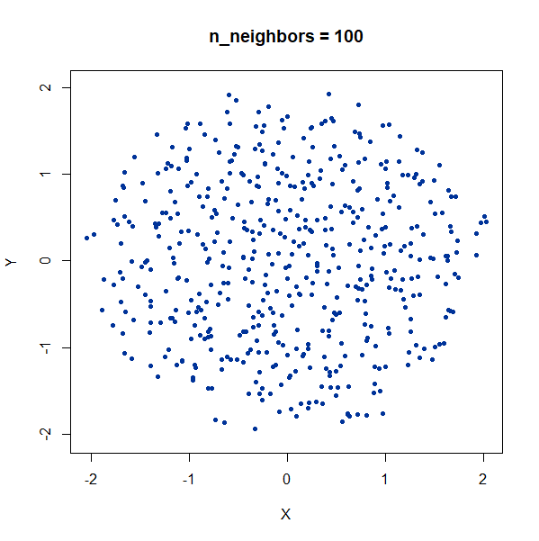
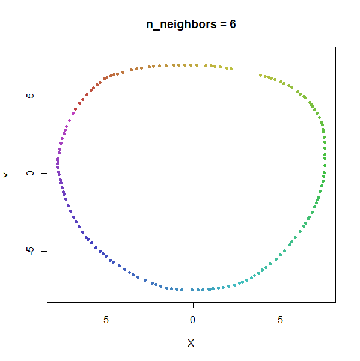

# UMAP on some simple datasets

The distill publication [How to Use t-SNE
Effectively](https://distill.pub/2016/misread-tsne/) provides some
interactive examples of t-SNE on a variety of simple datasets and
demonstrates the effect of changing its hyperparameters, mainly the
perplexity, which acts like a continuous version of the `n_neighbors`
parameter in UMAP.

Below, I will repeat some results using UMAP instead of t-SNE, which
might highlight some differences between the two methods. Sadly, there
won’t be any fancy in-browser interactive demos.

The datasets used in the distill publication are available translated to
R in the [snedata](https://github.com/jlmelville/snedata) package.

UMAP results are all run with the `n_neighbors` parameter set to match
the `perplexity` used in t-SNE all other parameters left at their
default values. There are two minor exceptions: in UMAP, a point is a
neighbor of itself, which isn’t the case with perplexity. This doesn’t
make much difference for large perplexities, but for the low perplexity
values of 2 and 5, I use `n_neighbors = 3` and `n_neighbors = 6`,
respectively.

I won’t repeat the t-SNE results here. You should refer back to the
distill page to compare. I have kept the same order of datasets and used
the same colors so it should be straightforward to keep things tracked.

## Grid

A 2D grid with regularly spaced points.

``` r
grid2d <- snedata::grid_data(n = 20)
```


Like t-SNE, UMAP tends to expand denser regions of data, so there is a
bigger gap between points in the middle of the grid.

## 2 Clusters

Two 2D Gaussian clusters of equal variance, and 50 points each.

``` r
gauss2d <- snedata::two_clusters_data(n = 50, dim = 2)
```

|                                                  |                                                  |                                                    |
|:------------------------------------------------:|:------------------------------------------------:|:--------------------------------------------------:|
|      |    |      |
|  |  |  |

Setting `n_neighbors` too low clearly gives results which are too local.

## Cluster Densities

In this example, one of the clusters (the yellow one) is much denser
(and hence smaller) than the other.

``` r
gauss2d_scale <- snedata::two_different_clusters_data(n = 75, scale = 10, dim = 2)
```

|                                                          |                                                          |                                                            |
|:--------------------------------------------------------:|:--------------------------------------------------------:|:----------------------------------------------------------:|
|      |    |      |
|  |  |  |

Again like t-SNE, UMAP does not reproduce the relative cluster
densities.

## Cluster Size

``` r
x100a <- snedata::gaussian_data(n = 100, dim = 50, color = "blue")
x1000b <- snedata::gaussian_data(n = 1000, dim = 50, color = "orange")
x1000b[, 1:50] <- x1000b[, 1:50] <- x1000b[, 1:50] + 10
x200 <- rbind(x100a, x100b)
x1100 <- rbind(x100a, x1000b)
```

As an aside, what about two clusters with the same density but different
numbers of points? Below is an example with two clusters with equal
sizes (100 points each), and then where the orange cluster contains 1000
points:

|                                                            |                                                              |
|:----------------------------------------------------------:|:------------------------------------------------------------:|
|  |  |

From this example you can see that UMAP will display clusters with more
members as being larger. This can have implications for the
visualization if you have a minority class that you are most interested
in.

## Distances Between Clusters

In this example, we are back to gaussians with the same variances, but
now one of them (the green one) is much further away than the other two.

``` r
gauss_3clusters <- snedata::three_clusters_data(n = 50, dim = 2)
```

|                                                |                                                |                                                  |
|:----------------------------------------------:|:----------------------------------------------:|:------------------------------------------------:|
|      |    |      |
|  |  |  |

There’s not really any value of `n_neighbors` where the correct relative
distances are reproduced. On the other hand, at least we don’t see any
strange distortion of the size of the green cluster at high values for
`n_neighbors`, where as the t-SNE results start showing distortions at
high perplexity.

We then repeat with a larger number of points in each cluster:

``` r
gauss_3clusters200 <- snedata::three_clusters_data(n = 200, dim = 2)
```

|                                                        |                                                        |                                                          |
|:------------------------------------------------------:|:------------------------------------------------------:|:--------------------------------------------------------:|
|      |    |      |
|  |  |  |

Results are very consistent with a sensible value of `n_neighbors`, but
it’s clear that UMAP does not reproduce relative distances in this case.

## Random Noise

A single high-dimensional Guassian:

``` r
gauss100d <- snedata::gaussian_data(n = 500, dim = 100, color = "#003399")
```

|                                                    |                                                    |                                                      |
|:--------------------------------------------------:|:--------------------------------------------------:|:----------------------------------------------------:|
|      |    |      |
|  |  |  |

Again, we see t-SNE-like behavior: the density of points in the
projection is more even than the linear projection provided by PCA. It’s
also clear that low values of `n_neighbors` could mislead you into
seeing large numbers of small clusters that aren’t really there.

## Elongated Shapes

An ellipsoidal cluster:

``` r
gauss_long <- snedata::long_gaussian_data(n = 100, dim = 50, color = "#003399")
```

|                                                        |                                                        |                                                          |
|:------------------------------------------------------:|:------------------------------------------------------:|:--------------------------------------------------------:|
|      |    |      |
|  |  |  |

Once again, UMAP behaves pretty well here as long as `n_neighbors` is
sufficiently high.

Now, here are two ellipsoidal clusters:

``` r
gauss_2long <- snedata::long_cluster_data(n = 75)
```

|                                                          |                                                          |                                                            |
|:--------------------------------------------------------:|:--------------------------------------------------------:|:----------------------------------------------------------:|
|      |    |      |
|  |  |  |

The density distortion effect is also apparent here, causing the
clusters to curve.

## Topology

### Containment

In this dataset, there are two 50D gaussian clusters, centered over the
same location, but as the PCA plot on the top left row shows, the blue
cluster has a much smaller variance and so is “contained” inside the
yellow cluster.

``` r
subset50d <- snedata::subset_clusters_data(n = 75, dim = 50)
```

|                                                |                                                |                                                  |
|:----------------------------------------------:|:----------------------------------------------:|:------------------------------------------------:|
|      |    |      |
|  |  |  |

At last a difference with the t-SNE results. With t-SNE, the containment
relationship can be displayed with a suitable choice of perplexity, at
the cost of the yellow cluster gaining a more ring-like shape. UMAP,
however, stubbornly refuses to show anything of the sort, with the blue
cluster expanded to overlap the yellow cluster even at the higher values
of `n_neighbors`.

### Linked Rings

2D linked rings, embedding into 3D (one is at right angles to the
other).

``` r
linked_rings <- snedata::link_data(n = 100)
```

|                                            |                                            |                                              |
|:------------------------------------------:|:------------------------------------------:|:--------------------------------------------:|
|      |    |      |
|  |  |  |

The t-SNE results show the rings between separate at low perplexity, and
only linked at high perplexities. The UMAP results are always unlinked
except at a very low value of `n_neighbors`, and even then this seems to
be an artifact of the number of epochs and the random seed. If you set
`n_epochs` higher, then the rings will be invariably unlinked.

### Trefoil Knot

``` r
trefoil <- snedata::trefoil_data(n = 150)
```

|                                                  |                                                  |                                                    |
|:------------------------------------------------:|:------------------------------------------------:|:--------------------------------------------------:|
|      |    |      |
|  |  |  |

Results here are quite similar to the t-SNE results. At low values of
`n_neighbors`, the knot is unfolded into a circle, and at higher values,
the folded form appears. As with the linked rings, the results you get
at low values of `n_neighbors` are more consistent at higher values of
`n_epochs`.

What are we to make of all this? Mainly, that the UMAP results are a bit
more consistent than that of t-SNE, in the sense that changing
`n_neighbors` doesn’t lead to very different results in the way that
changing `perplexity` does for t-SNE, although these effects are mainly
restricted to the three cluster and the containment example. You may see
this as an advantage to t-SNE. Personally, I am a bit skeptical that you
would see this sort of thing in real world datasets.

It’s also worth noting that, like t-SNE:

- Inter-cluster distances are not reproduced.
- Relative cluster sizes are not reproduced.
- Denser regions of space are expanded more than less dense parts.
