This is part of the documentation for [UWOT](https://github.com/jlmelville/uwot).

The default initialization for UMAP uses the eigenvectors of a normalized graph
Laplacian of the sparse affinity matrix. This normally works well except when:

* The graph has disconnected components, in which case you really have multiple
separate graphs. In `uwot`, there is a risk that the 
[RSpectra](https://cran.r-project.org/package=RSpectra) can have trouble 
converging under these circumstances.
* Even with a connected graph, there can sometimes be convergence issues, which
I have tried to mitigate. However, there is a still a risk of a very long
initialization, and possibly a hang. Unfortunately, interrupting RSpectra can
result in requiring the entire R session to be lost.

An alternative to using the spectral initialization is to use PCA, although
depending on the scaling of your input variables, this could lead to a quite
spread-out initial set of coordinates, which can be hard to optimize. For the
related technique t-SNE, 
[Kobak and Berens](https://www.biorxiv.org/content/10.1101/453449v1) recommend
scaling the PCA results so that the standard deviation for each dimension is
`1e-4`. You can get that behavior in `uwot` by using `init = "spca"`.

You don't need to worry about disconnected components when attempting to 
use spectral initialization: if `uwot` detects more than one component in the
affinity graph, it will fall back to using the `"spca"` initialization 
automatically. 

However, using PCA ignores the information in the affinity matrix that might
be useful for initialization: for example, when using supervised UMAP or mixing
different types of distance metrics. And conceptually, using the affinity 
matrix has a lot of appeal. Dzwinel and co-workers describe a very fast 
multi-dimensional scaling-like method
called [ivhd](https://arxiv.org/abs/1902.01108) which generates a connected 
graph, by only knowing only a few neighbor and non-neighbor points and
pretending the target distances are 0 and 1, respectively. Similar theoretical
support for this is given by 
[Linderman and co-workers](https://arxiv.org/abs/1711.04712). On the basis of
this work, I have implemented an "approximate global" spectral method of 
initialization: which is a very minor modification of the standard spectral
initialization:

* All non-zero elements of the affinity matrix are set to 1.
* A random number of the zero elements are set to 0.1, at a rate of
`n_neg_samples` for each positive edge in the graph. This is consistent with the
ratio of neighbor to non-neighbor edge sampling during optimization and, if
using a default value of `n_neg_samples`, is a similar order of magnitude as the
ratio of neighbor to non-neighbor entries in the graph that is used with ivhd.
* Theoretically, this should be enough to guarantee a graph with a single
component. The spectral initialization is carried out.
* After initialization, the original affinity matrix is used for optimization.

You can get this behavior in uwot with `init = "agspectral"`.

Another option for a connected graph is to use a variation on the normalization used in the graph
Laplacian to get something close to 
[Laplacian Eigenmap](https://doi.org/10.1162/089976603321780317)
with `init = "laplacian"`. In 
[Luxburg's spectral clustering tutorial (PDF)](http://www.kyb.mpg.de/fileadmin/user_upload/files/publications/attachments/luxburg06_TR_v2_4139%5b1%5d.pdf)
this form of normalization is recommended over that used in the `init = "spectral"`
normalization.

If all else fails, you can use random initialization. In the spirit of 
generosity, `uwot` offers two types of random initialization. The first is that
used by UMAP, which uses a random uniform distribution between -10 and +10 along
each axis. You can get this with `init = "rand"`. Alternatively, there is the
method favoured by LargeVis (and used by default with `lvish`), which is to use
a Gaussian distribution with standard deviation 1e-4. This is also the method 
used by t-SNE. You can get this by setting `init = "lvrand"`.

To summarize your options:

```R
# Default initialization: use spectral initialization if possible
# falling back to scaled PCA if multiple components are found in the graph
embedding <- umap(data)

# same as the above
embedding <- umap(data, init = "spectral")

# use scaled PCA
embedding <- umap(data, init = "spca")

# use an "approximate global" spectral initialization that should be applicable
# even under conditions where "spectral" fails and has to use spca
embedding <- umap(data, init = "agspectral")

# use a Laplacian Eigenmap style initialization, which will also fall back to
# spca if it has to
embedding <- umap(data, init = "laplacian")

# use random initialization, UMAP style
embedding <- umap(data, init = "rand")
# use random initialization, t-SNE/LargeVis style
embedding <- umap(data, init = "lvrand")
```

Below, we'll explore the effect of these settings. For more details on the
datasets, see the 
[examples](https://jlmelville.github.io/uwot/umap-examples.html) page.

Apart from changing `init`, mainly default settings where used, except using
`pca = 100`, which is necessary with high dimensional datasets for the
Annoy-based nearest neighbor search to complete in a reasonable time. An 
exemplary command using the `iris` dataset and `"agspectral"` initialization:

```R
set.seed(1337)
iris_umap <- umap(iris, pca = 100, init = "agspectral")
```

## Spectral vs SPCA

Below are some examples of using either the scaled PCA initialization or
a spectral approach. On the first row, the left-hand image is the result of 
using `init = "spca"`, and the right-hand image is `init = "agspectral"`. On
the second row, the left-hand image is for `init = "spectral"`.
and the right-hand image is `init = "laplacian"`. Some datasets don't have the
second row of images, because with the settings used here, they generate more
than one component in the graph, and therefore both `init = "spectral"` and
`init = "laplacian"` would fall back to the same results as seen with 
`init = "spca"`.

### iris

|                             |                           |
:----------------------------:|:--------------------------:
|

### s1k

|                             |                           |
:----------------------------:|:--------------------------:
|
|

### oli

|                             |                           |
:----------------------------:|:--------------------------:
|
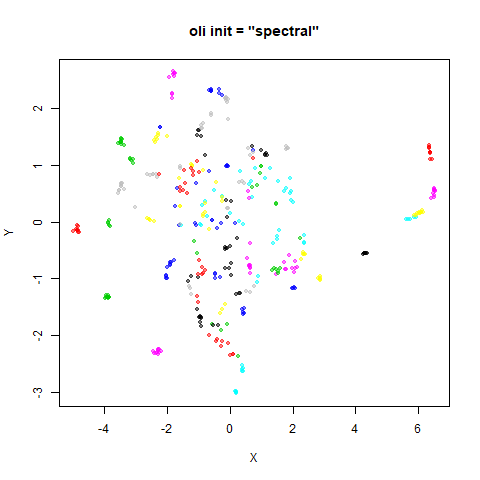|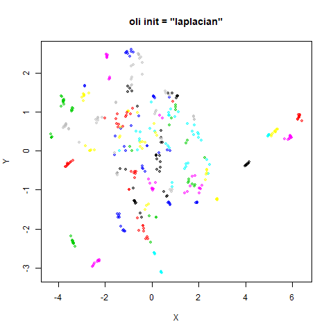

### frey

|                             |                           |
:----------------------------:|:--------------------------:
|
|

### coil20

|                             |                           |
:----------------------------:|:--------------------------:
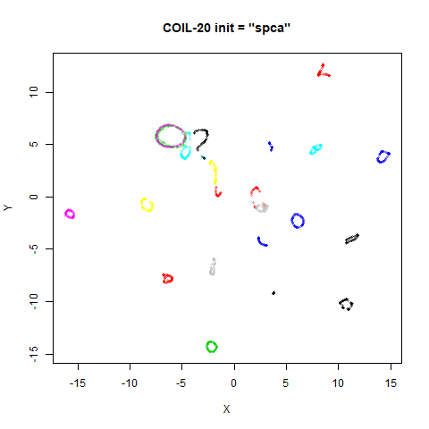|

### coil100

|                             |                           |
:----------------------------:|:--------------------------:
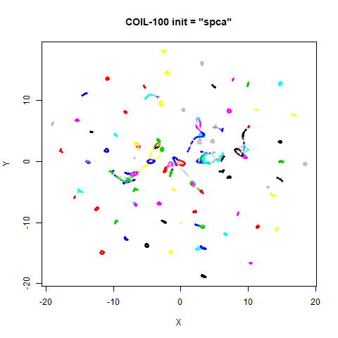|

### mnist

|                             |                           |
:----------------------------:|:--------------------------:
|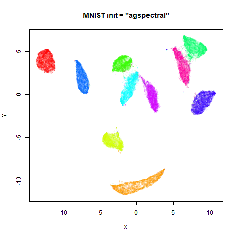
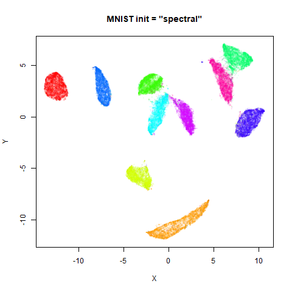|

### fashion

|                             |                           |
:----------------------------:|:--------------------------:
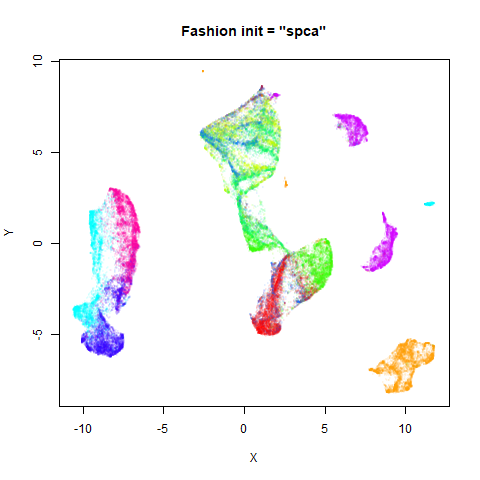|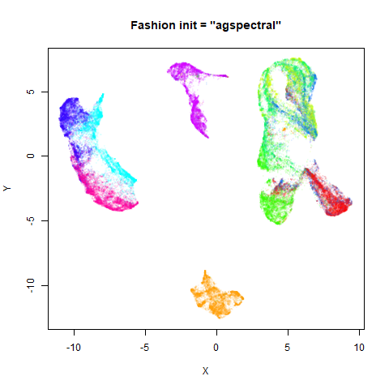
|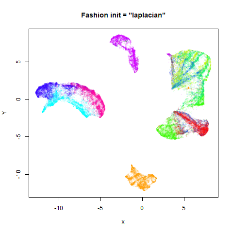

### kuzushiji

|                             |                           |
:----------------------------:|:--------------------------:
|
|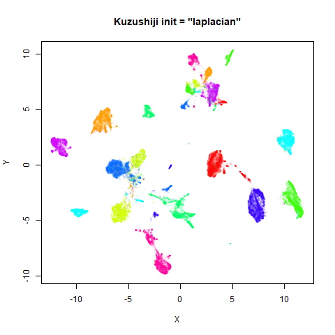

### norb

|                             |                           |
:----------------------------:|:--------------------------:
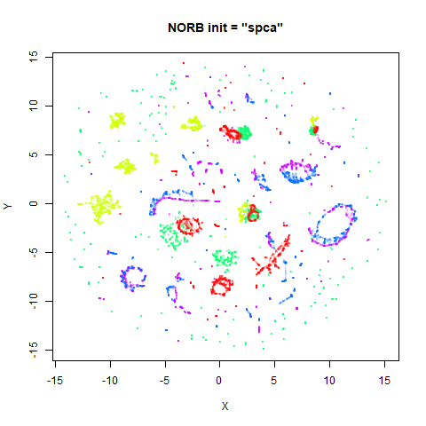|

### tasic2018

|                             |                           |
:----------------------------:|:--------------------------:
|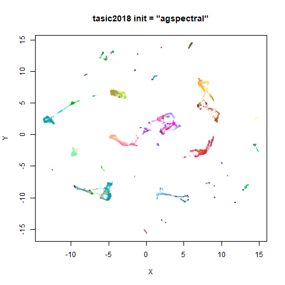

### macosko2015

|                             |                           |
:----------------------------:|:--------------------------:
|
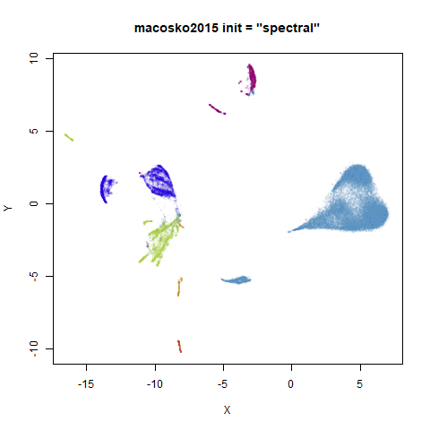|

## SPCA init_sdev

As mentioned earlier, the `init = "spca"` settings scales the PCA initialization
to have a standard deviation of `1e-4`, as recommended by Kobak and Berens. This
value is taken from the t-SNE initialization, so if it seems arbitrary, at least
it has a history of being quite successful on its side. But for MNIST, one of
the clusters has been broken up, and this wasn't seen with the spectral
initialization. I repeated the embedding with a different seed (results not
shown) and again saw a split cluster, so probably this wasn't due to bad luck
with the random number generator.

Could the standard deviation of the input be to blame? Although this setting
works well with t-SNE, the normalization involved in that method may mean that
the sort of gradients seen at those distances are quite different from those
used with UMAP. To test this, below are results using a larger standard
deviation. Results on the left use:

```R
iris_umap <- umap(iris, init = "spca", init_sdev = 0.01)
```

and those on the right:

```R
iris_umap <- umap(iris, init = "spca", init_sdev = 1)
```

### iris

|                             |                           |
:----------------------------:|:--------------------------:
|

### s1k

|                             |                           |
:----------------------------:|:--------------------------:
|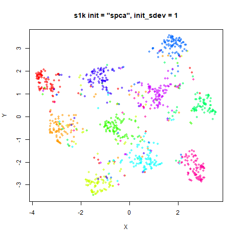

### oli

|                             |                           |
:----------------------------:|:--------------------------:
|

### frey

|                             |                           |
:----------------------------:|:--------------------------:
|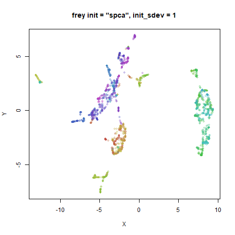

### coil20

|                             |                           |
:----------------------------:|:--------------------------:
|

### coil100

|                             |                           |
:----------------------------:|:--------------------------:
|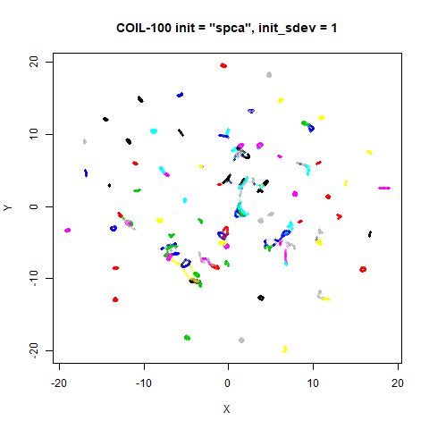

### mnist

|                             |                           |
:----------------------------:|:--------------------------:
|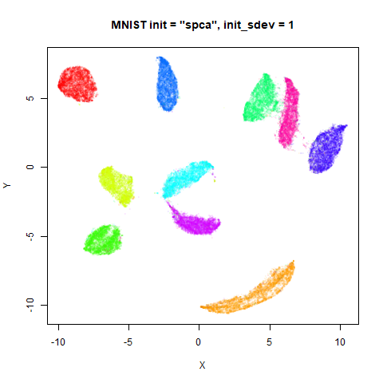

### fashion

|                             |                           |
:----------------------------:|:--------------------------:
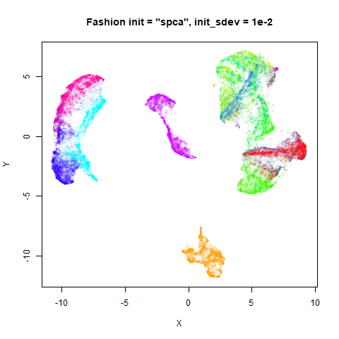|

### kuzushiji

|                             |                           |
:----------------------------:|:--------------------------:
|

### norb

|                             |                           |
:----------------------------:|:--------------------------:
|

### tasic2018

|                             |                           |
:----------------------------:|:--------------------------:
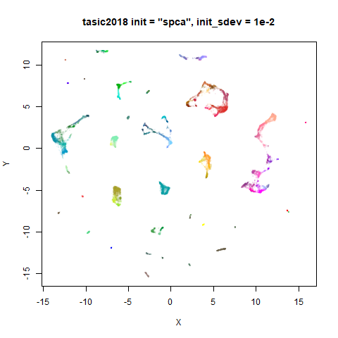|

### macosko2015

|                             |                           |
:----------------------------:|:--------------------------:
|

Results are much better with a larger value for `init_sdev`. As the typical 
standard deviation of a spectral initialization for these datasets is in the 
range of 1-5, using `init_sdev = 1`, seems like a good place to start. 

## Random Initialization: `rand`

Below are two results each from using random initialization, so you can get
a sense for how much variation you can expect from getting lucky or not with
the initialization. 

```R
# left-hand plots used this seed
set.seed(1337)
# right-hand plots used this seed
# set.seed(42)
iris_umap <- umap(iris, init = "rand")
```

### iris

|                             |                           |
:----------------------------:|:--------------------------:
|

### s1k

|                             |                           |
:----------------------------:|:--------------------------:
|

### oli

|                             |                           |
:----------------------------:|:--------------------------:
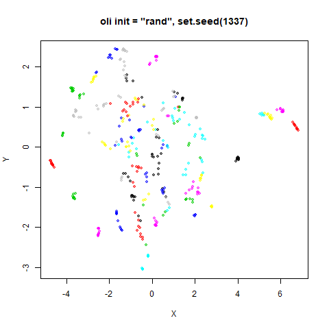|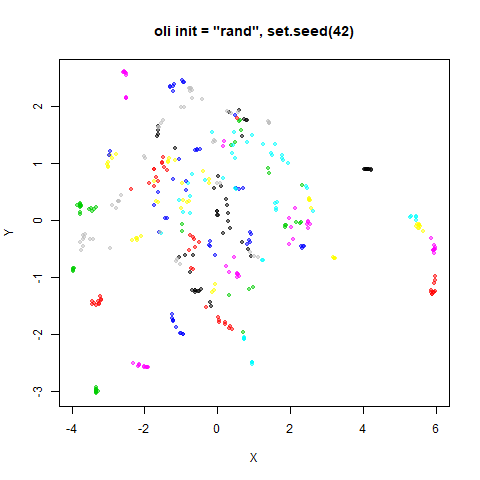

### frey

|                             |                           |
:----------------------------:|:--------------------------:
|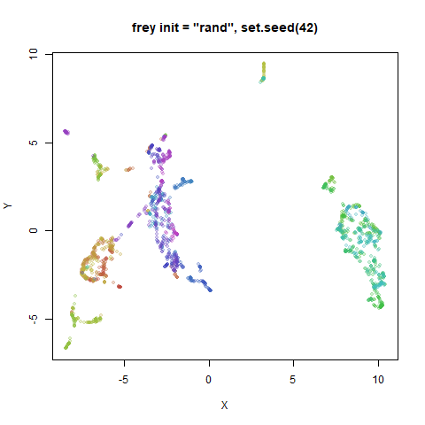

### coil20

|                             |                           |
:----------------------------:|:--------------------------:
|

### coil100

|                             |                           |
:----------------------------:|:--------------------------:
|

### mnist

|                             |                           |
:----------------------------:|:--------------------------:
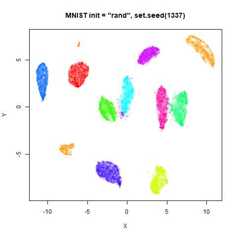|

### fashion

|                             |                           |
:----------------------------:|:--------------------------:
|

### kuzushiji

|                             |                           |
:----------------------------:|:--------------------------:
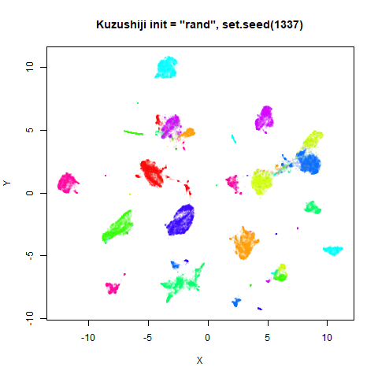|

### norb

|                             |                           |
:----------------------------:|:--------------------------:
|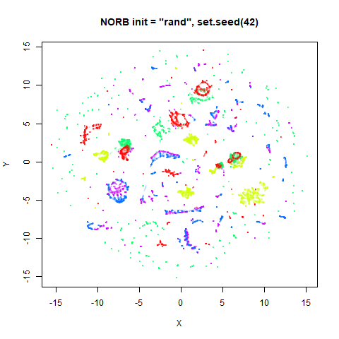

### tasic2018

|                             |                           |
:----------------------------:|:--------------------------:
|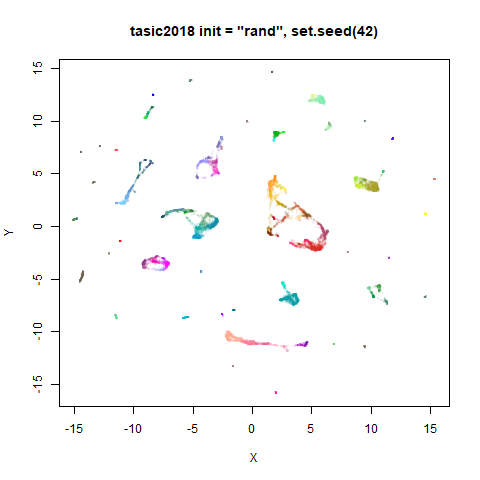

### macosko2015

|                             |                           |
:----------------------------:|:--------------------------:
|

Broken-up clusters are again observed, although the prevalence is increased.
I tried repeating these embeddings with `init_sdev = 1`, but that didn't help.

## Random Initialization: `lvrand`

And here is the result of using random initialization in the t-SNE/LargeVis
style, which use a Gaussian distribution over a much smaller initial range of
coordinate values. Will it make much difference?

```R
# left-hand plots used this seed
set.seed(1337)
# right-hand plots used this seed
# set.seed(42)
iris_umap <- umap(iris, init = "lvrand")
```

### iris

|                             |                           |
:----------------------------:|:--------------------------:
|

### s1k

|                             |                           |
:----------------------------:|:--------------------------:
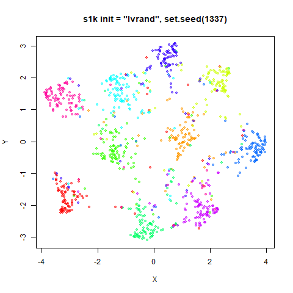|

### oli

|                             |                           |
:----------------------------:|:--------------------------:
|

### frey

|                             |                           |
:----------------------------:|:--------------------------:
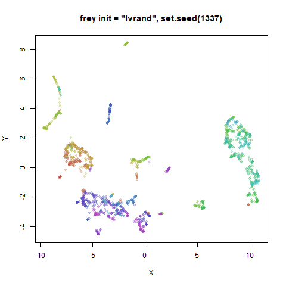|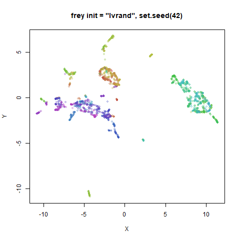

### coil20

|                             |                           |
:----------------------------:|:--------------------------:
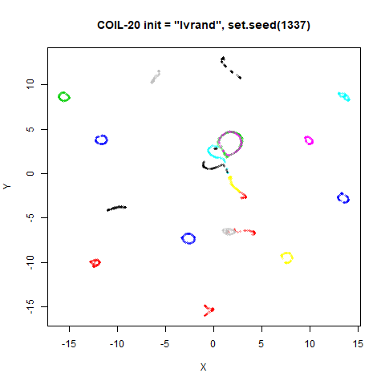|

### coil100

|                             |                           |
:----------------------------:|:--------------------------:
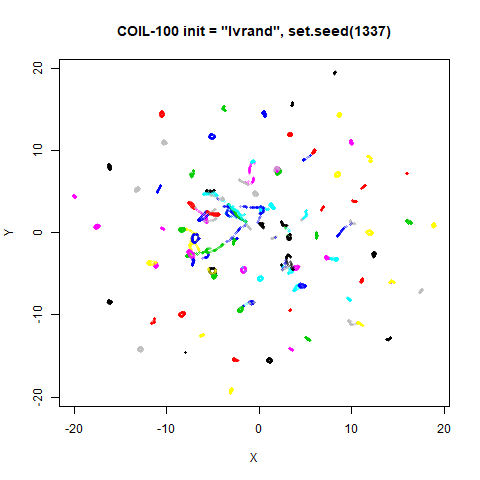|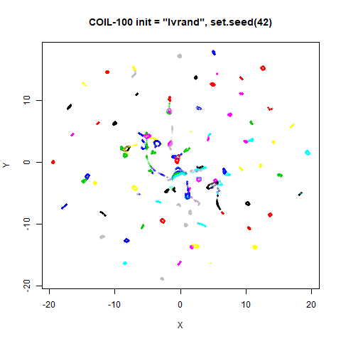

### mnist

|                             |                           |
:----------------------------:|:--------------------------:
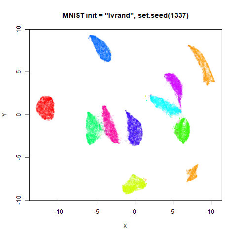|

### fashion

|                             |                           |
:----------------------------:|:--------------------------:
|

### kuzushiji

|                             |                           |
:----------------------------:|:--------------------------:
|

### norb

|                             |                           |
:----------------------------:|:--------------------------:
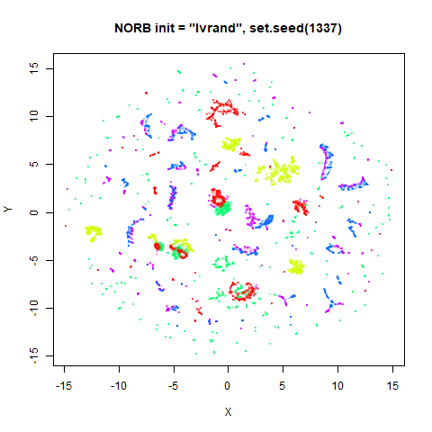|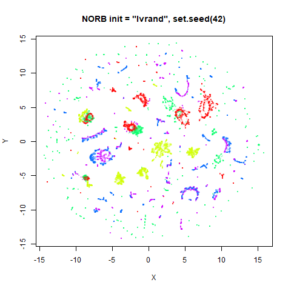

### tasic2018

|                             |                           |
:----------------------------:|:--------------------------:
|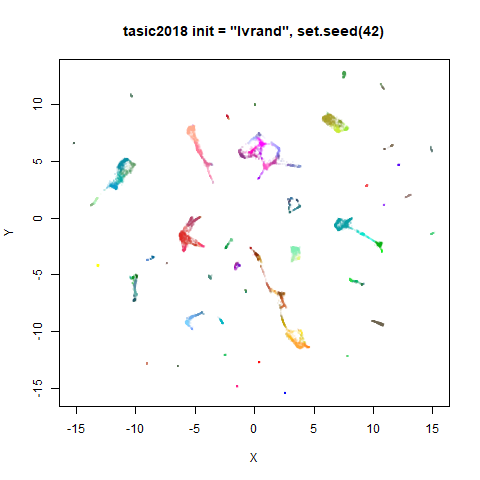

### macosko2015

|                             |                           |
:----------------------------:|:--------------------------:
|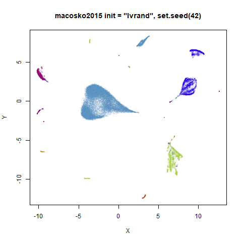

No, it doesn't make a huge difference. MNIST still has an issue with split
clusters. And increasing the `init_sdev` value doesn't really help. What did
help was increasing the `n_neighbors` parameter. With `n_neighbors = 150`, the
MNIST clusters were correctly reconstituted.

## Recommendations

The default spectral initialization does a good job, and the fallback to scaled
PCA is also fine, as long as you set the `init_sdev = 1`. From `uwot` version
0.0.0.9010, these are the default initialization settings.

As far as I can see, the `init = "agspectral"` settings also work well. There's
not much difference between them and the `init = "spectral"` results when
spectral initialization succeeds, and it has the added advantage that it 
shouldn't ever have to fall back to the scaled PCA approach. That means it might
give a more relevant initialization than PCA (e.g. with supervised UMAP). The
Laplacian Eigenmap initialization gives results that are very similar to the
spectral initialization. If spectral initialization is causing problems (e.g.
suffering from numeric issues that cause it to take too long), I would probably
look at the `agspectral` settings before Laplacian Eigenmaps, as it is more 
likely to converge easily and it doesn't need a single-component graph to work. 
That said, the `agspectral` approach is entirely my own invention, whereas a
Laplacian Eigenmaps is a published technique, so you may have more confidence in
the latter (I don't blame you).

The random initializations are probably the least good choice. With default
settings, you run a sizable risk of splitting up clusters. This can be 
ameliorated by increasing the `n_neighbors` parameter, but this increases the
run time and other methods don't seem as sensitive to these issues.
