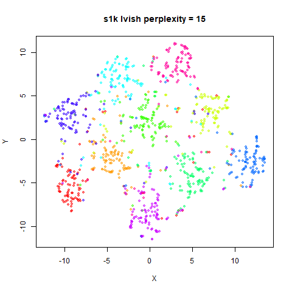
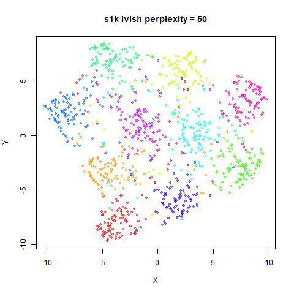
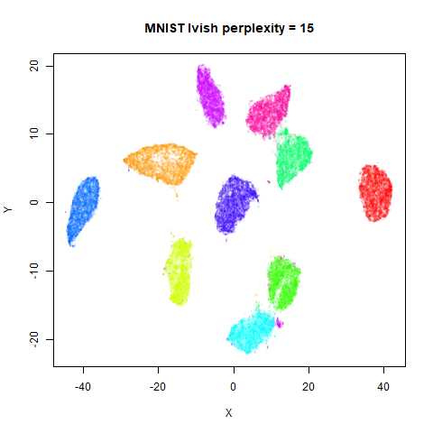
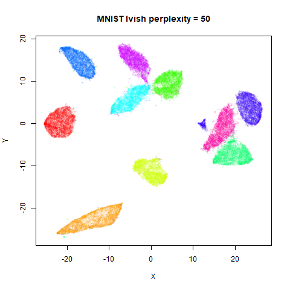
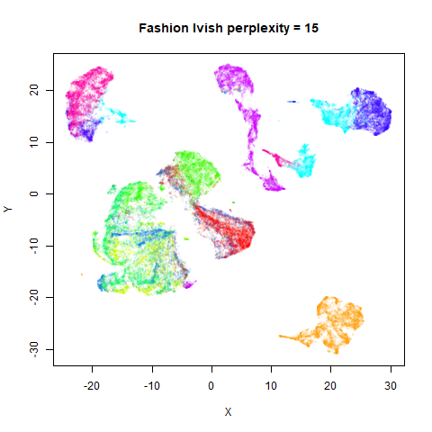
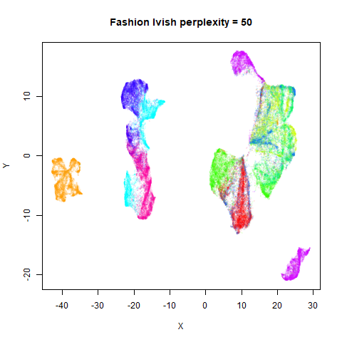
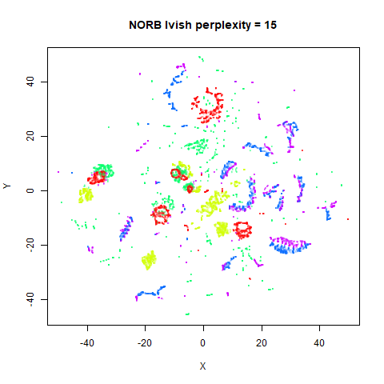
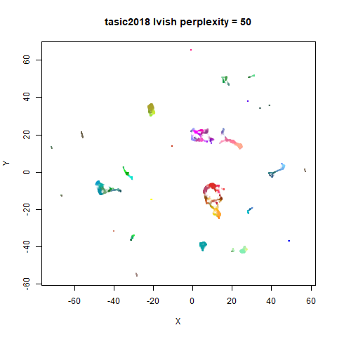
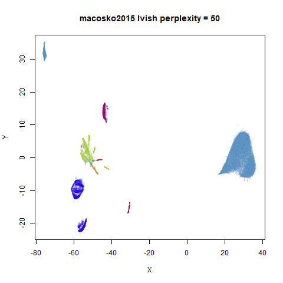

This is part of the documentation for [uwot](https://github.com/jlmelville/uwot).

This page is a gallery of images of the result of running the `lvish` function
on some datasets. For all intents and purposes, it should perform very similarly
to the [LargeVis](https://arxiv.org/abs/1602.00370) method (see also its 
[github](https://github.com/lferry007/LargeVis)).

For details on the datasets, and to compare with the output of UMAP and t-SNE,
see the 
[UMAP examples gallery](https://jlmelville.github.io/uwot/umap-examples.html).

There are two images per dataset. The left-hand image uses a perplexity of 15,
which is similar to the sort of settings UMAP uses. The right-hand image is
for a perplexity of 50, which is the LargeVis default.

The only other non-default settings was to use `pca = 100`, which reduces
the input dimensionality to 100.

```R
iris_lv15 <- lvish(iris, pca = 100, perplexity = 15)
iris_lv50 <- lvish(iris, pca = 100, perplexity = 50)
```

Note that by default `lvish` uses a random initialization and a much larger 
number of epochs to match the LargeVis defaults. This makes the optimization
take a lot longer than UMAP. LargeVis uses multiple threads during the 
optimization phase, but `lvish` does not, to ensure reproducibility of results
with a fixed random seed. To get multi-threaded performance like LargeVis, add
the option, `n_sgd_threads = "auto"`, e.g.:

```R
iris_lv15 <- lvish(iris, pca = 100, perplexity = 15, n_sgd_threads = "auto")
```

I would also suggest that you fix the number of epochs to a smaller value 
initially and see if that provides an adequate visualization.

```R
iris_lv15 <- lvish(iris, pca = 100, perplexity = 15, n_sgd_threads = "auto", n_epochs = 500)
```

### iris

|                             |                           |
:----------------------------:|:--------------------------:
|

### s1k

|                             |                           |
:----------------------------:|:--------------------------:
|

### oli

|                             |                           |
:----------------------------:|:--------------------------:
|

### frey

|                             |                           |
:----------------------------:|:--------------------------:
|

### coil20

|                             |                           |
:----------------------------:|:--------------------------:
|

### coil100

|                             |                           |
:----------------------------:|:--------------------------:
|

### mnist

|                             |                           |
:----------------------------:|:--------------------------:
|

### fashion

|                             |                           |
:----------------------------:|:--------------------------:
|

### kuzushiji

|                             |                           |
:----------------------------:|:--------------------------:
|

### norb

|                             |                           |
:----------------------------:|:--------------------------:
|

### tasic2018

|                             |                           |
:----------------------------:|:--------------------------:
|

### macosko2015

|                             |                           |
:----------------------------:|:--------------------------:
|

Default initialization in `lvish`, as with LargeVis and t-SNE, is from a
random distribution. As with t-SNE, you can see one issue with that is that
sometimes clusters get split up by another cluster and are unable to re-merge.
MNIST is the easiest example image to see this in.

In general, there's not a huge difference in the effect of increasing
perplexity, for larger datasets. For smaller datasets it's apparent that the
resulting clusters tend to be more spread out with larger perplexity values. The
`norb` ([small NORB](https://cs.nyu.edu/~ylclab/data/norb-v1.0-small/)) dataset 
shows an obvious difference, where the `perplexity = 15` results are clearly too
low, and break up the structures that are apparent at `perplexity = 50`. A
similar effect is seen when using UMAP, so I don't think this is due to the
random initialization of `lvish` in this case. A contributing factor is likely
to be that the initial PCA dimensionality reduction to 100 dimensions is too
aggressive for NORB and reduces the nearest neighbor accuracy, which is 
recovered at higher perplexities (as this requires finding more near neighbors).

On the other hand, it's hard to see what's going on with the `coil20` and
especially the `coil100` results. If you *could* see what was going on from the
static images above, it would be apparent that, in contrast to the `norb`
results, the `perplexity = 50` results are too high here, and the loop structure
of the clusters gets broken up.

The `coil100` and `coil20` results show an issue with using LargeVis (and UMAP)
that isn't normally a problem with t-SNE: the extra repulsion in their cost
function can often spread the data quite far apart compared to the cluster 
sizes. t-SNE has the opposite problem of the clusters expanding into a large
circular form which makes discerning clusters harder as the datasets get larger,
but in a single static plot, I find the t-SNE results to be easier to examine.
For UMAP and `lvish`, you may have to resort to more interactive means of
examining the data, such as using the `embed_plotly` function in 
[vizier](https://github.com/jlmelville/vizier).

An alternative for `lvish` is to modify the `repulsion_strength` parameter 
(referred to as `gamma` in LargeVis). The default value, `7` is taken from the
LargeVis paper but seems to have been chosen empiricially. Here are results
for `coil20` and `perplexity = 50` with the repulsion reduced to 
`repulsion_strength = 0.7` in the left image, and `repulsion_strength = 0.07` 
on the right:

|                             |                           |
:----------------------------:|:--------------------------:
|

This helps a bit, but there are limits: the blue cluster on the right remains
an outlier, and reducing the `repulsion_strength` too far causes some of the 
loops to shrink, as can be seen with the outlying blue and black clusters for
the right-hand plot.
