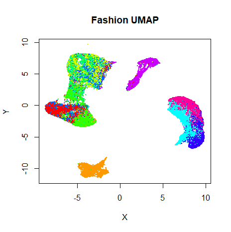
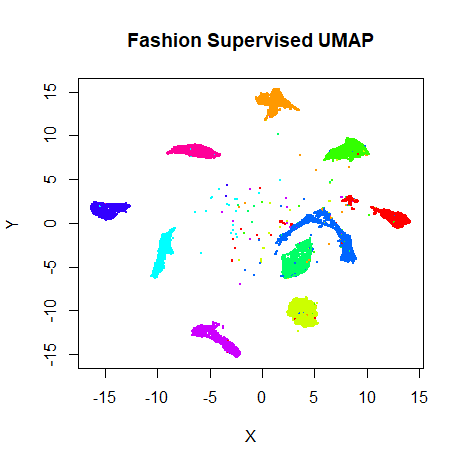
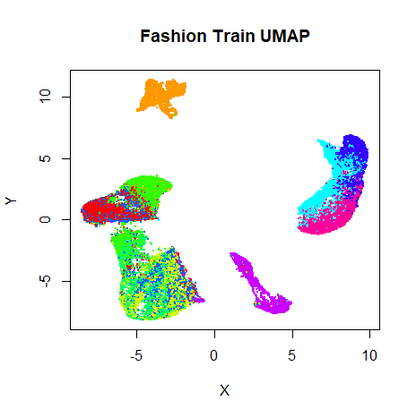
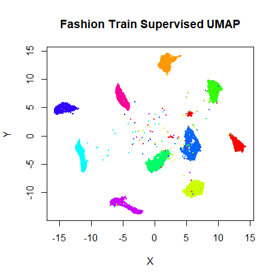
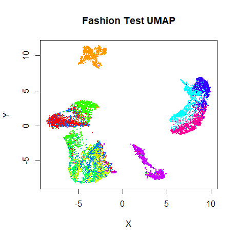
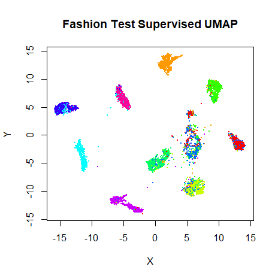

This is part of the documentation of [uwot](https://github.com/jlmelville/uwot).

Among other things, UMAP provides two interesting extensions to its basic
dimensionality reduction. First, it can do a supervised embedding, where 
labels (or numeric values) are leveraged so that similar points are closer
together than they would otherwise be. Second, it can do metric learning, by
embedding out-of-sample points based on an existing embedding. 

This document shows how to do it in `uwot`, but more information is
available in UMAP's 
[documentation](https://umap-learn.readthedocs.io/en/latest/supervised.html).

The example dataset used is 
[Fashion MNIST](https://github.com/zalandoresearch/fashion-mnist). One way
to download it in uwot-ready form is:

```R
devtools::install_github("jlmelville/snedata")
fashion <- snedata::download_fashion_mnist()
```

The Fashion MNIST dataset contains 70,000 images of fashion items, in one of ten
classes. A factor column, `Label` contains the id of each item (from `0` to `9`)
for backwards compatibility with the MNIST dataset, which Fashion MNIST is
designed to be a drop-in replacement for. A more descriptive, but entirely
equivalent, factor column, `Description` provides a short text string to
describe the classes, e.g. the `Description` `"Coat"` and the `Label` `4` are
equivalent.

## Supervised Learning

We'll compare the supervised result with a standard run of UMAP:

```R
set.seed(1337)
fashion_umap <- umap(fashion)
```

For supervised learning, provide a suitable vector of labels as the `y` argument
to `umap` (or `tumap`):

```R
set.seed(1337)
fashion_sumap <- umap(fashion, y = fashion$Description)
```

Let's take a look at the results, the unsupervised embedding on the left, and
the supervised version on the right:

|                             |                           |
:----------------------------:|:--------------------------:
|

Clearly, the supervised UMAP has done a much better job of separating out the
classes, although it has also retained the relative location of the clusters
pretty well, too.


## Metric Learning

It's also possible to use an existing embedding to embed new points. Fashion
MNIST comes with its own suggested split into training (the first 60,000
images) and test (the remaining 10,000 images) sets, so we'll use that:

```R
fashion_train <- head(fashion, 60000)
fashion_test <- tail(fashion, 10000)
```

Training proceeds by running UMAP normally, but we need to return more than just
the embedded coordinates. To return enough information to embed new data, we
need to set the `ret_model` flag when we run `umap`. This will return a list.
The embedded coordinates can be found as the `embedding` item. 

### Training

For training, we shall continue to use both standard UMAP:

```R
set.seed(1337)
fashion_umap_train <- umap(fashion_train, ret_model = TRUE)
```

and supervised UMAP:

```R
set.seed(1337)
fashion_sumap_train <- umap(fashion_train, y = fashion_train$Description, ret_model = TRUE)
```

These results shouldn't be that different from the full-dataset embeddings, but
let's take a look anyway:

|                             |                           |
:----------------------------:|:--------------------------:
|

Everything looks in order here. The standard UMAP training plot is flipped along
the y-axis compared to the full dataset, but that doesn't matter.

### Embedding New Data

To embed new data, use the `umap_transform` function. Pass the new data and the
trained UMAP model. There's no difference between using a standard UMAP model:

```R
set.seed(1337)
fashion_umap_test <- umap_transform(fashion_test, fashion_umap_train)
```

or a supervised UMAP model:

```R
set.seed(1337)
fashion_sumap_test <- umap_transform(fashion_test, fashion_sumap_train)
```

Here are the results:

|                             |                           |
:----------------------------:|:--------------------------:
|

The test data results are very obviously embedded in a similar way to the
training data. Of particular interest are the test results with the supervised
model, where the clusters stay well separated compared to the unsupervised 
results, although there are some misclassifications of shirts, t-shirts, coats
and pullover classes (the green, blue and red clusters on the right of the
supervised UMAP plot).
