This is part of the documentation for [UWOT](https://github.com/jlmelville/uwot).

Here are some examples of the output of `uwot`'s implementation of UMAP, 
compared to t-SNE output.

To generate the plots, I used the default settings for `uwot::umap` to generate
UMAP results. I then scaled the output so that the standard deviation for both
dimensions was 1e-4, and used that as input to t-SNE. This is the same as
that standard initialization for t-SNE, but not random. The other non-default
setting was to reduce the `perplexity` to `15`, to make it closer to the
`n_neighbors = 15` default used by UMAP.

The [Rtsne](https://cran.r-project.org/package=Rtsne) package was used for 
the t-SNE calculations, except for the `iris` dataset, because Rtsne doesn't
allow for duplicates. For `iris` only, I used the 
[smallvis](https://github.com/jlmelville/smallvis) package.

For visualization, I used the [vizier](https://github.com/jlmelville/vizier)
package. The plots are colored by class membership (there's an obvious choice
for every dataset considered), except for `frey`, where the points are colored
according to their position in the sequence of images.

Also, the mean 15-neighbor preservation is given as `np@15` on each plot,
calculated via the [quadra](https://github.com/jlmelville/quadra) package. This
is a number between 0 and 1 and is the fraction of the 15 nearest neighbors in
the original space that are preserved in the embedded space. The preservation is
calculated for each item in the dataset and the reported values is the mean over
all items. Nearest neighbors were calculated using the
[RcppAnnoy](https://cran.r-project.org/package=RcppAnnoy) package. I used UMAP's
internal `annoy_nn` function for this purpose. Compared with using exact nearest
neighbor results tested on smaller datasets, the effect of using approximate
nearest neighbors was negligible.

I also looked at initializing UMAP and t-SNE from PCA results 
(with two components), again scaled to a standard deviation of 1e-4. Neither
the visualizations nor the neighbor preservations change very much, so results
shown here should not be due to initialization.

Some sample commands are given below.

```R
iris_umap <- umap(iris)

squash <- function(x, sd = 1e-4) {
  scale(x, scale = apply(x, 2, stats::sd) / sd)
}

# For iris only
iris_tsne <- smallvis::smallvis(iris, Y_init = squash(iris_umap), perplexity = 15)

# For all other datasets
mnist_tsne <- Rtsne::Rtsne(as.matrix(mnist[, -785]), perplexity = 15, Y_init = squash(mnist_umap))

# Neighbor preservation values
kin <- annoy_nn(as.matrix(iris[, -5]), k = 15)$idx
kout <- annoy_nn(iris_umap, k = 15)$idx
mean(quadra::nbr_pres_knn(kin, kout, k = 15))
```

For more on the datasets, follow their links. Somewhat more detail is also given
in the [smallvis documentation](https://jlmelville.github.io/smallvis/datasets.htm).

## iris

The standard `iris` dataset, known and loved by all.

|                             |                           |
:----------------------------:|:--------------------------:
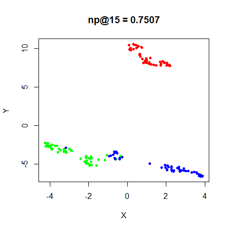|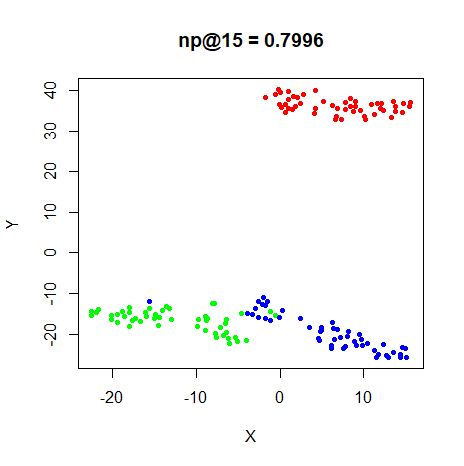

## s1k

A 9-dimensional fuzzy simplex, which I created for testing t-SNE and related
methods, original in the [sneer](https://github.com/jlmelville/sneer) package.

|                             |                           |
:----------------------------:|:--------------------------:
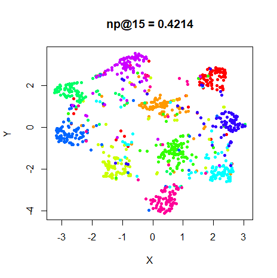|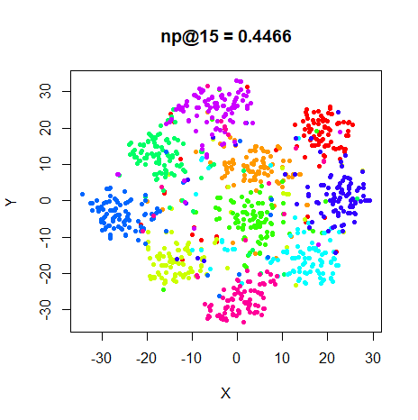

## oli

The [ORL database of faces](http://www.cl.cam.ac.uk/research/dtg/attarchive/facedatabase.html).

|                             |                           |
:----------------------------:|:--------------------------:
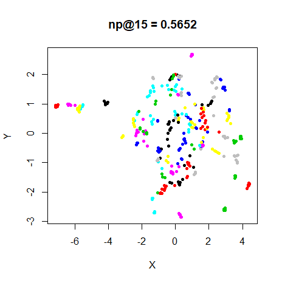|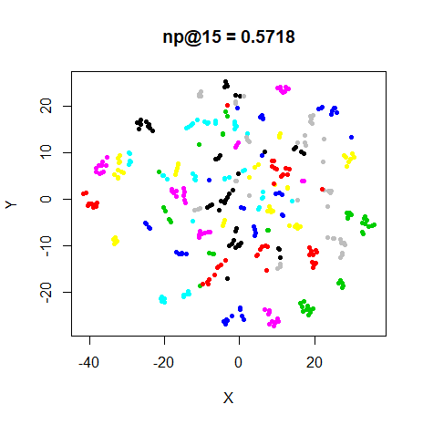

## frey

Images of Brendan Frey's face, as far as I know originating from a page belonging
to [Saul Roweis](https://cs.nyu.edu/~roweis/data.html).

|                             |                           |
:----------------------------:|:--------------------------:
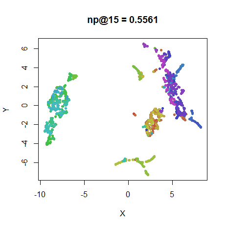|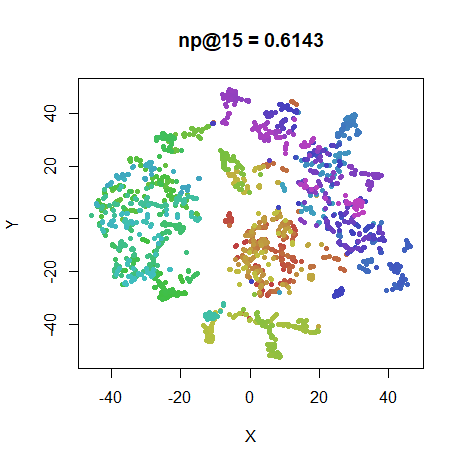

## coil20

The [Columbia Object Image Library](http://www.cs.columbia.edu/CAVE/software/softlib/coil-20.php).

|                             |                           |
:----------------------------:|:--------------------------:
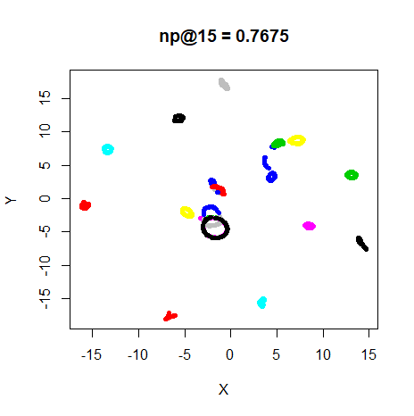|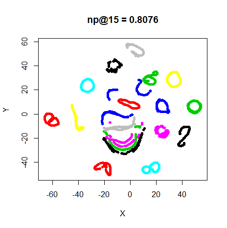

## mnist

The [MNIST database of handwritten digits](http://yann.lecun.com/exdb/mnist/).

|                             |                           |
:----------------------------:|:--------------------------:
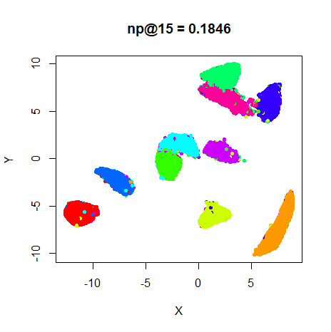|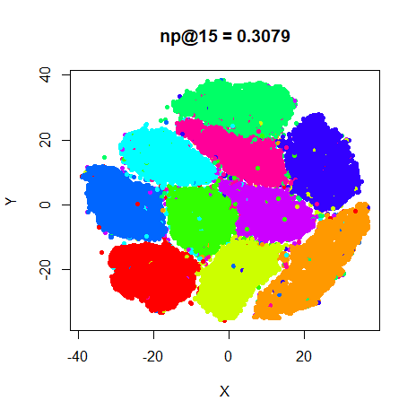

## fashion

The [Fashion MNIST database](https://github.com/zalandoresearch/fashion-mnist),
images of fashion objects.

|                             |                           |
:----------------------------:|:--------------------------:
|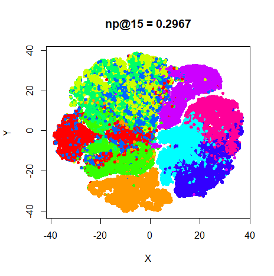

The more compact nature of UMAP's results compared to t-SNE is obvious for all
datasets. For some reason, t-SNE always did a better job of preserving the
15-nearest neighbor. The difference is largest for the two large datasets,
`mnist` and `fashion`. I make no claims to statistical or practical significant
differences, however.
