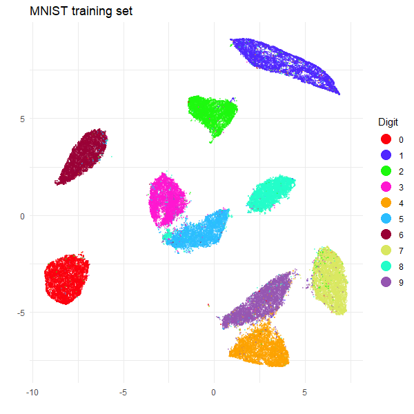
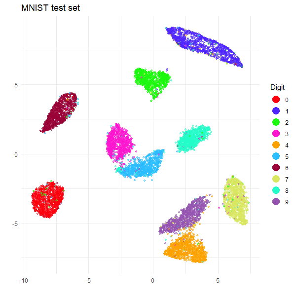

```{r, include = FALSE}
knitr::opts_chunk$set(
  collapse = TRUE,
  comment = "#>",
  eval = FALSE
)
```

# HNSW for nearest neighbors

The Hierachical Navigable Small World (HNSW) method for finding approximate
nearest neighbors is a popular due to its speed and good performance. A
header-only C++ implementation by the HNSW authors can be found at
[hnswlib](https://github.com/nmslib/hnswlib), and R-bindings are available in
the package [RcppHNSW](https://cran.r-project.org/package=RcppHNSW).

If you would like to use HNSW for nearest neighbor search, `uwot` now integrates
with `RcppHNSW` as an optional dependency. You just need to install the 
`RcppHNSW` package:

```{r install hnswlib}
install.packages("RcppHNSW")
```

`uwot` will now be able to use it if you set `nn_method = "hnsw"`, e.g.

```{r uwot hnsw}
library(uwot)
# doesn't use HNSW
iris_umap <- umap(iris)

# does use HNSW
iris_umap_hnsw <- umap(iris, nn_method = "hnsw")
```

## MNIST example

For a more involved example we'll use the MNIST digits data set for this 
article, for which you will need to install the `snedata` package from GitHub:

```{r install snedata}
# install.packages("pak")
pak::pkg_install("jlmelville/snedata")

# or
# install.packages("devtools")
# devtools::install_github("jlmelville/snedata")
```

Then, download the MNIST dataset (this requires access to the internet), and we
will split the data into the traditional training/test split used with this
dataset.

```{r load mnist}
mnist <- snedata::download_mnist()
mnist_train <- head(mnist, 60000)
mnist_test <- tail(mnist, 10000)
```

`mnist` is a dataframe where the first 768 columns contain the pixel data for
each image, and the last column is a factor `Label`, which contains the digit
the image represents. 

### UMAP on training data with HNSW

As noted above, you only need to use `nn_method = "hnsw"` to use HNSW. But I
am going to also set some other non-default parameters:

* `verbose = TRUE` -- I just like to know what's going on.
* `n_sgd_threads = 6` is the number of threads to use in the optimization step.
* `batch = TRUE` is an alternative optimization method that gives a bit more
repeatable results when setting `n_sgd_threads` to greater than one.
* `n_epochs = 500` is the number of epochs to use in the optimization step.
I find that when `batch = TRUE`, you need to use a larger number of epochs than
the usual default (which for MNIST-sized datasets would be `n_epochs = 200`).
* `ret_model = TRUE` is a parameter that tells `uwot` to return the UMAP model
so that we can transform new data later.

```{r UMAP on training data}
mnist_train_umap <-
  umap(
    mnist_train,
    nn_method = "hnsw",
    batch = TRUE,
    n_epochs = 500,
    n_sgd_threads = 6,
    ret_model = TRUE,
    verbose = TRUE
  )
```
```R
UMAP embedding parameters a = 1.896 b = 0.8006
Converting dataframe to numerical matrix
Read 60000 rows and found 784 numeric columns
Building HNSW index with metric 'l2' ef = 200 M = 16 using 6 threads
Finished building index
Searching HNSW index with ef = 15 and 6 threads
Finished searching
Commencing smooth kNN distance calibration using 6 threads with target n_neighbors = 15
Initializing from normalized Laplacian + noise (using RSpectra)
Commencing optimization for 500 epochs, with 1239066 positive edges using 6 threads
Using method 'umap'
Optimizing with Adam alpha = 1 beta1 = 0.5 beta2 = 0.9 eps = 1e-07
0%   10   20   30   40   50   60   70   80   90   100%
[----|----|----|----|----|----|----|----|----|----|
**************************************************|
Optimization finished
```

### UMAP on test data

You don't need to specify the use of HNSW for transforming new data, the model
contains the necessary information. So we can just use the `umap_transform`
as normal:

```{r UMAP on test data}
mnist_test_umap <-
  umap_transform(
    X = mnist_test,
    model = mnist_train_umap,
    n_sgd_threads = 6,
    verbose = TRUE
  )
```
```R
Read 10000 rows and found 784 numeric columns
Processing block 1 of 1
Finished searching
Commencing smooth kNN distance calibration using 6 threads with target n_neighbors = 15
Initializing by weighted average of neighbor coordinates using 6 threads
Commencing optimization for 167 epochs, with 150000 positive edges using 6 threads
Using method 'umap'
Optimizing with Adam alpha = 1 beta1 = 0.5 beta2 = 0.9 eps = 1e-07
0%   10   20   30   40   50   60   70   80   90   100%
[----|----|----|----|----|----|----|----|----|----|
**************************************************|
Finished
```

### Plotting the results

Let's plot the embeddings to make sure that HNSW is giving us useful results.
I will use `ggplot2`, and the `Polychrome` package to create a set of distinct
colors for each digit.

```{r plot setup}
install.packages(c("ggplot2", "Polychrome"))
library(ggplot2)
library(Polychrome)
```

This gives a palette of 10 colors following a recipe that is a bit like
that in the Python [glasbey](https://github.com/lmcinnes/glasbey) package:

```{r create palette}
palette <- as.vector(Polychrome::createPalette(
  length(levels(mnist$Label)) + 2,
  seedcolors = c("#ffffff", "#000000"),
  range = c(10, 90)
)[-(1:2)])
```

Now we can plot the training and test data, which I will do in two separate
plots.

```{r plot training data}
ggplot(
  data.frame(mnist_train_umap$embedding, Digit = mnist_train$Label),
  aes(x = X1, y = X2, color = Digit)
) +
  geom_point(alpha = 0.5, size = 1.0) +
  scale_color_manual(values = palette) +
  theme_minimal() +
  labs(
    title = "MNIST training set UMAP",
    x = "",
    y = "",
    color = "Digit"
  ) +
  theme(legend.position = "right") +
  guides(color = guide_legend(override.aes = list(size = 5, alpha = 1)))
```

```{r plot test data}
ggplot(
  data.frame(mnist_test_umap, Digit = mnist_test$Label),
  aes(x = X1, y = X2, color = Digit)
) +
  geom_point(alpha = 0.5, size = 1.0) +
  scale_color_manual(values = palette) +
  theme_minimal() +
  labs(
    title = "MNIST test set UMAP",
    x = "",
    y = "",
    color = "Digit"
  ) +
  theme(legend.position = "right") +
  guides(color = guide_legend(override.aes = list(size = 5, alpha = 1)))
```





The training set embedding looks like a very typical UMAP-on-MNIST result, and
the test clusters are all in the right place relative to the training set. So
we can celebrate victory and a successful use of HNSW.

## HNSW parameters

`umap` has a number of parameters that can be set to control the behavior of
nearest neighbor search with its default method, Annoy, namely `n_trees` and
`search_k`. These are not used when `nn_method = "hnsw"` is set. Instead, you
can control the behavior of the HNSW index by passing a list of arguments as
`nn_args`. For HNSW, you can set:

* `M`: The number of bi-directional links created for every new element during
  construction. Higher values mean more accurate search, but slower
  construction and larger index size. Default is 16.
* `ef_construction`: The size of the dynamic list for the nearest neighbors
  during the construction. Higher values mean more accurate search, but slower
  construction and larger index size. Default is 200.
* `ef`: The size of the dynamic list for the nearest neighbors during
  the search. Higher values mean more accurate search, but slower search.
  Default is 10, but it will be set to `n_neighbors` if the latter is larger.

For example you could do something like:

```{r HNSW nn_args}
iris_umap <- umap(iris, nn_method = "hnsw", 
                  nn_args = list(M = 12, ef_construction = 64, ef = 20))
```

## Using RcppHNSW Directly

The `nn_method = "hnsw"` is a new feature in `uwot`. In previous versions, you
could still make use of HNSW neighbors but you would need to work with
`RcppHNSW` directly. The rest of this article shows you how to do this, and can
be used as a way to understand how `RcppHNSW` works and how to use external
nearest neighbor data with `uwot`.

### Preparing the data

Our starting point is still `mnist_train` and `mnist_test`. As a reminder,
these are dataframes with both the numerical pixel intensities of the images
as well as the `Label` factor describing the number the digit represents.

We won't use the labels for calculating nearest neighbors, and in fact
`RcppHNSW` is a bit more fussy than `uwot`. It only wants numerical matrix data
only for input, so we will define a function to convert the dataframe to a
matrix containing only the numerical data and then generate the matrices we
need.

```{r convert to matrix}
df2m <- function(X) {
  as.matrix(X[, which(vapply(X, is.numeric, logical(1)))])
}

mnist_train_data <- df2m(mnist_train)
mnist_test_data <- df2m(mnist_test)
```

## Using RcppHNSW

Now load RcppHNSW:

```{r load hnswlib}
library(RcppHNSW)
```

Time to build an index using the training data. The default settings for
`hnsw_build` are perfectly good for MNIST, so we'll go with that. I recommend
using as many threads as you can for this stage. Here I use 6 threads:

```{r build index}
mnist_index <- hnsw_build(mnist_train_data, n_threads = 6)
```

### MNIST training data k-nearest neighbors

Now we will query the index with the training data to find the k-nearest
neighbors of the training data. Note that in this case we built the index with
the same data that we are querying it with.

As with the index building, we can get good performance with default settings,
but it's recommended to use as many threads as you can. The searching should
be substantially faster than the index building, though. The only other extra
parameter we need is to specify the number of neighbors we want. In `uwot`,
the default number of neighbors is 15, so we shall use that for the `k` 
parameter:

```{r training data search}
mnist_train_knn <-
  hnsw_search(
    mnist_train_data,
    mnist_index,
    k = 15,
    n_threads = 6
  )
```

There is a separate [article on `uwot`'s nearest neighbor format](https://jlmelville.github.io/uwot/articles/nearest-neighbors-format.html)
but the good news is that the output format from RcppHNSW is already in the
right format for `uwot` (this is not a coincidence: I created and maintain the
RcppHNSW package). Nonetheless, let's take a look at the output, which is a
list of two matrices:


```{r knn names}
names(mnist_train_knn)
```
```R
[1] "idx"  "dist"
```

The first matrix, `idx`, contains the indices of the nearest neighbors for each
point in the training data. The second matrix, `dist`, contains the distances
to the nearest neighbors. Let's take a look at the dimensions of these matrices:

```{r knn dimensions}
lapply(mnist_train_knn, `dim`)
```
```R
$idx
[1] 60000    15

$dist
[1] 60000    15
```

So we have 60,000 rows, one for each point in the training data, and 15 columns,
one for each nearest neighbor. Let's take a look at the first few rows and
columns of each matrix:

```{r knn first few indices}
mnist_train_knn$idx[1:3, 1:3]
```
```R
     [,1]  [,2]  [,3]
[1,]    1 32249  8729
[2,]    2   640 51122
[3,]    3 54198 46129
```

```{r}
mnist_train_knn$dist[1:3, 1:3]
```
```R
     [,1]     [,2]     [,3]
[1,]    0 1561.472 1591.601
[2,]    0 1020.647 1100.529
[3,]    0 1377.631 1541.127
```

For the k-nearest neighbors of a dataset, it's often a convention that the
nearest neighbor of any item is the item itself, which is why the nearest neighbor
of the first item has the index `1`, and the distance is zero. Not all nearest
neighbor packages follow this convention, but `uwot` does, so we're good.

### MNIST test set query neighbors

We will also need the test set neighbors, so let's do that now. We are not
going to build an index with the test set, but instead we will query each test
set item against the training set index:

```{r test set search}
mnist_test_query_neighbors <-
  hnsw_search(
    mnist_test_data,
    mnist_index,
    k = 15,
    n_threads = 6,
    verbose = TRUE
  )
```

The output is the same format as for the training set neighbors, so there
should be no surprises here:

```{r test query neighbors dimensions}
lapply(mnist_test_query_neighbors, `dim`)
```
```R
$idx
[1] 10000    15

$dist
[1] 10000    15
```

Here are the first few indices and distances for the test set:

```{r test query neighbors first few indices}
mnist_test_query_neighbors$idx[1:3, 1:3]
```
```R
      [,1]  [,2]  [,3]
[1,] 53844 38621 16187
[2,] 28883 49161 24613
[3,] 58742 46513 15225
```

```{r test query neighbors first few distances} 
mnist_test_query_neighbors$dist[1:3, 1:3]
```
```R
          [,1]      [,2]      [,3]
[1,]  676.5841  793.9868  862.6766
[2,] 1162.9316 1211.8445 1285.9285
[3,]  321.6629  332.4635  341.0484
```

Remember that we queried the test set against the training set, so the test set
indices don't get a chance to be neighbors of themselves. Consequently, also
the nearest neighbor distances are not zero.

## Using HNSW k-nearest neighbors with UMAP

We are now ready to use the HNSW k-nearest neighbors with `uwot`.

### UMAP on training data with HNSW knn

UMAP works on the nearest neighbor graph, so if you pass it pre-computed
nearest neighbor data, you don't actually need to give it any other data. To do
so:

* set `X = NULL`.
* pass the nearest neighbor data as the `nn_method` parameter.

The other parameters are the same as those we used before with 
`nn_method = "hnsw"`, so see above for a description.

```{r UMAP on training data with HNSW knn}
mnist_train_umap <-
  umap(
    X = NULL,
    nn_method = mnist_train_knn,
    batch = TRUE,
    n_epochs = 500,
    n_sgd_threads = 6,
    ret_model = TRUE,
    verbose = TRUE
  )
```
```R
UMAP embedding parameters a = 1.896 b = 0.8006
Commencing smooth kNN distance calibration using 6 threads with target n_neighbors = 15
Initializing from normalized Laplacian + noise (using irlba)
Commencing optimization for 500 epochs, with 1239236 positive edges using 6 threads
Using method 'umap'
Optimizing with Adam alpha = 1 beta1 = 0.5 beta2 = 0.9 eps = 1e-07
0%   10   20   30   40   50   60   70   80   90   100%
[----|----|----|----|----|----|----|----|----|----|
**************************************************|
Optimization finished
Note: model requested with precomputed neighbors. For transforming new data, distance data must be provided separately
```

Nothing very exciting is in the output, except that notice the last line of
output reminding us that if we want to transform new data we better have
generated neighbors for that data too. And we did, so we're ok.

### Transforming the test data

Let us now transform the test data using the UMAP model we just created. There
are far fewer nobs to twiddle when transforming new data as that is mainly baked
into the UMAP model. Again, we pass `X = NULL` as we don't need the original
test set data, and pass the test set nearest neighbor data as the `nn_method`
parameter. We also need to pass the UMAP model we just created.

```{r UMAP on test data with HNSW neighbors}
mnist_test_umap <-
  umap_transform(
    X = NULL,
    model = mnist_train_umap,
    nn_method = mnist_test_query_neighbors,
    n_sgd_threads = 6,
    verbose = TRUE
  )
```
```R
Read 10000 rows
Processing block 1 of 1
Commencing smooth kNN distance calibration using 6 threads with target n_neighbors = 15
Initializing by weighted average of neighbor coordinates using 6 threads
Commencing optimization for 167 epochs, with 150000 positive edges using 6 threads
Using method 'umap'
Optimizing with Adam alpha = 1 beta1 = 0.5 beta2 = 0.9 eps = 1e-07
0%   10   20   30   40   50   60   70   80   90   100%
[----|----|----|----|----|----|----|----|----|----|
**************************************************|
Finished
```

At this point we could visualize the data again, but you can take my word for
it that it looks just like the `nn_method = "hnsw"` approach.

## Conclusions

To summarize, to use HNSW with `uwot` do the following:

* Make sure `RcppHNSW` is installed.
* Set `nn_method = "hsnw"`.
* Pass an `nn_args` list containing a combination of `M`, `ef_construction` and
`ef` to control the speed/accuracy trade-off.
* To transform new data, just use `umap_transform` as normal.

To use `RcppHNSW` directly for UMAP do the following:

* build an index for your data with `hnsw_build`.
* query the index with `hnsw_search` to obtain the k-nearest neighbors.
* run UMAP on it with `umap` setting passing the neighbor data to `nn_method`.

To transform new data, do the same thing with the following additions and
modifications:

* use `hnsw_search` with the new data and the index created in the first step
above to get the neighbors for your new data (with respect to the training
data).
* when you run UMAP, set `ret_model = TRUE` to get the UMAP model back.
* use `umap_transform` with the UMAP model and pass the new data's neighbors
as `nn_method`.

You also don't need to keep the original data around once you have the
neighbors, so you can set `X = NULL` when running `umap` and `umap_transform`.
But that data can still be useful for initialization. For example if you want to
use a PCA-based initialization then you *will* need to keep your original data
around. But it's not necessary with the default settings for `umap`.
