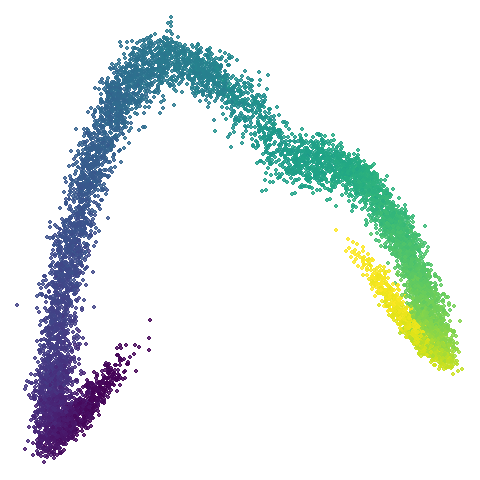
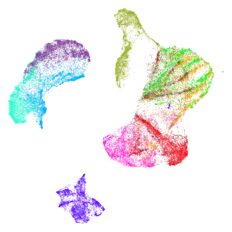
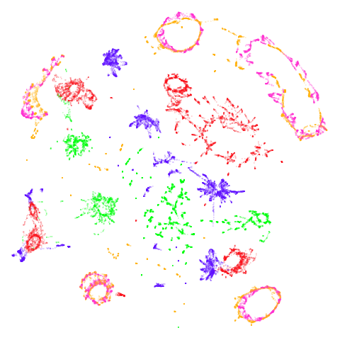

## Introduction

The
[initialization article](https://jlmelville.github.io/uwot/articles/init.html) 
describes some ways to initialize the embedding process. Really you have two
options: a spectral initialization (the default) and PCA, which is what you will
use if the affinity graph contains disconnected components. A third option, the 
"approximate global" spectral method attempts to allow for spectral
initialization in the face of disconnections by adding some random edges to the
affinity graph. This mainly works, but it did change the results for the 
`isoswiss` dataset (and not for the better) suggesting that the `agspectral`
initialization was perturbing the coordinates in a way that was not helpful.

One of the things that [PaCMAP](https://github.com/YingfanWang/PaCMAP) does is
include the concept of "mid-near" pairs. The process is:

1. Pick `n` random neighbors for each point (`n` is usually 6)
2. Sort them by distance and keep the `k`-th closest (`k` is usually 2)
3. Repeat `m` times (`m` is usually 10).

This results in each point having `m` neighbors where the distribution isn't
uniformly random, but is instead biased towards slightly nearer neighbors. 

In PaCMAP, these are added to the graph as additional edges, but given a
different set of weights and schedule in the first phases of the optimization.

Because they are not involved in the final step of the optimization, you could
view the mid-near pairs as a way of enforcing extra longer-range structure for
the final stage of the embedding fine-tunes the layout. So could we add these
to the spectral initialization and get some extra structure in the initial
embedding? At the very least, it's likely that adding these extra edges will
help with the disconnected components problem and allow for a spectral-like
initialization.

## Implementation

Here's how I imagine this working:

1. Create the mid-near pairs as described above.
2. Use the `uwot` function `similarity_graph` to generate a
  "mid affinity graph" using the mid-near pairs.
3. Create the nearest neighbor graph in the usual way. You can also use 
  `similarity_graph` for this.
4. Combine the two graphs by adding the mid-near pairs to the nearest neighbor
  graph. Probably we will need to ensure the emphasis remains on the nearest
  neighbor graph, so this should be a weighted sum of the two graphs.
5. Do spectral initialization on the combined graph.
6. Use this as the initial embedding for the optimization.

Below are some functions to make this work. Note that:

* You need to have [rnndescent](https://cran.r-project.org/package=rnndescent)
  installed.
* You will need to borrow the `sort_knn_graph` function from the code given in
  the 
  [locally-scaled-neighbors](https://jlmelville.github.io/uwot/articles/locally-scaled-neighbors.html) 
  article.
* There are tons of internal `uwot` functions used here. I do not plan to
  support this officially at the moment, but I don't want to break this myself,
  so it's likely to be stable (or I will update the code below to keep it
  working with future versions of `uwot`).
* In the code below I assume you have generated the nearest neighbors externally
  to `uwot` via something like `rnndescent`. Because `similiarity_graph` can
  return the nearest neighbors (via `ret_extra = "nn"`) the code could be
  changed to allow for the nearest neighbors to be returned from calling
  `mid_spectral_init` directly. I leave this as an exercise for the reader.
* I have also assumed we always use Euclidean distance. `rnndescent::random_knn`
  can use other distances, but I have not implemented this here.
  
To use this code do something like:

```r
nn_graph <- rnndescent::rnnd_knn(X, k = 15)
init_coords <- mid_spectral_init(X, nn_graph, mid_nnbrs = 4, graph_weight = 0.9)
umap_res <- umap2(X, nn_method = nn_graph, init = init_coords)
```

The two parameters you are most likely to want to play around with are
`mid_nnbrs` and `graph_weight`. The former is the number of mid-near pairs to
generate for each point, and the latter is the weight to give the nearest
neighbor graph in the combined graph. The higher the value, the more like the
typical spectral initialization you will get.

```r
pacmap_mid_nbrs <- function(X,
                            k = 10,
                            n_rand = 6,
                            nth_closest = 2,
                            ...) {
  varargs <- list(...)
  varargs$data <- Matrix::t(X)
  varargs$k <- n_rand
  varargs$obs <- "C"
  if (is.null(varargs$threads)) {
    varargs$n_threads <- default_num_threads()
  }

  res <- list(
    idx = matrix(0, nrow = nrow(X), ncol = k),
    dist = matrix(0.0, nrow = nrow(X), ncol = k)
  )

  for (i in 1:k) {
    random_nbrs <- do.call(rnndescent::random_knn, varargs)
    res$idx[, i] <- random_nbrs$idx[, nth_closest]
    res$dist[, i] <- random_nbrs$dist[, nth_closest]
  }
  res <- sort_knn_graph(res, enforce_self_first = FALSE)
  res
}

weighted_affinity_graph <- function(X,
                                    nn_graph,
                                    midn_graph = NULL,
                                    mid_nnbrs = 10,
                                    mid_select = 6,
                                    mid_nth_closest = 2,
                                    graph_weight = 0.9,
                                    n_threads = NULL,
                                    verbose = FALSE) {
  if (is.null(n_threads)) {
    n_threads <- default_num_threads()
  }
  if (is.null(midn_graph)) {
    if (is.null(X)) {
      stop("X must be provided if midn_graph is NULL")
    }
    uwot:::tsmessage(
      "Generating mid neighbor graph with mid_nnbrs=",
      mid_nnbrs,
      " (",
      mid_nth_closest,
      " from ",
      mid_select,
      ")",
      " using ",
      n_threads,
      " threads"
    )
    midn_graph <- pacmap_mid_nbrs(
      X,
      k = mid_nnbrs,
      n_rand = mid_select,
      nth_closest = mid_nth_closest,
      n_threads = n_threads
    )
  }

  uwot:::tsmessage("Generating near-affinity graph")
  nbr_affinity_graph <- uwot::similarity_graph(
    nn_method = nn_graph,
    n_threads = n_threads,
    verbose = FALSE
  )

  uwot:::tsmessage("Generating mid-affinity graph")
  mid_affinity_graph <- uwot::similarity_graph(
    nn_method = midn_graph,
    n_threads = n_threads,
    verbose = FALSE
  )

  uwot:::tsmessage(
    "Combining near and mid neighbor graphs with graph weight ",
    graph_weight
  )
  if (graph_weight == 1) {
    affinity_graph <- nbr_affinity_graph
  } else if (graph_weight == 0) {
    affinity_graph <- mid_affinity_graph
  } else {
    affinity_graph <- graph_weight * nbr_affinity_graph +
      (1 - graph_weight) * mid_affinity_graph
  }

  affinity_graph
}

mid_spectral_init <- function(X,
                              nn_graph,
                              midn_graph = NULL,
                              mid_nnbrs = 5,
                              mid_select = 6,
                              mid_nth_closest = 2,
                              graph_weight = 0.9,
                              n_threads = NULL,
                              verbose = FALSE) {
  if (is.null(n_threads)) {
    n_threads <- uwot:::default_num_threads()
  }

  affinity_graph <- weighted_affinity_graph(
    X = X,
    nn_graph = nn_graph,
    midn_graph = midn_graph,
    mid_nnbrs = mid_nnbrs,
    mid_select = mid_select,
    mid_nth_closest = mid_nth_closest,
    graph_weight = graph_weight,
    n_threads = n_threads,
    verbose = verbose
  )

  coords <- uwot:::spectral_init(affinity_graph, verbose = verbose)

  uwot:::tsmessage("Finished initializing")
  coords
}
```

## Datasets

Brief descriptions of the datasets used here can be found in the 
[examples article](https://jlmelville.github.io/uwot/articles/umap-examples.html).

## Effect of weight on initial coordinates

In the following I have set `mid_nnbrs = 4`. We don't want the number of these
edges to be too high, because we shouldn't need too many to get a fully
connected graph. In practice I have found that `mid_nnbrs = 2` is also fine,
and usually `mid_nnbrs = 1` also works.

Let's take a look at `mammoth` to start with. It has a very different result
if you initialize with the spectral method vs PCA. Below are the initial
mid-spectral initialization with different values of `graph_weight`, which is
given in the header of the table cell. As we go left to right, top to bottom
we increase from 0 (just use mid-near neighbors) to 1 (only use k-nearest 
neighbors, standard spectral initialization). I've also included the PCA results
for comparison.

### mammoth

| pca | 0 | 0.25 |
:---:|:---:|:---:|
|  |  |  |

| 0.5 | 0.75 | 0.9 |
:---:|:---:|:---:|
|  |  |  |

| 0.99 | 0.999 | 1 |
:---:|:---:|:---:|
|  |  |  |

First of all, sorry about the odd orientation of the mammoth, but them's the
breaks. What's apparent is that the addition of mid-near neighbors immediately
makes the coordinates take on a very similar layout to the PCA initialization.
Now I know you're saying "no, it looks like a fuzzy mess". True, but you can see
that the legs are placed together, i.e. it's the same side-on view as the PCA
result. Compare that to the k-nearest neighbors initialization (bottom right),
which is more like looking at the mammoth from above. There are two lines, one
at about 12 o'clock and the other at about 7 o'clock. Those are the legs,
clearly separate from each other, and split by the torso.

What's more than slightly annoying to me is that I have been unable to reproduce
the "pure" spectral initialization with any value of `graph_weight` < 1. The
presence of the mid-near edges pushes the coordinates into the "PCA-like"
orientation. Now the good news there is that the PaCMAP paper makes great hay
of the mammoth embedding looking more sensible under their method than UMAP and
part of that is the side-on view.

In terms of why this happens, it's notable that the mammoth spectral
initialization takes a comparative age to converge. Most initializations for
datasets of this size (50,000 items) take a second, or a couple of seconds at
most. Spectral initialization chugs along for nearly a minute. That's not a good
sign, so there must be something about the mammoth dataset that makes it
troublesome. Probably fiddling with the parameters to `RSpectra`'s solution
(more memory, more iterations) would help, but the mid-spectral initialization
is not necessarily worse than the spectral initialization and it also completes
in a second.

### isoswiss

Another low-dimensional dataset, but this one is the classic manifold that is
perfect for a spectral approach (well, apart from the 
[repeated eigendirections problem](https://arxiv.org/abs/1505.06118), but UMAP
optimization helps fix that). What you certainly won't want to do is to use
PCA in this case. Given that PCA-ness seems to creep into the `mammoth` results
with `graph_weight` < 1, let's see what happens.

| pca | 0 | 0.25 |
:---:|:---:|:---:|
|  |  |  |

| 0.5 | 0.75 | 0.9 |
:---:|:---:|:---:|
|  |  |  |

| 0.99 | 0.999 | 1 |
:---:|:---:|:---:|
|  |  |  |

Hard to really see here, but in the `pca` case you are basically looking at the
swiss role perpendicular to rolled up part. So those apparent four darker lines
are where the folding is occurring. The mid-spectral cases all struggle to
avoid wanting to fold it up or just make what seems like a bit of a mess. The
closes we get is with `graph_weight = 0.999`. If you increase the graph_weight
to `0.9999` you *do* get the fully unrolled swiss roll, but that doesn't work
for `mammoth`, and if you are up at the four 9s you might as well just do the
normal spectral initialization at this point.

One more low-dimensional and manifold-based dataset:

### scurvehole

| pca | 0 | 0.25 |
:---:|:---:|:---:|
|  |  |  |

| 0.5 | 0.75 | 0.9 |
:---:|:---:|:---:|
|  |  |  |

| 0.99 | 0.999 | 1 |
:---:|:---:|:---:|
|  |  |  |

No real sign of the PCA result here. The "horseshoe" shape is apparent at most
settings. On the one hand that is characteristic of the spectral initialization.
On the other, this is a classic sign of the "repeated eigendirections problem",
but we aren't going to solve that here. You do have to get all the way to
`graph_weight = 0.999` to get weird hook-looking appendages at the end of the
curve to disappear, but at least we get there.

I don't really care about these datasets. Let's take a look at a higher
dimensional more "blobby" dataset. Like `mnist`:

### mnist

| pca | 0 | 0.25 |
:---:|:---:|:---:|
|  |  |  |

| 0.5 | 0.75 | 0.9 |
:---:|:---:|:---:|
|  |  |  |

| 0.99 | 0.999 | 1 |
:---:|:---:|:---:|
|  |  |  |

You can also get to something that looks very spectral-like with with a
`graph_weight = 0.99` or above. And the `graph_weight = 0.9` results is quite
pleasing, showing a visible cluster structure and seeming to sit intermediate
between the PCA and spectral result. That's more like it.

Let's try one more high-dimensional dataset:

### fashion

| pca | 0 | 0.25 |
:---:|:---:|:---:|
|  |  |  |

| 0.5 | 0.75 | 0.9 |
:---:|:---:|:---:|
|  |  |  |

| 0.99 | 0.999 | 1 |
:---:|:---:|:---:|
|  |  |  |

Sort of the same deal here as with `mnist`.

Another dataset I want to check is `tomoradar`. With the Python UMAP package
and this data, I have found this dataset will take several minutes to converge.
In `uwot` it can take over a minute (the difference is due to the implementation
of the spectral decomposition). So like `mammoth`, this would be a good test
of whether convergence can be sped up. For this dataset, we use
`n_neighbors = 50`, because otherwise there is a disconnected component. I want
to compare the results here with a successful spectral initialization because
of the slow convergence.

### tomoradar

| pca | 0 | 0.25 |
:---:|:---:|:---:|
|  |  |  |

| 0.5 | 0.75 | 0.9 |
:---:|:---:|:---:|
|  |  |  |

| 0.99 | 0.999 | 1 |
:---:|:---:|:---:|
|  |  |  |

Even with a high `graph_weight`, the results resemble the PCA results more than
the spectral results. It seems like a situation like with `mammoth`.

The next set of results are for datasets where you can't do a spectral
initialization. `uwot` detects disconnected components in the graph, steps in
and makes you do PCA instead. So I won't try to go to `graph_weight = 1`. Also,
nothing interesting happens at `graph_weight = 0.25` or `graph_weight = 0.75`,
so we can discard an entire row of output. Without any ground truth to compare
to, I am just looking for a suitably "spectral-like" result at high
`graph_weight`: pointy, spiky, radial, etc. especially compared to the more
diffuse PCA results.

### coil20

| pca | 0 | 0.5 |
:---:|:---:|:---:|
|  |  |  |

| 0.9 | 0.99 | 0.999 |
:---:|:---:|:---:|
|  |  |  |

### coil100

| pca | 0 | 0.5 |
:---:|:---:|:---:|
|  |  |  |

| 0.9 | 0.99 | 0.999 |
:---:|:---:|:---:|
|  |  |  |

### norb

| pca | 0 | 0.5 |
:---:|:---:|:---:|
|  |  |  |

| 0.9 | 0.99 | 0.999 |
:---:|:---:|:---:|
|  |  |  |

### tasic2018

| pca | 0 | 0.5 |
:---:|:---:|:---:|
|  |  |  |

| 0.9 | 0.99 | 0.999 |
:---:|:---:|:---:|
|  |  |  |

Ok, similar pattern emerges. We do have a successful enough looking spectral
shape at higher `graph_weight` values (and these all converged quickly). Lower
values inject some more PCA-like structure into things.

`macosko2015` and its PCA-reduced version are all fully connected, but I am
including them here because they are transcriptomics datasets like `tasic2018`.

### macosko2015

| pca | 0 | 0.5 |
:---:|:---:|:---:|
|  |  |  |

| 0.9 | 0.99 | 0.999 |
:---:|:---:|:---:|
|  |  |  |

### macosko2015pca100

| pca | 0 | 0.5 |
:---:|:---:|:---:|
|  |  |  |

| 0.9 | 0.99 | 0.999 |
:---:|:---:|:---:|
|  |  |  |

`macosko2015` looking reliably terrible even in spectral form, but
`macosko2015pca100` seems in line with the other datasets.

Overall, the initialization is doing what I want it to do with "real" datasets
at least. Does it translate into different results when fed into UMAP?

## UMAP

These are the UMAP embeddings of the datasets with the initializations above.
I use `umap2` with the same nearest neighbors that produced the initialization
(but no mid-near neighbors). The only deviation from default values is to use
`rng_type = "deterministic"` to remove any effect of random numbers (which can't
always be controlled with multiple threads even with the same seed). This 
probably introduces some other bias, but is probably ok.

There is also one change for `norb` only. It never does well with
`n_neighbors = 15` so for that dataset, I set `n_neighbors = 50`, to make the
results more legible (probably there are other datasets where I should do this).

In most cases, there is nothing too surprising about the results if you know
how the initializations look.

### mammoth

| pca | 0 | 0.25 |
:---:|:---:|:---:|
|  |  |  |

| 0.5 | 0.75 | 0.9 |
:---:|:---:|:---:|
|  |  |  |

| 0.99 | 0.999 | 1 |
:---:|:---:|:---:|
|  |  |  |

### scurvehole

| pca | 0 | 0.25 |
:---:|:---:|:---:|
|  |  |  |

| 0.5 | 0.75 | 0.9 |
:---:|:---:|:---:|
|  |  |  |

| 0.99 | 0.999 | 1 |
:---:|:---:|:---:|
|  |  |  |

### isoswiss

| pca | 0 | 0.25 |
:---:|:---:|:---:|
|  |  |  |

| 0.5 | 0.75 | 0.9 |
:---:|:---:|:---:|
|  |  |  |

| 0.99 | 0.999 | 1 |
:---:|:---:|:---:|
|  |  |  |

### mnist

| pca | 0 | 0.25 |
:---:|:---:|:---:|
|  |  |  |

| 0.5 | 0.75 | 0.9 |
:---:|:---:|:---:|
|  |  |  |

| 0.99 | 0.999 | 1 |
:---:|:---:|:---:|
|  |  |  |

In this case the PCA result has some unfortunate overlapping and breaking up
of the clusters, so everything is an improvement on that.

### fashion

| pca | 0 | 0.25 |
:---:|:---:|:---:|
|  |  |  |

| 0.5 | 0.75 | 0.9 |
:---:|:---:|:---:|
|  |  |  |

| 0.99 | 0.999 | 1 |
:---:|:---:|:---:|
|  |  |  |

### tomoradar

| pca | 0 | 0.25 |
:---:|:---:|:---:|
|  |  |  |

| 0.5 | 0.75 | 0.9 |
:---:|:---:|:---:|
|  |  |  |

| 0.99 | 0.999 | 1 |
:---:|:---:|:---:|
|  |  |  |

With the usual caveat that UMAP results for this dataset don't look like much
of anything, at least with a `graph_weight = 0.999`, you can get a result which
resembles what you get from spectral initialization. But it still takes around
20-30 seconds on my machine. That's still somewhere around 2-3 times faster than
the pure spectral initialization, so a bit of a win.

### coil20

| pca | 0 | 0.5 |
:---:|:---:|:---:|
|  |  |  |

| 0.9 | 0.99 | 0.999 |
:---:|:---:|:---:|
|  |  |  |

The downside of having disconnected components is that the clusters are pretty
free to move about relative to each other, so there's not always an obvious
transition as `graph_weight` incraeses as can be seen here.

### coil100

| pca | 0 | 0.5 |
:---:|:---:|:---:|
|  |  |  |

| 0.9 | 0.99 | 0.999 |
:---:|:---:|:---:|
|  |  |  |

### norb

| pca | 0 | 0.5 |
:---:|:---:|:---:|
|  |  |  |

| 0.9 | 0.99 | 0.999 |
:---:|:---:|:---:|
|  |  |  |

At least in the `norb` case, I think the mid-spectral initialization improves
on the PCA results, as it doesn't break up the pink/orange cluster in the top
center.

### macosko2015

| pca | 0 | 0.5 |
:---:|:---:|:---:|
|  |  |  |

| 0.9 | 0.99 | 0.999 |
:---:|:---:|:---:|
|  |  |  |

### macosko2015pca100

| pca | 0 | 0.5 |
:---:|:---:|:---:|
|  |  |  |

| 0.9 | 0.99 | 0.999 |
:---:|:---:|:---:|
|  |  |  |

### tasic2018

| pca | 0 | 0.5 |
:---:|:---:|:---:|
|  |  |  |

| 0.9 | 0.99 | 0.999 |
:---:|:---:|:---:|
|  |  |  |

Cluster arrangement seems to be more consistently different in the mid-spectral
initialization versus PCA in terms of the relative location of the orange-red
versus the pink-purple cluster.

My conclusions from this set of results is that in most cases, there isn't much
difference between PCA and spectral initialization, but for some datasets, you
can get some slightly different results with a spectral initialization and it
might be improved over PCA, so having this available *could* be useful.

But not useful enough for me to add this to `uwot` natively.

## BMNN Initialization

In the
[mutual nearest neighbors](https://jlmelville.github.io/uwot/articles/mutual-nearest-neighbors.html) 
article, I lamented that focusing on MNN leads to more disconnections so
initialization becomes even trickier. Could mid spectral initialization help?

Below I will consider 4 datasets which have a large number of disconnected
components when using mutual nearest neighbors (and are disconnected even with
just a knn graph).

For `tasic2018` and `norb` I will use 50 nearest neighbors: `norb` because we
know it does better that way and `tasic2018`, just in case it will also show a
difference. For `coil20` and `coil100` I will use 15 nearest neighbors as these
datasets do better with a smaller number of neighbors. I will use 5 neighbors
to ensure all items have at least 5 neighbors in the graph used for UMAP. See
the MNN article for more details on the procedure.

For each dataset we'll consider all four combinations of the following
settings:

* For the nearest neighbor graph, using either the k-nearest neighbors or the
balanced mutual nearest neighbor graph. In the results, the rows will be marked
as `knn<k>` or `bmnn-<k>-<m>` respectively, where `k` is either 50 or 15 and `m`
is 5.
* For the initialization, using either PCA or mid-spectral initialization. For
the mid-spectral initialization, the nearest neighbor graph is either the knn 
graph or the balanced MNN graph. `graph_weight = 0.999` in all these cases. In
the results table, the columns are marked as `pca` or `0.999`.

The question I want to answer here is: is initializing the coordinates using
the neighbor graph better or at least different from using PCA?

### tasic2018

| | pca | 0.999 |
:---:|:---:|:---:|
| knn50 |  |  |
| bmnn-50-5 |  |  |

### norb

| | pca | 0.999 |
:---:|:---:|:---:|
| knn50 |  |  |
| bmnn-50-5 |  |  | 

### coil20

| | pca | 0.999 |
:---:|:---:|:---:|
| knn15 |  |  |
| bmnn-15-5 |  |  | 

### coil100

| | pca | 0.999 |
:---:|:---:|:---:|
| knn15 |  |  |
| bmnn-15-5 |  |  | 

With `coil20` and `coil100` it would be hard to say whether PCA or the spectral
initialization is better. I think the `norb` result is best with the spectral
initialization and maybe the `tasic2018` result too. It's at least different.

## Conclusions

If you have reason to want to avoid PCA initialization, but you have
disconnected components in your nearest neighbor graph or the spectral
initialization is having issues and failing to converge in a timely fashion,
then using the mid-spectral initialization might be worth a try.

Unfortunately, like my `agspectral` attempt before, for synthetic and
manifold-like datasets, it may not be the right choice so it's not a guaranteed
upgrade over spectral initialization in all cases.
