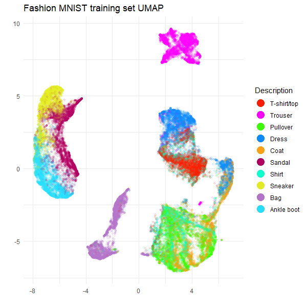
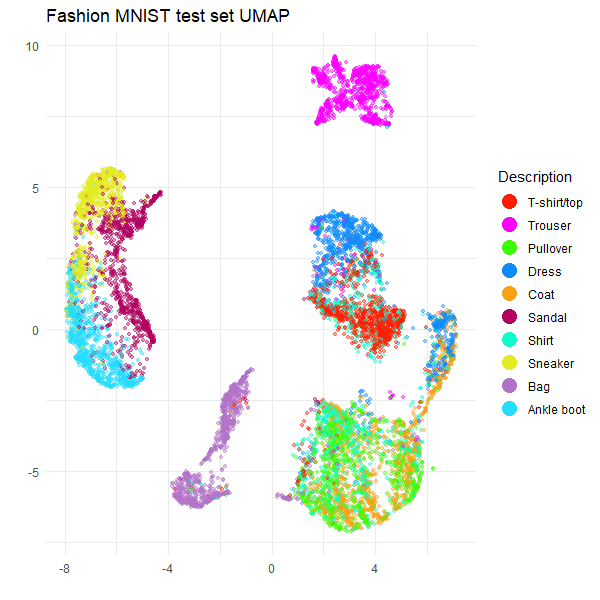
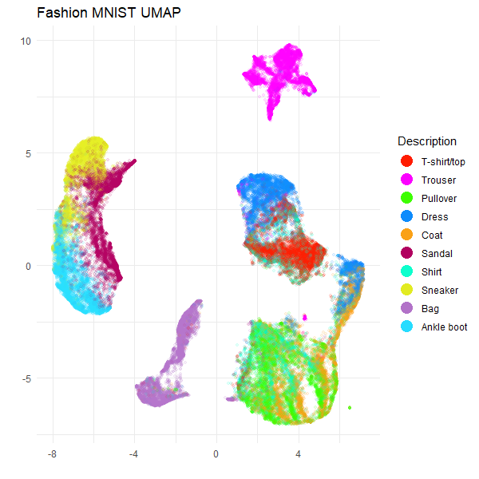

```{r, include = FALSE}
knitr::opts_chunk$set(
  collapse = TRUE,
  comment = "#>",
  eval = FALSE
)
```

This is a companion article to the [HNSW article](https://jlmelville.github.io/uwot/articles/hnsw-umap.html)
about how to use nearest neighbor data from other packages with `uwot`.
You should read that article as well as the on `uwot`'s 
[nearest neighbor format](https://jlmelville.github.io/uwot/articles/nearest-neighbors-format.html)
for proper details. I'm going to provide minimal commentary here.

The [rnndescent](https://cran.r-project.org/package=rnndescent) package can
be used as an alternative to the internal Annoy-based nearest neighbor method
used by `uwot`. It is based on the Python package
[PyNNDescent](https://github.com/lmcinnes/pynndescent) and offers a wider range
of metrics than other packages and the ability to work with sparse data.
For an example of using `rnndescent` with sparse data see the [sparse UMAP article](https://jlmelville.github.io/uwot/articles/sparse-data-example.html).
Here we will use typical dense data and the typical Euclidean distance.

First we need some data, which I will install via the `snedata` package from
GitHub:

```{r install snedata}
# install.packages("pak")
pak::pkg_install("jlmelville/snedata")

# or
# install.packages("devtools")
# devtools::install_github("jlmelville/snedata")
```

The HNSW article used the MNIST digits data, but to mix things up a bit I'll
use the [Fashion MNIST data](https://github.com/zalandoresearch/fashion-mnist):

```{r load data}
fashion <- snedata::download_fashion_mnist()
fashion_train <- head(fashion, 60000)
fashion_test <- tail(fashion, 10000)
```

This is structured just like the MNIST digits, but it uses images of 10
different classes of fashion items (e.g. trousers, dress, bag). The name of
the item is in the `Description` column.

## Using rnndescent

Now install `rnndescent` from CRAN:

```{r install rnndescent}
install.packages("rnndescent")
library(rnndescent)
```

### Build an index for the training data

First, we will build a search index using the training data. You should use as
many threads (`n_threads`) as you feel comfortable with. You can also set
`verbose = TRUE`, but when building an index you will see a lot of output so I
won't reproduce that here. The `k` parameter is the number of nearest neighbors
that we are looking for. The index is tuned to work well for that number of
neighbors. The `metric` parameter is the distance metric to use, but the default
is Euclidean, so we don't need to specify that. Finally, there is a stochastic
aspect to the index building. You may get slightly different results from me,
but I am leaving the seed unset so that we must both live with the inherently
random nature of the index building process.

```{r build index}
fashion_index <- rnnd_build(fashion_train, k = 15, n_threads = 6)
```

What's in the returned index? A bunch of stuff:

```{r index info}
names(fashion_index)
```
```R
[1] "graph"           "prep"            "data"            "original_metric" "use_alt_metric"  "search_forest"   "search_graph"
```

Most of that is there to support searching the index. What we want is the
`graph`. This is a list with two elements, `idx` and `dist`, which contain
the nearest neighbor indices and distances respectively. The nearest neighbor
of each item is itself, so we expect the first column of `idx` to be the
sequence 1, 2, 3, ... and the first column of `dist` to be all zeros.

```{r neighbor indices info}
fashion_index$graph$idx[1:3, 1:3]
```
```R
     [,1]  [,2]  [,3]
[1,]    1 25720 27656
[2,]    2 42565 37551
[3,]    3 53514 35425
```

```{r neighbor distances info}
fashion_index$graph$dist[1:3, 1:3]
```
```R
     [,1]      [,2]      [,3]
[1,]    0 1188.7826 1215.3440
[2,]    0 1048.0482 1068.3951
[3,]    0  532.6199  632.1653
```

With other nearest neighbor methods like HNSW and Annoy, you would have to run a
separate query step to get the k-nearest neighbors for the data used to build
the index. One of the advantages of `rnndescent` is that you can get this data
directly from the index without the separate query step. Note that you can still
query the index if you want to, and those results might be a bit more accurate,
but I am quietly confident that the results from the index are sufficient for
UMAP.

### Query the test data

To get the test set neighbors, query the index with the test data:

```{r query index}
fashion_test_query_neighbors <-
  rnnd_query(
    index = fashion_index,
    query = fashion_test,
    k = 15,
    n_threads = 6,
    verbose = TRUE
  )
```

```{r query neighbors info}
fashion_test_query_neighbors$idx[1:3, 1:3]
```
```R
      [,1]  [,2]  [,3]
[1,] 18095 53940 18353
[2,]  8573 31349  3885
[3,]   286 38144  3422
```

```{r query distances info}
fashion_test_query_neighbors$dist[1:3, 1:3]
```
```R
          [,1]      [,2]      [,3]
[1,]  482.2966  681.9905  708.4991
[2,] 1308.0019 1329.3134 1382.7317
[3,]  466.0322  538.5378  555.8795
```

As we are querying the test data against the training data, the nearest neighbor
of any test item is *not* the test item itself.

We now have all the nearest neighbor data we need. The good news is that it's
already in a format that `uwot` can use so we can proceed straight to running
UMAP.

## Using rnndescent nearest neighbors with UMAP

```{r setup}
library(uwot)
```

### UMAP on training data

To use pre-computed nearest neighbor data with `uwot` pass it as the `nn_method`
parameter. In this case, that is the `graph` item in `fashion_index`. See the
HSNW article for more details on the other parameters, but this is designed to
give pretty typical UMAP results.

```{r umap on training data}
fashion_train_umap <-
  umap(
    X = NULL,
    nn_method = fashion_index$graph,
    batch = TRUE,
    n_epochs = 500,
    n_sgd_threads = 6,
    ret_model = TRUE,
    verbose = TRUE
  )
```
```R
UMAP embedding parameters a = 1.896 b = 0.8006
Commencing smooth kNN distance calibration using 6 threads with target n_neighbors = 15
Initializing from normalized Laplacian + noise (using irlba)
Commencing optimization for 500 epochs, with 1359454 positive edges using 6 threads
Using method 'umap'
Optimizing with Adam alpha = 1 beta1 = 0.5 beta2 = 0.9 eps = 1e-07
0%   10   20   30   40   50   60   70   80   90   100%
[----|----|----|----|----|----|----|----|----|----|
**************************************************|
Optimization finished
Note: model requested with precomputed neighbors. For transforming new data, distance data must be provided separately
```

### Transforming test data

Now we have a UMAP model we can transform the test set data. Once again we don't
need to pass in any test set data except the neighbors as `nn_method`:

```{r}
fashion_test_umap <-
  umap_transform(
    X = NULL,
    model = fashion_train_umap,
    nn_method = fashion_test_query_neighbors,
    n_sgd_threads = 6,
    verbose = TRUE
  )
```
```R
Read 10000 rows
Processing block 1 of 1
Commencing smooth kNN distance calibration using 6 threads with target n_neighbors = 15
Initializing by weighted average of neighbor coordinates using 6 threads
Commencing optimization for 167 epochs, with 150000 positive edges using 6 threads
Using method 'umap'
Optimizing with Adam alpha = 1 beta1 = 0.5 beta2 = 0.9 eps = 1e-07
0%   10   20   30   40   50   60   70   80   90   100%
[----|----|----|----|----|----|----|----|----|----|
**************************************************|
Finished
```

### Plotting the results

Now to take a look at the results, using `ggplot2` for plotting, and 
`Polychrome` for a suitable categorical palette.

```{r plot setup}
install.packages(c("ggplot2", "Polychrome"))
library(ggplot2)
library(Polychrome)
```

The following code creates a palette of 10 (hopefully) visually distinct colors
which will map each point to the type of fashion item it represents. This is
found in the `Description` factor column of the original data.

```{r create palette}
palette <- as.vector(Polychrome::createPalette(
  length(levels(fashion$Description)) + 2,
  seedcolors = c("#ffffff", "#000000"),
  range = c(10, 90)
)[-(1:2)])
```

And here are the results:

```{r plot training data}
ggplot(
  data.frame(fashion_train_umap$embedding, Description = fashion_train$Description),
  aes(x = X1, y = X2, color = Description)
) +
  geom_point(alpha = 0.1, size = 1.0) +
  scale_color_manual(values = palette) +
  theme_minimal() +
  labs(
    title = "Fashion MNIST training set UMAP",
    x = "",
    y = "",
    color = "Description"
  ) +
  theme(legend.position = "right") +
  guides(color = guide_legend(override.aes = list(size = 5, alpha = 1)))
```

```{r plot test data}
ggplot(
  data.frame(fashion_test_umap, Description = fashion_test$Description),
  aes(x = X1, y = X2, color = Description)
) +
  geom_point(alpha = 0.4, size = 1.0) +
  scale_color_manual(values = palette) +
  theme_minimal() +
  labs(
    title = "Fashion MNIST test set UMAP",
    x = "",
    y = "",
    color = "Description"
  ) +
  theme(legend.position = "right") +
  guides(color = guide_legend(override.aes = list(size = 5, alpha = 1)))
```




These results are typical for Fashion MNIST result with UMAP. For example, see
the first image in
[part of the Python UMAP documentation](https://umap-learn.readthedocs.io/en/latest/supervised.html#umap-on-fashion-mnist). So it looks like `rnndescent` with its default settings does a good job
with this dataset.

### A potentially simpler workflow

If you don't want to transform new data, you can make life a bit easier. Instead
of `rnnd_build`, use `rnnd_knn` which behaves a lot like `rnnd_build` but
doesn't preserve the index or do any index preparation. This saves time and the
nearest neighbor results are returned directly in the return result. Let's use
the full Fashion MNIST results as an example:

```{r}
fashion_knn <- rnnd_knn(fashion, k = 15, n_threads = 6)
names(fashion_knn)
```
```R
[1] "idx"  "dist"
```

You can then pass `fashion_knn` to `nn_method`:

```{r fashion umap}
fashion_umap <-
  umap(
    X = NULL,
    nn_method = fashion_knn,
    batch = TRUE,
    n_epochs = 500,
    n_sgd_threads = 6,
    verbose = TRUE
  )
```

(I have spared you the log output). We don't need to pass `ret_model = TRUE`
here because we can't transform new data. Here is the UMAP plot for the full
Fashion MNIST dataset:

```{r fashion plot}
ggplot(
  data.frame(fashion_umap, Description = fashion$Description),
  aes(x = X1, y = X2, color = Description)
) +
  geom_point(alpha = 0.1, size = 1.0) +
  scale_color_manual(values = palette) +
  theme_minimal() +
  labs(
    title = "Fashion MNIST UMAP",
    x = "",
    y = "",
    color = "Description"
  ) +
  theme(legend.position = "right") +
  guides(color = guide_legend(override.aes = list(size = 5, alpha = 1)))
```



Everything looks as expected. However, if you think you might want to transform
new data in the future, then you will need to completely restart the process,
with `rnnd_build` and using `ret_model = TRUE`.

## Conclusions

If you want to use `rnndescent` with `uwot`, then:

* Run `rnndescent::rnnd_build` on your training data.
* Run `uwot::umap` with `nn_method` set to the `graph` item in the result of
  `rnnd_build` and remember to set `ret_model = TRUE`.
  
To transform new data:

* Run `rnndescent::rnnd_query` on your test data, using the result of
  `rnnd_build` as the `index` parameter.
* Run `uwot::umap_transform` with `nn_method` set to the result of
  `rnnd_query`.
  
If you don't want to transform new data, then it's even easier:

* Run `rnndescent::rnnd_knn` on your training data.
* Run `uwot::umap` with `nn_method` set to the result of `rnnd_knn`.
