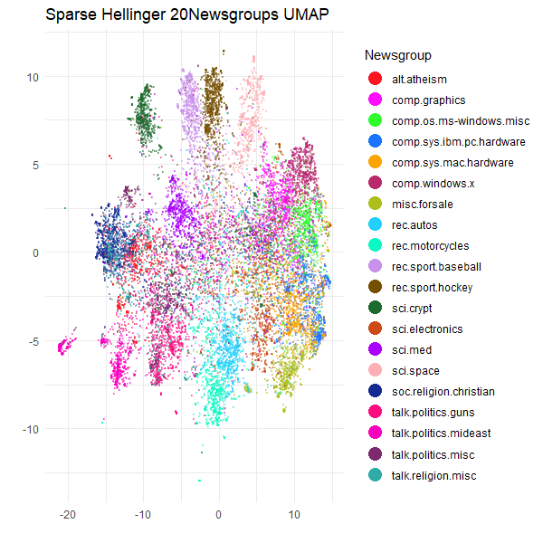

```{r, include = FALSE}
knitr::opts_chunk$set(
  collapse = TRUE,
  comment = "#>",
  eval = FALSE
)
```

## Text Analysis of the 20 Newsgroups Dataset

A great use case for working with sparse data is TF-IDF text analysis. Despite
the prevalence of deep-learning-based text embedding, TF-IDF is simple, far less
compute intensive and can be surprisingly effective. Most dimensionality
reduction methods don't work well with sparse data, and need the input data to
be dense. `uwot` is no different, but one of the Python UMAP's unique features
is that it can work with sparse data, due to its use of
[PyNNDescent](https://github.com/lmcinnes/pynndescent) for nearest neighbor
search.

There is a 
[Python UMAP with sparse data](https://umap-learn.readthedocs.io/en/latest/sparse.html)
tutorial that uses the [20 Newsgroups](http://qwone.com/~jason/20Newsgroups/)
dataset that I have long wanted to replicate in R. The main barriers have
been the lack of a straight-forward way to download the data and the lack of
a fast approximate nearest neighbor search package that can work with sparse
data.

The first problem is solved with the
[snedata](https://github.com/jlmelville/snedata) package, to which I recently
added a `download_twenty_newsgroups` function. That took up a large chunk of one
afternoon and evening. The second problem is solved by replicating the
PyNNDescent package in R. This took me a bit longer, but a mere 4 years later,
the [rnndescent](https://cran.r-project.org/package=rnndescent) package is
finally in a usable state.

So let's get started. Apart from the Python example above, some other good
resources for doing text analysis on this dataset can be found in chapter 9 of
[text mining with R](https://www.tidytextmining.com/usenet#usenet) and the
juicily-titled Python notebook 
[20 Newsgroups Secrets](https://github.com/Alvant/20-newsgroups-secrets).

## Downloading the 20 Newsgroups Dataset

The [20 Newsgroups](http://qwone.com/~jason/20Newsgroups/) dataset is (nearly)
20,000 usenet posts sampled (nearly) equally from 20 different newsgroups. The
webpage linked above contains more information on the data's provenance and
structure. We can use `snedata::download_twenty_newsgroups` to download it:

```{r download 20 newsgroups}
devtools::install_github("jlmelville/snedata")

ng20 <- snedata::download_twenty_newsgroups(subset = "all", verbose = TRUE)
```

The `subset` argument can be used to download only the training or test set
data but I will use all of it. The `verbose` argument is useful to see how
what it's doing: it will take a few minutes to download it. It's a `tar.gz` file
and unfortunately, I am unaware of a way to stream tar data directly into R,
so `download_twenty_newsgroups` will download the file to a temporary directory,
extract everything, and attempt to clean up afterwards. If something goes wrong
it should log the directory it downloaded to.

```{r 20 newsgroups dimensions}
dim(ng20)
```
```R
[1] 18846     6
```

The data is returned as a data frame with 6 columns:

```{r 20 newsgroups columns}
names(ng20)
```
```R
[1] "Id"        "FileId"    "Text"      "Subset"    "Label"     "Newsgroup"
```

The `Id` column is a unique identifier for each post, `FileId` is the filename
combined with the `Subset`, `Text` is the post text, `Subset` is either
`"train"` or `"test"`, `Label` is the integer label of the newsgroup and 
`Newsgroup` is the name of the newsgroup.

The columns we will be most interested in are the `Text` and `Newsgroup`, and
for some data manipulation we need to do, the `Id` so we can keep track of the
rows. Here's the first row without the `Text` column (we can safely ignore the
row id):

```{r 20 newsgroups first row}
ng20[1, -3]
```
```R
                   Id FileId Subset Label   Newsgroup
alt.atheism.1 train_1  49960  train     0 alt.atheism
```

And here's the first few characters of the text:

```{r 20 newsgroups first few characters}
substr(ng20[1, ]$Text, 1, 72)
```
```R
[1] "From: mathew <mathew@mantis.co.uk>\nSubject: Alt.Atheism FAQ: Atheist Res"
```

There is a *lot* more where that came from, which I invite you to investigate
(and fill your terminal with) yourself. Notably, `snedata` doesn't do any
processing of the posts, so the headers are still there, as are the footers
and any other quotations of previous posts that the current poster might be
replying to.

## Preprocessing the Data

Unless you get very luck with pre-cleaned datasets, text data usually requires a
fair amount of processing to turn it into a vector of numbers that UMAP can work
on, so we will need to do some text wrangling to start with. We'll need to
install [dplyr](https://dplyr.tidyverse.org/), 
[tidyr](https://tidyr.tidyverse.org/) and 
[stringr](https://stringr.tidyverse.org/), for this:

```{r install dplyr and tidyr}
install.packages(c("dplyr", "tidyr", "stringr"))
library(dplyr)
library(tidyr)
library(stringr)
```

[Text Mining with R](https://www.tidytextmining.com/usenet#usenet) is a good
place to start to get some ideas of what to do, but bear in mind the dataset
is structured a bit differently, so let's temporarily expand the dataset by
splitting the text on new lines like in the tidy text mining example so that
each row is a line in the original post:

```{r split text on new lines}
ng20spl <- ng20 |> separate_longer_delim(`Text`, delim = "\n")
dim(ng20spl)
```
```R
[1] 834780      6
```

Now the first row looks like:

```{r first row split}
ng20spl[1, ]
```
```R
       Id FileId                               Text Subset Label   Newsgroup
1 train_1  49960 From: mathew <mathew@mantis.co.uk>  train     0 alt.atheism
```

The first filtering is to remove headers (anything before the first blank line)
and footers (assumed to be anything after the first line of repeated hyphens):

```{r}
cleaned_text <- ng20spl |>
  group_by(`Newsgroup`, `Id`) |>
  filter(
    cumsum(`Text` == "") > 0,
    cumsum(str_detect(`Text`, "^--")) == 0
  ) |>
  ungroup()
dim(cleaned_text)
```
```R
[1] 599249      6
```

And this attempts to removed quoted text:

```{r}
cleaned_text <- cleaned_text |>
  filter(
    str_detect(`Text`, "^[^>]+[A-Za-z\\d]") |
      `Text` == "",
    !str_detect(`Text`, "writes(:|\\.\\.\\.)$"),
    !str_detect(`Text`, "^In article <")
  )
dim(cleaned_text)
```
```R
[1] 445080      6
```

These functions are a bit different from the ones used on the python side by
[scikit-learn](https://github.com/scikit-learn/scikit-learn/blob/3f89022fa04d293152f1d32fbc2a5bdaaf2df364/sklearn/datasets/_twenty_newsgroups.py) -- see the functions `strip_newsgroup_header`,
`strip_newsgroup_quoting` and `strip_newsgroup_footer`, but if the R functions
are good enough for the tidy text modelers, it's good enough for me.

Also, in the tidy text book, they explicitly remove two items "that contained a
large amount of non-text content". Specifically they are images, and you can
find out more about them in the "20 Newsgroups Secrets" notebook linked above
(don't get too excited). There seems to be other binary data in some of the
posts, so to try and catch more, I will end up filtering those out later.

The tidy text example goes on to examine the word frequencies for each newsgroup
as a whole, but we will go back to analysing on a per post basis. Now, having
split the posts into lines, we need to unsplit them, and also re-associate
the other columns from the original `ng20` data:

```{r unsplit text}
text_unsplit <-
  cleaned_text |>
  group_by(`Id`) |>
  summarise(`Text` = paste(`Text`, collapse = " "))
text_unsplit <- ng20 |>
  select(-`Text`) |>
  left_join(text_unsplit, by = "Id")
text_unsplit <-
  text_unsplit[, c("Id", "FileId", "Text", "Subset", "Label", "Newsgroup")]
dim(text_unsplit)
```
```R
[1] 18846     6
```

Back to the original structure. This processing isn't perfect, but it should
do a decent job. Now we can do some actual text processing.

## Text Mining

I'm going to use the [tm](https://cran.r-project.org/package=tm) package for the
text mining:

```{r install tm}
install.packages("tm")
library(tm)
```

We are going to create a "corpus" from the text and then apply various
processing steps to normalize the text, such as handling whitespace, case,
removing punctuation and so on. When we create the `Corpus` initially, we also
convert the text encoding from `latin1` to `UTF-8` via the `iconv` function. As
far as I can tell, the 20 Newsgroups data is in `latin1` encoding (`sklearn`
also reads them in that encoding), which we will then convert to `UTF-8` for the
rest of the processing. There are still a few documents with odd formatting
characters but `tm` seems to deal with them without issue.

```{r create corpus}
corpus <-
  Corpus(VectorSource(iconv(text_unsplit$Text, "latin1", "UTF-8"))) |>
  tm_map(content_transformer(tolower)) |>
  tm_map(removePunctuation) |>
  tm_map(removeNumbers) |>
  tm_map(removeWords, stopwords("english")) |>
  tm_map(stripWhitespace)
length(corpus)
```
```R
[1] 18846
```

### Filtering Out Bad Documents

At this point, I take a bit of inspiration from `20 Newsgroups Secrets` and
start looking at the distribution of document lengths in terms of number of
words and number of characters. If our corpus really is mainly English text
we would expect to see some kind of rough relationship between these sorts of
values and any deviations are likely to be anomalies that need investigating.

This is a bit of a diversion from the business at hand, but we might as well
see if we can come up with some reasonable filter values using some simple
methods.

```{r number of words}
count_words <- function(doc) {
  doc |>
    strsplit(" ") |>
    unlist() |>
    length()
}

nwords <- sapply(corpus, count_words)
```

```{r summary of number of words}
summary(nwords)
```
```R
   Min. 1st Qu.  Median    Mean 3rd Qu.    Max. 
   0.00   24.00   46.00   84.42   86.00 6592.00 
```

Clearly there is quite a skew in terms of the number of words. Some messages
now have zero words, and one has nearly 7000. But the median is less than 50
words. Let's look at the distribution of the number of words, but stop at 95%
of the data to avoid the outliers:

```{r histogram of number of words}
hist(nwords[nwords <= quantile(nwords, 0.95)], main = "0-95% word count distribution")
```


So 95% of the data contains 250 words or less.

What is this massive document. Let's (carefully) take a look:

```{r longest document}
substr(ng20[which.max(nwords), ]$Text, 0, 80)
```
```R
[1] "From: jeh@cmkrnl.com\nSubject: Electrical wiring FAQ (was: A question about 120VA"
```

Ah, it's a FAQ. Ok that makes sense. Now let's look at the distribution of the
raw length of the documents in terms of number of characters:

```{r summary of number of characters}
nchars <- sapply(corpus, function(doc) {
  doc |> str_length()
})
summary(nchars)
```
```R
   Min. 1st Qu.  Median    Mean 3rd Qu.    Max. 
    0.0   158.0   310.0   594.6   593.0 67441.0 
```

Seems reminiscent of the word count distribution. So let's see how related they
are (you'd assume very related but you never know):

```{r correlation between number of words and number of characters}
plot(nwords, nchars, main = "Number of words vs number of characters")
```


Ok that's a very good relation, which makes those documents which don't appear
on the main trendline all the more suspicious. The easy way to deal with this
is to define an average word length:

```{r average word length}
avg_word_lengths <- nchars / nwords
summary(avg_word_lengths)
```
```R
   Min. 1st Qu.  Median    Mean 3rd Qu.    Max.    NA's 
  1.000   6.294   6.750   6.720   7.213  27.533      77 
```
Those `NA`'s are the documents with zero words. This looks like another rather
skewed distribution:

```{r histogram of average word lengths}
hist(avg_word_lengths[avg_word_lengths <= quantile(avg_word_lengths, 0.95, na.rm = TRUE)],
  main = "0-95% average word length distribution"
)
```


So 95% of the data has an average word length of 8 or less.

This gives us a bit of a feel for what might be some reasonable filter settings
to get rid of unsuitable data. The filters established by 
`20 Newsgroups Secrets` for document length based on word seem reasonable here:
less than 10 words is suspicious and 2000 or more words is also suspicious.

To avoid making this even longer than it needs to be, I won't be investigating 
the suspicious documents in this article.

```{r filter suspiciously short documents}
is_suspiciously_short <- function(doc) {
  doc |> count_words() <= 9
}
suspiciously_short_indices <- sapply(corpus, is_suspiciously_short)
corpus <- corpus[!suspiciously_short_indices]
text_unsplit <- text_unsplit[!suspiciously_short_indices, ]
length(corpus)
```
```R
[1] 17708
```

```{r filter suspiciously long documents}
is_suspiciously_long <- function(doc) {
  doc |> count_words() >= 2000
}
suspiciously_long_indices <- sapply(corpus, is_suspiciously_long)
corpus <- corpus[!suspiciously_long_indices]
text_unsplit <- text_unsplit[!suspiciously_long_indices, ]
length(corpus)
```
```R
[1] 17675
```

```{r filter suspiciously short words}
avg_word_len <- function(doc) {
  (doc |> str_length()) / (doc |> count_words())
}
has_suspiciously_short_words <- function(doc) {
  doc |> avg_word_len() < 4
}

suspiciously_short_word_indices <- sapply(corpus, has_suspiciously_short_words)
corpus <- corpus[!suspiciously_short_word_indices]
text_unsplit <- text_unsplit[!suspiciously_short_word_indices, ]
length(corpus)
```
```R
[1] 17670
```

```{r filter suspiciously long words}
has_suspiciously_long_words <- function(doc) {
  doc |> avg_word_len() > 15
}
suspiciously_long_word_indices <- sapply(corpus, has_suspiciously_long_words)
corpus <- corpus[!suspiciously_long_word_indices]
text_unsplit <- text_unsplit[!suspiciously_long_word_indices, ]
length(corpus)
```
```R
[1] 17666
```

Ok, I think we've done enough to move on.

## TF-IDF

The next step is to convert the corpus into a matrix of TF-IDF values:

```{r tf-idf}
tfidf <- weightTfIdf(DocumentTermMatrix(corpus))
dim(tfidf)
```
```R
[1] 17666 88894
```

Nearly 90,000 dimensions, each one a weighted word frequency. How sparse is it:

```{r tf-idf sparsity}
Matrix::nnzero(tfidf) / prod(dim(tfidf))
```
```R
0.0006920568
```

so less than 0.1% of the matrix is non-zero.

One way to proceed at this point would be to use a SVD that can work on sparse
matrices, such as [irlba](https://cran.r-project.org/package=irlba), and turn
this into a dense representation with far fewer dimensions. However this is slow
and takes up a lot of memory and you have to spend time working out how many
dimensions to use, which slows things down even more if you don't get it right
the first time.

So let's use `rnndescent` to find nearest neighbors on the sparse data directly.

## Finding Nearest Neighbors

We need to convert the sparse matrix into a format from the
[Matrix](https://cran.r-project.org/package=Matrix) package that `rnndescent`
can handle:

```{r convert to rnndescent format}
library(Matrix)
tfidf_sp <-
  sparseMatrix(
    i = tfidf$i,
    j = tfidf$j,
    x = tfidf$v,
    dims = dim(tfidf)
  )
```

and, following the example in the Python UMAP tutorial, we want to use the 
Hellinger distance. This show-cases another example of `rnndescent`, which is
that it implements a lot more distances than most other methods. The Hellinger
distance, being a divergence is designed to work on probability distributions,
so I am going to L1-normalize each row of the sparse matrix:

```{r normalize rows}
l1_normalize <- function(X) {
  res <- rep(0, nrow(X))
  dgt <- as(X, "TsparseMatrix")
  tmp <- tapply(dgt@x, dgt@i, function(x) {
    sum(abs(x))
  })
  res[as.integer(names(tmp)) + 1] <- tmp
  Diagonal(x = 1 / res) %*% X
}
tfidf_spl1 <- l1_normalize(tfidf_sp)
```

Now we can find the neighbors.

```{r install rnndescent}
install.packages("rnndescent")
library(rnndescent)
```

I will use the brute-force search in `rnndescent` as the dataset is small enough
for us to handle an exact search comfortably, at least if you have enough cores:

```{r nearest neighbors}
tfidfl1_hell_bf <-
  brute_force_knn(
    tfidf_spl1,
    k = 15,
    metric = "hellinger",
    n_threads = 6,
    verbose = TRUE
  )
```

This took under a minute on my laptop.

## UMAP

At last we can run UMAP. As we have the nearest neighbors data already, that's
the only input data we need. The other settings ensure we do a slightly longer
optimization than usual (as we save a bit of time from having already done the
nearest neighbor search), and that we use
[LEOPOLD](https://jlmelville.github.io/uwot/articles/leopold.html) to model some
of the original density differences in the data.

```{r setup}
library(uwot)
ng20_umap <-
  umap(
    X = NULL,
    nn_method = tfidfl1_hell_bf,
    n_sgd_threads = 6,
    n_epochs = 1000,
    batch = TRUE,
    init_sdev = "range",
    dens_scale = 0.5,
    verbose = TRUE
  )
```

If you follow along with the code here, you will not get the same results as me
when you plot them below, due to the stochastic nature of UMAP. But you should
see something similar (if you don't, please 
[file an issue](https://github.com/jlmelville/uwot/issues)).

## Plot the Results

This is going to be a bit challenging to plot, as we have to have 20 unique
colors for the 20 newsgroups. Most palettes don't offer anything of that size,
so I am going to use the
[Polychrome](https://cran.r-project.org/package=Polychrome) package to generate
a palette with 20 colors which are hopefully reasonably distinguishable. This is
a similar approach to the Python package
[glasbey](https://github.com/lmcinnes/glasbey).

```{r create palette}
library(Polychrome)

palette <- as.vector(Polychrome::createPalette(
  length(levels(text_unsplit$Newsgroup)) + 2,
  seedcolors = c("#ffffff", "#000000"),
  range = c(10, 90)
)[-(1:2)])
```

I will also rotate the coordinates so they align along the principal axes:

```{r rotate}
ng20_umap_rotated <- prcomp(ng20_umap)$x
```

Ok, now to make the plot with [ggplot2](https://ggplot2.tidyverse.org/):

```{r plot}
library(ggplot2)

ggplot(
  data.frame(ng20_umap_rotated, Newsgroup = text_unsplit$Newsgroup),
  aes(x = X1, y = X2, color = Newsgroup)
) +
  geom_point(alpha = 0.4, size = 0.5) +
  scale_color_manual(values = palette) +
  theme_minimal() +
  labs(
    title = "Sparse Hellinger 20Newsgroups UMAP",
    x = "",
    y = "",
    color = "Newsgroup"
  ) +
  theme(legend.position = "right") +
  guides(color = guide_legend(override.aes = list(size = 5, alpha = 1)))
```



Although we can't compare this result too easily with the Python example, as
that one plots the training and test set separately, and there isn't a legend, I
think this has done a pretty good job of separating at least some of the 20
newsgroups.
