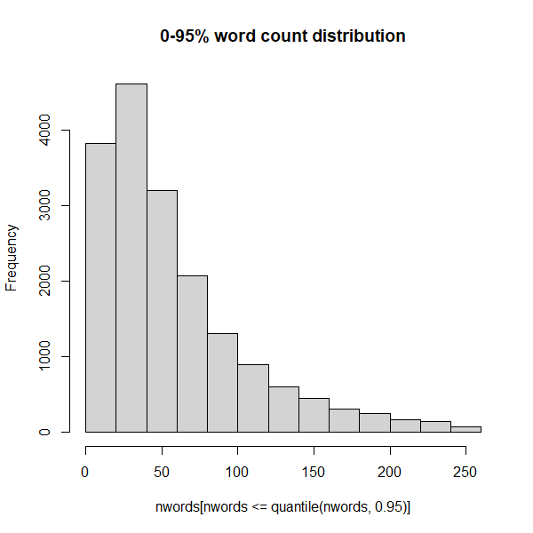
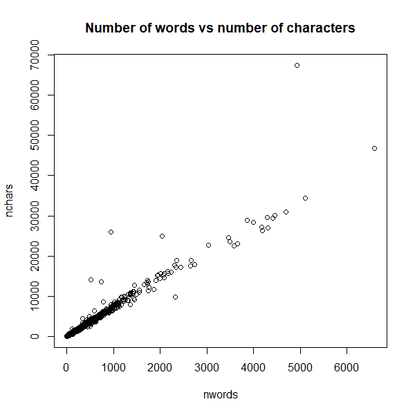
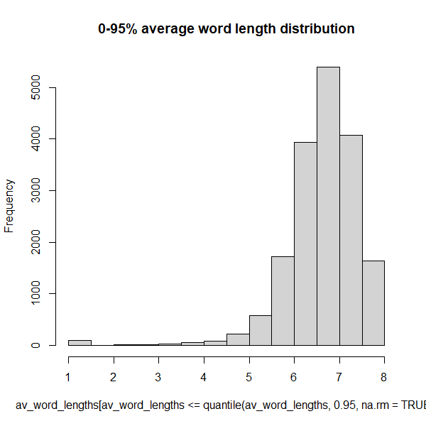
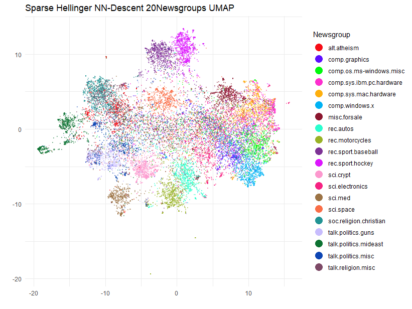
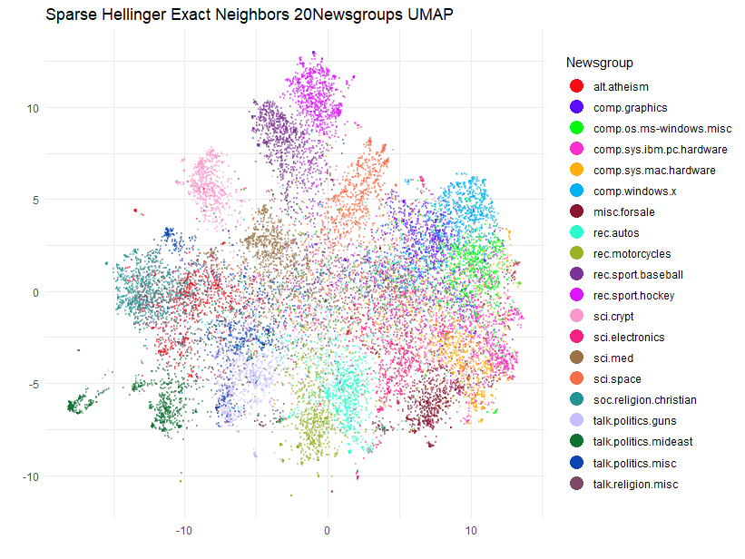
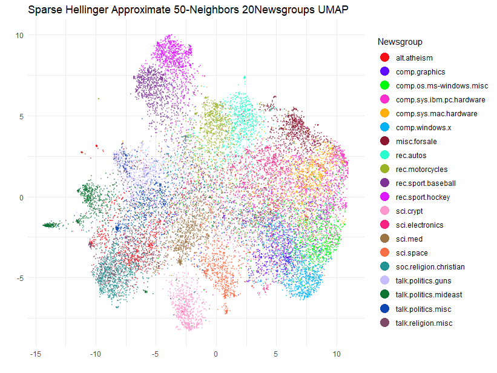
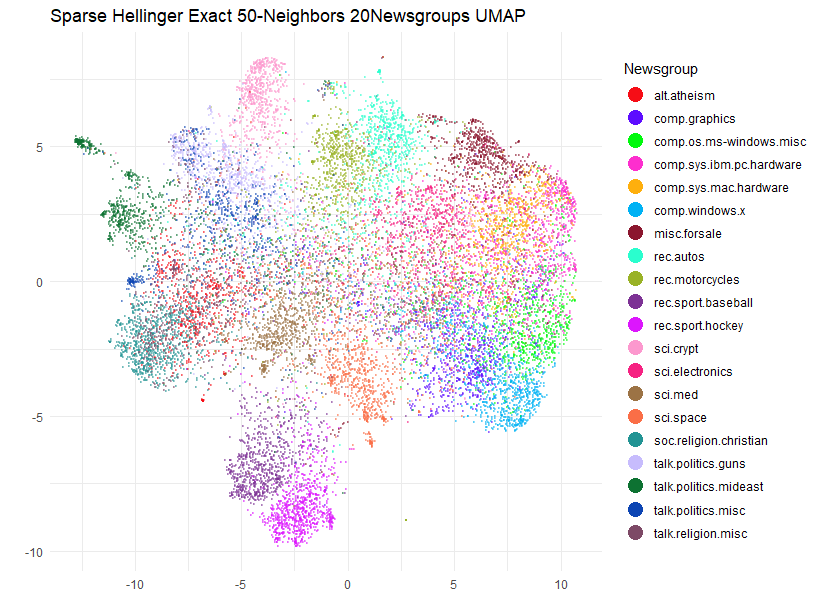
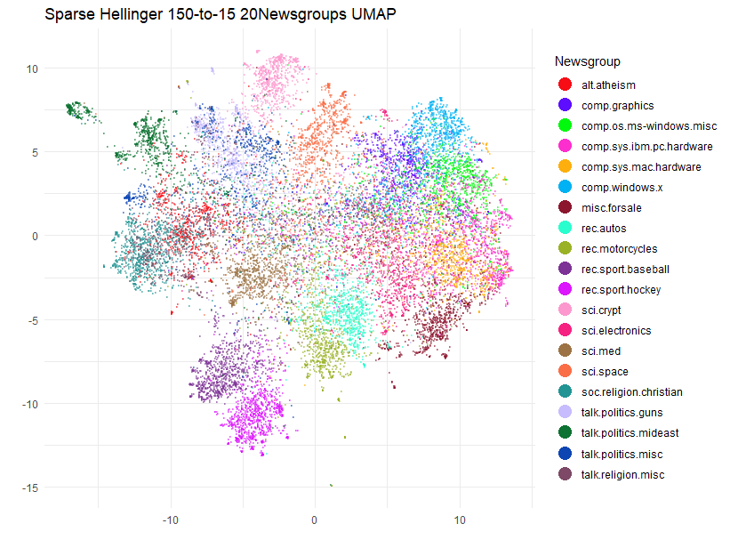

```{r, include = FALSE}
knitr::opts_chunk$set(
  collapse = TRUE,
  comment = "#>",
  eval = FALSE
)
```

## Text Analysis of the 20 Newsgroups Dataset

A great use case for working with sparse data is TF-IDF text analysis. Despite
the prevalence of deep-learning-based text embedding, TF-IDF is simple, far less
compute intensive and can be surprisingly effective. Most dimensionality
reduction methods don't work well with sparse data, and need the input data to
be dense. `uwot` is no different, but one of the Python UMAP's unique features
is that it can work with sparse data, due to its use of
[PyNNDescent](https://github.com/lmcinnes/pynndescent) for nearest neighbor
search.

There is a 
[Python UMAP with sparse data](https://umap-learn.readthedocs.io/en/latest/sparse.html)
tutorial that uses the [20 Newsgroups](http://qwone.com/~jason/20Newsgroups/)
dataset that I have long wanted to replicate in R. The main barriers have
been the lack of a straight-forward way to download the data and the lack of
a fast approximate nearest neighbor search package that can work with sparse
data.

The first problem is solved with the
[snedata](https://github.com/jlmelville/snedata) package, to which I recently
added a `download_twenty_newsgroups` function. That took up a large chunk of one
afternoon and evening. The second problem is solved by replicating the
PyNNDescent package in R. This took me a bit longer, but a mere 4 years later,
the [rnndescent](https://cran.r-project.org/package=rnndescent) package is
finally in a usable state. Consequently, the `uwot` package can now make use
of `rnndescent` and support sparse input via the `umap2` function.

So let's get started. Apart from the Python example above, some other good
resources for doing text analysis on this dataset can be found in chapter 9 of
[text mining with R](https://www.tidytextmining.com/usenet#usenet) and the
juicily-titled Python notebook 
[20 Newsgroups Secrets](https://github.com/Alvant/20-newsgroups-secrets).

## Downloading the 20 Newsgroups Dataset

The [20 Newsgroups](http://qwone.com/~jason/20Newsgroups/) dataset is (nearly)
20,000 usenet posts sampled (nearly) equally from 20 different newsgroups. The
webpage linked above contains more information on the data's provenance and
structure. We can use `snedata::download_twenty_newsgroups` to download it:

```{r download 20 newsgroups}
devtools::install_github("jlmelville/snedata")

ng20 <- snedata::download_twenty_newsgroups(subset = "all", verbose = TRUE)
```

The `subset` argument can be used to download only the training or test set
data but I will use all of it. The `verbose` argument is useful to see how
what it's doing: it will take a few minutes to download it. It's a `tar.gz` file
and unfortunately, I am unaware of a way to stream tar data directly into R,
so `download_twenty_newsgroups` will download the file to a temporary directory,
extract everything, and attempt to clean up afterwards. If something goes wrong
it should log the directory it downloaded to.

```{r 20 newsgroups dimensions}
dim(ng20)
```
```R
[1] 18846     6
```

The data is returned as a data frame with 6 columns:

```{r 20 newsgroups columns}
names(ng20)
```
```R
[1] "Id"        "FileId"    "Text"      "Subset"    "Label"     "Newsgroup"
```

The `Id` column is a unique identifier for each post, `FileId` is the filename
combined with the `Subset`, `Text` is the post text, `Subset` is either
`"train"` or `"test"`, `Label` is the integer label of the newsgroup and 
`Newsgroup` is the name of the newsgroup.

The columns we will be most interested in are the `Text` and `Newsgroup`, and
for some data manipulation we need to do, the `Id` so we can keep track of the
rows. Here's the first row without the `Text` column (we can safely ignore the
row id):

```{r 20 newsgroups first row}
ng20[1, -3]
```
```R
                   Id FileId Subset Label   Newsgroup
alt.atheism.1 train_1  49960  train     0 alt.atheism
```

And here's the first few characters of the text:

```{r 20 newsgroups first few characters}
substr(ng20[1, ]$Text, 1, 72)
```
```R
[1] "From: mathew <mathew@mantis.co.uk>\nSubject: Alt.Atheism FAQ: Atheist Res"
```

There is a *lot* more where that came from, which I invite you to investigate
(and fill your terminal with) yourself. Notably, `snedata` doesn't do any
processing of the posts, so the headers are still there, as are the footers
and any other quotations of previous posts that the current poster might be
replying to.

## Preprocessing the Data

Unless you get very luck with pre-cleaned datasets, text data usually requires a
fair amount of processing to turn it into a vector of numbers that UMAP can work
on, so we will need to do some text wrangling to start with. We'll need to
install [dplyr](https://dplyr.tidyverse.org/), 
[tidyr](https://tidyr.tidyverse.org/) and 
[stringr](https://stringr.tidyverse.org/), for this:

```{r install dplyr and tidyr}
install.packages(c("dplyr", "tidyr", "stringr"))
library(dplyr)
library(tidyr)
library(stringr)
```

[Text Mining with R](https://www.tidytextmining.com/usenet#usenet) is a good
place to start to get some ideas of what to do, but bear in mind the dataset
is structured a bit differently, so let's temporarily expand the dataset by
splitting the text on new lines like in the tidy text mining example so that
each row is a line in the original post:

```{r split text on new lines}
ng20spl <- ng20 |> separate_longer_delim(`Text`, delim = "\n")
dim(ng20spl)
```
```R
[1] 834780      6
```

Now the first row looks like:

```{r first row split}
ng20spl[1, ]
```
```R
       Id FileId                               Text Subset Label   Newsgroup
1 train_1  49960 From: mathew <mathew@mantis.co.uk>  train     0 alt.atheism
```

The first filtering is to remove headers (anything before the first blank line)
and footers (assumed to be anything after the first line of repeated hyphens):

```{r}
cleaned_text <- ng20spl |>
  group_by(`Newsgroup`, `Id`) |>
  filter(
    cumsum(`Text` == "") > 0,
    cumsum(str_detect(`Text`, "^--")) == 0
  ) |>
  ungroup()
dim(cleaned_text)
```
```R
[1] 599249      6
```

And this attempts to removed quoted text:

```{r}
cleaned_text <- cleaned_text |>
  filter(
    str_detect(`Text`, "^[^>]+[A-Za-z\\d]") |
      `Text` == "",
    !str_detect(`Text`, "writes(:|\\.\\.\\.)$"),
    !str_detect(`Text`, "^In article <")
  )
dim(cleaned_text)
```
```R
[1] 445080      6
```

These functions are a bit different from the ones used on the python side by
[scikit-learn](https://github.com/scikit-learn/scikit-learn/blob/3f89022fa04d293152f1d32fbc2a5bdaaf2df364/sklearn/datasets/_twenty_newsgroups.py) -- see the functions `strip_newsgroup_header`,
`strip_newsgroup_quoting` and `strip_newsgroup_footer`, but if the R functions
are good enough for the tidy text modelers, it's good enough for me.

Also, in the tidy text book, they explicitly remove two items "that contained a
large amount of non-text content". Specifically they are images, and you can
find out more about them in the "20 Newsgroups Secrets" notebook linked above
(don't get too excited). There seems to be other binary data in some of the
posts, so to try and catch more, I will end up filtering those out later.

The tidy text example goes on to examine the word frequencies for each newsgroup
as a whole, but we will go back to analyzing on a per post basis. Now, having
split the posts into lines, we need to unsplit them, and also re-associate
the other columns from the original `ng20` data:

```{r unsplit text}
text_unsplit <-
  cleaned_text |>
  group_by(`Id`) |>
  summarise(`Text` = paste(`Text`, collapse = " "))
text_unsplit <- ng20 |>
  select(-`Text`) |>
  left_join(text_unsplit, by = "Id")
text_unsplit <-
  text_unsplit[, c("Id", "FileId", "Text", "Subset", "Label", "Newsgroup")]
dim(text_unsplit)
```
```R
[1] 18846     6
```

Back to the original structure. This processing isn't perfect, but it should
do a decent job. Now we can do some actual text processing.

## Text Mining

I'm going to use the [tm](https://cran.r-project.org/package=tm) package for the
text mining:

```{r install tm}
install.packages("tm")
library(tm)
```

We are going to create a "corpus" from the text and then apply various
processing steps to normalize the text, such as handling whitespace, case,
removing punctuation and so on. When we create the `Corpus` initially, we also
convert the text encoding from `latin1` to `UTF-8` via the `iconv` function. As
far as I can tell, the 20 Newsgroups data is in `latin1` encoding (`sklearn`
also reads them in that encoding), which we will then convert to `UTF-8` for the
rest of the processing. There are still a few documents with odd formatting
characters but `tm` seems to deal with them without issue.

```{r create corpus}
corpus <-
  Corpus(VectorSource(iconv(text_unsplit$Text, "latin1", "UTF-8"))) |>
  tm_map(content_transformer(tolower)) |>
  tm_map(removePunctuation) |>
  tm_map(removeNumbers) |>
  tm_map(removeWords, stopwords("english")) |>
  tm_map(stripWhitespace)
length(corpus)
```
```R
[1] 18846
```

### Filtering Out Bad Documents

At this point, I take a bit of inspiration from `20 Newsgroups Secrets` and
start looking at the distribution of document lengths in terms of number of
words and number of characters. If our corpus really is mainly English text
we would expect to see some kind of rough relationship between these sorts of
values and any deviations are likely to be anomalies that need investigating.

This is a bit of a diversion from the business at hand, but we might as well
see if we can come up with some reasonable filter values using some simple
methods.

```{r number of words}
count_words <- function(doc) {
  doc |>
    strsplit(" ") |>
    unlist() |>
    length()
}

nwords <- sapply(corpus, count_words)
```

```{r summary of number of words}
summary(nwords)
```
```R
   Min. 1st Qu.  Median    Mean 3rd Qu.    Max. 
   0.00   24.00   46.00   84.42   86.00 6592.00 
```

Clearly there is quite a skew in terms of the number of words. Some messages
now have zero words, and one has nearly 7000. But the median is less than 50
words. Let's look at the distribution of the number of words, but stop at 95%
of the data to avoid the outliers:

```{r histogram of number of words}
hist(nwords[nwords <= quantile(nwords, 0.95)], main = "0-95% word count distribution")
```


So 95% of the data contains 250 words or less.

What is this massive document? Let's (carefully) take a look:

```{r longest document}
substr(ng20[which.max(nwords), ]$Text, 0, 80)
```
```R
[1] "From: jeh@cmkrnl.com\nSubject: Electrical wiring FAQ (was: A question about 120VA"
```

Ah, it's a FAQ. Ok that makes sense. Now let's look at the distribution of the
raw length of the documents in terms of number of characters:

```{r summary of number of characters}
nchars <- sapply(corpus, function(doc) {
  doc |> str_length()
})
summary(nchars)
```
```R
   Min. 1st Qu.  Median    Mean 3rd Qu.    Max. 
    0.0   158.0   310.0   594.6   593.0 67441.0 
```

Seems reminiscent of the word count distribution. So let's see how related they
are (you'd assume very related but you never know):

```{r correlation between number of words and number of characters}
plot(nwords, nchars, main = "Number of words vs number of characters")
```


Ok that's a very good relation, which makes those documents which don't appear
on the main trendline all the more suspicious. The easy way to deal with this
is to define an average word length:

```{r average word length}
avg_word_lengths <- nchars / nwords
summary(avg_word_lengths)
```
```R
   Min. 1st Qu.  Median    Mean 3rd Qu.    Max.    NA's 
  1.000   6.294   6.750   6.720   7.213  27.533      77 
```
Those `NA`'s are the documents with zero words. This looks like another rather
skewed distribution:

```{r histogram of average word lengths}
hist(avg_word_lengths[avg_word_lengths <= quantile(avg_word_lengths, 0.95, na.rm = TRUE)],
  main = "0-95% average word length distribution"
)
```



So 95% of the data has an average word length of 8 or less.

This gives us a bit of a feel for what might be some reasonable filter settings
to get rid of unsuitable data. The filters established by 
`20 Newsgroups Secrets` for document length based on word seem reasonable here:
less than 10 words is suspicious and 2000 or more words is also suspicious.

To avoid making this even longer than it needs to be, I won't be investigating 
the suspicious documents in this article.

```{r filter suspiciously short documents}
is_suspiciously_short <- function(doc) {
  doc |> count_words() <= 9
}
suspiciously_short_indices <- sapply(corpus, is_suspiciously_short)
corpus <- corpus[!suspiciously_short_indices]
text_unsplit <- text_unsplit[!suspiciously_short_indices, ]
length(corpus)
```
```R
[1] 17708
```

```{r filter suspiciously long documents}
is_suspiciously_long <- function(doc) {
  doc |> count_words() >= 2000
}
suspiciously_long_indices <- sapply(corpus, is_suspiciously_long)
corpus <- corpus[!suspiciously_long_indices]
text_unsplit <- text_unsplit[!suspiciously_long_indices, ]
length(corpus)
```
```R
[1] 17675
```

```{r filter suspiciously short words}
avg_word_len <- function(doc) {
  (doc |> str_length()) / (doc |> count_words())
}
has_suspiciously_short_words <- function(doc) {
  doc |> avg_word_len() < 4
}

suspiciously_short_word_indices <- sapply(corpus, has_suspiciously_short_words)
corpus <- corpus[!suspiciously_short_word_indices]
text_unsplit <- text_unsplit[!suspiciously_short_word_indices, ]
length(corpus)
```
```R
[1] 17670
```

```{r filter suspiciously long words}
has_suspiciously_long_words <- function(doc) {
  doc |> avg_word_len() > 15
}
suspiciously_long_word_indices <- sapply(corpus, has_suspiciously_long_words)
corpus <- corpus[!suspiciously_long_word_indices]
text_unsplit <- text_unsplit[!suspiciously_long_word_indices, ]
length(corpus)
```
```R
[1] 17666
```

Ok, I think we've done enough to move on.

## TF-IDF

The next step is to convert the corpus into a matrix of TF-IDF values:

```{r tf-idf}
tfidf <- weightTfIdf(DocumentTermMatrix(corpus))
dim(tfidf)
```
```R
[1] 17666 88894
```

Nearly 90,000 dimensions, each one a weighted word frequency. How sparse is it:

```{r tf-idf sparsity}
Matrix::nnzero(tfidf) / prod(dim(tfidf))
```
```R
0.0006920568
```

so less than 0.1% of the matrix is non-zero.

One way to proceed at this point would be to use a SVD that can work on sparse
matrices, such as [irlba](https://cran.r-project.org/package=irlba), and turn
this into a dense representation with far fewer dimensions. However this is slow
and takes up a lot of memory and you have to spend time working out how many
dimensions to use, which slows things down even more if you don't get it right
the first time.

Fortunately, now that `uwot` can use `rnndescent`, we can work on the sparse
data directly.

## UMAP with NN-Descent

To use `uwot` with sparse data we need to convert the TF-IDF matrix into a 
format from the [Matrix](https://cran.r-project.org/package=Matrix) package
that `rnndescent` can handle:

```{r convert to rnndescent format}
library(Matrix)
tfidf_sp <-
  sparseMatrix(
    i = tfidf$i,
    j = tfidf$j,
    x = tfidf$v,
    dims = dim(tfidf)
  )
```

For historical reasons to do with not breaking backwards compatibility, we can't
use the `umap` function with sparse input data. Instead we will use the `umap2`
function, which is a newer version of `umap` but with slightly better defaults
and which can take sparse matrix input. We also need to load the `rnndescent`
package.

```{r install rnndescent}
install.packages("rnndescent")
library(rnndescent)
```

In terms of non-default options, I'm going to use the `batch = TRUE` setting, 
a longer than usual optimization, and a non-zero `dens_scale` to model some of
the original density differences in the data (see the article on
[LEOPOLD](https://jlmelville.github.io/uwot/articles/leopold.html) for more
details). I will also save the nearest neighbors with `ret_nn = TRUE` so I can
compare them with the exact results we will calculate later.

```{r umap on sparse}
library(uwot)
ng20_umap <-
  umap2(
    X = tfidf_sp,
    nn_method = "nndescent",
    metric = "hellinger",
    n_epochs = 1000,
    batch = TRUE,
    dens_scale = 0.5,
    ret_nn = TRUE,
    verbose = TRUE
  )
```
```
Using nndescent for nearest neighbor search
UMAP embedding parameters a = 1.577 b = 0.8951
Read 17666 rows and found 88894 numeric columns
Using alt metric 'alternative-hellinger' for 'hellinger'
Initializing neighbors using 'tree' method
Calculating rp tree k-nearest neighbors with k = 15 n_trees = 17 max leaf size = 15 margin = 'explicit' using 6 threads
Using angular margin calculation
0%   10   20   30   40   50   60   70   80   90   100%
[----|----|----|----|----|----|----|----|----|----]
***************************************************
Extracting leaf array from forest
Creating knn using 32172 leaves
0%   10   20   30   40   50   60   70   80   90   100%
[----|----|----|----|----|----|----|----|----|----]
***************************************************
Running nearest neighbor descent for 14 iterations using 6 threads
0%   10   20   30   40   50   60   70   80   90   100%
[----|----|----|----|----|----|----|----|----|----]
***************************************************
Convergence: c = 170 tol = 264.99
Finished
Commencing smooth kNN distance calibration using 6 threads with target n_neighbors = 15
17 smooth knn distance failures
Initializing from normalized Laplacian + noise (using irlba)
Range-scaling initial input columns to 0-10
Commencing optimization for 1000 epochs, with 389106 positive edges using 6 threads
Using method 'leopold'
Optimizing with Adam alpha = 1 beta1 = 0.5 beta2 = 0.9 eps = 1e-07
0%   10   20   30   40   50   60   70   80   90   100%
[----|----|----|----|----|----|----|----|----|----|
**************************************************|
Optimization finished
```

If you follow along with the code here, you will *not* get the exact same
results as me when you plot them below, due to the stochastic nature of UMAP.
But you should see something similar (if you don't, please
[file an issue](https://github.com/jlmelville/uwot/issues)).

## Plot the Results

This is going to be a bit challenging to plot, as we have to have 20 unique
colors for the 20 newsgroups. Most palettes don't offer anything of that size,
so I am going to use the
[Polychrome](https://cran.r-project.org/package=Polychrome) package to generate
a palette with 20 colors which are hopefully reasonably distinguishable. This is
a similar approach to the Python package
[glasbey](https://github.com/lmcinnes/glasbey).

```{r create palette}
library(Polychrome)
set.seed(42)

palette <- as.vector(Polychrome::createPalette(
  length(levels(text_unsplit$Newsgroup)) + 2,
  seedcolors = c("#ffffff", "#000000"),
  range = c(10, 90)
)[-(1:2)])
```

I will also rotate the coordinates so they align along the principal axes:

```{r rotate}
ng20_umap_rotated <- prcomp(ng20_umap$embedding)$x
```

Ok, now to make the plot with [ggplot2](https://ggplot2.tidyverse.org/):

```{r plot}
library(ggplot2)

ggplot(
  data.frame(ng20_umap_rotated, Newsgroup = text_unsplit$Newsgroup),
  aes(x = PC1, y = PC2, color = Newsgroup)
) +
  geom_point(alpha = 0.4, size = 0.5) +
  scale_color_manual(values = palette) +
  theme_minimal() +
  labs(
    title = "Sparse Hellinger NN-Descent 20Newsgroups UMAP",
    x = "",
    y = "",
    color = "Newsgroup"
  ) +
  theme(legend.position = "right") +
  guides(color = guide_legend(override.aes = list(size = 5, alpha = 1)))
```



Although we can't compare this result too easily with the Python example, as
that one plots the training and test set separately, and there isn't a legend, I
think this has done a pretty good job of separating at least some of the 20
newsgroups.

## Finding Exact Nearest Neighbors

Before `uwot` supported using `rnndescent` internally for sparse data, this
article documented the process of using `rnndesent` directly with the 20
Newsgroups data and then integrating that with the `umap` function. This is
still a perfectly viable approach, especially if you want to use exact nearest
neighbors. `uwot` uses the nearest neighbor descent method to find approximate
nearest neighbors, which is faster but not exact. In what follows we'll use
`rnndescent` to find exact nearest neighbors by a brute force method and then
see what sort of difference that makes to the UMAP result.

I'll assume you've been following along so far, so that we have the
L1-normalized TF-IDF matrix `tfidf_spl1` and `rnndescent` loaded. Now let's use
the brute-force search in `rnndescent`. This dataset is small enough for us to
handle an exact search comfortably, at least if you have enough cores:

```{r nearest neighbors}
tfidfl1_hell_bf <-
  brute_force_knn(
    tfidf_sp,
    k = 15,
    metric = "hellinger",
    n_threads = 6,
    verbose = TRUE
  )
```
```
Using alt metric 'alternative-hellinger' for 'hellinger'
Calculating brute force k-nearest neighbors with k = 15 using 6 threads
0%   10   20   30   40   50   60   70   80   90   100%
[----|----|----|----|----|----|----|----|----|----]
***************************************************
Finished
```

This took about 35 seconds on my machine, whereas nearest neighbor descent only
took about 5 seconds. That said, in this case I am happy to pay the
price of the extra 30 seconds to avoid any issues due to approximation.

## UMAP with Exact Neighbors

We can now run UMAP with the exact neighbors. I will use the same parameters
in conjunction with `umap2` as I did with the approximate nearest neighbors:

```{r umap with exact nearest neighbors}
ng20_umap_exact <-
  umap2(
    X = NULL,
    nn_method = tfidfl1_hell_bf,
    n_epochs = 1000,
    batch = TRUE,
    dens_scale = 0.5,
    verbose = TRUE
  )
```
```
UMAP embedding parameters a = 1.577 b = 0.8951
Commencing smooth kNN distance calibration using 6 threads with target n_neighbors = 15
16 smooth knn distance failures
Initializing from normalized Laplacian + noise (using irlba)
Range-scaling initial input columns to 0-10
Commencing optimization for 1000 epochs, with 377272 positive edges using 6 threads
Using method 'leopold'
Optimizing with Adam alpha = 1 beta1 = 0.5 beta2 = 0.9 eps = 1e-07
0%   10   20   30   40   50   60   70   80   90   100%
[----|----|----|----|----|----|----|----|----|----|
**************************************************|
Optimization finished
```

## Plot the Exact Neighbors UMAP Results

```{r plot exact neighbors UMAP}
ggplot(
  data.frame(prcomp(ng20_umap_exact)$x, Newsgroup = text_unsplit$Newsgroup),
  aes(x = PC1, y = PC2, color = Newsgroup)
) +
  geom_point(alpha = 0.4, size = 0.5) +
  scale_color_manual(values = palette) +
  theme_minimal() +
  labs(
    title = "Sparse Hellinger Exact Neighbors 20Newsgroups UMAP",
    x = "",
    y = "",
    color = "Newsgroup"
  ) +
  theme(legend.position = "right") +
  guides(color = guide_legend(override.aes = list(size = 5, alpha = 1)))
```



Actually, although the plots share a lot of the same features there are some
noticeable differences to some of the cluster placements. 

## Hubness

What's going on here? If you want, you can re-run the UMAP with the exact
nearest neighbors a few times, which will tell us how much the result varies due
to the random selection during negative sampling. I will leave that as an
exercise for you. Having tried it myself, the plot is pretty stable (the
`sci.space` cluster moves between two locations). So the reason for the
differences is going to be down to the performance of the approximate nearest
neighbors. As we have gone to the trouble of generating the exact nearest
neighbors we can answer the question of how well did we actually do in
reproducing the exact neighbors? `rnndescent` has a `neighbor_overlap` function
we can use which will return a value of 0 (no overlap between two sets of
neighbors) and 1 (perfect overlap):

```{r compare overlap}
neighbor_overlap(ng20_umap$nn$hellinger, tfidfl1_hell_bf)
```
```
[1] 0.7484169
```

So about 75% accuracy, that's less than the 90% that I would usually be happier
with. I'm not totally surprised as high dimensional datasets tend to contain
"hubs" (items which appear on the nearest neighbor lists of many other items)
and these tend to make it hard for any approximate nearest neighbor method to do
a good exploration. Does this combination of dataset, `n_neighbors` and `metric`
result in the neighbors having a hub. Once again `rnndescent` can help us with
its `k_occur` function which will count the k-occurrence for each item: the
number of times an item appears in the nearest neighbor lists of other items
(aka the number of reverse neighbors). The hubness for a dataset can be defined
as the maximum number of times any item appears in the k-occurrence list, and
I am going to normalize that with respect to `n_neighbors`:

```{r hubness}
tfidfl1_hell_bf |> k_occur() |> max() / 15
```
```
20.13333
```

A dataset where each item gets its fair share of reverse neighbors would result
in a maximum k-occurrence of `n_neighbors`, or in this case a normalized hubness
of 1. So we are at a much larger value than that. My own personal experience is
that if the normalized hubness exceeds 10, then approximate nearest neighbors
methods will struggle to do well, at least if you are looking for relatively low
values of `n_neighbors` with default settings. Incidentally, you don't need the
exact nearest neighbors to detect hubness, the approximate results will also act
as a good diagnostic:

```{r hubness with approximate}
ng20_umap$nn$hellinger |> k_occur() |> max() / 15
```
```
30.46667
```

Not necessarily good at reproducing the result from the exact neighbors, but it
will certainly tell you that something is up.

## UMAP with More Neighbors

So what are we going to do about this? In these cases, usually increasing
`n_neighbors` helps. I'm going to look at `n_neighbors = 50`. We will also want
the equivalent brute force results to see if it helped:

```{r more exact neighbors}
tfidfl1_hell_bf_50 <-
    brute_force_knn(
        tfidf_sp,
        k = 50,
        metric = "hellinger",
        n_threads = 6,
        verbose = TRUE
    )
```

Let's see what's up with the hubness:

```{r hubness with more exact}
tfidfl1_hell_bf_50 |> k_occur() |> max() / 50
```
```
[1] 20.1
```

Not that different to the `n_neighbors = 15` result, but I have more confidence
that nearest neighbor descent will be able to handle this level of hubness given
the larger `n_neighbors` value. But let's find out.

```{r umap with more approximate neighbors}
ng20_umap_50 <-
    umap2(
        X = tfidf_sp,
        nn_method = "nndescent",
        metric = "hellinger",
        n_neighbors = 50,
        n_epochs = 1000,
        batch = TRUE,
        dens_scale = 0.5,
        ret_nn = TRUE,
        verbose = TRUE
    )
```

```{r hubness with more approximate}
ng20_umap_50$nn$hellinger |> k_occur() |> max() / 50
```
```
[1] 21.12
```

A similar level of hubness reported, but more importantly, what's the accuracy
like?

```{r compare overlap with more}
neighbor_overlap(ng20_umap_50$nn$hellinger, tfidfl1_hell_bf_50)
```
```
[1] 0.9553753
```

96%! Much better. Let's see how the UMAP plot looks:

```{r ggplot with more}
ggplot(
  data.frame(prcomp(ng20_umap_50$embedding)$x, Newsgroup = text_unsplit$Newsgroup),
  aes(x = PC1, y = PC2, color = Newsgroup)
) +
  geom_point(alpha = 0.4, size = 0.5) +
  scale_color_manual(values = palette) +
  theme_minimal() +
  labs(
    title = "Sparse Hellinger Approximate 50-Neighbors 20Newsgroups UMAP",
    x = "",
    y = "",
    color = "Newsgroup"
  ) +
  theme(legend.position = "right") +
  guides(color = guide_legend(override.aes = list(size = 5, alpha = 1)))
```



Well, the clusters have spread out a bit (expected due to the 3-fold increase
in `n_neighbors`) but they have also continued to move around a bit compared
to the `n_neighbors = 15` result. Hmm, let's see if at least we have agreement
with the exact case for `n_neighbors = 50`:

```{r UMAP on exact 50}
ng20_umap_exact_50 <-
    umap2(
        X = NULL,
        nn_method = tfidfl1_hell_bf_50,
        n_epochs = 1000,
        batch = TRUE,
        dens_scale = 0.5,
        verbose = TRUE
    )

ggplot(
    data.frame(prcomp(ng20_umap_exact_50)$x, Newsgroup = text_unsplit$Newsgroup),
    aes(x = PC1, y = PC2, color = Newsgroup)
) +
    geom_point(alpha = 0.4, size = 0.5) +
    scale_color_manual(values = palette) +
    theme_minimal() +
    labs(
        title = "Sparse Hellinger Exact 50-Neighbors 20Newsgroups UMAP",
        x = "",
        y = "",
        color = "Newsgroup"
    ) +
    theme(legend.position = "right") +
    guides(color = guide_legend(override.aes = list(size = 5, alpha = 1)))
```



Again, some of the clusters are on the move compared to the approximate case.
It seems that the locations of `sci.crypt` and the
`rec.sports.baseball`/`rec.sports.hockey` pair are particularly sensitive.

## UMAP with Even More Neighbors

The next step would be to increase `n_neighbors` even further and see if results
are more stable. The maximum I usually consider is `n_neighbors = 150`: this
is the sort of number that would be used by methods like t-SNE with a fairly
large perplexity of 50. Fortunately, in my testing the results for this
value of `n_neighbors` actually *are* stable so we don't need to go higher this
time. To get something that visually resembles the original `n_neighbors = 15`
result, my strategy is to run UMAP with progressively smaller values of
`n_neighbors` using the output of the previous run as the initialization. This
isn't as time consuming as it could be because we only need to do the nearest
neighbor search once and the optimizations before the final step can use the 
faster t-UMAP gradient, which will be used by `umap2` if it detects `a = 1` 
and `b = 1` being passed. The following uses `n_neighbors = 150`, 
`n_neighbors = 50` and then finished off at `n_neighbors = 15`:

```{r 150-to-15 UMAP}
ng20_umap_150 <- umap2(
  X = tfidf_sp,
  nn_method = "nndescent",
  metric = "hellinger",
  n_epochs = 1000,
  batch = TRUE,
  verbose = TRUE,
  n_neighbors = 150,
  a = 1,
  b = 1,
  ret_nn = TRUE
)

ng20_umap_150_50 <- umap2(
  X = tfidf_sp,
  nn_method = list(
    idx = ng20_umap_150$nn$hellinger$idx[, 1:50],
    dist = ng20_umap_150$nn$hellinger$dist[, 1:50]
  ),
  n_epochs = 1000,
  batch = TRUE,
  verbose = TRUE,
  a = 1,
  b = 1,
  init = ng20_umap_150$embedding
)

ng20_umap_150_50_15 <- umap2(
  X = tfidf_sp,
  nn_method = list(
    idx = ng20_umap_150$nn$hellinger$idx[, 1:15],
    dist = ng20_umap_150$nn$hellinger$dist[, 1:15]
  ),
  n_epochs = 1000,
  batch = TRUE,
  verbose = TRUE,
  dens_scale = 0.5,
  init = ng20_umap_150_50
)
ggplot(
    data.frame(prcomp(ng20_umap_150_50_15)$x, Newsgroup = text_unsplit$Newsgroup),
    aes(x = PC1, y = PC2, color = Newsgroup)
) +
    geom_point(alpha = 0.4, size = 0.5) +
    scale_color_manual(values = palette) +
    theme_minimal() +
    labs(
        title = "Sparse Hellinger Exact 150-to-15 20Newsgroups UMAP",
        x = "",
        y = "",
        color = "Newsgroup"
    ) +
    theme(legend.position = "right") +
    guides(color = guide_legend(override.aes = list(size = 5, alpha = 1)))
```


This strategy can work well if you can find a suitable starting value for
`n_neighbors` that isn't too onerous. Bear in mind that quite apart from the
computational cost of finding a large number of neighbors and the consequent
increase in number of edges that need optimizing, a more "global" setting is not
always better as you could be short-circuiting the manifold structure of the
data. It seems to have worked out in this case, though, and repeated runs give
a layout which is much more stable than the original `n_neighbors = 15` case.

## Conclusion

If you install `rnndescent` and use the `umap2` function, it's possible to embed
sparse high-dimensional datasets using UMAP and you can even use relatively
exotic metrics like Hellinger divergence.

Be aware that high-dimensional datasets can contain hubs. For low values of
`n_neighbors`, you may not get as high nearest neighbor accuracies as you are
used to. `rnndescent` has functions which can help detect hubness. Increasing
`n_neighbors` can help, but you should still be wary of over-interpreting
the relative positions of clusters in the output. Yes, I know everyone says this
but it bears repeating because the temptation is always there. I recommend
re-running your UMAP results multiple times with any given settings, even if
you have exact nearest neighbors, and you should also repeat with different
values of `n_neighbors` (e.g. `50` and/or `150`). "Annealing" the `n_neighbors`
value down in a series of optimizations can work out well.
