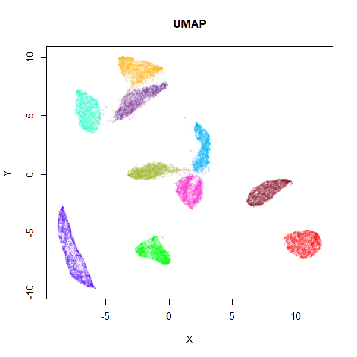
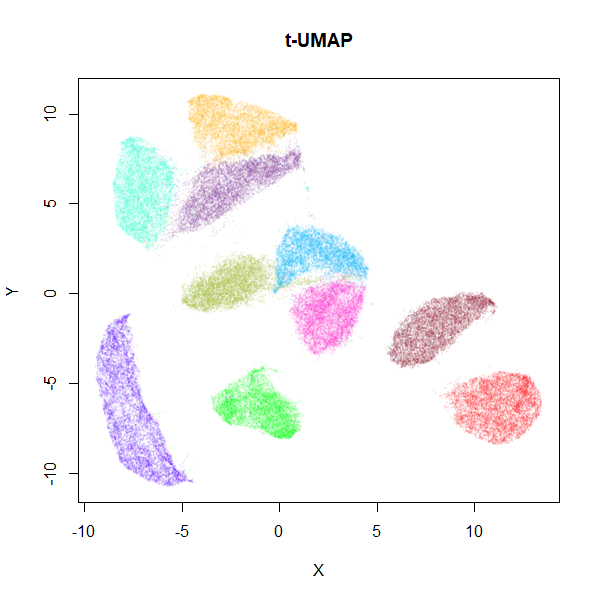

```{r, include = FALSE}
knitr::opts_chunk$set(
  collapse = TRUE,
  comment = "#>"
)
```

If you choose the UMAP curve parameters to be `a = 1` and `b = 1`, you get
back the Cauchy distribution used in
[t-Distributed Stochastic Neighbor Embedding](https://lvdmaaten.github.io/tsne/)
and [LargeVis](https://arxiv.org/abs/1602.00370). This also happens to
significantly simplify the gradient leading to a noticeable speed-up.

For MNIST:

```{r install and download, eval = FALSE}
library(uwot)
# install snedata package from github
# pak::pkg_install("jlmelville/snedata")
mnist <- snedata::download_mnist()
```

I saw the optimization time drop from 66 seconds with UMAP:

```{r umap, eval = FALSE}
mnist_umap <- umap(mnist, n_neighbors = 15)
```


```{r, echo = FALSE, out.width = "75%", fig.cap = "MNIST UMAP"}

```

to 18 seconds with t-UMAP:

```{r tumap, eval = FALSE}
mnist_tumap <- tumap(mnist, n_neighbors = 15)
```

```{r, echo = FALSE, out.width = "75%", fig.cap = "MNIST t-UMAP"}

```

You will still spend most of the time in the nearest neighbor search, so you
will really see a difference in terms of total time with larger values of
`n_epochs`. The trade off, as you can see, is that you will see larger, more
spread-out clusters than with the typical UMAP settings (they're still more
compact than you see in t-SNE, however). I think it's worth the trade-off.

Note that using `umap(a = 1, b = 1)` doesn't use the simplified gradient, so
you won't see any speed-up that way.

Some examples comparing UMAP and t-UMAP are in the
[examples](https://jlmelville.github.io/uwot/articles/umap-examples.html)
article.


