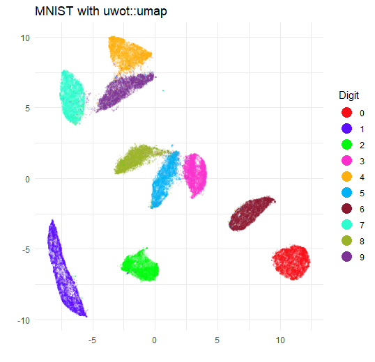
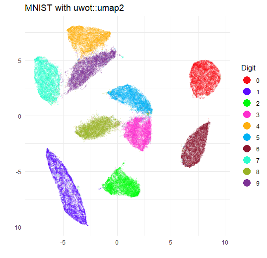
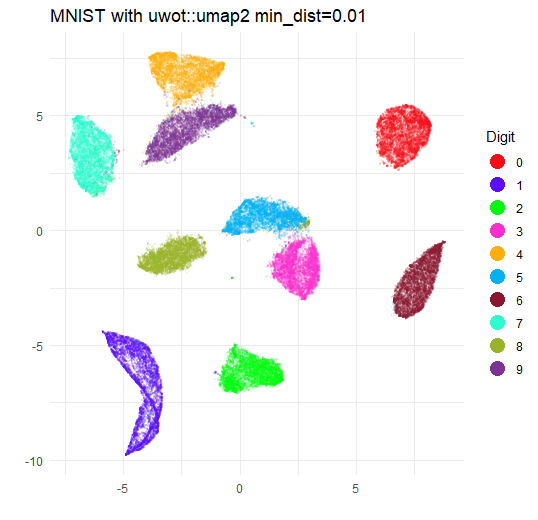

```{r, include = FALSE}
knitr::opts_chunk$set(
  collapse = TRUE,
  comment = "#>",
  eval = FALSE
)
```

`umap2` is a new function that works a lot like `umap`, but updates some
defaults to make it easier to use, and to bring it a bit more in line with the
Python UMAP implementation. The main differences are the following defaults:

* `min_dist = 0.1` (and used to be `0.01`) It should always
have had this value, I just messed up when I initially attempted to reproduce
the default parameters from the Python UMAP package.
* `init_sdev = "range"`. This scales the input coordinates between 0-10. I am
pretty sure that this was introduced in the Python UMAP package after I wrote
`uwot`, but we might as well follow suit.
* `n_epochs = 500`. In `umap` (and Python UMAP) the default is 200 epochs unless
the dataset is small (< 4,096 items). I think it's better to just pick one
default value, and with `batch = TRUE`, you need slightly more epochs.
* `batch = TRUE`. This means use the Adam optimizer rather than the asynchronous
stochastic gradient descent method. I find that in the vast majority of cases
you get quite equivalent results, at the cost of needing a slightly larger value
of `n_epochs`, but that you get more consistent results when using multiple
threads, so you can ameliorate the cost of the extra epochs by using more
threads.
* `n_sgd_threads`, speaking of threads, if you go with `batch = TRUE`, then
`n_sgd_threads` will be set to the same number of threads that is used to find
nearest neighbors and create the edge weights (controlled by `n_threads`). By
default that's the available number of threads divided by 2. For `umap`, the
default `n_sgd_threads` is always 1 because of concerns around reproducibility.
Note that even with a fixed seed and number of threads, the reproducibility 
concerns don't fully go away with `batch = TRUE` unless the nearest neighbor
search is not subject to stochastic effects and usually it will be.
* If you have [RcppHNSW](https://cran.r-project.org/package=RcppHNSW) 
installed, it will be used instead of Annoy. But bear in mind that the only
supported `metric`s are `euclidean` and `cosine`.
* If you don't RcppHNSW installed, but you do have
[rnndescent](https://cran.r-project.org/package=rnndescent) installed, that will
be used instead of Annoy.
* If you use `rnndescent` for neighbors (whether because you have it installed
and don't have `RcppHNSW` installed or because you have specified it with
`nn_method = "nndescent"`), then you can use sparse matrices (of class
`dgCMatrix`) as input (i.e. the `X` parameter). In `umap` sparse matrix input is
assumed to be a sparse distance matrix. As a result you *cannot* use sparse
distance matrices as input to `umap2` but I very much doubt if anyone was using
that feature, so this is a good trade-off.
* If you set `a = 1, b = 1` (and you don't specify `dens_scale`), then the
faster `tumap` gradient will be used.

These are not big changes so don't expect large differences in behavior, but I
do strongly recommend installing (and loading) `RcppHNSW` and `rnndescent`. I'll
use the MNIST digits for a comparison. Use the `snedata` package from github for
this:

```{r install snedata}
# install.packages("pak")
pak::pkg_install("jlmelville/snedata")

# or
# install.packages("devtools")
# devtools::install_github("jlmelville/snedata")
```

```{r load mnist}
mnist <- snedata::download_mnist()
```

Now let's run `umap` and `umap2` on the MNIST data using their defaults.

```{r umap}
library(uwot)

set.seed(42)
mnist_umap <- umap(mnist)
```

Install `RcppHNSW` and `rnndescent` if you haven't already.

```{r install RcppHNSW and rnndescent}
install.packages(c("RcppHNSW", "rnndescent"))
```

With these libraries installed `umap2` will use `RcppHNSW` by default.

```{r umap2}
library(RcppHNSW)
library(rnndescent)

set.seed(42)
mnist_umap2 <- umap2(mnist)
```


```{r plot umap setup}
#install.packages(c("ggplot2", "Polychrome"))
library(ggplot2)
library(Polychrome)

set.seed(42)
palette <- as.vector(Polychrome::createPalette(
  length(levels(mnist$Label)) + 2,
  seedcolors = c("#ffffff", "#000000"),
  range = c(10, 90)
)[-(1:2)])
```


```{r plot umap}
ggplot(
    data.frame(mnist_umap, Digit = mnist$Label),
    aes(x = X1, y = X2, color = Digit)
) +
    geom_point(alpha = 0.1, size = 0.5) +
    scale_color_manual(values = palette) +
    theme_minimal() +
    labs(
        title = "MNIST with uwot::umap",
        x = "",
        y = "",
        color = "Digit"
    ) +
    theme(legend.position = "right") +
    guides(color = guide_legend(override.aes = list(size = 5, alpha = 1)))
```



```{r plot umap2}
ggplot(
  data.frame(mnist_umap2, Digit = mnist$Label),
  aes(x = X1, y = X2, color = Digit)
) +
  geom_point(alpha = 0.5, size = 1.0) +
  scale_color_manual(values = palette) +
  theme_minimal() +
  labs(
    title = "MNIST with uwot::umap2",
    x = "",
    y = "",
    color = "Digit"
  ) +
  theme(legend.position = "right") +
  guides(color = guide_legend(override.aes = list(size = 5, alpha = 1)))
```



The biggest difference is that the clusters are somewhat larger and closer
together. This is due to the increase in `min_dist`. If you re-run with
`min_dist = 0.01` you will get a plot that is very similar to the `umap` plot.

```{r umap2 min_dist}
set.seed(42)
mnist_umap2 <- umap2(mnist, min_dist = 0.01)
```

I will spare you the ggplot2 incantation and go straight to the image:



So there's not much difference in whether you use `umap2` or `umap`. In general,
RcppHNSW and rnndescent can find nearest neighbors at a given level of quality
a bit faster than Annoy does and even if you deviate from the default settings,
you probably have less to type with `umap2` than `umap`.
