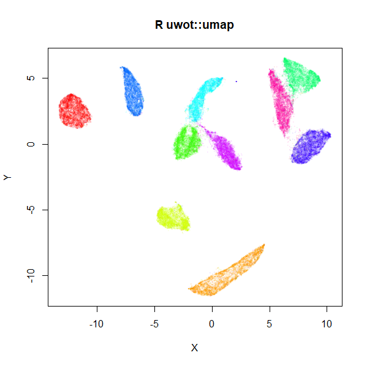

```{r, include = FALSE}
knitr::opts_chunk$set(
  collapse = TRUE,
  comment = "#>"
)
```

```{r setup}
library(uwot)
library(RSpectra)
```

`uwot` is the a package for implementing the UMAP dimensionality reduction 
method. For more information on UMAP, see the 
[original paper](https://arxiv.org/abs/1802.03426) and the 
[Python package](https://github.com/lmcinnes/umap).

We'll use the `iris` dataset in these examples. It's not the ideal dataset
because it's not terribly large nor high-dimensional (with only 4 numeric
columns), but you'll get the general idea.

The default output dimensionality of UMAP is into two-dimensions, so it's
amenable for visualization, but you can set a larger value with `n_components`.
In this vignette we'll stick with two dimensions. We will need a function to
make plotting easier:

```{r plot function}
kabsch <- function(pm, qm) {
  pm_dims <- dim(pm)
  if (!all(dim(qm) == pm_dims)) {
    stop(call. = TRUE, "Point sets must have the same dimensions")
  }
  # The rotation matrix will have (ncol - 1) leading ones in the diagonal
  diag_ones <- rep(1, pm_dims[2] - 1)

  # center the points
  pm <- scale(pm, center = TRUE, scale = FALSE)
  qm <- scale(qm, center = TRUE, scale = FALSE)

  am <- crossprod(pm, qm)

  svd_res <- svd(am)
  # use the sign of the determinant to ensure a right-hand coordinate system
  d <- determinant(tcrossprod(svd_res$v, svd_res$u))$sign
  dm <- diag(c(diag_ones, d))

  # rotation matrix
  um <- svd_res$v %*% tcrossprod(dm, svd_res$u)

  # Rotate and then translate to the original centroid location of qm
  sweep(t(tcrossprod(um, pm)), 2, -attr(qm, "scaled:center"))
}
iris_pca2 <- prcomp(iris[, 1:4])$x[, 1:2]
plot_umap <- function(coords, col = iris$Species, pca = iris_pca2) {
  plot(kabsch(coords, pca), col = col, xlab = "", ylab = "")
}
```

Most of this code is just the
[kabsch algorithm](https://en.wikipedia.org/wiki/Kabsch_algorithm)
to align two point sets, which I am going to use to align the results of UMAP
over the first two principal components. This is to keep the relative
orientation of the output the same across different plots which makes it a bit
easier to see the differences between them. UMAP is a stochastic algorithm
so the output will be different each time you run it and small changes to the
parameters can affect the *absolute* values of the coordinates, although the
interpoint differences are usually similar. There's no need to go to such
trouble in most circumstances: the output of `umap` is a perfectly useful
2D matrix of coordinates you can pass into a plotting function with no further
processing required.

## Basic UMAP

The defaults of the `umap` function should work for most datasets. No scaling
of the input data is done, but non-numeric columns are ignored:

```{r basic UMAP}
set.seed(42)
iris_umap <- umap(iris)
plot_umap(iris_umap)
```

### Parameters

`uwot` has accumulated many parameters over time, but most of the time there
are only a handful you need worry about. The most important ones are:

#### `min_dist`

This is a mainly aesthetic parameter, which defines how close points can get in
the output space. A smaller value tends to make any clusters in the output more
compact. You should experiment with values between 0 and 1, although don't
choose exactly zero. The default is 0.01, which seems like it's a bit small for
`iris`. Let's crank up `min_dist` to `0.3`:

```{r min_dist 0.5}
set.seed(42)
iris_umap_md05 <- umap(iris, min_dist = 0.3)
plot_umap(iris_umap_md05)
```

This has made the clusters bigger and closer together, so we'll use 
`min_dist = 0.3` for the other examples with `iris`.

#### `n_neighbors`

This defines the number of items in the dataset that define the neighborhood
around each point. Set it too low and you will get a more fragmented layout.
Set it too high and you will get something that will miss a lot of local 
structure.

Here's a result with 5 neighbors:

```{r 5 neighbors}
set.seed(42)
iris_umap_nbrs5 <- umap(iris, n_neighbors = 5, min_dist = 0.3)
plot_umap(iris_umap_nbrs5)
```

It's not hugely different from the default of 15 neighbors, but the clusters
are a bit more broken up. 

There should be a more pronounced difference going the other way and looking at
100 neighbors:

```{r 100 neighbors}
set.seed(42)
iris_umap_nbrs100 <- umap(iris, n_neighbors = 100, min_dist = 0.3)
plot_umap(iris_umap_nbrs100)
```

Here there is a much more uniform appearance to the results. It's always worth
trying a few different values of `n_neighbors`, especially larger values,
although larger values of `n_neighbors` will lead to longer run times. Sometimes
small clusters that you think are meaningful may in fact be artifacts of setting
`n_neighbors` too small, so starting with a larger value and looking at the
effect of reducing `n_neighbors` can help you avoid over interpreting results.

#### `init`

The default initialization of UMAP is to use spectral initialization, which acts
upon the (symmetrized) k-nearest neighbor graph that is in determined by your
choice of `n_neighbors`. This is usually a good choice, but it involves a very
sparse matrix, which can sometimes be a bit *too* sparse, which leads to numerical
difficulties which manifest as slow run times or even hanging calculations. If
your dataset causes these issues, you can either try increasing `n_neighbors`
but I have seen cases where that would be inconvenient in terms of CPU and RAM
usage. An alternative is to use the first two principal components of the data,
which at least uses the data you provide to give a solid global picture of the
data that UMAP can refine. It's not appropriate for every dataset, but in most
cases, it's a perfectly good alternative.

The only gotcha with it is that depending on the scaling of your data, the 
initial coordinates can have large inter-point distances. UMAP will not optimize
that well, so such an output should be scaled to a small standard deviation.
If you set `init = "spca"`, it will do all that for you, although to be more
aligned with the UMAP coordinate initialization, I recommend you also set
`init_sdev = "range"` as well. `init_sdev` can also take a numerical value
for the standard deviation. Values from `1e-4` to `10` are reasonable, but I
recommend you stick to the default of `"range"`.

```{r spca init}
set.seed(42)
iris_umap_spca <-
  umap(iris,
    init = "spca",
    init_sdev = "range",
    min_dist = 0.3
  )
plot_umap(iris_umap_spca)
```

This doesn't have a big effect on `iris`, but it's good to know about this as
an option: and it can also smooth out the effect of changing `n_neighbors` on
the initial coordinates with the standard spectral initialization, which can
make it easier to see the effect of changing `n_neighbors` on the final result.

Some other `init` options to know about:

* `"random"`: if the worst comes to the worst, you can always fall back to
randomly assigning the initial coordinates. You really want to avoid this if you
can though, because it will take longer to optimize the coordinates to the
same quality, so you will need to increase `n_epochs` to compensate. Even if you
do that, it's *much* more likely that you will end up in a minimum that is less
desirable than one based on a good initialization. This will make interpreting
the results harder, as you are more likely to end up with different clusters
beings split or mixed with each other.
* If you have some coordinates you like from another method, you can pass them
in as a matrix. But remember will probably want to scale them with `init_sdev`
though.

#### `dens_scale`

The `dens_scale` parameter varies from 0 to 1 and controls how much of the
relative densities of the input data is attempted to be preserved in the
output.

```{r UMAP with density scaling}
set.seed(42)
iris_umapds <- umap(iris, min_dist = 0.3, dens_scale = 0.5)
plot_umap(iris_umapds)
```

This has shrunk the black cluster on the left of the plot (those are of species
`setosa`), which reflect that the density of the `setosa` points is less spread
out in the input data than the other two species. For more on `dens_scale`
please read its dedicated
[article](https://jlmelville.github.io/uwot/articles/leopold.html).

## Embedding New Data

Once you have an embedding, you can use it to embed new data, although you need
to remember to ask for a "model" to return. Instead of just the coordinates, you
will now get back a list which contains all the extra parameters you will need
for transforming new data. The coordinates are still available in the
`$embedding` component.

Let's try building a UMAP with just the `setosa` and `versicolor` iris species:

```{r create a UMAP model}
set.seed(42)

iris_train <- iris[iris$Species %in% c("setosa", "versicolor"), ]
iris_train_umap <-
  umap(iris_train, min_dist = 0.3, ret_model = TRUE)
plot(
  iris_train_umap$embedding,
  col = iris_train$Species,
  xlab = "",
  ylab = "",
  main = "UMAP setosa + versicolor"
)
```

Next, you can use `umap_transform` to embed the new points:


```{r embed new coordinates}
iris_test <- iris[iris$Species == "virginica", ]
set.seed(42)
iris_test_umap <- umap_transform(iris_test, iris_train_umap)
plot(
  rbind(iris_train_umap$embedding, iris_test_umap),
  col = iris$Species,
  xlab = "",
  ylab = "",
  main = "UMAP transform virginica"
)
```

The green points in the top-right show the embedded data. Note that the original
(black and red) clusters do not get optimized any further. While we haven't
perfectly reproduced the full UMAP, the `virginica` points are located in more
or less the right place, close to the `versicolor` items. Just like with any
machine learning method, you must be careful with how you choose your training
set.

## Supported Distances

For small (N < 4096) and Euclidean distance, exact nearest neighbors are found
using the [FNN](https://cran.r-project.org/package=FNN) package. Otherwise,
approximate nearest neighbors are found using
[RcppAnnoy](https://cran.r-project.org/package=RcppAnnoy). The supported
distance metrics (set by the `metric` parameter) are:

* Euclidean
* Cosine
* Pearson Correlation (`correlation`)
* Manhattan
* Hamming

Exactly what constitutes the cosine distance can differ between packages. `uwot`
tries to follow how the Python version of UMAP defines it, which is 
1 minus the cosine similarity. This differs slightly from how Annoy defines its
angular distance, so be aware that `uwot` internally converts the Annoy version 
of the distance. Also be aware that the Pearson correlation distance is the
cosine distance applied to row-centered vectors.

If you need other metrics, and can generate the nearest neighbor info
externally, you can pass the data directly to `uwot` via the `nn_method`
parameter. Please note that the Hamming support is a lot slower than the
other metrics. I do not recommend using it if you have more than a few hundred
features, and even then expect it to take several minutes during the index
building phase in situations where the Euclidean metric would take only a few
seconds.

## Multi-threading support

Parallelization can be used for the nearest
neighbor index search, the smooth knn/perplexity calibration, and the
optimization, which is the same approach that
[LargeVis](https://github.com/lferry007/LargeVis) takes.

You can (and should) adjust the number of threads via the `n_threads`, which
controls the nearest neighbor and smooth knn calibration, and the
`n_sgd_threads` parameter, which controls the number of threads used during
optimization. For the `n_threads`, the default is the number of available cores.
For `n_sgd_threads` the default is `0`, which ensures reproducibility of results
with a fixed seed.

## Python Comparison

For the datasets I've tried it with, the results look at least reminiscent of
those obtained using the
[official Python implementation](https://github.com/lmcinnes/umap).
Below are results for the 70,000 MNIST digits (downloaded using the
[snedata](https://github.com/jlmelville/snedata) package). Below,
is the result of using the official Python UMAP implementation
(via the [reticulate](https://cran.r-project.org/package=reticulate) package).
Under that is the result of using `uwot`.

```{r, echo=FALSE, out.width="75%", fig.cap="MNIST UMAP (Python)"}
knitr::include_graphics("mnist-py.png")
```

```{r, echo=FALSE, out.width="75%", fig.cap="MNIST UMAP (R)"}

```

The project documentation contains some more [examples](https://jlmelville.github.io/uwot/articles/umap-examples.html),
and [comparison with Python](https://jlmelville.github.io/uwot/articles/pycompare.html).

## Limitations and Other Issues

### Nearest Neighbor Calculation

`uwot` leans heavily on the [Annoy](https://github.com/spotify/annoy) library
for approximate nearest neighbor search. As a result, compared to the Python 
version of UMAP, `uwot` has much more limited support for different distance
measurements, and no support for sparse matrix data input.

However, `uwot` *does* let you pass in nearest neighbor data. So if you have
access to other nearest neighbor methods, you can generate data that can be
used with `uwot`. See the
[Nearest Neighbor Data Format](https://jlmelville.github.io/uwot/articles/nearest-neighbors-format.html)
article. Or if you can calculate a distance matrix for your data, you can pass
it in as `dist` object. 

For larger distance matrices, you can pass in a
`sparseMatrix` (from the [Matrix](https://cran.r-project.org/package=Matrix)
package).

Experience with
[COIL-100](https://cave.cs.columbia.edu/repository/COIL-100),
which has 49,152 features, suggests that Annoy will *definitely* struggle with
datasets of this dimensionality. Even 3000 dimensions can cause problems,
although this is not a difficulty specific to Annoy. Reducing the dimensionality
with PCA to an intermediate dimensionality (e.g. 100) can help. Use e.g.
`pca = 100` to do this. This can also be slow on platforms without good linear
algebra support and you should assure yourself that 100 principal components
won't be throwing away excessive amounts of information.

### Spectral Initialization

The spectral initialization default for `umap` (and the Laplacian Eigenmap
initialization, `init = "laplacian"`) can sometimes run into problems. If it
fails to converge it will fall back to random initialization, but on occasion
I've seen it take an extremely long time (a couple of hours) to converge. Recent
changes have hopefully reduced the chance of this happening, but if
initialization is taking more than a few minutes, I suggest stopping the
calculation and using the scaled PCA (`init = "spca"`) instead.

## Supporting Libraries

All credit to the following packages which do a lot of the hard work:

* Coordinate initialization uses
[RSpectra](https://cran.r-project.org/package=RSpectra) to do the
eigendecomposition of the normalized Laplacian.
* The optional PCA initialization and initial dimensionality reduction uses
[irlba](https://cran.r-project.org/package=irlba).
* The smooth k-nearest neighbor distance and stochastic gradient descent
optimization routines are written in C++ (using
[Rcpp](https://cran.r-project.org/package=Rcpp), aping the Python code as
closely as possible.
* Some of the multi-threading code is based on 
[RcppParallel](https://github.com/RcppCore/RcppParallel).
